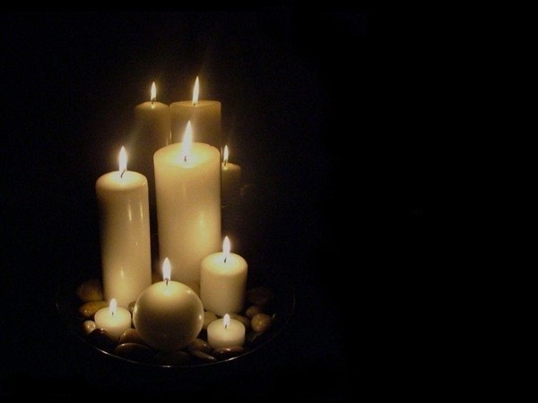
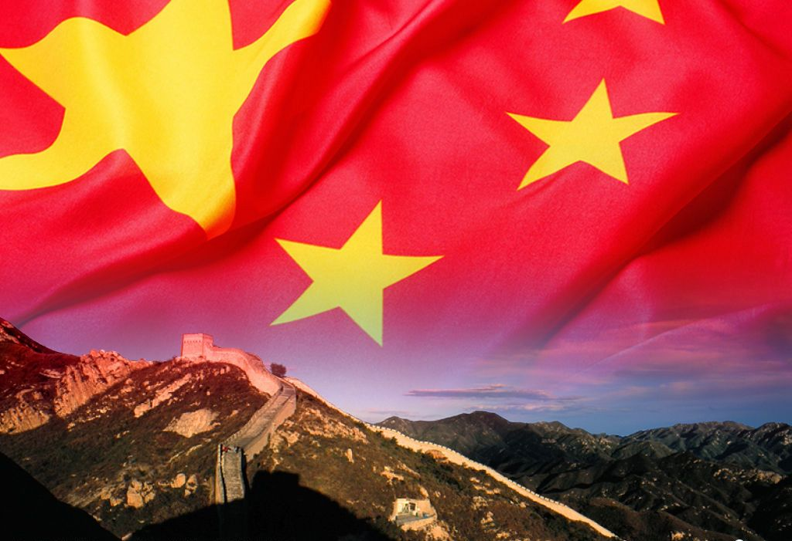

# ＜天璇＞一刀两断

**我不想讨论墙外自由不自由的问题，特别是在香港这个地方，我说不清楚。现在在瑞士，我的身份更加抽离。我才清楚的发现，是的，在墙外我收获了阳光空气和水，可是我失去了赖以生存的土地。那么这种自由，才是最可怕的枷锁，一头是不断走得更远的我，另一头是我日日夜夜无比思念可是站在上面又无所适从的土地。** 

### 

# **一刀两断**

** **

## 文/小桥（香港中文大学）

 有时候，自由我来说，更像是一条枷锁。 约莫四年以前，一位从来没有采访过我或是我的家长的家乡记者写到：“拒绝了家长的陪同，背起心爱的电吉他，带着行李独自踏上求学之路”。我当时坐的是巴士，当时羊城到庸成的高速还没修好，差不多十个小时的山路，车里睡不着，反复想将来的生活会给我带来什么。那会儿还不太能明白，一所真正的大学和一所“党校”的不同，只是庆幸自己不需要军训，不需要上思修。在后来的三年里，我使用着没有被封锁的网络，吃着还算安全卫生的食品，在校园里说我想说的话，每年那个时候，能在公开场合点上一根蜡烛。 

 只是，时不时的，我在某些在维园演讲和某些学生组织身上，总能读出一丝丝北方某个政党的味道，那个他们无比厌憎的政党的味道。 我也没有获得更多的快乐，大多数的时间里，我感到孤独。地铁里的广告每天变样，“你需要这个，你需要那个”，邮箱里塞满了“中大职业发展部的实习信息”，成功只有一条标准，只有投身咨询或者投行行业的人，才有资格被别人称道。走在街上，看着她们大同小异妆容精致面无表情的脸，我感觉不到一丝丝的性感。而身边美丽可爱的北边姑娘们，正逐渐变成她们的模样。 今年清明节，父亲跟我说了家里翻修祠堂的事，然后跟我说了很多清末时候家族自粤东迁到桂东的往事，那是一个背井离乡落地生根的故事。我笑着告诉他，“然后接着的是更多的背井离乡。”那时候我已经跟不少不同发色和瞳色的姑娘搭过讪调过情，在一些美妙的曲折里，至少没有给祖国丢脸，嗯哪。终究是没有变成“性爱偏好中的自身肤色歧视”。你瞧，在她们的脸上，我始终读不出芙蓉如面柳如眉的性感。 去年再早些时候，中大文研系的一些人放映四川“天灾”的纪录片。小小的教室里，总算能看到一些平常街上见不到的表情，后来才想明白，这些表情一直都在，在这座城市的内心深处，只是，在这座城市里，维持这样的表情，需要太多的心胸和希望。映后讨论，一个北京的学姐说，在这里我们永远是他者，跨过口岸的一瞬间便被打上了内地生的标签，更遑论其实墙外并没有墙内更自由。她垂下眼睛，伤神的样子特别好看。 我不想讨论墙外自由不自由的问题，特别是在香港这个地方，我说不清楚。现在在瑞士，我的身份更加抽离。我才清楚的发现，是的，在墙外我收获了阳光空气和水，可是我失去了赖以生存的土地。那么这种自由，才是最可怕的枷锁，一头是不断走得更远的我，另一头是我日日夜夜无比思念可是站在上面又无所适从的土地。 生为一个支那青年是一件多么令人沮丧的事啊。总是有人扯着你说起她，翻来覆去了无生意。后来干脆说自己是越南人，从而避免这个令人生厌可又能让我滔滔不绝的话题。我总想着要跟支那一刀两断。用什么方式都好。 

 我疑心自己终究还是做不到的，不管过上多少年，不管生活在什么地方。自出生起，我跟所有人一样，被打上了帝国的臣民这个记号。总是莫名奇妙的记起，为她骄傲，为她沮丧，好像永远摆脱不了。这个记号太深了，甚至印到了灵魂最深处。卑微的祈求这个国家强大，好像这样就能在爬梯上收获更多的蓝色的媚眼。好像爱那个这样，就不用在香港的报纸和新闻里，看到他们语气暧昧的提到“内地生”，评头论足。 看过一篇文章，一个在西方世界漂泊了很久的大叔写到，“性感属于一段时空、一片土地和一群人。”读到这里，我发疯的想北京。我不再在她们有礼貌的热情里寻找蓝睐，我思念每一个在北京挤地铁的姑娘。回想一下，在香港的三年里，去了好多次北京。每一次都是一种逃离，我可以不再理会我那个内地生新移民的尴尬身份，尽快在北京我也只是一个操着奇怪口音的外地人。我能感觉到我在北京是被接纳的，我想念那种写满单纯的青睐，亮堂堂的黑眼睛，那才是真正的性感。 前些天在一个娶了瑞士姑娘的跑路叔叔家里喝茶，我说祖国有太多的事情能做太多的事情需要做了。他说，可是有什么是做得成的呢。我不知道，可我知道有些人在做了，尽管有些私人恩怨，可我为他们骄傲。 现在，我有一个思念北京的新理由，她眼神明亮，心底干净，总是在地铁里坐过站。我决定再相信自己一次。我想，我还得去北京好多好多次才行。 支那青年也罢，帝国臣民也罢，我死拽着阳光空气水，做不到跟赖以生存的土地一刀两断。 祝生者几天后的青年节快乐，望以屈原为代表的逝者安息。  

（采编：陈轩 责编：陈轩）

### 
