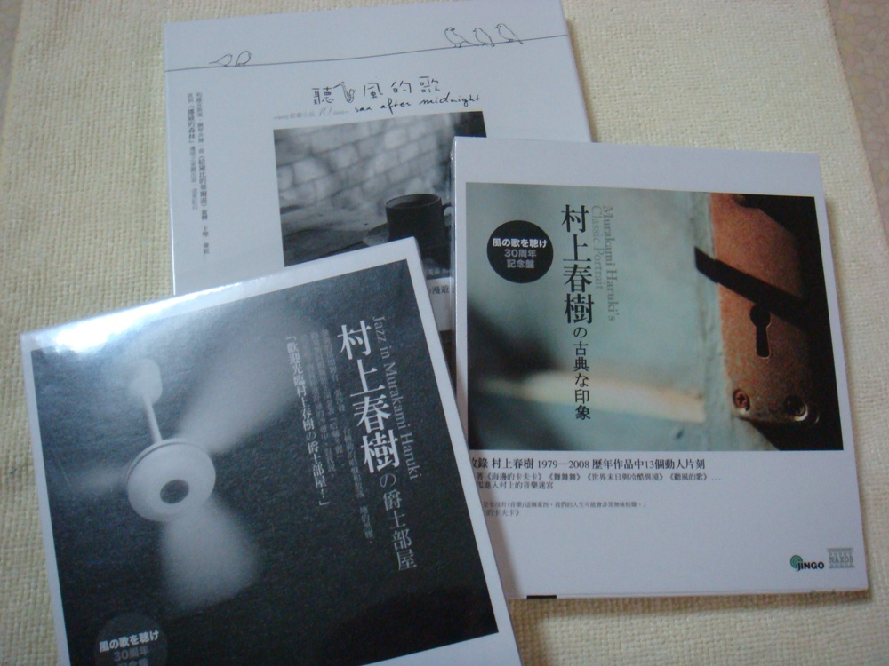

# ＜天璇＞一天

**入夜。我躺在客厅沙发，听到窗外久违市声。车辆呼啸经过。偶尔有人大声叫骂。白的月亮挂在灰色低矮天空。城市从来不沉睡。** 

# 一天

## 文/张益清（Syracuse University）

 

前晚睡不好，多梦。但不像小时候，什么梦都记得。现在梦都了无痕迹了。七点醒了，穿衣刷牙洗脸，微波炉热华夫饼迅速下肚。整理完东西，Nate电话说五分钟后到。

拎包下楼。天气晴好，绿草白花。上车，照常问好，出发。车刚上高速，他说昨晚做梦梦见自己大战纳粹。我说我现在根本不会记得梦，小时候的记得。漫天的星都在暗沉暗沉的天空往下掉，掉到未知的海洋。他讲，wow，不可思议。

到车站，检票上车。车子开了，我才发现去年5月我在去纽约路上坐的是同样窗边阳光的位置。只是心情已经大不同。

猛然想起自己忘了带钱包和证件。也没恐慌，有种爱谁谁的木然。身无分文地心无挂碍地，奔去纽约。

拿出手机在人人上发状态一条，得建议和帮助若干。给Janet发短信：Janet,我又对自己干蠢事了。如果可能，请来车站接我。

Janet说，别担心，车站见。

给邓老师短信，让她把留在家的证件拍照发了过来。

心安。拿出书来看。

一点，车进城，顺利和J碰头。她穿平底鞋，牛仔裤，随身一直带本书在看。单身母亲，和她的18岁的儿子住在纽约。

J带我找地方换衣服。出发时穿牛仔裤和polo衫。在中央公园旁边找到一个地方换上窄身套装，丝袜和黑皮鞋。

然后去找面试的酒店。

酒店是所有曼哈顿的高层酒店的模样。它们附带的咖啡厅都无一例外地有法语名字。果然这间咖啡馆叫L'Atelier。

进去的时候上一个面试的女孩刚出来。穿驼色大衣，浓妆，手上提名牌手袋。

到我。坐定。第一个问题，对时尚有了解么。

我答，很少。

又问，平时经常逛街和购物么。

我答，不多。功课很忙。

15分钟后，所有问答结束。我终于是松口气，跑进卫生间换回出门的行头。

想起在来的路上看的马尔库塞。工业文明时代的单向度的人。外部需求对个体、社会的异化已经到了这样的程度，任何质疑都变成了不可能。科技和消费的暴政，是不可避免的。

找到在咖啡馆和男友一起等我的J。J的男友是黑人，律师。

去拥挤的市场买东西。各色人出没。高挑神色漠然的白人女孩，戴新款雷朋镜。穿着入时西班牙裔夫妇仔细挑选水果。第一代移民华人，70岁，布鞋眼镜，神情紧张。买到西红柿，牛肉，cheese，葡萄。

搭地铁，回J家。曼哈顿边缘，黑人区。街上聚了二十几个黑人青年分成两帮在激烈吵，互相推搡。年久公寓，没有旧屋的心安，大厅空旷，不知为何似乎摇摇欲坠。就是美黑帮片枪战的那种地方。等电梯的时候，黑人青年拎大收音机放震耳欲聋音乐出来。他快乐地和J和我打招呼。

进门，公寓是我想象的凌乱。J的儿子Sam出来和我打招呼。年轻男孩，脸上雀斑，头发浓密。我削红薯，J准备水果。S开始做牛肉汉堡。

边吃饭边聊。S在准备申请音乐学院作曲系。他喜欢舒伯特，有John Glass的每一张唱片。我说，你写什么类型，古典吗？

他有一点犹豫：当然我的音乐更偏古典而不是流行。

那种神情和语气我再熟悉不过了。通常发生在想要遮掩一个书呆子气的爱好之时。

他又说，我不知道给学院看什么好，是那些聪明、复杂的作曲，还是简单而好听的。

我想就这个话题可以多谈一些，又怕不懂音乐造次，就只点头认真听。

他又问我，你们真的，大多数人都不知道天安门么。

我摇头。这个话题我谈不了。

晚上，和J改完一篇稿子。J看到我脸书上有村上春树页面，问我，这是写海边的卡夫卡那个家伙？

是。

我，J认真看着我说，从来没搞懂那本书要讲什么。

入夜。我躺在客厅沙发，听到窗外久违市声。车辆呼啸经过。偶尔有人大声叫骂。白的月亮挂在灰色低矮天空。城市从来不沉睡。

我一定是太习惯了小镇的安宁。我失眠于这样的喧哗与躁动。 

 

（采编：董一儒；责编：应鹏华）

