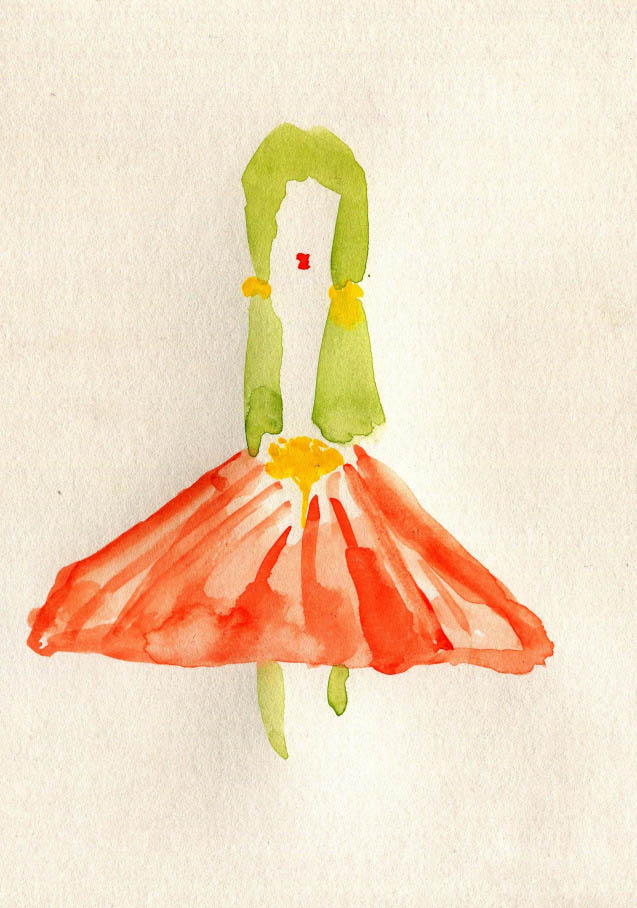
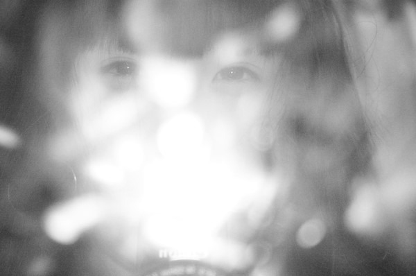

# ＜天璇＞不会说话的爱情

**这时我才明白，不是所谓观念的问题，更多的时候是个性的问题，不存在太多的主义，你就是这样的一个人，你就是做不出来一些事，你就是喜欢那个样子，更没有任何道德上的优越感，有些事对于有些人来说很容易，对于有些人来说实在太难。**  

# 不会说话的爱情

## 文/韩潇（江南大学）

 

你们眼中的爱情都是什么样子的？

“感觉是件很美好的事情。”

“找寻灵魂伴侣，朋友、战友、知己。付出的存在感和不灭的欲望。”

“爱情就是你让她滚她就滚！”

“没有了你疯狂的梦还有什么用。”

“遇到一个人，他的灵魂里有你最想珍惜让你完整的东西。”

我今天在家翻到了中学时期的日记本，由于彼时几个好友间总互相交换阅读留言，而且大家也都不怎么规矩，很多地方都是笔迹重叠乱七八糟，大概就是十年前的发状态回状态转状态和各种吐槽骂娘。看了四五本，渐渐发现所谈论最多的一个主题还是：姑娘。

年轻人有年轻人追求爱情的方式，虽然现在说这话不免有些老气横秋。但是这种追求从来都是不曾停止的。我们总私下嘲弄某个搞到年级靓女的哥们，什么傻逼玩意儿，二货，好逼都让狗操了，一干人忿忿不平走回教室。而实际情况是人家搞到手了我等怂男只能酸溜溜地骂娘眼馋意淫，究竟真正傻逼的是谁可见一斑。

那个年代的爱情总是跟纯洁二字挂钩，初中时人生中第一次爱上一位姑娘，总觉得每天能跟她同处一间教室就已足够幸福，更何况我们还是同桌。我从来怯于表达自己的真实情感，于是这种默默的关注一直持续到毕业。高中我们还在一个学校，开学第一天我在分班的榜单上先找的都不是自己的名字，甚至每天上下学路过她家的时候总要放慢速度或是在周围短暂徘徊，期待所谓偶遇，偶尔的几句交谈便已是幸甚至哉。不曾得知她是否理解我沉默的情怀。

那么现在的生活是什么样子呢？我无意探讨诸如社会现实或是把爱情和财富划等号等等无休止的争论。就拿自己来说，已经很久不曾感受到那种脸红心跳的感觉。很娴熟地和各类女性交流，跟混熟的甚至没混熟的妹子时不时来个“想你了”，却不愿全情投入和她们中的一位开启一段崭新的旅程。这几年看了一些书认识了一些人交流了一些思想，渐渐抛弃了过去稍显保守落后的爱情观价值观，我在这方面也渐渐倾向于将自己培养制造成一个爱情自由主义者。认同恋爱的不绝对自由性，不以“责任感”将自己和对方绑架；抛弃处女情结，读些女权的书，尊重女性；认为“炮友”是比较适合现代人类的生活方式的，只要双方愿意结合当然自由；同理，我支持色情行业合法化，不可鄙视“失足妇女”；处在恋爱关系中的双方均要保留彼此的独立性，不可以爱人的身份以“为了我”的借口要求强迫对方做不喜欢不愿意的事情；真诚待人，原则问题上不欺骗，不喜欢了就分开别墨迹。于是我个人对爱情的定义可以概括如下：自由，独立，真诚。于是从前一段时间起本人产生了一个尽快摆脱处男之身的愿望——至于还是处男的原因，可以归结为在上一段恋情中，双方对于守贞这种事情均有些许愚蠢的执着——于是很积极地向一些有过ons经验或有“炮友”结交经验的朋友求助，得到的答案总是很简单：电话短信或社交网站勾搭一下，见面吃个饭，开房，办事。我表示迷茫，继续追问细节，他们说你得怎么怎么样，不能怎么怎么样，如此这般，如此那般，就成了。我时而恍然大悟时而低头思索，朋友会心一笑，到时候你就知道了。

这个时候真的到了或者说近了，我一个人住宾馆，夜半敲门声，我可以说进来吧。跟朋友玩到挺晚，我可以说你别回了来我那住吧。每念及此时却总是面红发热，紧张得要死，事先在心中演练过数次的话语却死活说不出来，等敲门声渐渐停止，送朋友回了家，之后才在一丝悔恨中如释重负。

这时我才明白，不是所谓观念的问题，更多的时候是个性的问题，不存在太多的主义，你就是这样的一个人，你就是做不出来一些事，你就是喜欢那个样子，更没有任何道德上的优越感，有些事对于有些人来说很容易，对于有些人来说实在太难。总之和一个真正喜欢的姑娘在一起的感觉，绝对不是想赶紧扒了办事的感觉，或许就是坐着啥也不干，或许就是不停地聊天，多想一些都是罪恶。说我怂我也认，为此披上道德的外衣反而使人反感。

前几天跟一姑娘相见，席间扯淡谈及绯闻，我一直以为该姑娘跟某小伙子在一块儿了。求证后发现并非如此，二人属挚交好友但姑娘对小伙并无爱慕之情。后因好奇去访该小伙校内页面，看到他写的那些真挚动人的东西和想法，我突然想起了两三年前年爱上一位小吴姑娘时的那种感觉。那两年真是心无杂念孑然独立只为伊人。朋友劝，劝你妹，不听。朋友说她其实哪哪不好，不好你妹那是你不了解她，滚蛋。偶有其他不错的姑娘有机会深入交流，一概不理，都他妈的玩儿蛋去！老子心里有人了。不管你如何拒绝我我就是喜欢你，你跟别人在一起了我也喜欢你，就是爱上了没办法，不在乎那点时间，等吧。

时至今日虽然也深切认为这种方式不太可取，但也确实深切怀念。如此用心爱人，毫无原则地坚持和付出，已好久没有经历过了。可能这其实才是爱情中应该有的样子，自由也需要为他，独立也需要依靠，真诚有时也需要谎言。

这是一种难以言说的感觉。你坐在我的对面，看起来是那么端庄，我每次无意中直视你的眼睛，就会觉得被深深吸引，但又随即岔开话题转移视线，马上又有一阵不舍，于是继续抬头看着你的明亮双眸，都不知道自己在说些什么，你的温柔善良不停地打动着我，我多想这么一直看着你，时间停止，我多想和你一起幻想。

 

（采编：麦静；责编：黄理罡）

 
