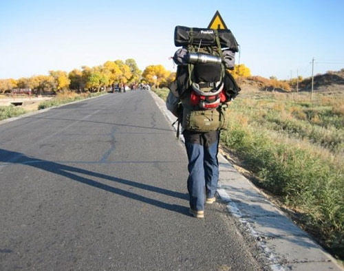

# ＜天璇＞不再年轻的个人主义者

**对于一个传统上强调“尊老”、不能“为老不尊”的社会来说，这是一种令人印象深刻的新现象。直到不久前为止，中国社会的老人形象都是农业文明的典型产物：是值得尊敬的经验丰富的智慧化身，是活着的祖宗。从某种程度上说，他们也是传统秩序中个人自由较少的一群人——事实上，似乎从未有人注意过中国的老年人也有个人自由的需求。人们对老年人的要求通常是更好地扮演好他们自己的社会角色：做一个像样的父亲、母亲、祖父母或外祖父母。但在新的时代，有些老年人不情愿地成为个人主义者，因为核心家庭的出现使年轻一代已不大愿意和父母一起生活，这使老年人被迫寻找自己的生活，这在起初还会让他们颇感不习惯。**  

# 不再年轻的个人主义者

## 文/维舟

 

在去顺化的火车上，我刚举起相机，迎面一个黑瘦的老妇走过来问我：“你是中国人吗？”她说的是汉语。她说，隔着几排座看到我的样子，就猜我应该是中国人，因为越南人无疑不会拍这么普通的车厢，她兴奋地说：“太好了，我已经好久没遇到中国人了，都没机会说中国话了。”但若不是她开口，我第一眼却吃不准她是哪里人——她的衣着打扮看上去好像和车厢里的某个越南老妇没多大差别；她问我“去寮国怎么走”，以及她那随身带的标着诸如“西贡”、“永珍”之类地名的地图，使我一度还误以为她是台湾人，后来才知道那只是因为她在胡志明市跟华侨学的——她甚至不知道“寮国”在国内叫“老挝”。

这是她有生以来第一次长途旅行。按她的说法，她之前顺从而压抑地工作了一辈子，直到一年前退休。她感觉留给自己的时间可能已经不多，也正因此，内心的那种渴望以一种她自己都未曾料想的力量喷薄而出。这次出行她原本只是想独自去西藏走走，结果在拉萨的旅社里加入了一群前往尼泊尔的年轻徒步者。随后就一发不可收拾，在遇到我之前，她已在半年内周游了九个国家——印度、马尔代夫、斯里兰卡、孟加拉国、马来西亚、印度尼西亚、泰国、柬埔寨，以及越南。这一路上，绝大部分的时间里她都是独自旅行，因为多数年轻人不愿带她一起玩。她离开边境时并未告诉家人，因为她自己也没想到一走就是半年多。到柬埔寨时她第一次给家里打了国际长途，以为她早已失踪而报过警的老伴和儿子都疯狂地劝她回家，但她仍想继续往前走。“我觉得他们并没有真的很想念我，”她淡淡地说，“我的手机是全球通，他们本可以打我手机。”

为了能走得更远一点，她一路都极其节省。去西藏时她随身只带了两万元人民币，那时也没想到会在外呆那么久，好在路经的各国消费水平大多不高。“我想，当地人每天只赚很少钱也能生活，为什么我不能？”她所以横下一条心，把一路的生活需求降低到最基本的层面——无论是饮食、装束，还是住宿，好在这半年里南亚、东南亚气温都较高，所以她经常睡在车站火车室里也没事。她略微得意地说：“你相信么，我那么多次睡在车站，从来都没遇到过失窃。”除了钱包、护照、手机和相机，她确实也没什么重要的物什。她说，世上毕竟还是好人多。但她对越南印象不是特别好：“到了越南就有点像中国了，警察会来管，火车站凌晨还会锁上，不让你睡里面，很坏，我在之前其他国家从来没遇到过。”因为出发时带的钱不多，本来她确实也有点山穷水尽了，但令她惊喜的是在金边的街头发现了中国银联卡的取款机，使她决定再继续进入越南和老挝。

很难想像她这一路是怎么过来的。她不会英语，“一句都不会”，但这似乎并不是问题，“其实通过打手势什么的，基本都能明白意思，砍价的话把数字写下来就好”。她到了印度才知道有Lonely Planet这样的旅行指南，某些国家和城市，她在出国前甚至从未听说它们的存在——到越南后她也不知道会安、顺化很值得一去。我问她这种情况下如何确定旅游目的地，她答：“我就是看地图，照着地图上那些大的圈去……”

虽然这一路犹如流浪，但对一个忙碌了半辈子的人来说，这是她头一次感到完全的自由。对她来说，旅行已经不仅仅是一次休假或放松，它事实上变成了生活，是某种她想要的人生。这使她从压抑的日常生活中解脱出来，去做一些自己年轻时没机会或不敢做的事——她说自己在广东的一所不出名的医院里工作了三十年，从未休假过。她一路唠唠叨叨讲了很多她那枯燥的工作，以及只能默默忍受的大家庭生活，如今，她终于有机会逃离了。临别时我对她说：“你会上瘾的。”她笑了笑，答：“已经是了。”她已经定下了一个走遍五大洲的计划，虽然那些地方没南亚、东南亚那么好走，但看上去已经很少有什么能阻挡她了。

如今在中国，像这样自虐的旅行方式并不鲜见，但令人印象深刻的是这个旅客的特殊身份：她几乎是那些自虐背包客的父母一辈人物，而且无论怎么看都不像一个“典型的”背包客——既没有那些让人从人群中分辨出来的旅行装备，也缺少相应的旅行攻略。当然也有一些老年背包客更专业一些，例如59岁的北京人赵瑞萍，她2009年只带了23,000元人民币，历时75天独自骑游欧洲11个国家。虽然这类案例并不多，但他们都共同代表着一种社会现象的兴起：越来越多国内的老人，在晚年突然发现了自我，并意识到这是自己实现自我和梦想的最后机会。由于他们觉得自己已经没有牵挂，有时他们反倒比年轻人能更有勇气去决绝地进行下去。

对于一个传统上强调“尊老”、不能“为老不尊”的社会来说，这是一种令人印象深刻的新现象。直到不久前为止，中国社会的老人形象都是农业文明的典型产物：是值得尊敬的经验丰富的智慧化身，是活着的祖宗。从某种程度上说，他们也是传统秩序中个人自由较少的一群人——事实上，似乎从未有人注意过中国的老年人也有个人自由的需求。人们对老年人的要求通常是更好地扮演好他们自己的社会角色：做一个像样的父亲、母亲、祖父母或外祖父母。但在新的时代，有些老年人不情愿地成为个人主义者，因为核心家庭的出现使年轻一代已不大愿意和父母一起生活，这使老年人被迫寻找自己的生活，这在起初还会让他们颇感不习惯。

即便是阎云翔这样的社会学家，在讨论中国社会的个人化倾向时，更多注意和强调的是年轻人中个人主义的盛行。我不知道有谁关注过老年人对个人主义的接受，这乍看上去确实像是一个悖论，似乎老年人不应去追求个人自由和自我实现。当然，他们确实可能也是中国社会中第一代这样的老人：他们越来越多地不是扮演老祖宗，而开始鼓起勇气追求自己最后的自由时光——有时，这也在年轻一代的不断鼓励下，因为年轻人往往告诉他们：老人要懂得有自己的生活，要过得开心。如今在大多数中国城市中，突然发现自己多出许多闲适时间的老年人，都重新爆发出极大热情——你可以在多数城市公园里看到从事从歌舞队到太极拳的各种兴趣小组的老年人，用我朋友的话，“老年人热情爆发时真的很可怕”。旅游，作为一种自由的生活方式，也很受欢迎，诸如“夕阳红专列”之类的老年旅游团并不鲜见。

荣格曾说过，自我改造是人的后半生而不是前半生的任务。确实，从某种意义上说，老年生活是继童年之后人们第二段自由时光——但这种观点本身就是个人主义的，以个人的自我实现为基本前提。这在以往的中国社会，即便不是不可思议的，至少也是罕见到无法成为一种社会群体现象。吊诡的是，正是由于在如今这个以年轻人文化主导的社会中被边缘化了，才使老人第一次具有了追求自我的自由空间。他们恐怕仍是最被忽视的个人主义群体，但正是这一边缘的不寻常现象，比主流的文化更有力地说明了这个社会的某些变迁。

源地址：

[http://www.douban.com/note/221962564/](http://www.douban.com/note/221962564/)

 

（采编：杨成；责编：何凌昊）

 
