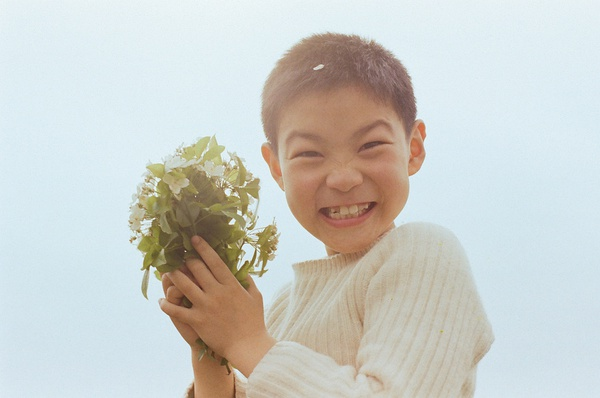
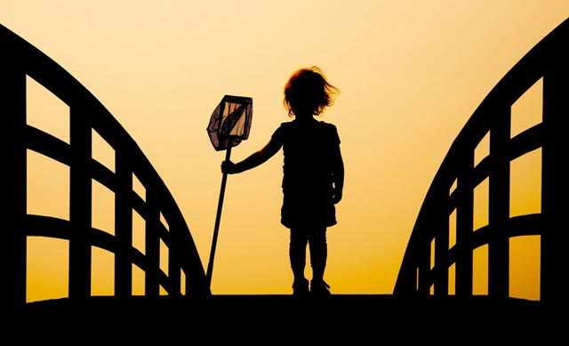

# ＜天璇＞与这个世界和解

**别人家的父母生了打得怕骂得怕的子女，而我的父母生了一个打不怕骂不怕的儿子。孩子最初都是通过长辈来认知这个世界，如果大人们崇尚“暴力哲学”，孩子也会效仿，这是理所当然的事。有的时候如果孩子哭着鼻子回家向父母告状被谁欺负了，父母反而会厉声呵斥，“死没用的！他打你，你为什么不打他！”这种观念的强化不分男女，我见多了悍妇，也战斗过很多令我心有余悸的彪悍女生。 **

** **

### ** **

********

### 

# 与这个世界和解

### 

## 文 / 钟起鹏（中国人民大学）

### 

如果你手里握着榔头，世上一切在你眼中都是钉子。——题记 我的童年记忆始于父亲的各种暴打，以至于那些导致我遭到暴打的辉煌事迹都是日后在长辈们的笑谈中才渐渐清晰起来。如今我已经去童年甚远，诸事如意，健康成长，对于肉体的疼痛已没有任何记忆。时过境迁，我常藉此思考童年和少年的际遇都给个人的成长带来了什么。 长辈们说我从小就不安分，三岁就因为淘气从家门前一丈高的台阶上摔下去导致胳膊脱臼。如果此事属实，那是目前为止受伤最严重的一次，哪怕日后与人打架到头破血流也不过是受点皮肉之苦。等到四五岁能自己玩了，就像脱缰的野马，春夏秋冬混战在泥土里，今天和同伴打架，明天带着打输的同伴找别的孩子打架，孩子王的路数大抵不过如此。若是只有这些，倒也不过是每天傍晚别的家长领着被欺负的孩子到家里找我母亲理论理论。 我因淘气闻名乡里，大人们笑称“翻天赢”、“程师傅”（据乳名“起程”而来），我也自觉威风。母亲日日担忧我长大之后必定犯事进班房之类，而奶奶比母亲还悲观，她老人家觉得我迟早要被我父亲打死。每当我犯事遭父亲毒打，没人敢前来救场，奶奶总是扯开嗓门大骂：“你就把我孙子打死去吧，打死了你就省心了!”父亲却说：“生出来只会害人，留着有什么用？！要不是咽下这口气，早把他打死了！”这点我倒是印象极其深刻，所以后来父母外出打工，亲子疏离，母亲诱导问我是谁生的，我说是奶奶生的。 打也打了，骂也骂了，可是我仍然屡教不改，父母一筹莫展。待到五岁，实在管不住了，把我送到村里的幼儿园，同已经上幼儿园的姐姐一起学习，希望学校老师能教化我，姐姐也能监督我。我非常高兴，因为可以和全村的孩子们玩了。在幼儿园里的第一年，基本上都是在捣蛋，姐姐哭了一次又一次。后来她上一年级，我继续上幼儿园，她上二年级，我还上幼儿园。我在村里更出名了，还多了一个“降班先生”的外号，人生中最初的羞耻感大概源自于此。当大人们这么叫我的时候，我心里会骂他们；同伴们见了我叫这个外号，我就直接用拳脚回应他们了。我发现这个外号不像“翻天赢”和“程师傅”那样给我带来自豪感，那些通过拳脚的实力和做其他人不敢做的事情的勇气得来的外号，它们更像勋章，而“降班先生”却是一种羞辱的标签。 后来回想，也许幼儿园教育可能真正地改变了我，甚至我的一生。在我漫长四个学期幼儿园生涯的第三个学期（那个时候农村也没什么学前班，幼儿园也没有分大中小班，每个学期都上一样的课程。农村家庭为了省学费，一般都是孩子七岁上小学，六岁或者六岁半才送到幼儿园。我五岁上幼儿园，到七岁半才上小学，导致我幼儿园的同学非常多），在老师每一个学期讲一模一样的内容我听到第三遍的时候，我终于每次作业都能得优了。老师说我变聪明了，选我当班长。同学都知道我会打架，不守纪律的都靠暴力制服，所以我这个班长当得很好。 当一个纪律破坏者变成一个纪律维护者的时候，那种被认同感、正义感和道德的自觉会油然而生，我也会想做一个好学生好榜样。我当然没有想到这会是我幼儿园时代、小学时代和中学时代漫长的班长生涯的开始。到了小学，我凭借幼儿园几年打下的“坚实基础”，学习还差强人意。在小学，学习最好的一般都是学习委员；而小学生很难管理，所以需要我这样的可好可坏的孩子来当班长。这样既可以保证班级内部团结稳定，也可以保证班里的同学不受其他班的坏孩子欺负。可以认为这是老师们搞的平衡术，升华一下也许正体现了教育的精髓在于鼓励在于谆谆善诱在于因势利导。 然而当上班长并不影响我在小学时代的辉煌战果。我有十来个大大小小的堂兄弟堂姐妹，只要他们受到了来自别人的攻击，不管有理没理，我永远都是战斗在第一线。我的妹妹稍受欺负就哭，教室离得不远，我永远都是高度戒备的状态，一听到哭声就加入战斗。低年级的时候和高年级的学生打架，高年级的时候照样打低年级的学生，甚至和女生打架。我今天脸上的坑坑洼洼，多拜当年某些彪悍女生的指甲所赐。比如她弟弟欺负了我妹妹，我就要打她弟弟，她就要来打我，我肯定连她姐弟俩一起打。我从小个头不大，打架上并不占绝对优势，所以整个小学时代被打的青一块紫一块啊流鼻血啊破头啊的事情常有。然而我有的就是这种打不怕的精神，直到把别人打怕为止。那时身上留下了很多小疤痕，它们就像勋章一样闪耀在我童年时代的记忆里。 

### 

### 

打架其实在农村是一件非常正常的事情，哪怕是大人，当他们遇到无法用其他方式解决的问题，他们往往诉诸武力。就像我的父亲不知道如何教育我，所以他只能通过打我来是我增长记性，其他的父母也是这样教育孩子。只不过，别人家的父母生了打得怕骂得怕的子女，而我的父母生了一个打不怕骂不怕的儿子。孩子最初都是通过长辈来认知这个世界，如果大人们崇尚“暴力哲学”，孩子也会效仿，这是理所当然的事。有的时候如果孩子哭着鼻子回家向父母告状被谁欺负了，父母反而会厉声呵斥，“死没用的！他打你，你为什么不打他！”这种观念的强化不分男女，我见多了悍妇，也战斗过很多令我心有余悸的彪悍女生。 随着年龄的渐渐增长，我也在想自己当年的打架哲学是不是受到了父亲的影响，因为一个暴戾的父亲往往会塑造一个暴戾的儿子，事情远非“棍棒底下出孝子”那么简单。尤其是在我最初认知这个世界的时候，我的父亲选择了或者别无选择地用棍棒和我交谈。父亲的暴打带给我的影响像是播种，有一天这种暴力哲学会生根发芽，有可能长成参天大树。开始懂事的少年时代，我一直为这个事情担心，我也想做一个温和善良的人。 前面提到，我的父母从我上小学就开始外出打工，所以这种遭到暴打的经历其实也非常短暂。而不像其他的一些典型，有的人在整个成长过程中，都活在家庭暴力的阴影之下，直到有一天强大到足以反抗或者逃离。而从童年时代就失去父母管教的我，所有的路都要自己走完。有一天我突然发现我闯祸之后，再也没有最后的堡垒来保护我或者最终的裁决者来惩罚我，那么所有的作恶都变得索然无味和没有意义。一方面我体会到了无法无天的孤独，也渐渐学会自我保护。我至今都没有学会如何同别人讲理，但是我学会了克制自己，不去侵犯别人。这种克制需要非常大的自制力，尤其是在这种莽莽撞撞的年纪。我用了很多年来锤炼自己，经历的人事也锤炼了我。 中学时代离开农村，我来到市里上学，变成一个有点自闭和自卑的孩子，因为“背井离乡”（其实我家离市区就八公里），还多了一份忧郁。最初的时候，觉得自己是个下里巴人（用得不对，当时就是这么想的），处处都与人为善，畏畏缩缩，唯唯诺诺。哪怕有野心也是隐藏着小心翼翼，别人出来竞选班长，自己就去竞选没人争的副班长，这样顺利当选，然后勤勤恳恳通过自己的努力做出成绩，重新竞选时候就可以名正言顺的当班长。 对于班上那些被老师同学称为“小混混”的同学，我也很能团结他们。我尝试着尊重他们，就像尊重其他每一个人一样。像他们那样被老师同学看衰的人，如果有人让他们觉得被尊重，他们肯定也会尊重你，甚至会保护你。那时学校门口经常发生住校生周末回校时在校门口被抢钱的事情，学校花大力气整治也不见好，因为都是学校的“小混混”联合社会上的“大混混”所为，这种事情可大可小，公安局都不怎么管。但是我从来没有被抢过，我的姐姐妹妹也没有被抢过，我想肯定是有人打过招呼的原因。 我本身并没有怕他们而明哲保身的意图，我也没有看不起他们。我常想，如果我不是到了城里上学，不管我在小学表现的如何“优秀”，在乡下的初中里，我最后大概也是一名“小混混”。环境可以真正改变一个人，所以我更能体会他们这些不被关爱的群体混日子混社会的心境。当时学校里有名的一个“坏学生”阿宽，总是“班长班长”地叫我，其实他都不是我们班上的同学，在路上抢同学钱物的事情他没有少干。但有的时候也会没有“收入来源”，连饭都吃不起。我有的时候就跟他讲，如果真的到了没有办法的地步，我可以给他一些救急，还不还随意。后来他真的问我要过几次钱，也就是十五二十的数目，有时候会还，有时候不还。当时我每个月有150的生活费，有的时候我也没有现金富余，我就带着他到食堂里刷卡吃饭。像他这样的人，在圈里也是风云人物，神情里会不自然流露出被施舍的卑微。于是在我面前他会学着掩饰自己，尽量使自己像一个普普通通的学生，有朋友，有道德标准，也值得别人的尊重。 我不怕他们，还有另外一个原因。就是如果争锋相对，我不会怕事。要打架么，他们只知道我老实本分，但是我自己却知道打架这个事情我也在行。如果要比狠，我二年级就逞班长之威将同学打到脑震荡去医院拍片子，三年级受老师指使让犯错的同学跪玻璃渣子，血淋淋的。这两件事真不怪我，回想当年体罚学生的事非常普遍，真是教育的悲哀。那时我也是年少无知，做了一些助纣为虐的事情。后来我向很多同学道歉，求得他们谅解，可是没有一个老师敢向同学道歉的，相比我觉得无愧于心。 我最后一次打架是在初二。那时班里的寝室住了一个初三的学生，平时在寝室作威作福，从不轮值打扫卫生，拿这个同学的洗衣粉香皂，用那个同学的洗发水牙膏；周末同学回校一般都会带一些家里的零食来，他都要先享用。这些来自农村的孩子大多老实本分，见他如此有恃无恐也只能忍气吞声。有一天下完晚自习看他又在寝室欺负班里的同学，我实在是忍无可忍，一脚将他踹倒在床，摁着就打。整个过程没有半分钟，期间没有一个同学敢出声。没多久那个初三的同学就搬出了我们寝室。其实我当时一直怕他毕业时报复我，所以主动和班主任说了这个事情，寻求学校的帮助；为了保险起见，我也无意中将这件事透露给了前文提到的阿宽。这个世界本来就很小，小混混斗殴都是请大混混出面撑场，请来请去最后很可能到“终极大哥”手里，于是“四海之内皆兄弟，五洲震荡和为贵”。 回到最初的担心所在，暴力的种子发芽已是既成事实，它会不会长成参天大树？我始终认为成长就是一种轮回，所有的际遇最后都会得到偿还，不管是好的还是坏的。也许在农村那种成长氛围里，所有的孩子都要学会打架。懂得欺负别人，才能懂得不欺负别人。懂得保护自己，才能懂得保护别人。如果一个孩子总是被欺负被保护，那么有一天他很可能将把所有受过的委屈和不公还给这个操蛋的世界。这样的例子在我身边发生太多太多，有一些小学时代弱小到需要别人保护的同伴，到了乡下初中没有人保护，只能自己起来反抗。最后发现自己如此的能战能胜，于是就成了学校里的“混混”。我儿童时代唯一的偶像，学习非常之好又老实听话，全村的父母都拿他教育自己的孩子，可如今因为故意伤害罪正蹲在监狱里。 我对自己的这种担心可能是多余的。回看我的际遇，尽管我从小被打，但是我的父亲从来都是打手臂啊屁股啊大腿啊这些抗击打能力强的部位，对于凶器的适用上也比较广泛。他的巴掌非常有力，除非他非常非常生气，一般不会用巴掌打脸，那个一巴掌下去真的是眼冒金星。所以我小的时候打架从不下重手，也从不拿凶器，砖头和石头这样的大规模杀伤性武器更不敢用。所以这种打架是小孩子之间的近身扭打，双方都是受点皮肉之苦，目的只是为了让对方服气和认输。 更重要的是，随着见识的增长和认知的提升，我发现很多事情是暴力无法解决的，很多事情也无需用暴力解决，我们完全可以用更文明更道德的方法。这些全部需要我自己去领会。我的父亲打我，是因为他不知道如何教育自己的孩子，或者说他不懂得如何与自己莽撞的儿子相处。但是他离家之后的那些年，随着这种亲子关系的疏离，他也在改变，努力修复父子的关系。当我长到十一二岁的时候，他开始尝试着和我对话，因为他和母亲都在外面，我们三姐弟妹独自在家，他别无选择，只能让自己的儿子提前长大，而我也别无选择。这样的结果是，我们家现在变得非常的民主，有关家里的大事都是拿出来一起商量，而我们三个孩子的事情，做父母的也极少干预。 我中学时代，加起来拿回家的“三好学生”“优秀学生干部”和各种比赛的奖状大概有二十多张，他们从来都不看一眼，哪怕我把它们张贴在客厅最显眼的位置。在家的时候从不督促我们做作业，考试成绩就问过三次，一次中考两次高考，什么文理分科高考填志愿一概不管。他们大概只是希望子女们都做一个普普通通的人，正直善良勤劳踏实，不走歪门邪道，至于其他的事情自己拿主意就可以。 我是后来才真正懂得，其实我的父亲非常非常爱我。我就像是一块不规则顽石，他想把它变成一尊精致的雕像，只能大刀阔斧的先让它成形，然后在慢工细活地雕琢。虽然这块顽石经过时光的打磨侵蚀未必成为了他想要的样子，然而至少他想要一匹马，它现在还有马的轮廓，而没有变成一条狗。 他打我更像一个围篱笆驯兽的过程。我是一头到处冲撞的小兽，当我撞到篱笆的时候他就要抽打我，告诉我这个是界线，如果我破坏了篱笆，就会受到更严厉的惩罚。他还非常了解我的习性，把这个篱笆围的很大很大，降低我冲撞到篱笆的概率，而我可以在里面享受最大的自由。同时我也获得这么一种强烈的信号，篱笆外面是凶险的丛林，那里不是父亲的领地。 在父母离家之后那些年，我尝试着为自己的心灵围一道篱笆，把可以接受的人和事都放进自己的领地。为了避免他们冲撞到我，我把这个篱笆围的很大很大，所以我们相安无事。我也尝试在这个拥挤的世界为自己的躯壳围一道最小的篱笆，这块领地越小，那么外面世界的人越不容易冲撞到我的界线，我们也可以相安无事。 所以我们很难说一种际遇会给我们带来什么，坏的际遇未必带来坏的结果，负面的讯息也可能获得正面的回应。就像我的父亲和我，我从他教育我的方式方法出发，也会思考有一天我该如何教育我的孩子，我肯定不会再走父亲走过的弯路。我并不认为他打我不好，我也从未怨恨他，因为以我对自己的了解以及众人对我的了解，我想父亲是对的。这不表示我认同打孩子这个行为，我想教育子女肯定有更好更适合的方法。但是如果我发现对于我的孩子而言，某一个惩罚是必需的话，我想我一定会打他的屁股。我不求他有一天能理解我，就像我的父亲从没有要求我理解他一样。小男孩都会长大，男人一生都在寻求来自父亲的认同，而不是父亲寻求来自儿子的认同。一个父亲寻求的认同惟二——除了来自他的父亲之外，一定是来自他的公主女儿的。 去年春节，当我再次回到老家的时候，那些伴随我的成长而迅速老去的人们，我已经开始遗忘他们的名字，而他们却如数家珍地和我谈起我的童年趣事。比如放火烧了人家地里整片的割下来当草料的禾苗，比如活埋了人家一群的鸭子，比如牵出自家的公牛与别人家的公牛搏斗，使得人家的公牛断了角和肋骨而无法下田耕地……这些竟然都是我四到七岁之间的故事。是的，关于我的故事。我不曾知道，自己那么鲜活地活在别人的记忆里。“翻天赢”、“程师傅”依然是一种荣耀，“降班先生”也终于成为一枚勋章。 这个世界终于安抚了我童年时代和少年时代的莽撞，而我已成长。
