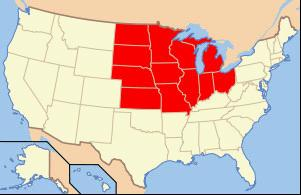

# ＜天璇＞东海岸的贵气，中西部的野性，中国人的焦虑

**“如果一个人一见面就问你：‘你在哪里上的大学’？”那么他是从东海岸来的，而如果一个人一见面就问你：‘你是做什么的’？”那么这个人则是从中西部或者是西部来的。”**  

# 东海岸的贵气，中西部的野性，中国人的焦虑

## 文/ 王逅逅（Haverford College）

 

“我写这篇文章，不是为了批判什么，而是想问，我们缺了什么，让我们如此焦虑。为什么美国人可以在同样的社会地位上有截然不同的做法，而自信满满，而我们处在迥异的地位，却都想用一样的方式，去得到一样的东西。我们每一个人需要的不是谩骂，不是仇富，不是天天说这个拜金那个高富帅美富白，也许我们需要的只是一个安静的晚上，一张白纸和一支笔，写一篇给自己的信，问问自己的内心：我到底是谁，我到底愿意在这个世界上，留下什么样的痕迹。”

东海岸：成功靠校友，家族

中西部（midwest, 不是西部！）：我们是“self-made men”!

中国：我们把孩子送出国，但是我们不知道他们要学什么，做什么。

在东海岸上学，每当我提起我曾经在Iowa住过一年时，我那些从波士顿，费城和纽约来的同学都会非常惊讶地望着我，迷茫地问一声：“Why？” 东海岸的人称中西部为：“fly over country”（飞过的国家），意思是他们觉得中西部和东西海岸不是一个类型的，而他们对于中西部的了解仅停留在飞机飞过的份上。当中西部的人听到东海岸时，会慢慢地从鼻子里哼出一口气来：“well, they are not like folks’ round here!” (哈，那些人和我们这边的伙计们可不一样）。

如果不是先在中西部的Iowa州的一个美国家庭中生活过一年，又在东海岸的一所文理学院读书，我想我也是很难看出来个中端倪的。就像是美国人，到了中国的沿海地区，有到内陆地区逛了一圈，的确可以看出风光的不同，可是要让他真的说出人的不同也是很难的。况且美国地域上的贫富差距远没有中国那样明显。

东海岸是英国清教徒最先来到的地方，他们从英国来到东海岸是为了政治避难，所以大部分都是有知识有抱负受尽欺凌的教士。这些人保留着英国的传统，英国的生活习惯，还有英国的价值观。这些我们现在在新英格兰地区都还可以看见。东海岸历史比较悠久的学校，都还保留着以前的那种常青藤布满红砖墙的校园，兢兢业业的学术传统。东海岸的大学，曾经都是给贵族男性开的教会学校，所以很多时候被美国平民认为是一种贵族的享受。

_东海岸小镇_

我在Iowa的一个好朋友， kristina， 是一个令人羡慕的美国女孩儿，家里条件很好，爸爸斯坦福毕业，漂亮的房子紧密的家庭听话的妹妹。但是这次从东海岸回来再见到她，多了一种眼光，发现也许典型的美国女孩儿是有地域之分的。而东海岸和中西部的文化差异真得是像中国南北的文化差异一样大。

我们说到haverford，一般中西部的人都不知道，但是我们提起了学费，我告诉kristina一家haverford的学费之后，他们就都明白了：“those private， expensive east coast prep colleges。”（那些私立，昂贵的东海岸文理学院），大多数美国人不知道很多文理学院的名字，但是只要一提起这整个文理学院的类别，大家立马就能知道是什么。文理学院基本上是一种东海岸新英格兰地区的特色，保留着以前从欧洲带来的悠久传统，提供一种贵族化的精英教育。在刚回Iowa的时候，我还跟人描述Haverford，但是后来都不太好意思跟人说到 “liberal arts college” “private” “east coast” 这几个字眼，因为这几个词整个就代表了一种上层社会的优越感。而且在美国人看来，很多这些大学的名字一听就非常“东海岸”，我的一个中西部的朋友第一次听说我去Haverford的的时候曾经说：“Sounds fancy，very east coast” （听上去很高贵，很东海岸），我很奇怪，因为我不明白他们怎么能从一个名字中听出来“高贵”或者“平凡”，后来我明白，这大概就是像中国人在听到一个老北京姓“金”一样，马上就觉得是皇室的人。

好，回到kristina家的餐桌。我们一边吃饭一边聊天，晚饭是牛排，香蕉面包，土豆泥和沙拉。桌上有黄油和牛奶。非常中西部。我们聊到Iowa最近的caucus，我把我坐在保守党候选人Romney儿子身边的事告诉了他们，然后我说：“很奇怪，当时我看到他，我就觉得他是东海岸来的。但是我还是不是很清楚怎么判断一个人到底是来自东海岸还是来自其他地方。”

kristina妈妈说：“如果一个人一见面就问你：‘你在哪里上的大学’？”那么他是从东海岸来的，而如果一个人一见面就问你：‘你是做什么的’？”那么这个人则是从中西部或者是西部来的。”

我仔细想了一会儿，真的是这样！比如说我美国的爸爸，他从来都是对陌生人伸出手去，然后问：“你是做什么的？” 我在Iowa， Michigan，Chicago的时候，所有人都问我的是：“你是做什么的？”“你爸妈是做什么的？”而非：“你去什么学校？” 但是去Greg波士顿的家过感恩节的时候，真的是一进门大家就问：“你是哪个学校的？”，在介绍我的时候他们会说：“Gogo在Haverford上学” “Good old Haverford”，而不是像中西部人介绍：“Gogo来自中国，她现在在美国上学。”而且当我在波士顿的时候（上帝啊，这个学期我的每一个假期都是在波士顿度过的！）我们在餐桌上吃饭，大家讲到的都是自己打着长曲棍球，穿着牛津鞋抱着一摞书的东海岸大学时光，什么Tufts啊，MIT啊，全都是大学，大学，大学。因为在东海岸，大学为你建立的关系是非常重要的，所以一个人一生都跟自己的大学时光有很多联系，而在中西部的州立大学里，大家毕业了就毕业了，跟大学联系不紧密。后来如果成功，很多都是靠自己。

_中西部农庄_

东海岸的私立大学为学生建立了非常好的关系网，这是无庸置疑的。比如Haverford，40％的人拿奖学金，那么剩下的60％不拿奖学金的都是每年出的起5w美金的家庭。而且作为一个小的文理学院，知道这个学校的基本上都是在这么一个上层社会圈子里的人（美国人不看排名，所以haverford排多少他们也不在乎）。比如说我们hall上，我就不知道有从公立高中毕业的。美国好的私立高中和大学几乎一样贵，所以这些学生从小到大都是私立学校，一直到大学。他们家庭的财富，都是比较可观的。我的一个hall mate曾经跟我说：“如果我爸爸那里有一个空出来的实习，而你需要的话，我肯定能让你去。” 是的，这样的事在Iowa State也会发生，但是在东海岸，大部分人根据财富和家庭地位去非常不同的学校，而在这些学校，大家对于自己的朋友很有安全感，因为家庭条件基本上是相符的。东海岸这样的学校比比皆是，除了常青藤，文理学院以外还有很多历史悠久的名校，比如Tufts啊，Boston College， Boston University等等。

那么这些校友关系能够紧密到什么地步呢？Haverford因为人本来就少，所以校友关系尤其紧密。我有一次在国际学生的dinner上面表演了个节目，后来下来跟alumni office的director聊天，他问我想做什么，我说没想好，可能finance。然后他说，那你得早点开始啊，这个暑假就要开始实习。这样好了，我们有一个alumni的父亲是一个在中国的企业家，我把他的email给你，你给他发邮件，我相信他会帮助你的。

我回去一查，吓了一条，是一位很牛逼的中国企业家。于是我给他的孩子发了邮件。没想到当天晚上就回了，而且回的非常多，内容之详尽我都感激涕零。 我们刚进学校就被教育，要利用alumni关系。无数次都在说：从alumni本里找你愿意contact的alumni，然后放心大胆地去联系他们。记得wentworth miller说过，他普林斯顿毕业之时，想进入电影行业，于是去alumni office，人家递给他一份薄薄的册子，他当时一看就疯了，因为普林斯顿在电影行业的alumni太少了。

而在中西部，大学给你提供教育，但是不负责这个名字给你带来的其他附属品。我美国的妈妈是在东海岸长大的，但是在密歇根州立上的大学，后来又到ohio读了法学院。她告诉我，在密歇根州立读大学时，她的实习全是自己找的。而且她到了大四才开始实习。她说在她所知道的中西部大学，很少有学校组织的校友net working events。中西部的人似乎不太在乎。他们更相信自己的能力，而非家族和学校的关系。可以说，中西部长大的美国人大多有这样一种保守党的思想：我自力更生做我自己的事情，政府没有理由来将我的成果夺走。我如果努力了，有钱了，我的目的不是给我的后代提供一个优越的，不用工作的环境，而是一种拓荒，创新，兢兢业业的精神。所以我的孩子从小就要努力工作，像其他没钱人家的孩子一样。

我的好朋友在Iowa的高尔夫俱乐部工作，在那里她负责做汉堡，和在麦当劳工作没有什么区别。而和她共事的学生们全都是家里非常有钱的孩子，但是他们仍然在坐着每小时十美元的低廉工作。而在东海岸，情况就大不一样。我的朋友A，妈妈是离婚了，带着三个孩子的医生，挣得不少，但是不会非常多。她一个人非常辛苦地让三个孩子全去了昂贵的私立高中和著名大学，但是从不让他们工作。这是典型的东海岸elite（贵族）思想。

而东海岸的人却有着很不一样的想法。我妈妈小时候在宾夕法尼亚州的一个富裕的律师家庭长大，她说在东海岸，人们对于她的期望是“不要工作”。在她的私立高中里，打工被看作是一件比较耻辱的事情。我想到以前在北京认识的那些东海岸私立高中里的学生，即使是家里条件不怎么好的，也都不打工。而在Iowa这里，我们私立高中里有许多当地非常有钱的孩子，他们和其他人一样在麦当劳和沃尔玛工作。

再举个例子，E，来自Iowa，父亲是牙医母亲也是医生，家里每年挣得能有五十万美元，非常富裕。他去了便宜的州立大学，学了一个“体育播报”的专业，出来后找不到工作，现在在圣路易斯的一家星巴克卖咖啡。辛辛苦苦工作，自己租了一间小公寓，父母一点也不管一分钱也不给。这样的例子在中西部非常普遍。我一个好友courtney，父亲拥有整个Iowa州所有的麦当劳，而她却在其中的一个麦当劳卖汉堡，拿每小时七美元的工资，开着二手车，却住在父母有着喷泉花园游泳池的房子里。在中西部，大家的价值观是“self－made men”（自己成就自己的人），就是说不靠家庭支持自己成就一番事业的人是模范。

相比起中西部，东海岸的有钱人有很多是继承财产的，所以他们有一种贵族的，上层社会的对于简单劳动的鄙视。而在开发较晚的中西部大平原，农场主们认为简单劳动是每个人必备的，基础的品质，所以他们非常重视在这一方面对于孩子的培养。东海岸在衡量一个人方面，更多是学历，素质，礼仪，家族。

我在东海岸的朋友M，家里是新泽西的律师家庭，两辆奔驰一辆宾利，我去过他的家，放着华尔兹，有书房电影院舞厅电梯健身房桑拿房。对于他而言，生活就是去做自己愿意做的事情，而学习是因为乐在其中。M学习非常刻苦，是因为他“喜欢”，是因为“我享受读书，我享受思想上的挑战”，而非“我要找个好工作”。这种思想在东海岸的私立文理学院里非常占统治地位。在Haverford，我们是不会讨论成绩的，因为“没有意义”。学习不是为了成绩，而是因为这是高素质的人类的一种自然的需求。所以在文理学院中，没有和以后工作有直接联系的那些专业（商学，会计之类），而是纯文理（文学，哲学，数学等等）。而在大多常青藤大学里，本科教育也都是文理学院的教育（即纯文理），而到了研究生大家才决定以后做什么。

所以在东海岸的很多私立高中里，那些讲课非常引人入胜，气质十足的老师都是拿着不多的教师工资，但是能轻松地全世界到处飞，住在宫殿一样的房子里，过着上层社会的生活的人。而这样的事在中西部基本上是见不到的。教育更多是为了找到好的工作，努力得到好的生活，而不是保持一种贵族的高素质，自由地在学海里徜徉。

那么，哪一种更为中国化呢？

其实，东海岸的这种贵族式教育和中国传统的贵族教育是很像的。孩童们受教育，是为了成为更好的贵族，而不是为了能够谋得生计。就像我在Iowa的朋友不明白长曲棍球，壁球，cricket，划艇这些在东海岸历史悠久的运动的意义一样，古时勤劳的中国农民也不明白蹴鞠的意义何在。可惜，我们没能将这种中式的贵族式教育延续下来。那么我们是否又有这种中西部的拓荒精神呢？好像也很难找到。

_中国的焦虑_

中国的问题在于：社会没有多元的标准，每个人都焦虑而自卑，不知道最好的，最适合自己的是什么。我写这篇文章的时候，完全没有想过哪种生活方式是好的，到底是东海岸充满古老贵气的方式，还是中西部的那种对自然的热爱，对生活原始的热忱，对“self－made men”的向往，甚至是我在这篇里没有讲到的，西部的探险精神。在当下的中国，没钱人想变成有钱人，有钱人想把孩子送出国受一种自己也不知道好不好的教育，最后回国来完全不知所措。我欣赏美国人的是他们这么一种对于自己本身价值的认知。他们知道自己是谁，想要什么，应该做什么，不会没有头绪地随着大溜到处乱撞最后头破血流地来抱怨社会。他们有一种“我自己做选择，我坚持我的选择，我不后悔我的选择”的概念。

我在haverford的一个中国朋友说：申请实习需要写一篇关于他为什么想做金融的文章，而他完全不知道自己为什么要做，所以无从下手。多少在美国的中国学生是这样的？太多太多了。在没来haverford之前我也很迷茫，我不知道我到底是该怎么做才是对的。但是来了之后，联系上了我以前交流的经历，一切就像串起来的珠子一样。我发现我慢慢习惯了这个成熟的社会，我明白了自己想要的是什么，我快乐地读我感兴趣的书，和我的hall mates们讨论，然后我提前一个月开始写我的期末论文，因为我想交上去最好的作品。在中西部和东海岸的价值观中，我更倾向于东海岸的观点。我开始发现学习的乐趣，发现每个人都有他们的路，我们何必相同。

很多中国同学说，如果你学习不是为了钱，以后没有钱，你怎么能快乐。为什么不能？钱不是目的，而是手段。你快不快乐不是由钱的多少来衡量的，而是由你如何看待钱来决定的。东海岸的文理学院教育我：受到一种贵族的，私人化的教育是为了让你能成为一个更加优秀而完整的个体。那么即使我以后没有钱（实际上haverford的学生因为家庭，学校和自身努力都还是很富裕的），我照样会大量阅读，以相对便宜的方式周游世界，试图以不同的方式去看世界，每天写出自己满意的东西。这样的生活带给我的享受要比开比别人好的车带来的快感更加强烈。但是现在中国充满了这么一种焦躁的情绪。没有人有安全感，大家不知道自己为什么快乐，为什么不快乐。

我写这篇文章，不是为了批判什么，而是想问，我们缺了什么，让我们如此焦虑。为什么美国人可以在同样的社会地位上有截然不同的做法，而自信满满，而我们处在迥异的地位，却都想用一样的方式，去得到一样的东西。我们每一个人需要的不是谩骂，不是仇富，不是天天说这个拜金那个高富帅美富白，也许我们需要的只是一个安静的晚上，一张白纸和一支笔，写一篇给自己的信，问问自己的内心：我到底是谁，我到底愿意在这个世界上，留下什么样的痕迹。

1月6日 德梅因

ps：中西部（midwest）是指美国的中部，但是翻译过来是中西部，中西部和西部没有关系：）

作者人人公共主页：[http://page.renren.com/601121146](http://page.renren.com/601121146)

 

（采编：应宁康；责编：陈锴）

 
