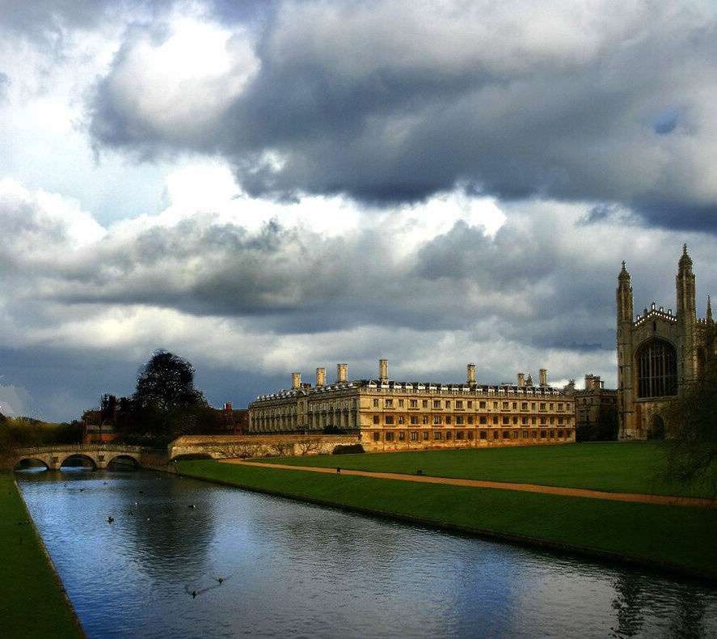

# ＜天璇＞中国式选举——观2011剑桥中国学联主席竞选

**我庆幸自己见证了2011年这一次选举。与许知远两年前观察的剑桥中国学生会选举不同，这一幕并非轰轰烈烈而来，无可奈何而去，比我更年轻的这一代，分明少了包袱和压力，多了勇气与常识，他们自己判断未来。**

#  中国式选举——观2011剑桥中国学联主席竞选

## 文/周轶君

 

英伦初冬，剑桥中国学生会主席选举，像一出宣传已久的话剧，在万众期待中开场。候选人站在同一舞台，顶光投下他们长长的内心独白。他们中的每一个，带着成长背景，性格印记，对未来的不同解读，分饰这一代“中国少年”角色。

这出话剧上演前最好的广告，是前主席自动宣布连任引起反弹，27年历史的中国学联遭剑桥大学注销。 剑桥校刊以“中国式民主”为题，报道“未选举，就当选”之事。反对前主席常非凡者和她的支持者在网站、 校园持续互攻，终于成就12月2日紫禁之巅胜负一仗。

我庆幸自己见证了2011年这一次选举。与许知远两年前观察的剑桥中国学生会选举不同，这一幕并非轰轰烈烈而来，无可奈何而去，比我更年轻的这一代，分明少了包袱和压力，多了勇气与常识，他们自己判断未来。

初入会场的时候，我是心存偏见的。中国学生确实如许知远描述“公共生活中的隐形人”，事不关己并不热衷。排队入场时，耳边传来的对话是关于“昨晚通宵打牌”或“某个牌子到底是哪个国家的”。但后来现场观众的反应证明，他们显然有自己的主张。

工程系讲演厅几乎满座，据说到场有三、四百人。入场证件检查异乎严格，现场不准摄影。监督选举的是多名黑袍高帽的外方校监。他们还站在各个出口，控制出入，严肃庄重。

三名主席候选人中，西装革履的杨第一个登场。他引用了湖南老乡曾国藩的“醒世言”，但迅速指出，剑桥学联只是学生组织，不过问政治，更要避谈民主。杨亮出准备好的幻灯片，说明自己的工作重点将是组织剑桥中国学生聚餐、郊游、找工作、办春晚。照片中不经意出现一张合影，身后有学生私语：“那个是中国驻英大使”。

杨的竞选讲演中庸、和善，但乏动人之处。前排观众开始玩ipad。

轮到陈鲁滨上台。周围有人交头接耳： “这不是个小孩吗？” 你上中学时候，班上是不是总会有一个头脑灵光、成绩令人羡慕嫉妒恨的理科天才？清瘦敏捷，很早就戴眼镜，认识久了才发现他也读朦胧诗听贝多芬？医药博士生二年级陈鲁滨，模样就可以归到这一类。

陈鲁滨一张口就要“为万世开太平”，令人暗暗捏把汗。我记得许知远曾经描写过物理系博士M，他的竞选理想获得掌声口号，却没有人严肃对待。

但了解陈的人，会知道我的担心多余。陈原来是学联娱乐部部长，挑战常非凡属于“党内斗争”。他并不缺乏“从政经验”。

陈是主席候选人中唯一没有念稿的，只准备了几张提示卡在手里。完全不同于杨的“服务型学联”，他直踏雷区：“我们是什么人？是读书人，读书人要思考未来做什么⋯⋯走出校园，我们就是光，要去照亮社会的灰暗角落”，“为什么我们的社会里，跌倒了没有人扶，为什么主席可以自己说连任就连任⋯⋯我们的责任就是去改变世界。

台下响起一个孤独的掌声。更多掌声跟进。陈鲁滨自己一愣，接下来却更加有信心。

三名候选人在讲稿中都引用了名言。杨以曾国藩开场，陈鲁滨表达对张载、鲁迅和丘吉尔的认同。常非凡自称孔子和邓亚萍的粉丝，引用了拜伦和马克思主义者罗萨.卢森堡。

陈鲁滨用鲁迅说“中国人对未成之事总是苛责备至，对既成之事总是委屈求全”来形容自己出头反对的不易。

他的讲演妙趣横生，挖苦起来不动声色：“英雄以德服人，巾帼英雄也不例外”。台下掌声、笑声不断。

他同样承诺为中国学生组织活动、寻找工作。他说，可能有人质疑自己能否兑现，“我以一个普通青年的身份，告诉你可以的”，暗讽其他对手家族背景强大。来自浙江的陈鲁滨提到学联并不是要让中国学生禁锢在自己的小圈子里，他将继续组织中西音乐会、文化讨论会。幻灯片结尾是他弹钢琴的照片。

陈鲁滨有时侧对台下，来回踱步，仿佛同另一个自己对话。相信他在上台之前，曾在宿舍里这样练习讲演。他不知道这件“未成之事” 命运几何。有报道说，他虽然一开始反对常非凡自动连任，但在会议更改说法“支持常继续工作”时，还是举手同意了。后来又直接找剑桥校监，“家丑外扬”导致学联收到注销警告。还有所谓“迎新砸场”事件。个中是非，当事人各自表述。但在剑桥学联选举现场，你会由衷钦佩这个年轻人的眼界和胸怀。他提到“读书人”的使命，直指每一个选民内心。他提到，摒弃中国学联以往一方胜选之后，另一方全盘退出的陋习，欢迎常的团队和常本人加入新的学联。

陈赢得掌声最热烈的时候，是他宣布增设 “退订学联邮件”功能——赋予选民选择不喜欢的自由。

笑声掌声冷却之后，常非凡登场。这个山东女孩令人充满好奇。身处风暴中心，面对千夫指。她曾就读剑桥政治专业，称“民主不是无政府主义的瞎闹 ”，后转工程系，在剑桥迎来送往近千中国官员要人，竞选前后都有学者支持她的电邮“被曝光”。之前有一名跟常通过电话的中国记者告诉我，常在英国呆了九年，为什么讲话一副国内官腔，比如一再强调采访她只能“正面宣传”。第一次见到她的形象，是学校图书馆外张贴的竞选海报。照片上的她眉目清秀，意气风发，像小时候画片上见的三好学生标准像。宣传海报语言非常“主流媒体”，密密麻麻不得要领。

常非凡穿着精致，带着现任主席的气场，持重端庄。她首先讲了一段英文，派发英文讲稿。这时我才发现，原来座中有少数非华裔，他们也来投票选中国学联主席？旁边有中国学生告诉我，帮着派发英文稿的巴基斯坦人前几天向她拉票。问他为什么给一个中国女生助选，巴基斯坦人以实相告，常非凡许诺，如果巴人投她的票，她就带着中国学生票仓支持这个人竞选剑桥另一个社团主席。

常以回顾三年工作成就开篇。刚说了几句，台下猛一嗓子英文：“Stop lying（别撒谎了）！”常稍停即恢复讲演。

为了学联工作，常非凡说她和团队“牺牲了学业、家庭，甚至健康”，“为了获取祖国人民对海外学子的新春问候，让大家在冬天感受春天的温暖，我们很多同学过节的时候过家门而不入”。常非凡自掏腰包，请电视台在国内奔走，为剑桥春晚拍片。去年春节，她要讨一封教育部部长贺信，“在最寒冷的冬天里，在北京站了一早晨”。她受了委屈，教育部人员说，“剑桥要温暖，哈佛怎么办，英国学生要温暖，美国学生怎么办”，但她不屈不挠，在寒风中站了一天，“终于站到了贺信”。讲到这里，这个二十出头的女孩几乎热泪盈眶，台下却笑成一团，嘘声四起。

“我们学联搞春晚没权，没钱，没时间，一台春晚，方方面面，不知道要克服多少困难”，据媒体报道，常非凡团队在竞选之前已经投入2012年春晚的准备。常当场宣布一旦当选将成立学联基金会，个人捐赠两万英镑“启动资金”。

常非凡列出自己参选的“五大优势”。其中一条，“我们团队保全大局，孤注一掷，只推举我一人竞选主席，而不竞选副主席、秘书长、财长等职位，也就是说，如果我落选，我们整个团队，在未来学生会里不会有一席之地”。台下嘘声再起。

她显然意识到有必要强化自己的性别优势，引用一名德国女革命家（英文稿中注明是罗莎.卢森堡)的话：“如果街道上只剩下一个人，那个人一定是女人”。常非凡的解释是，这句话证明“女人很少成为机会主义者，女人很少趋利避害。相反，她们生性温和宽容，容易相处，团结众人”。

我没有找到这些句子间的逻辑。也没有搜索到罗莎.卢森堡的原话，却找到了罗莎说过的这段话：“未经选举，没有新闻和集会自由，没有表达意见的自由，生命在公共空间如行尸走肉，只有官僚主义生龙活虎”。

“Without general elections, without unrestricted freedom of press and assembly, without a free struggle of opinion, life dies out in every public institution, becomes a mere semblance of life, in which only the bureaucracy remains as the active element.” ― Rosa Luxemburg

陈鲁滨是三人之中唯一没有提到“民主”或者“政府”二字的。他只谈“社会责任”。常计划在下届学联增设机构，她说“政府扩大机构要多收纳税人的钱，学联不会”。

讲演最后，常非凡要求观众允许她“用有点倔强但充满真情的头颅鞠躬⋯⋯”现场再次被笑声引爆，几十个声音同时重复“头颅？——”

常的讲演超出规定时间，监选人过来示意“时间到”，常没有理会。终于言尽，她在台上站了好几秒钟，手持麦克风，嘴唇轻微抽动。也许预感到，这是自己作为学联主席最后一次站在舞台中央。

在那凝固的最后几秒里，我为这个女孩感到难过——她至少是自己的信徒。如果眼前真是一幕话剧，她也许可以多站一会儿，来一段内心独白：凭自己的人脉、财力、利益陈诺，怎么可能会输？自己如此真诚，现场为什么有人发笑？为什么有人起哄？究竟错在哪里？

杨对上意和民情都是清醒的。在提问环节，有人抛出敏感的“未来学联与驻英使馆关系”。杨带笑作答，学联当然支持使馆工作，“没有其他什么你想的关系”。陈鲁滨回答，是合作关系，而非“affiliate”(附属），“希望我回答了你的问题”。

舞台上，还有重要的第四个人。他让我想起，领袖有时并非天生，而是生于对事件的反应。张亮，秘书长职位竞选者。中国学生说他长得像凤凰卫视主播姜声扬。

“听说主席自动当选，我当时的反应是一笑；知道有反对的声音，还是付诸一笑；知道社团被大学注销，我仍是付诸一笑⋯⋯”他站在舞台一角娓娓道来。

他的“三笑”代表了大多数人对“既成之事”的委曲求全。 “直到收到一封Bcc邮件”，张亮终于拍案而起。“我想我和大多数人一样，大部分时候选择做容易的事情。我们可以冷眼旁观，但当我了解真相，我选择了做正确的事情。所以我站在这里，发出自己的声音⋯⋯”

不清楚他指的“Bcc（抄送）邮件”是什么。是不是一名中国学生转给我的那封广为流传的email，内容是呼吁“常主席行动起来”，“让陈鲁滨有点民族自尊心”，指陈勾结外国人搞民主选举，“整自己的同胞”云云。邮件署名是“关心学联的部分剑桥中国人”。

直到选举结束，结果公布，网上还出现了“陈鲁滨一伙选举舞弊”与驳斥这种说法，公布英国校方如何监选唱票计票细节的“帖战”。剑桥学联成立二十多年来，其实对于选举是习惯了的，突然出现的连任风波才是意外。

因反复核对证件，投票过程漫长。讲演时间已过，不断有刚刚下课的师生加入。计票在清场之后进行。出门时，我听到一个男生问另外两个中国女生：“你们没投常非凡吧？”女生答：“那一定是没有的啦。”同行的中国学生说，看来陈鲁滨赢定了。我再次“保守”，难说啊，现场效果好不一定比得过人家票仓坚固。

竞选结果12月6日在学联网站公布。陈、杨、常分别得票177 、77、 65。“三笑”的张亮以159票当选秘书长。这个结果扭转了整个事件的定义，把我的“保守估计”击得粉碎。这一幕话剧真正的主角，是台下观众。他们有选票，他们没有做看客。

 

（采编：佛冉 责编：陈锴）

 
