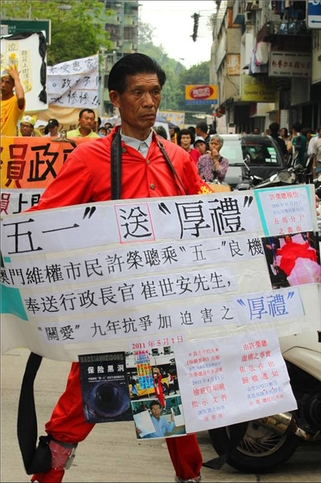
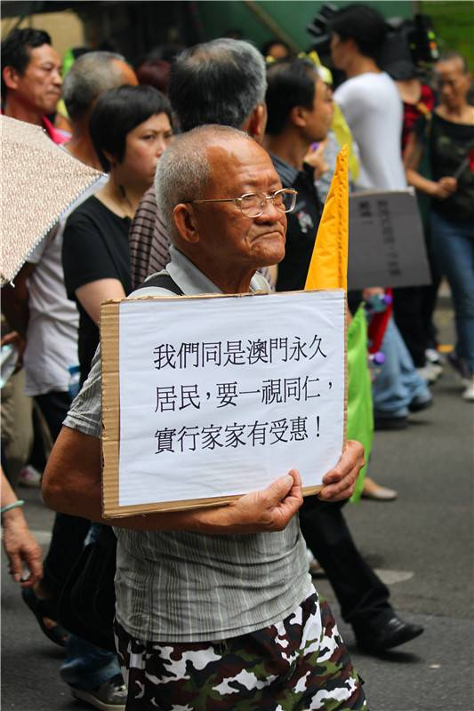

# ＜天璇＞中国新闻人的面包与梦想

**在大陆新闻界最大的悲哀是，新闻人是思想上的愤青，行动上的奴才。在思想深处，每一个人都对当局的媒体政策持有不以为然的态度。但在实际行动上，却没有人敢越雷池一步。大家战战兢兢履行职责，为虎作伥，充当着帮凶。** ** ** ** **

#  中国新闻人的面包与梦想

##  文/ 陈润博（澳门科技大学）

 中国新闻界向来存在诸多问题。 名人、明星的花边新闻成为主流， 格调低下、内容粗俗的文字， 无中生有，捕风捉影，胡编乱造， 毫无生命力与意义的新闻， …… 但我今天写下的与这些无关。 我今天想谈的，只是一个关于面包与梦想的天平。 谎言与真话。 在志熙的Facebook上看到这样一个消息。 某内地出镜记者叫她的PARTNER 拍释放A*W*W*的标语,她的PARTNER 爆出一句: 这是谁啊。 在香港，在澳门。 我们尚可经历目睹这些游行。在大陆，永远都不可能触及如此声势浩大的社会运动。小倩说的很对，作为一个大陆记者。也许永远只忙着内部斗争。我们都不能知道这个社会到底在发生什么。 

### 

 在2011年5月1日之前，我觉得，年轻人应该有改变社会的力量。又或者说，年轻人应该为现实做出改变。可是现在看来，我终究还是想得太天真了。 2007年，陈丹青就曾在传媒大学对学生调侃说，在中国做媒体，不一定能够感受到社会主义和资本主义的好处，但是能深刻感受到社会主义和资本主义的坏处；拿不到社会主义的大锅饭的好处，却可以感受到集中管制；拿不到资本主义言论自由的好处，却感受到恶性竞争的坏处。 在大陆新闻界最大的悲哀是，新闻人是思想上的愤青，行动上的奴才。在思想深处，每一个人都对当局的媒体政策持有不以为然的态度。但在实际行动上，却没有人敢越雷池一步。大家战战兢兢履行职责，为虎作伥，充当着帮凶。 这对媒体者，应该是一种痛苦。平时义愤填膺，为民请命，可出现在报刊上的文章依然歌舞升平，不但表达不了自己的心声，反而歪曲心灵，颠倒黑白。 就拿一次又一次的矿难来说，另一边，铺天盖地的报道说领导批示要严查，可矿难却来的更加凶猛，死亡人数只增不减。这事如果发生在美国根本无法想象。新闻是向广大人民传播真实的客观存在的消息，可现在中国又有几家媒体能真正做到如此。 贪污、童工、草菅人命、黑心医生、教育腐败、院士坑蒙拐骗、假食品、假药品、高房价。 你有没有胆量说真话。 只有领导才知道。普通百姓永远只会看见高官到处走访，永远不会知道事实的真相。 或许有人会说，这由不得我们选择。 写出的稿子要经过主任、总编批，最上面还有相关部门。 敏感问题不知道被枪毙在第几轮，或许根本轮不到记者自己作决定。在写稿之前，报社可能就会接到宣传部的通知："凡是涉及到***问题的稿件，一律不准报道。" 面对这样的媒体禁令，再无穷无尽的同情心与热血都被击得粉碎。这样的禁令使得现代媒体的真正宗旨变成子虚乌有。 中国新闻是没有自由的。 我突然想到了两个人。 第一个是杜长平。 2008年5月，《南都周刊》的副总编辑杜长平先生终被免职。长平事件的起由在于《南都周刊》副总编辑长平所发表的一篇文章《西藏：真相与民族主义情绪》（发表在其博客上时称《拉萨真相从哪里来》）。 杜长平说，这些虚假报道对新闻价值的最大伤害，在于让很多人进一步放弃了对客观公正的信赖，而选择了狭隘民族主义立场。他们从中得出结论说，普世价值都是骗人的玩意儿，只有国家利益的你争我夺。他们甚至以此为依据说，撒谎也是一种“国际惯例”，从而对自己身边或者历史上的谎言予以谅解。当然，一些人本来就是这样想的，这次媒体事件让他们又找到一个证据，从而去对别人宣讲而已。 随后《北京晚报》发布了署名文峰的一篇时评《造谣自由的南都长平》。在随后的言论中将整个矛头对准了《南方都市报》甚至是南方报系。随后，北京晚报与南方报系开始彻底分裂。这在历来讲究人脉的中国传媒界，还是第一次。 本是一篇文章的讨论，开始变为整个传媒界的一场关于南方报系的是非争论，最后又演变成所谓“知识分子”“精英阶层”关于民粹主义的大辩护与大抨击。 杜长平因此被免职，这种勇气终于还是演变成一种悲哀。 南方报系也是悲哀的，作为中国传媒界的先行者，在这样一场窝里斗中被称为“反华媒体代言人”。 早在1901年，就有西方媒体称“中国人缺乏公共精神”“对自己国家的命运毫不关心”。然而，当中国人终于敢于言论，开始具备公共精神的时刻，又贴向了“窝里斗”这个劣根，反而更悲哀。 第二个是仇子明。 2010年中，中国新闻史上发生了一起空前也或许“绝后”的事件——记者仇子明遭遇公安系统全国通缉。整个过程比任何编造出来的喜剧更加地滑稽可笑。但是在笑完后真的让人觉得无比悲哀。 仇子明被所谓的“通辑”后，换了三个地方住，生活得象一个真的通辑在逃的犯人一样，对于一个二十多岁，刚刚大学毕业，涉世不深的人来说，因为批评报道，倾刻之间将面临牢狱之灾，他的心态可想而知。 还未过转正期。 少年气盛涉世不深。 相信公平正义而没有城府。 仇子明的妻子在接受采访时说以后不希望他再做记者了，这个愿望再正常不过，毕竟做其它工作也是一个人生，没准还是个不错的人生。但是，一个没被所谓社会城府一点点浸染的热血青年记者的职业生涯可能就此打住。 在如此“寂寞和艰难”中，仇子明敢于执笔直面如此扯淡的惨淡。 这已经不是第一次了，享有舆论监督权的记者尚且遭此待遇，如果听之任之，普通国民是否要全部噤声。 是不是要所有的报纸天天歌功颂德，掩黑暗没落于歌舞升平之下。 一篇有根有据的针对上市公司的报道便引起如此轩然大波，还有谁敢直言，还有谁敢替民请命。 

 爱国与民族主义并没有错，但被一种情绪左右就失于一种职业准则。 新闻的不自由无疑是中国媒体从业人员的悲哀。 我在中国传媒大学电视学院教授、电视节目研究所所长张雅欣教授的讲座上曾经提问，当生存变成中国大陆媒体的第一要务时，如何能在颠覆传统，突出重围和迎合受众之间找到平衡点。 张老师当时笑了，说，这个问题很尖锐啊。她最后说，找到平衡从根本上来说是不可能的，因为这样大家都会变成疯子，变成精神分裂症患者。 如果真的是这样，那么谎话说上一千遍就可以成为真理的定律还成立吗？ 昨天跟完游行之后，我一直在想的是：人究竟可以多伟大？ 很多老人，满头华发，脸上沧桑的皱纹清晰可见，可是依旧高高举起手中的标语，跟在人群里大声呼喊。有人晕倒，有人中暑，5月1日的澳门竟是这样的闷热。但是队伍依然在前进。 走到新马路的时候，我突然明白了。 马路两边都是警察，看不到头的警察，那一刻我想起晕倒在地流着眼泪的婆婆，想到那些戴着面具高声喊着的学生，我觉得他们的努力很徒劳。我觉得其实我也一样，很多事情，希望是美好的，可是我什么也做不了。 

 我被老师拖出来的时候，被推搡到政府大楼门口，眼前人群晃动，满世界都是维持秩序的警察。耳边不停不停的听到这样混杂的声音。 你是记者吗？ 对不起，这里不能停留。 请出示媒体证件。 请不要过马路了。 往右行好吧。 一直一直走，不要停不要停…… 就像老式的录音机卡带了一样，天旋地转。 人便是人，再勇敢的媒体人，也是生活在现实中，需要养妻育子，需要考虑方方面面的因素。 但是，媒体应是社会公平、正义、良知的麦田守望者，守望者们需要怎样的素质这一点不用多说，社会公众的支持是守望者们必不可少的强大后盾。仇子明的被“通辑”，让这个守望者本身，陷入无立足之地的境遇。 只有那些坚守职业信念的人会了解并成为最后的快乐者。 分专业的时候，很多人问我为什么不选新闻，其实答案很简单，倘若有那么一天我回到内地，我不希望未来的几十年靠说假话生活。 美国之所以成为今日的美国，就是因为他们的开国之父曾经说过一句名言:如果非要两选一;我宁肯选择没有政府而有报纸。 中国时至今日还距离美国相差十万八千里;不是因为我们没有航空母舰，也不是因为我们没有微软intel波音google，而是因为，我们的国人在文化和精神层面本身就缺少美国人追求真相和真理的决心与意志。 每个人力量都太渺小了。即使是昨天声势浩大的游行。其实从本质上改变不了什么。 晚上和小倩聊了很久，我说，今天下午回来我心里一直很难受很压抑，老百姓其实很可怜，人能改变的事情真的是太有限了。就像黄伟民最后在大楼对面，站在人群之上，他对着扩音器声嘶力竭的吼着，他手中的牌子上写着，没有抗争，哪来改变。他最终被带走了。很多老人围着警车在喊，放人放人。那些叫喊我想我一辈子也忘不掉。 其实一开始，选择在中国大陆修读新闻专业就是一条万劫不复的道路，我们必须奔跑在街头，去做一些其实我们根本就无力挽回的事情，我们或许无法做到兼济天下，忧国忧民，可是我们至少要凭良心，说真话。 其实一个人的职业生涯在整个历史的潮流中无足轻重，但是，仇子明们的止步会让更多的记者在每一个报道的选择上更多地保护自已，更多的新的新闻从业者会选择一个更“安全”的职业。 这个世间存在着太多的阴暗面和丑陋面。我们最终想实现正义，可是面包与梦想的抗争最后谁会占上风。 说不好吧。毕竟在中国大陆，一切皆有可能。 

### 

### 

（采编：陈锴；责编：陈锴）
