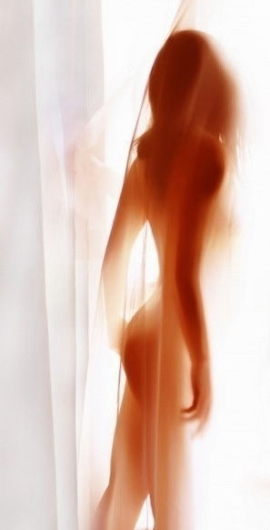
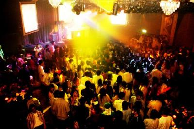
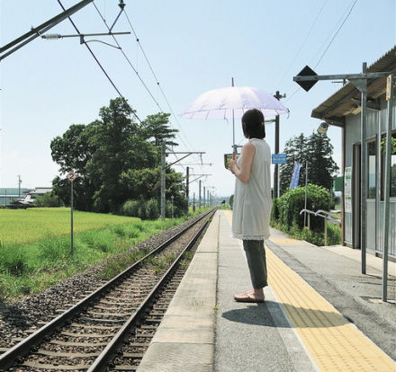

# ＜天璇＞串个门，然后回到我的世界。。。

**白天枯燥的工作，挣钱的辛苦，无聊的生活，和被伤害过的感情，在现实与理想差距面前纠结迷茫的人，夜里只有在这里，才能找到那么一些魅力和成就，女人可以被男人捧着，男人成为妇女之友，可以搞定任何女的~~殊不知，每个人都带着厚厚的面具，逗着别人，藏着自己~~有人会说，认识朋友嘛~朋友？一个好听的称呼而已，真正的朋友，有几个是这里认识的，换个名字，玩伴，有可能的话，发展成床伴就是收获了。。。**  

#  串个门，然后回到我的世界。。。

## 文/ 李静洁（山西大学）

 

最近，我去尝试了一种生活，这种生活是我曾经不屑，或者说，曾经有些不入眼的一种生活。我只是想知道，为什么很多人喜欢待在里面，而且乐此不疲。。

三三两两，一个寂寞的夜，无家可归或不想回家，一大群陌生的人啊，这之中或许有那么一两个你很熟，或者是不太熟的人，更多的人，转头即忘，或成为点头之交。

白天，每个人有着不同的职业，看起来与常人无异，夜晚，就完全变了，女人妖娆，男人多金，至少看起来如此。

女人，浓妆艳抹，脸上多少坑也能让粉填平了，眼睛再小，也能涂大了，天气再冷，两条大长腿也能御寒，一水儿的短裙，豹纹，丝袜和一个驴牌的包包~~无论坐哪，先掏出爱疯4，找个光线不错的地方自拍一张，全部是斜上方45度，然后美图秀秀，剩下一窄窄的小脸和大大的眼睛以及魅惑的背景，然后她们就变成了三个人，白天的，晚上的，和网上的。。。 

收起来，扭一扭，开始搭讪~说话腔调是一样的，或嗲嗲滴慢慢滴细细滴扭一扭，说话时身体前倾，好像所有男人都是她的情人，或加点脏话或豪气十足然后优雅的夹个烟喝个酒，和所有男人都可以勾肩搭背称兄道弟。。甚至连搭讪的方式都一样，“你长得和我一个朋友好像啊~”最刺激的是，一晚上听过4次，当第四个人进来说的时候，前三个多不好意思了，连忙附和，真的真的，我朋友真的这样，哪天让你认识。我只好说，哦，我大众脸。

女人和女人之间的话题，无外乎两个：哪个男人在追我；今天我买了什么。。。

女A说，昨天我哥让我相亲，说，你就不能穿个裤子么，我没有呀，我就这范儿，全是裙子，我这么长的腿，怎么能穿裤子呢，多浪费啊~~

女B说，我是学中文的，你们看不出来吧，其实我骨子里特别贤妻良母~你们教教我，怎么搞定摩羯座男人，有个男人Q上天天豁聊我，上次和我说意兴阑珊，我以为人家有意思了，结果很多次之后，我一查，发现，妈的，意兴阑珊是没意思的意思！

女C说，我搞定过很多摩羯，我教你，你们看我和网上不一样吧~女B：对对，我没想到你这么高，又瘦又高的~

女C说，是吧，看看，这个摩羯男又给我留言了，留了个，麻豆，什么意思？我说，模特~女C，哈哈，他说我是模特呀~我平时，最大的爱好就是喝个咖啡，看个书，也算小资女，你也是吧~~我==#，我不是，我不小资（我特想抽我自己，让你丫接话）。。。

女D说：那个傻逼男的的女朋友又给老娘电话了，你都是女朋友给我电话干嘛，炫耀啊，自己不求行，还天天骚扰我~~男人也贱，外面的才是好的，我只要给个好脸，P颠P颠的，我告你们，姐我就HOLD住他了~

女E说：匡威的鞋吧，限量版，我上次见了，那个，多钱多钱来着？我：假的。。女E：额~哈哈，喜欢穿这个的都有自己的style，就是风格~我：我听得懂。。 

再说男人，无外乎，喝酒，炫耀，夸女人~

手表，香水，头发站起来，各个打扮起来还算顺眼，只有个别人的屎坨坨的金链子，让我不能忍受。。我以为进入这个圈子不容易，我以为我卡通帽衫加板鞋算是异类，不说话坐坐即可，结果很简单，结果搭讪的哥哥还很多，我估计，是不是这些男人吃多了咸的看甜的，吃腻了甜的，想咸的~或者，甜咸通吃，来者不拒。。

男A：你怎么不说话？我：头疼！男A：感冒了吧，要不喝点热水~我就不喜欢那些女的，太装了~我：。。。（我也在装你没看出来？）

男B：你是学中文的吧~我：新闻！男B：新闻？也算中文么？算吧，我眼力很好的~我：哦，看女人看多了是吧~男B：不要这样说么~就是受欢迎一些~~~我：==#。。。

男C：我昨天被蚊子咬了~我：哦，女蚊子看上你了~男C：你真幽默，你怎么知道这只蚊子是女的？我：。。。（你妈没教过你咬人的蚊子都是母的？）我：猜的==#~~。。。

最长一次说话：

男D：女生，最重要的是素质。。我：哦，一个漂亮的；一个有钱的；一个有素养的，三个占你面前，你选谁？男D：不能说一个女生漂亮就没素养么~我：我没这么说，不过又漂亮又有钱还有素养的轮的上你么？大方向，实话！男D：哦，我当然先选有素养的，再是有钱的，最后是漂亮的~素养是需要积累的，钱无所谓我有，漂亮能管几年啊~~我：不是吧，我觉得要翻过来吧，男人什么时候可以这么有觉悟？得不到的时候吧~~男D（变脸）：你在说我？我，不不，我说话直，对事不对人~男D：我就喜欢这样性格的~我：==#。。。。

也算是体验生活吧，转了一圈，我觉得这个世界和我还真格格不入。

熙熙攘攘的人呐，一颗颗缺爱空虚的心，忽然想起一句话，一个人缺什么，看他炫耀什么就好了~~男人与女人，女人与女人，相互吹捧，相互安慰，时间长了，自己也就信了，每个人都觉得自己身边美女如云，帅哥不断，人中焦点，爱好广泛，每个人都觉得自己赢了。谁也能和谁暧昧，不过是场游戏，各取所需，各得其所。

白天枯燥的工作，挣钱的辛苦，无聊的生活，和被伤害过的感情，在现实与理想差距面前纠结迷茫的人，夜里只有在这里，才能找到那么一些魅力和成就，女人可以被男人捧着，男人成为妇女之友，可以搞定任何女的~~殊不知，每个人都带着厚厚的面具，逗着别人，藏着自己~~有人会说，认识朋友嘛~朋友？一个好听的称呼而已，真正的朋友，有几个是这里认识的，换个名字，玩伴，有可能的话，发展成床伴就是收获了。。。

陌生的人呐，热闹完后各回各家，电话本里多了许多的号码，又有几个你敢去说知心的话。。小风一吹，还是无尽的空虚~白天又回来，到底哪一个才是真实的自己，估计连自己也不知道了。恶性的循环，幼稚的人，以为做个4不的人，不承诺，不主动，不拒绝，不负责，就可以保护自己，得到更多的爱。其实，早已失去爱的能力。 

从今天起，我回到自己的世界！我的心太小，装不下那么多人，每天在大太阳下，按时，上班，定点，下班，回家，吃饭，看书，码字，早睡，牛仔裤，素颜，认真的爱一个人，有烦恼时掉眼泪，打电话给那一两个朋友，简单而充实，不吵也不闹。。 

 

（采编：王胜；责编：陈锴）

 
