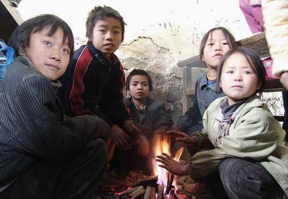
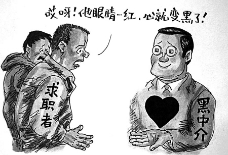
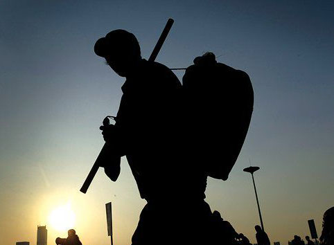

# ＜天璇＞临时人生

**看了过多的青春偶像剧，钟情于灰姑娘式的童话情节，幻想着自己某一天终能在城市出人头地，彻底摆脱父辈的命运。** ** 毫无意义的工作，日复一日地消磨着他们的青春。他们终将在这个阶层流动日益僵化的社会里，一遍又一遍地质疑自己生活的意义。** ** 然而他们很快就会发现，无论是临时工还是长期工，都无法给他们一个想要的未来。**  

# 临时人生

## 文/蓝方（媒体记者）

 

#### 南城

在北京生活了六年，我很少去这个城市的南面。

那是另一个北京。

新修的大马路边是一栋又一栋丑陋干瘪的低矮楼房，劣质大喇叭放着嘈杂的山寨音乐，油腻腻的小吃摊堵在人行道上，满地的垃圾与横流的污水。

然而随着这个城市疯快地发展，这样的南城，在不断地向南退去。

上个周，我去到南六环附近的乡镇，马驹桥。

这里也是北京，就是那个南城的北京，城市最边缘的北京。

拥挤，喧闹，大大的铁皮垃圾箱散发出浓烈的恶臭，土黄色的阳光打在土黄色的街道。

我被安排去写生活在这里的一群人。

一群年轻人。他们不过19、20岁的年纪。刚刚从农村来到城市。有着梦想，却没有未来。

他们在这个城市没有身份，日复一日地打着临时工，过的只是一种临时人生。

#### 车祸

为了体验他们的临时状态，我和他们一起去打了一天工。

一个男生带着我选了一家服装厂，一天十二个小时，能挣九十块钱。

六点左右，我把身份证押在一家黑中介手上。在铺面上呆坐了一个小时后，和另外十二个小孩一起上了班车。

这是一辆准载8人的大金杯。我们上车前，除去司机和副驾，车上已经坐了8个人。然后我们剩下的十三个人也要被塞进去。

车厢里本来有三排座位。第一排上挤了三个女孩，第二排被放平，坐了六个女孩，剩下的男生，各自蜷着身子抱着膝盖的挤坐在地上，还有三个人，弯着身子的站在门边。

中介用劲拉了两次，关上车门。

一个月前，就是一辆这样的金杯车。

准载六人，装了整整16个人。

金杯车开到马驹桥下，与一辆超速的空载公交车侧面相撞。

三人当场死亡，一人抢救无效，两人重伤。

当救援者打开金杯车的后车门时，就看到这些年轻人横七竖八的叠在一起，血腥异常。

报道大多数说，这是一辆送农民工去上班的班车。

农民工。

于是在大多数人那短短几秒钟的感叹中，一个个苍老而木讷的形象，沉默着地，便悄然逝去了。

然后我看到亦庄论坛上的那些留言。

一个说，为弟弟妹妹们祈福。

一个说，希望这些孩子们早点康复。

弟弟妹妹。孩子们。

#### 孩子们

为什么要来北京？

这些孩子们的回答，往往是，毕竟是首都嘛。

他们对北京有着不一样的想象。

一个男生说，他想象中的北京就是一座古城。故宫，城墙，胡同，四合院。

一个女生说，她以为北京就和偶像剧里一样，鳞次栉比的高楼，灯红酒绿，光鲜，亮丽。

他们都没有想到，他们所来到的北京，只是一个不比家乡县城更繁华的城乡结合部。

为什么来到马驹桥？

他们大多想不起最初的原因。是因为有哥哥姐姐在这里，是因为有朋友在这里。总之，是因为大家都在这里。

他们中的绝大多数，只是初中毕业，或者高中读了一两年，便不再读下去。

成绩不好，不是读书的料。

他们也总被念叨，对农村的孩子来说，读书考大学，几乎是改变命运的唯一路径。

但很快他们也发现，考上大学有时也很难真正改变什么。他们身边也有大专毕业的年轻人，和他们一起挤在300块钱一个月的平房中，在小公司里每个月挣两千多块钱，甚至还不如上流水线。每个周末，也和他们一起打临时工。

既然考不上大学，或者考上大学也摆脱不了贫穷，不如早点出来打拼。

一个男孩把这叫做，老大的榜样。

家里的哥哥姐姐便是读到半途就出来打工。哥哥告诉他，北京好得很，轻轻松松能找到一份两三千块钱的工作，比农村强太多。

一个女孩被她的小男朋友骗到北京，说，这里有很多年轻人，很多玩法，你不出来就永远体会不到。

于是他们懵懵懂懂，怀着对北京模糊的想象，来到这个城市的最边缘落足。

#### 临时工

他们的哥哥没有告诉他的是，两三千块钱的工作确实不难找，但他每天要在流水线上做十二到十五个小时，小小的线长、拉长仿佛和他有着八辈子的仇，永远不停地喝骂，他会慢慢变成一台不会动脑的机器，而且很可能一直这样运转下去，没有升迁，看不到前程。

她们的男朋友也没有告诉她们，一天做了十几个小时的工之后，早已没有力气出去玩。从这个城市的边缘去一趟城市的中心，公交车永远拥挤，道路总是拥堵，你站在路边看那些无从消费的五光十色，你离它们越近，它们便离你越远。

要找一份长期的工作，对他们而言，其实是再容易不过的事情了。

到处都缺工。连中介费都不用，一些工厂甚至免面试、免体检，到岗就可以上班。工资待遇也眼看着的往上涨，如果多加加班，一个月能挣三千块——要知道，在北京大学生的平均起薪，也无非如此。

一个女孩在飞利浦上了一个月的班。刚刚结束培训，便辞职了。

与其在流水线上消磨青春，她更珍惜自己的生活。

她选择打看起来更自由的临时工。没钱了去打工，有钱了便歇着。想干活就干活，想玩就玩。

每天早上六点，这些想要更自由的生活的年轻人便来到马驹桥的商业街。这条街上有将近一百家中介，几乎家家都招临时工。

他们把身份证押在中介那里，然后由中介拉到各个工厂，打十二小时的工，再回到商业街上结工资。

这里临时工的岗位种类繁多，覆盖全北京的各行各业。

有接到紧急订单的电子厂，去了还是上流水线。有印刷厂，往书刊里面夹海报。有服装厂，去给成衣剪线头，或是给品牌服装换包装袋。毛巾厂则是叠毛巾。还有发传单，贴“牛皮癣”。

也有危险系数相对较高的。例如去家具厂搬木料，到快递公司送快递，给物流公司做搬运，到绿化队挖坑植树，甚至还有强拆——一个工友说，中介只告诉他去做拆迁，没想到被拉到现场，才发现要拆的房子里面还有人，临时工们一人领一个盾牌和棍子，把人赶出来后继续拆房子。

事实上，绝大多数的活路并不比流水线上的工人轻松。

在出车祸之前，临时工的市场价是60元一天。车祸之后，则涨到了80元。据说每拉一个临时工，中介可以从中间吃掉30块。

我们这天，是要去顺义的服装厂。

满满当当的金杯车，载着我们21个工人，沿着南六环开了整整一个小时，把我们卸在机场附近的一家物流园里。

除了我们这车的21个工人，另一辆同样型号的金杯车里还装了19个人。下车后，服装厂的负责人发现人多了。于是中介随手点了十个男生跟他上车，他们又被拉到王府井的一家星级酒店，去当搬运工。

我们剩下的30个人，一人领了一张空白的胸牌，就去给这家服装厂——其实是服装物流仓库干活了。

我们主要做三件事：

第一件事，两个人一组，把一个又一个大箱子里面的衣服给挂出来，把外面的塑料袋撕掉，欧元的标签撕掉，再把大衣架换成小衣架挂好。刚开始时我还觉得挺好玩，顺带还把ZARA的秋冬新款看了个遍。结果一干一上午，一直站着不断重复向高处挂衣服、换衣架，不到中午，便手臂酸疼。

第二件事则十分轻松。我们被分成两组。一个男生负责把一箱一箱的毛衣倒在桌上，女生则围着桌子坐一圈，拆掉毛衣的包装袋、硬纸板和标签，再有两个人把毛衣收回到纸箱里。可以一边干活一边聊天。不过好日子没过一会儿，又被叫去继续挂衣服。

挂到下午五点，开始第三件看上去很好玩的工作——把大纸箱里不同款式的衣服全部倒出来放在地上，然后分门别类的又装回箱子里。ZARA这一季的款式多的让人惊诧，我们在五颜六色的毛衣堆里转来转去，晃得头晕脑胀。

就这样，从早到晚一刻不停歇地做十个小时工。中间有两个小时吃饭，每人领一盒豆芽炒饼，坐在台阶上解决。

一边吃，周围的小孩便一个接一个地宣誓：回马驹桥了我要吃炸鸡！我要吃大排档！

中介冷冷地说，给你们吃炒饼就不错了，之前吃的都是五毛钱的方便面。

#### 黑中介

孩子们和中介的关系颇为微妙。

在马驹桥商业街上，比恶臭的垃圾堆更多的，便是黄色的海报招贴，上面用红字写着各类招工信息。

招贴画着大箭头，指向一家又一家的职介所。

这些便是马驹桥有名的黑中介。

整个马驹桥，只有七家有正规资质的中介。其他都是家庭作坊。中介老板们在自家临街的铺面上，摆一张桌子两把椅子，雇佣一两个外地来打工的年轻人，便开始招揽工人。

有的中介挂着劳务公司的名头，有的写着家政公司或是信息咨询公司，有的干脆什么都没有，一侧用作小卖部，另一侧就用来招工。

每年春节前后，通州、大兴的政府部门都会对这些黑中介们“联合执法”。查封铺面，扯掉招牌，抱走灯箱。结果第二天，黑中介们撕开封条，收拾收拾房间，摆出桌椅板凳，便又开张了。

工厂自己直招能力太弱，往往把招工打包给大的劳务公司。这些劳务公司又会将大量的名额分摊下去。

马驹桥的黑中介们一边守着经济开发区，一边守着数以万计的年轻小孩，供需两旺，区位得天独厚。

他们是孩子们找工作最首要的渠道。为了一些好的岗位，一些孩子会和中介打得火热。

中介为了招工，也会对经常帮他们拉人的小孩一些小恩小惠。

还有中介一边招工，一边顺道组织卖血。工人每“献”两百毫升成份血，可以拿到160块钱和50块钱的电话充值卡。

当然，不管是招工还是卖血，黑中介从中扣钱，孩子们也看得一清二楚，对其阶级敌人的定位丝毫不含糊。

事实上，这些中介扮演的是劳务派遣的角色。在法律上，他们才是这些临时工真正的老板。他们之间应该有合同，有保险。

但孩子们什么都没有。

但他们似乎也不在乎。

#### 在乎

他们在乎什么呢？

一个小姑娘在工厂里干的不错，车间主任要提拔她做拉长。她吓得赶紧就辞职了。她说，一旦当了管理人员，她便没有朋友了。

友情，爱情。对从小看着芒果台偶像剧成长的这些孩子，城市不过是更华丽的背景。

他们觉得打临时工并不是吃不了苦。之所以打临时工，无非为了更自在的生活。

但当他们把钱拿到手，有一天再一天的时间去玩时，却也不知道自己可以做些什么。

女孩子们刚开始去逛街。逛了几次，便也没什么新鲜。再多的华丽，也没有一样属于她们。

男生便窝进网吧里，打游戏。或者打台球。也有年纪稍大一些、比较会玩的人，蹦迪、溜冰、泡吧、喝酒。马驹桥的商业街上，不乏这样的场所。

更多的时候，他们什么都不做。窝在家里，一集又一集地看步步惊心。

当然，他们也知道，自己不可能临时一辈子。

父母在老家，用一辈子打工的钱，给他们修好了房子，每天一个电话打过来说，回家吧。但回去干嘛呢？种地？养猪？开一家小卖铺还是麻将馆？年轻人都在外面，谁来打麻将呢？

工厂的工资和发展空间，让他们看不到在这个城市扎根的希望。

年轻工人跟我说，他们想象中美好的工作，不用死命加班，每周能够休息，一个月能挣三千多，足以。这样，他们可以搬出平房，租一间像样的房子。有时间谈恋爱，安居，乐业。

只是，他们不知道要怎样才能获得这样的一份工作。

也从来没有人告诉他们，一个人的人生应该怎样去规划。

除了越来越火热的传销课堂。

讲师一遍遍地给他们画出一个饼，饼上涂满了成功，每个人都是大金子，要抓住机遇干一番大事业。

于是他们便开始在商业街上向和他们一样的路人散发传单，鼓动他们购买那些昂贵的营养品和化妆品，兜售已经被无数次转手的成功理念。

#### 临时人生

十二个小时后，我们从顺义出发，开始往马驹桥走。

回来的路上，我倒坐在司机与副驾之间的扶手上。

一面听着两个中介盘算一天的收成和第二天的活计，一面听这些年轻人们聊天。

一个男生和同伴炫耀自己在学校的运动会上的丰功伟绩，另一个孩子用山寨手机放起《春天里》，一车的人，便低声和着唱了起来。

我忽然觉得，这都是一群多么善良而淳朴的青年。

看了过多的青春偶像剧，钟情于灰姑娘式的童话情节，幻想着自己某一天终能在城市出人头地，彻底摆脱父辈的命运。

然而他们很快就会发现，无论是临时工还是长期工，都无法给他们一个想要的未来。

毫无意义的工作，日复一日地消磨着他们的青春。他们终将在这个阶层流动日益僵化的社会里，一遍又一遍地质疑自己生活的意义。

我多么不希望看到这些朝气蓬勃的年轻人，最终走向无望而阴暗的另一端。

晚上十点左右，金杯车终于回到马驹桥。在嘈杂拥挤的商业街上，两帮小青年扭打在一起，五颜六色的朋克发型

在昏黄的街灯下尤其惹眼。年轻的工人们不多侧目，紧紧捂着自己的书包绕道而行。他们也不知道自己的明天，又将出现在哪里。

 

（采编：佛冉 责编：黄理罡）

 
