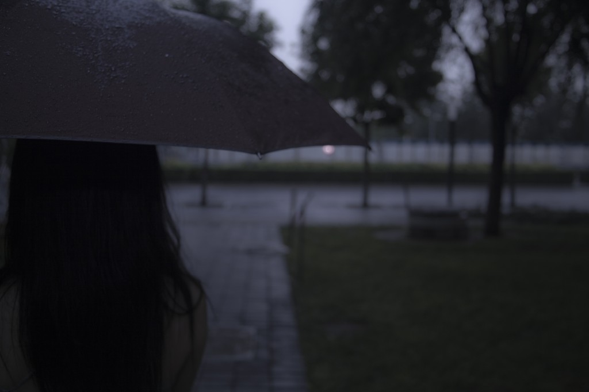
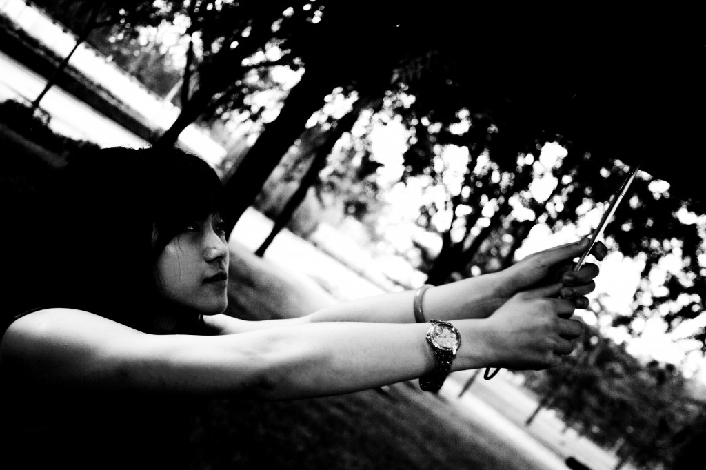

# ＜天璇＞九月二十五日的情书

**如此说来，你像是一个数轴，把我零散的、无秩序的时间片段串连到一起，然后你本身就成为了我的方向，既是我为之生活的原因，也是我为之奋斗的目标。你走到我面前，对我伸出手，说，来吧，我们开始了。我握住你的手。之后，我们所做的一切，都只是为了更持久的相伴。**

 

# 九月二十五日的情书

## 文/郑慧瑾（哈尔滨工业大学）

 

每次写文章之前，我都会暗暗地构思很久，在心里一遍一遍地对自己说话，直到把文章的结构、大致内容，甚至是遣词造句都一一念清楚，才动笔，使它生产出来。但是这封给你的情书，我偷偷地念了很久，在每一个可能的空间和时间。但是却仍然未能理出一个清晰的思路。而看看日期，再不写就来不及了。我早就想好要在一年整的日子一字一字地读给你听；为了使文章更完美，我还要留出修改的时间。所以，即使不太清楚我接下来要写什么，我还是开始了。

为什么会无法理清这情书的思路呢？是因为爱情障人目么？我想这并不是一个好的答案。好的感情，是应该让人变得越来越好的——诚然，真正的爱情是爱着对方的本身。所谓“变得越来越好”，并不是对一个人的硬性要求，以至于让人误以为自己的伴侣爱的是他虚拟出来的自己。而是一个人因为这圣洁而美好的情感的浸染，从而不知不觉地停止了堕落，感到自己肩上有一份义不容辞又令人愉悦的责任，便持续地向着积极而可爱的方向前进；是因为我们的爱情“无法用语言描述”么？这个答案也不能令我满意。我不知道人是更理性的动物还是更感性的，但是我可以肯定爱情是一种感情，被感性的思维所支配。然而即便如此，这也不能成为逃避问题的借口。就像我们一直坚持的那样，每次不愉快的时候我们都会试图讲清自己不愉快的原因，也会认真地听对方的叙述。我们从来不会吵到不知为何而吵。我们互相完全信任，把自己心里的话直接说出来，而这样做也的确避免了很多的误解，使我们更加确信信任是正确的选择。良性循环，不是么，亲爱的？

今天我去了二区。走进西门的时候我想起了两年前在开学之前我来逛二区的情景。当时我完全不知道校园里是什么样子，所以就连刚刚进门的那条小路都显得那么漫长。每一步都要看周围的风景、记住楼的名称。那时我十分留意了右手边的树林。而现在，校园里的一切，我都一清二楚。进门的时候仿佛已经看见了整个二区，自然也不会感觉到西门的小路，和旁边的树林。一切都是未知时，每一步都小心翼翼；直直地奔向结果时，过程往往被忽略。而我，假定了一个一直与你在一起的结果，面对着一个未知的人生。如此，我便一边享受着与你一起探索、一起迈出一步又一步的过程，又不至于对过多的未知产生恐惧感和孤独感。因为，最大的一个谜底已经揭开——最让我心安的，你的存在。

说到你的存在，我想到那天在姥姥家，在弟弟的屋子里，我坐在书桌旁，你立在窗子前，望着外面。我扭着身子看你的背影——在我生活了二十年的屋子，每一个角落我都熟悉无比的屋子，出现了你。当我发现这件事时，真是又惊又喜。但是，矛盾的是，从你进门到那时不过是过去了两个多小时，而我却感觉你一直在这里，像我一样在这屋子里长大，像我一样看着所有的变化，像我一样经历着我的时间，你就是我。从去年此时直到现在，我一方面觉得一切都是那么不可思议，另一方面又觉得一切都十分自然，像是理所应当发生在我们身上，像是我很久之前写好一个故事，然后拿出来，慢慢地看。

不过这并不是一个已经写好的故事。这是一个我们共同书写的故事，永远都是现在进行时。我们一人拿一支笔，在同一张纸上写着。或是不用笔，把颜料蘸在手指上，在纸上来回抹。再或是干脆把这纸裁剪、折叠起来，变成三维空间或者别的什么。最终形成的，就是我们一起经历的日子，和我们在那一时刻的样子。想想看，在生命结束之前，在“最终形成”之前，有那么多的时间摆在那里等待我们填充——就像刚刚我提到的纸，这是一件多么美妙的事情！虽然时间——或者生命，或者命运——不是从属于人、完全由人来支配，而是与人相互作用的，但是未知的未来更让人期待和兴奋。正如我每一个时刻都能看到一个不同的你，我也同样对将来持续体验无数个不同的你抱有极大的憧憬。

看《活着》的时候，我被里面凄凉的情节牢牢控制。每读完一个令人唏嘘的片段，我都像进入了书页中，无法摆脱其中的情绪。这时，我总会想到你。想到我们现在近似于无忧无虑的生活，和相比于过去不再受时代掌控的命运。想到我上一层楼就能看见你，我们在昏暗的食堂面红耳赤地争辩问题，我们和好的速度总是大于等于吵架的速度。我会由衷地想，真好。于是我便一边看书，一边想你。奇妙的是，当你看完了《活着》，竟然说出了同我一样的感觉。当我想象余下的生活（包括爱情），我总是先想到可能会发生的难处，再想怎样去面对和化解。在我看来，一切问题发生的可能性都是大于零的。而我恐怕无法空想出“一切问题”的答案。但是我还是会想。我不知道为什么会这样。而我唯一的希望就是，你对“一切问题”的解决方法之一就是对我诉说，不要独自承担。我当然会尽我之力支持你，如果我真的没法做什么，那么听听也好。也许有时候我的反应不够温柔，甚至会无意识地责怪你，但请相信我不是故意为之。我不会用“是因为爱”和“都是为你好”作为我错误行为的掩饰。我是愿意为你把自己变得越来越好的。

如此说来，你像是一个数轴，把我零散的、无秩序的时间片段串连到一起，然后你本身就成为了我的方向，既是我为之生活的原因，也是我为之奋斗的目标。你走到我面前，对我伸出手，说，来吧，我们开始了。我握住你的手。之后，我们所做的一切，都只是为了更持久的相伴。

 

（采编自投稿邮箱；责编：麦静）

 
