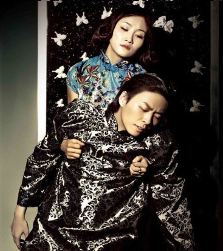

# ＜天璇＞二月十四 爱情挽歌

**这年代，女人心甘情愿被男人当商品挑选，凭自己的姿色讨个好价钱，男人本来就个个似柳梦梅荷尔蒙上涌，只要美女就追，也不管该女子才学秉性如何，是否宜室宜家。而这市场经济的婚姻现实则给他们找到了一个绝佳的借口：美女都明码标价了，哥有钱买得起是哥的本事！然后十年后钱更多了，再买一大把后院摆着，多好看。而那些可怜的仍对爱情有执念的男女，不是被洪流冲得粉身碎骨，就是在这逆大潮流的战斗中败下阵来，成了这婚姻市场的俘虏，可悲欤？可叹欤？** 

# 二月十四 爱情挽歌

## 文/ 贺沛（Stanford University）

 

妈妈说：看你衣橱，曾经下狠心花大价钱买下的衣服，就算之后再不穿了，仍在那放着；而那些廉价的，就算你当时再喜欢，也会搬家时候扔得毫不犹豫。所以你要做男人衣橱里那件倾家荡产的珍藏，而不要变成他曾经爱不释手以后弃若敝履的便宜货。

我笑而不语。女人口口声声讨伐“朋友如手足，妻子如衣服”，却心底里就把自己当成一件贵衣服，也难怪男人如是说。可是，衣服是死的，人是活的。衣服只能在衣橱里等待主人哪天的青睐，而人却可以自己活得精彩；衣服只能任灰尘和蛀虫慢慢侵蚀，人却可以在岁月中丰富了阅历心犹如年轻时一般。纵使被抛弃，衣服只能被动接受，而人却可以潇洒地走开，挥一挥衣袖，不带走一片云彩。女人哪，当你把自己等同成一件衣服地时候，你的价值，就离那衣服不远了。

春节晚会，那句“我要去找一个能给我买房子的男朋友”，真是让人无限悲凉。原来爱情，不知何时已被房子钱车子等物品挡在门外。朋友说，我们这一代真可怜，连谈情说爱都不能痛快。无知的我问：难道女生们就如此任父母摆布，用房车将爱情与自己隔离开来？朋友笑曰，”父母也是好心。如今包二奶猖獗，离婚率高升，好歹得让女儿们失了爱情青春，还可以剩下点物质补偿。“我无奈了，原来不仅是爱情和面包的问题了。王宝钏抛弃锦衣玉食苦守寒窑数十载，换来的不过是新人笑旧人哭，娥皇女英共徘徊。当爱情失却了其可信度，也只能用房子车子筑起一道高墙才能固守么？

小时候听到诸多动人爱情故事，张生与崔莺莺，柳梦梅与杜丽娘，侯方域和李香君，还有长恨歌长生殿里的唐明皇和杨贵妃。小时候因这些缠绵故事憧憬爱情，大了觉着之所以这些坚贞不渝的故事千百年得以传下来，不过是因为现实生活中这样的爱情太少了。到如今看来，才发现这些故事也未见得美好。西厢记的前身莺莺传，便是花心大萝卜元稹为自己抛情谊另谋高娶所做，莺莺最后落寞而死，不过换来一声叹；牡丹亭里柳梦梅就是一色鬼，第一次惊梦时便与杜丽娘巫山云雨，也不问这女子姓甚名谁，性情如何，而其中歌颂的“生者可以死，死者可以生”的情之极致，也是杜丽娘一个人的一往情深而已；桃花扇则更是了，义正词严拒绝奸臣贿赂的是李香君，宁死不屈的也是李香君，入山出家的还是李香君，侯方域呢？顺治年间乡试去了；明皇，我就不多说了，什么君王掩面救不得，回看血泪相和流，全是混帐话，寄情生色犬马的是他，若真爱得切，又怎会为保一己之安，忍看宛转蛾眉马前死呢？却在死后让杨玉环承担“红颜祸水”的骂名，而他自己昏君不过是为情误而已。

"Frailty, thy name is women," 大家都把莎翁这句话看成是他对女人是弱者的阐述，于是有人痛骂之，殊不知这是哈姆雷特面对他母亲对他父亲的淡漠且在其死后一月迅速投诸叔父怀抱的感叹，意在讽刺女人是灵魂上的弱者。或许这是西方人的观念？在东方故事里，似乎看着楚楚可怜的美人们都有一股子韧性，而懦弱薄情的，大多是男子。不过换个角度，无论东西方文学，女人似乎始终都是附属，都是寄生在男人身上的菟丝子，难怪丈母娘们管未来女婿要房要车要钱，因他们担心女儿今后的宿主不够强大，也担心若是被这一任宿主抛弃，找不到下一任宿主便无法存活。可惜有爱情靠得住的宿主都太稚嫩，而无爱情有物质的么，你能保证他十年二十年之后不想换一根更妖娆妩媚光线靓丽的菟丝子挂着么？

这年代，女人心甘情愿被男人当商品挑选，凭自己的姿色讨个好价钱，男人本来就个个似柳梦梅荷尔蒙上涌，只要美女就追，也不管该女子才学秉性如何，是否宜室宜家。而这市场经济的婚姻现实则给他们找到了一个绝佳的借口：美女都明码标价了，哥有钱买得起是哥的本事！然后十年后钱更多了，再买一大把后院摆着，多好看。而那些可怜的仍对爱情有执念的男女，不是被洪流冲得粉身碎骨，就是在这逆大潮流的战斗中败下阵来，成了这婚姻市场的俘虏，可悲欤？可叹欤？

（采编：陈锴；责编：陈锴）

 
