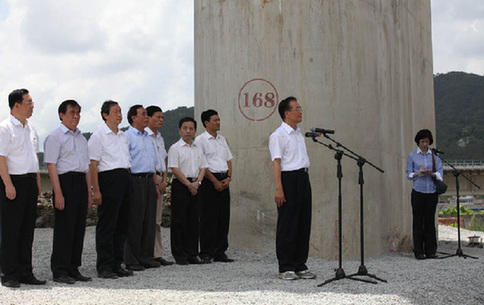
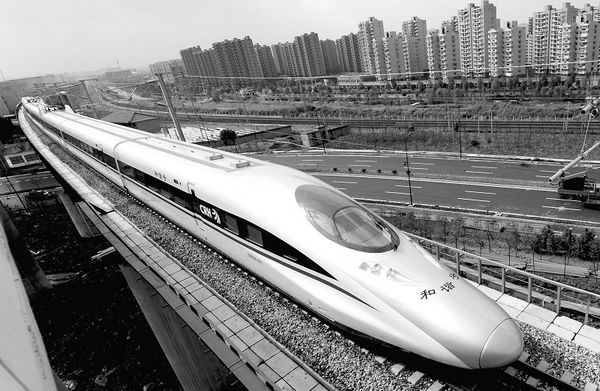

# ＜天璇＞二零一一，我的私人编年史是追尾的列车

**人们在互联网上制造着喧嚣和吵闹，正如这个时代的阴影一样长满蛆虫。在山东，其实是山东以外，网民热衷张贴戴着墨镜的头像。在广东，怒吼的工人撕咬着国家的衣摆。在山西，怀念旧时代的人们以焚烧报纸的形式表达自己的情绪。** **二零一一年，我的理想与现实追尾。**  

# 二零一一，我的私人编年史是追尾的列车

## 文/王钟的（中国人民大学）

 

2011年7月23日夜，当开往福州的D301次列车与另一列列车追尾相撞的时候，利用微博第一时间得知消息的我，最早的反应是——我是否会因为车次取消无法顺利回校。

这或许是有悖人性的想法，我似乎应该跟着微博上的朋友和师长追问确切的死亡人数，千呼万唤老是出不来的调查报告。可是我没有那么想，列车相撞的当天晚上，出于新闻学生的敏感，我反复刷新微博页面——这是几乎当时获取消息的唯一途径——当时我最关心的，却是这列列车车次是否能够维系。

我的私人编年史在2011年，看上去琐碎平庸。离开了自己做出许多努力的学生媒体，也不知道能给它留下多少遗产。在心向往之的南方周末结束了实习，却没有交出一份完全让自己满意的答卷。看过许多张书单，最终的阅读却是随性而为。选择了留在人大继续研究生学业，而没有勇气申请本来向往的那些没有防火墙的学校。

2011年，也是一个宏大叙事的年份，这个年份与一个王朝的覆灭和另一个王朝的崛起息息相关。在欧洲，人们谈论着中国会不会担当世界人民的救世主。而我们东北角的强盛大国，一个时代的帷幕落下了，另一个时代的号角吹响哪一个方向依旧不得而知。

人们在互联网上制造着喧嚣和吵闹，正如这个时代的阴影一样长满蛆虫。在山东，其实是山东以外，网民热衷张贴戴着墨镜的头像。在广东，怒吼的工人撕咬着国家的衣摆。在山西，怀念旧时代的人们以焚烧报纸的形式表达自己的情绪。

很多同学将离开学校。他们背起行囊，或留在北京，追寻着新闻梦，或者财富梦，或者都有。已经用不了多年，他们成为人父，嫁为人妻。再用不了多年，他们会成为优秀校友，也可能是落魄书生，还可能是囹圄之徒。相册日益饱满，我们青春的坟头已经长出荒草。

弱水三千，只取一瓢饮，这或许只是一个玩笑而已。更多时候，我会发现咒骂更为有力，也许是咒骂让我没有力气关注其他。也许我应该相信世事向善，如果没有看到戾气横生。

我们争辩着各种观念，力推哪怕改变一点这颗大树的生长方向。后来我发现，我的阳光和别人的阳光不一样，不一样的阳光总有不一样的生长方向。如果这个国家是一棵大树，它眼中的阳光究竟是什么颜色？

离开国家吧，不能承受的国家。我已计划一场旅行，购买一张车票，预定一段行程，从东方走到西方，从北方回到南方。我喜欢吃喝玩乐，拒绝培养北方浓烈的味蕾，怀念着家乡的海鲜。我要出发，我想象中有一段镜头，太阳刚升起来，穿过熙熙攘攘的集市，在买鲜花的姑娘手里接过一束雏菊，寄往没有地址的远方——在那里，可以看到没有污染的蓝天，和蓝天下轻灵的脚印。

那列车次终究没有取消，它修改了数字而最终保留了下来。人们关心的调查报告把责任推给了监狱里的人和死去的人。而列车，依旧越过黄河，长江，钱塘江，在我出生的城市经停两分钟。这两分钟里，我要把箱子放到站台上。

我的私人编年史在这一年一分为二。理想减速，现实加速。我把理想藏进分行的现代诗，支离破碎，当年愿景零落成泥。我瞻前顾后，盘算未来的职业。理想丰满，现实骨感。

二零一一年，我的理想与现实追尾。

2011/12/29

 

（采编：佛冉；责编：黄理罡）

 
