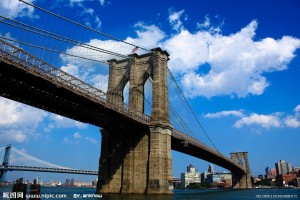
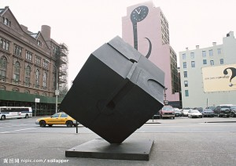
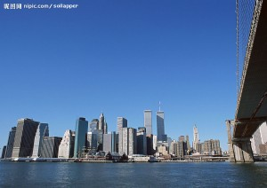

# ＜天璇＞五根

在黑暗之中慢慢浮现的，是对五官的感知。眼睛慢慢适应后，发现周围并不是绝对的黑暗，天空呈现出一种橘色和灰色混杂不可名状的颜色，这是郊区无法见到的颜色，是成千上万的灯汇集而成的地上的街市投射到天上的影子。而现在，虽然地上的街市都暗了，天上的影子仍然存在，仿佛是“理性之光”的魂魄。耳朵首先注意到的是风的声音，席卷一切的风从四面八方涌来，恶作剧般地冲向厨房的窗户，又忽然转向卧室的窗，甚至连厕所通风窗和马桶口都有它的存在；警车的声音划破风的嘶吼，平时刺耳的警报今天听来格外安慰，但在飓风的包围下只是一声呜咽。 

# 五根

## 文/何雨（纽约大学）

 

灯灭了。

忽然之间，周围的一切都陷入黑暗中。一声惊呼，一时没有意识到由我还是室友发出。接着我看见门口一点蓝白的微光，室友朱迪拿着手机走到我门口，说：“停电了。”

10月29日20:30，外面的飓风忽大忽小，窗框发出咔咔的响声，玻璃时而有纤维断裂的声响。即便用胶带封上了窗户的各个角落，雨水还是不停地渗漏进来。有几次窗户震动地特别厉害，仿佛随时就会炸裂开来，我几乎可以想象碎片朝不同的方向迸射，最后摊在地上变成莫名的形状。之前收到朋友微博提醒，电力公司Con Edisson宣告曼哈顿36街以南的街区可能会随时断电，如果雨水漫入地下系统，那么他们也无计可施。半小时之后，真的发生了。

几乎在断电的同时，网也断了。我给妈妈和男友分别打了个电话，接着发了条微博。收到朋友最后一条短信：“你还好吗？听说断电了。”为省电，我迅速回了她，随即关了机。

待眼睛慢慢适应了黑暗，我掀开暖帘，周围的楼都没有灯了。东南方向曼哈顿大桥还有两个灯红得特别耀眼，East River以东的布鲁克林还有灯，虽不比平日晚上璀璨，但也安慰。向南的街区，直到华尔街附近的摩天大楼都是一片黑暗，新世贸中心双子塔上的探照灯孤零零地矗立着，再隔几个街区有栋方形的大楼灯火通明，我搅尽脑汁也想不出来它是什么。

纽约，这座号称“永不眠”的城市，闭上了眼睛。

2003年8月14日，美加大停电，5000万人失去电力供应，停电29小时后才完全恢复。在此之前，纽约最大的停电事故发生在1977年，持续26小时。

纽约的中心，曼哈顿岛是一六二六年荷兰西印度公司总督彼得米努伊特以布料、罐头、玻璃珠、短刀等物品和印第安人换来的土地。荷兰人将这儿命名为新阿姆斯特丹，并在今日华尔街的附近建立了碉堡，以防印第安人的袭击。一六六四年英荷战争后曼哈顿改由英国人控制，并改称纽约，直到现在。曼哈顿岛的巨大变化出现在二十世纪，累积来自全球的资本，建筑不断往空中发展，成为现代纪元独特的都市景观。这个景观从纽约发起，之后东京、伦敦、上海、香港纷纷效仿，终于席卷全球。

十九世纪以前西方城市基本以宗教信仰为中心建立，建筑也是为了彰显神的庄严。蔓延开来的启蒙运动提倡理性精神，要用“理性之光”照看自然界的所有现象，宗教的影响日渐式微，追求前卫的建筑家们也在寻找神不再存在时人类的居住形态。高耸的摩天大楼诞生了，规整的方格建筑似乎在回应希腊时期就提倡的彰显宇宙和谐秩序的美学，大面积的落地玻璃和电气设备却又似乎在夸耀人的力量。

电的普及和现代建筑及都市的崛起，不知孰先孰后。迈克尔法拉第发现了电磁感应及法拉第电解定律，之后托马斯爱迪生发明了钨丝灯泡，留声机，电影摄影机，并成立通用电气公司和Edison Trust。纽约居垄断地位的电力公司Con Edisson的前身可追溯到1882年爱迪生在纽约成立的照明公司，当时公司仅为曼哈顿下城的59个顾客供电。没有电，纽约不可能成为一个“金钱永不眠”的神话，而小小的曼哈顿岛也不可能成为全球资本密集度最高的地方。而现在，Con Edisson发出了紧急通报，熄灯了。

在黑暗之中慢慢浮现的，是对五官的感知。眼睛慢慢适应后，发现周围并不是绝对的黑暗，天空呈现出一种橘色和灰色混杂不可名状的颜色，这是郊区无法见到的颜色，是成千上万的灯汇集而成的地上的街市投射到天上的影子。而现在，虽然地上的街市都暗了，天上的影子仍然存在，仿佛是“理性之光”的魂魄。耳朵首先注意到的是风的声音，席卷一切的风从四面八方涌来，恶作剧般地冲向厨房的窗户，又忽然转向卧室的窗，甚至连厕所通风窗和马桶口都有它的存在；警车的声音划破风的嘶吼，平时刺耳的警报今天听来格外安慰，但在飓风的包围下只是一声呜咽。朱迪点燃了火柴，鼻子闻到火吞噬火柴头时碳燃烧的味道，接着是蜡的气味，像五角钱的无色橡皮擦，只有凑到鼻尖才能感觉它的存在。蜡烛的温暖和窗户的寒冷形成强烈的反差，用手触摸，蜡烛的玻璃因为冷热不均发出轻微的震动，相比之下窗户的震动要剧烈很多，手贴上去又赶紧抽了回来，仿佛随时都会碎裂。电热壶里的水还没烧开便断了电，我给自己倒上一杯水，不温不火，没有气味，但尝起来有种麦子的味道，淡到几乎没有，却在舌根处迟疑。

我完全没有想到这次飓风会变得如此糟糕。去年我做好了万全准备，学校提前发了很多预警，可是最糟的时候只是晚上听见风在窗外擦身而过。对于纽约客而言，Sandy小姐与其说是威胁，不如说是救星，让大家从繁忙的工作学习中抽身喘息。下午的时候我还发了一条微博，感谢S小姐让我有时间偿还文债，并和朋友玩#飓风天应景发图#名画接龙。而现在，别说偿还文债了，连看书都没有办法。我只好花两分钟时间默默问候了Sandy小姐的列祖列宗，然后开始在黑暗中打坐。

#### **一、眼根**

我很喜欢的一位摄影家，叫杉本博司。他有一个系列，叫“蜡烛的一生”。在拍摄期间，他每晚都会独自一人在无垠的黑暗中看着点燃的蜡烛。日本蜡烛是取垆木果实榨汁抽蜡制成，在无风之日，火焰有时也会特别明亮，有时又自己要摇曳起来，似乎有来自异界的生命，以类似莫尔斯密码的信号与对坐的人彻夜交换信息，即时没有回应，对方还是不以为意地倾诉如故。

艺术家想象中与蜡烛的“交流”也许是因为垆木蜡中不纯物质的缘故。然后光里蕴含着信息是确凿无疑的。虽说没有了灯，屋里的一些人造设备还是残留着照明的痕迹，比如笔记本电脑上的电池显示灯，以及Verizon网络设备的备用充电器电源。天花板上偶然会有光闪现，我开始分辨哪种是自然光，哪种是警车的光。闪电是白色的，警车是红色和蓝色的。我卷起暖恋，看见对面楼里有几家透着幽蓝色的光，大约是应急灯。

曼哈顿是座岛，西部通过Lincoln Turnel和New Jersey相连，东部和北部通过几座大桥和皇后区、布鲁克林区及布朗克斯区连接。在紧急状态下，进入曼哈顿的大桥和隧道已经完全封闭，它变成一座名副其实的孤岛。而我居住的楼，位于东村，曼哈顿岛的东南边。向下望去，楼的底部淹没在黑暗中，我所在的十五层似乎漂浮在无边无际的夜空，是一座孤岛上的孤岛。

半夜的时候，我和朱迪同时被嘀嘀的警报声惊醒了。她的手机收到提示:"Extreme Alert. Go Indoors immediately. DO NOT DRIVE."（特危情况，尽快入室，严禁驾驶）我的手机没有开机，找了好久才发现声音的源头是Verizon网络设备的充电器电源耗尽的提示。这样一来，即便网络恢复无线网络也无法接通了。我关掉警报器的电源，房屋再次限于黑暗和静寂中。

#### **二、耳根**

哀号，第一个跃入我脑海的是这个词。乍一听像是人的哭声，仔细一听却又不是，声音的频率范围更加广，有时像细不可闻的叹息，有时又像轻佻的口哨，忽然间又尖叫着嘶吼着上下穿行，横贯一切。

连警车的声音都没有了，从窗户望出去，建筑物只有高高低低的轮廓。没有人，什么都没有。

曼哈顿恐怕是在人类脑海中覆灭最多次的城市。在各种灾难片中都有它的身影，它被海啸袭击过、洪水淹没过、大火烧毁过、外星人入侵过，被哥斯拉踩扁过。我看见人被撕裂、人被烧焦、人被烤熟，人互相残杀，我以为我已经无动于衷。

但是我没有想到，更加让人不寒而栗的是，没有人。

向窗外望去，没有光，没有生命迹象，只有风的哀恸，好像在控诉又好像在示威。

这情境，与其说是像世界末日，不如说像战场。一天的战争结束，幸存者躲进战壕，手指能够触摸的地方都已经没有生命迹象，和自己一样活着的不知是战友还是第二天就可能要继续厮杀的对手。无孔不入的风穿过枯黄的野草、穿过野兔的空穴、穿过松动的土墙，肆无忌惮地捉弄着惊弓之鸟的活人和安然沉睡的死尸。幸存者惶恐地聆听着，有时竟感觉出极致的美来，风仿佛是宇宙操弄的一把巨箫，实验着穷尽人类想象力也无法写出的乐章。

我急切地想听到人的声音，想知道外面的世界发生了什么。于是开机，手机显示凌晨一点半。信号始终维持在两格左右，拨通了一个可能还醒着的朋友的电话，只听到语音提示。手机的3G网络也无法使用了，我开始怀疑停电停网是波及整个曼哈顿的，于是打在加拿大的男友的电话，电话响了好久终于通了，他还在睡梦中，不清醒地应答了两声，我随即挂掉了电话。我想给国内的朋友打，又担心因为GFW无法查到纽约的最新情况。又试播了一个纽约的电话，电量在一点点减少，我感受到四年前的五月二十一日无法接通家人电话时的绝望。

电话最后接通时我几乎想要拥抱电话那头的安砾。她说哥大一切还好。我简单描述情况后她说上网查，一会儿再打过来。再打过来时声音有些断续，大意是14街的Con Edison电厂generator发生了爆炸，因此14街以下的电力都中断了，不知多久才能恢复，预计需要三天或更长。手机的信号更加差了，我们终于互道了珍重。

又关了机，宇宙重新申明了它的秩序，风再次成为世间主宰的声音，玻璃的撞击声、门的拍打声以及墙壁里细碎的咔咔声都是这支交响乐的附声部。我睡不着，起来打坐，呼吸之间风仿佛成为一只小球，钻进体内，终于在调息之间平衡下来，有规律地上下律动。

我想到11年暑假在四川中路。朋友的画室坐落在当地民宅的平台上，我住在邻近的一户，每天走去她家屋顶画画。她在顶上搭了一间两面墙的小厅，起风时就放下毡子，如果下雨我们就躲进室内。那是一个没有24小时热水的地方，晚上常停电，网络也时常无法接通，但是当时心中没有任何恐惧，宇宙的慈爱和威严都蕴藏在它的呼吸之中，风雨雷电都有格外的美丽。

有一天晚上，又停电了。我爬到屋顶，看见周围的人家慢慢点起来灯，朋友的画室亮了，在毡子上映出她的剪影来。底下院子里的人开始拉歌，从红歌到情歌，间杂着欢笑。再隔一会儿，朋友画室的灯熄了，她朝我方向喊了句什么。楼下的声音渐小，终于变成锅碗瓢盆在水里碰撞的声音。等到所有人间的声音消失的时候，我听到宇宙的声音，来自四面八方，穿越原野、森林、废弃的古碉，终于停留在星星上。

我想着星星的声音，终于睡着了。

#### **三、身根**

一觉睡到天亮，我是被阳光晒醒的。走到暖帘前，隔着竹篾细致的纹理，曼哈顿沐浴在耀眼的金光中。伸手用手抚摸暖帘，纽约也好像一个水中的影子波动起来。似乎是被惊扰到了一般，阳光忽然消失了，天地之间重新一片阴霾。风似乎小了，我看到一个遛狗的人，生命的迹象让我兴奋起来。

开始打包一个紧急救援箱。牛仔裤，羊毛衫，和一套内衣早就放在床边，我想了想，又加上一套柔软的长袖睡衣和一张轻薄的羊毛织毯。各种充电器、钱包、钥匙、护照和应急灯是要放进去的，不过在之前首先跳入脑海竟然是Kindle。一袋Energy Snacks,本来是前天去亚洲超市打折时买的，现在成为珍宝。洗漱用品、旅行套装、化妆品，但是不知道如果去避难所是否能用上。我已经两天没有洗澡了，头发泛出油腻，紧贴头皮，发梢处不安地打结。我想洗个头，但提前存下的几盆水是我和室友的共用资源，用来清洁是件太奢侈的性质。

“如果你小便，不要用水，”朱迪听见我起床的声音，警告我。

朱迪已经六十三岁了，在Con Edison工作，离婚，独生女儿在旧金山，现在跟我一起租住东村的一间rent-control apartment。她70年代随家人从香港移民纽约，讲英语和粤语。我走到她门口，朱迪还没起床，紧紧闭着双眼，似乎在拒绝发生的一切：“这是我来纽约后最糟糕的一天。”

10月30日8:00am，依然停电停水，没有网络，打开手机接到男友电话，向父母报告平安，再给朋友打了电话。东楠说：“听说东村有些地方有洪水，目前基本上都停电，大概还会持续几天，你收拾一下来我这儿吧。”

挂了电话，我决心好好吃一顿早餐。蜡烛亮了一夜，抚摸外面的玻璃还有微烫的质感。我几乎有些贪恋这个温度，于是抱了片刻，直到火焰变得有些灼手。屋里没有暖气已经两天了。

煤气跳动的火焰让我松了口气，烧上一锅热水，蒸汽慢慢爬上锅盖。在此过程中我开始思考今天该怎么办。14街以南都没有电，今天看来也不会有恢复的可能。地铁和巴士依然停运，如果要去东楠所在的82街可能要走很长的路。外面还刮着风，但走在路上危险应该小很多了，因为街上不时有人出没，运气好也许还能打上车。去纽约大学的公共避难所也是一个选择，但大通铺在晚上可能会激发群体焦虑，更不要说食物和饮水不足了。

总之，若想离开必须趁白天。

水烧开了，我舀出一些热水洗漱。洗面奶的泡沫无法完全冲干净，只能用棉球擦掉，但是整个人已经焕然一新。用剩下的水温了牛奶，切两片面包，再加一个香蕉，我觉得已经有力气应付新的一天。

在离开之前，还想做一件事情。我重新烧上了水，准备要泡一壶茶。

杉本博司在纽约的摄影工作室位于切尔西区，一座货仓改建的大楼的十一层。他在工作室的二层建了一个日本茶室，包括一个室内的水屋、庭院和小间（品茶区）。庭院的木料和奇石来自日本京都，从庭院到品茶区的躙口是杉本设计的，石阶旁的苔藓将人带回九世纪的日本庭院。踏过石阶，表示从人间进入茶道的世界，在这里发生的一切不在人世的时间和规则控制中。日本茶道一个突出的特征是对器物的尊敬，在请茶时不仅要对奉茶者和其他宾客拜谢，还要对茶具表示感谢。每个节令，主持茶道的人也会特意更换陈设的插花和画，显示时间的逝去。茶道在唐朝时传入日本，最开始被僧人作为冥想和修行。后被当时民间纷效仿，还兴起了被称为“茶数寄”的品茶论证和茶具鉴赏。由于曾做过古董商，杉本有很多茶具收藏，在工作室举行茶道时使用的风炉、茶碗也是收藏的一部分。

茶室并非完全与外界隔绝，从东侧的窗户望出去便是繁华的曼哈顿下城。2001年，杉本在这里目睹世贸双子塔化为废墟，后来他写到：“当包裹着上千人的建筑在一瞬间倒塌，又夹裹着生命化为乌有，我想到的已不是命运，而是文明与死亡的交汇。”

水开了，我将杯碗排开。青瓷杯倒上水，在边缘呈现出一道光晕来。用洗壶笔轻轻在杯中打圈，我忽然心生温柔。第一次注意到，手中握的笔柄是完整的竹，在一头还有气孔。想到之前认识的一个尺八演奏者小濵明人曾告诉我，每只尺八都是用完整的竹节做成的，所以在一端都会保留竹子特有的气孔和须。在吹奏时似乎是和竹子一起呼吸一般。第一杯水有些涩，因为泡的时间太短了。我延长了等待的时间，第二杯终于有茶香。因为天气的缘故，水冷得比较快，四碗过后我清理了剩下的茶叶。

#### **四、鼻根**

说服朱迪离开不是一件容易的事情。她说家人都在皇后区，早在昨天已经断电。即使曼哈顿到皇后区的桥通了，也不一定能打上车。14街的Con Edison总部也没有电，最坏的状况是只能去避难所。最终朱迪决定去最近一栋楼的朋友家，虽然也没有电和水，但至少和人群在一起。

我们匆匆吃了顿午饭，带上各自的手提行李，关上门窗和水。出门的前一刻，一直绷着脸的朱迪忽然笑了，用蹩脚的普通话说：“像跑难。”

“逃难，”我纠正了她。

推开房门，我们俩都倒抽了一口冷气，走道里漆黑一片，虽说是下午1点，楼道的黑暗程度更胜昨夜没有灯的曼哈顿，连紧急出口的灯都没有亮。我们打开应急灯，慢慢摸索着下楼梯。十五层的楼梯间有积水的味道，再往下走，间杂着垃圾的味道，越来越浓。不时有人加入我们，有搀扶着老人的女人，也有抱着小孩的，没有人说话，只有增加或减少的光束，可以判断还有多少人在看起来好像没有尽头的黑暗中走着。

终于到了楼外，风已经很小了，门口的花园有人在散步，还有小孩在嬉笑。在阳光的照射下，红色的砖墙绿色的防火梯又恢复了鲜艳的色彩，曼哈顿似乎和昨晚的鬼城一点关系也没有。我和朱迪道了再见，开始往北走。

东村素以衣着另类的时尚男女著称，然而今天一路上遇见的女人都没有化妆，高跟鞋们也不见了，大家都穿着基本的御寒衣物。大部分人都背着双肩包或提着一个旅行包，往北走。也有向南行的人，但身上装备都轻松很多，大约是出来探风的。

手机依然一点信号也没有，也没有3G网络。走了约十条街，看见一间星巴克，和其他店一样都没有开门，但是门口聚满了人，大家都在试着刷手机。我也加入他们的行列，然而仍然没有信号。这时我旁边的女人咒骂了一声，我确信不是自己手机的问题，于是继续往北。

路边都站着试图拦截出租车的人，我衡量了一下形势，决定徒步。有个同事每天花半小时徒步二十多条街上班，作为锻炼身体。我安慰自己，八十多条街也不是大问题，正好免掉这周的健身房。路边开始传来烧焦的气味，我辨别了来源，决定绕开那些冒着白烟的地下通风口。电线烧焦的味道伴随着树叶的味道，闻起来很秋天。如果没有偶然飘落的雨和沉重的行李箱，我几乎觉得像是一场悠闲的午后散步。

#### **五、舌根**

我一直想要用双脚丈量曼哈顿，看看帝国大厦、克莱斯勒大厦、以及其他不知名的纽约地标。然而来纽约一年皆因种种琐事而未能实行。没想到在这样的情况下得偿心愿，也算是难得的福利了。

走到48街的时候我终于看到一辆停在路边的出租车，停在酒店门口，仿佛已经很久。司机问我去哪儿，我说82街，他招招手我就抱着行李跳上车。中城和上东区的情况要好很多，沿途的商铺都在正常营业，比较火爆的餐厅门口还有排队，一直紧悬的心慢慢放松下来。

东楠穿着睡衣，赤着脚下来帮我提行李。她说曼哈顿下城的一些区域还有洪水，不过慢慢在减退了，电力和地铁系统恢复大约还要等到下周。在屋里喝着东楠泡得热茶，给朋友回了短信和电话，摊在床上，终于感觉到前所未有的安全。

傍晚的时候我们去买了日本酱油和西兰花，我想要做一顿简单而丰盛的晚餐。

烧上一锅汤，把荞麦面放入，烧开后反复加入三次冷水。待面熟后捞出，放入碗中自然冷却，顶上浇一些酱油。汤根据手头材料随意取配，煎了培根，再放入切片蘑菇和生菜。我从家中带了一些自制的卤鸭胗，也加入其中。香味慢慢飘满整间屋子，夹杂着煤气没有燃烧完全的味道。等到生菜沉入水中时便可以起锅了，浇汤上面，再备上一碟冷汁八爪鱼，肚里的馋虫都钻出来抗议。整个过程不到十五分钟。

一个奥地利女孩曾对我说，她觉得拉面是最有纽约气质的食物，快捷、融合、而且来历不明。今天我觉得还可加一句，世界末日必备。

#### **尾声**

有一次在Stern商学院上课，老师问班上同学，若沦落到荒岛，会带哪三样物品？依次回答，后一个人不能和任何一个前有的答案重复。

我们班都是视觉艺术管理、表演艺术或者音乐的学生，回答从斑马到大象到吉他到再到时空机，不一而足。

我是倒数第五个，奇怪的是我心中一直有的答案竟然没有人说过。

我说：“妈妈，一袋各式各样的种子，刀。”

妈妈是医生，视生死已平常，还会分辨草药和治病。而且知道她愿意和我在一起，若没有我，其他地方也和荒岛无疑。

总有种子可以栽培出能活命的食物。

刀可以防身，还可以记日记，等到所有人都不在这个世界上了，还有故事留在石头上。

 

（采编：何凌昊；责编：何凌昊）

 
