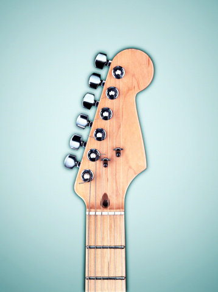

# ＜天璇＞人生这么短，爱干嘛干嘛

**他们之所以不同程度地感动我，便是因为他们抛却了“应该”。“应该”二字是一个诱惑，也像一把枷锁。不同的社会，不同的文化，不同的时代，你我他“应该”做着这样那样的事情，不过是将品格与能力一一剖开，然后按需分配做这世界里的一颗颗洋钉或螺母。**  

# 人生这么短，爱干嘛干嘛

## 文/ 曹嫄（北京大学）

 

前些时候在图书馆的时候看见一个很漂亮的姑娘。

并不是普通意义上的漂亮——中长发蓬乱地搭在一件最简朴的绿色外套上，皮肤有点黑，两颊上嘟嘟的有点肉。但她是漂亮的——发丝半掩的面颊上五官精致，尤其是有一双美丽的桃花眼，水汪汪。

我没有蕾丝倾向，所以一张同性的漂亮脸蛋对我没有什么吸引力，真正让我感到有趣的是她所做的事情：面前摊着一本小书，书页右边是一沓翻了一半的草稿纸。姑娘双眉紧蹙盯着纸上若有所思，两只手在桌前上上下下缓慢地翻动。判断并不难做出——这个在图书馆闭馆前二十分钟还在或握起右手或张开左手并且看起来烦恼且困惑的姑娘是个理科女。

这个对自己的美貌一无所知的女孩，她不在乎打扮，不在乎装束，甚至某种程度上称得上邋遢（我有提过她的头发看上去该洗了吗？），在一张自习桌前那么认真和忘我。她一直没有抬眼，也不在乎广播中播放的闭馆通知，仿佛世界上剩下的只有面前的那本书和那沓稿纸。

就是这个女孩，这个图书馆少女帮我解答了一个困惑很久的问题。那天之前，我看到了女记者玛丽•科尔文的死讯，又一时兴起查了诗人兰波的生平。她和他是两个让我热血沸腾而不能已的传奇：玛丽•科尔文是个战地记者，耶鲁毕业，报道过科索沃和车臣战争，在斯里兰卡被手榴弹炸伤失去了一只眼睛，称卡扎菲为“一个没有安全感的人”。二月的时候，她在叙利亚遇到炮击，身亡。兰波的名气更大些，这位法国超现实主义诗人，神童，银幕上需莱昂纳多来演的美少年，十六岁出名二十岁封笔，被同性恋情人大文豪维尔伦枪击后从比利时走回法国，后来贩卖武器奴隶，流浪在非洲并且最后在那里患上毒疽死去。

出于某种原因，我一直觉得这两个不同年代不同背景甚至不同性别的人有什么地方无比相似，正是那共性让我心向往之，让我热泪盈眶。那天晚上我终于清楚它是什么，实则简单直白——他们都在追寻中毫无保留，忘我排他，甚至飞蛾扑火。

一个耶鲁毕业的金发女郎，应该可以优渥富足风生水起甚至做共和党的竞选人去争总统；一个天才神童的俊美诗人，应该可以风流优雅惹人喜爱和全欧洲最著名的贵妇都有街头巷尾的情歌；一个有一双凤眼的美丽姑娘，也应该可以涂脂抹粉巧笑盼嫣在网上做红人不理会各种各样的公式与定理。

他们之所以不同程度地感动我，便是因为他们抛却了“应该”。“应该”二字是一个诱惑，也像一把枷锁。不同的社会，不同的文化，不同的时代，你我他“应该”做着这样那样的事情，不过是将品格与能力一一剖开，然后按需分配做这世界里的一颗颗洋钉或螺母。

在我所眼见耳闻的情景里，格子间实验室四大投行是一种“应该”，爵士乐志愿者骑行世界也是一种“应该”。我见识不多，只大致看到过这两种生态。几天前和一个聪敏的姑娘聊天，她说到见过一位北美名校的毕业生，热爱数据处理迷恋INPUT不能自拔，她同时还引了另一个师姐的评价。“那不是一个计算机吗”，师姐说。

“那，喜欢旅行的人，”我说，“不就是一辆自行车吗？”。

姑娘笑。

是有太多人，觉得自己应该刷绩点应该拼实习应该埋首程序与实验室，也有太多人，觉得自己应该找灵魂应该去旅行应该投身山河与大自然。事实上，“一种生活不见得比另一种更好，而人应该遵循心灵的指引。” 做《在路上》里横穿大陆自由不羁的萨尔有趣，做《生活大爆炸》里执着极客的谢耳朵也没有什么不好，但要是让他们互换生活,alas。

呐，世间总有种种的路，而我只有这一颗不能回头的灵魂。生活选择和人生哲学是要多复杂，说穿又是多简单。

人生这么短，爱干嘛干嘛。

 

（采编：应宁康；责编：陈锴）

 
