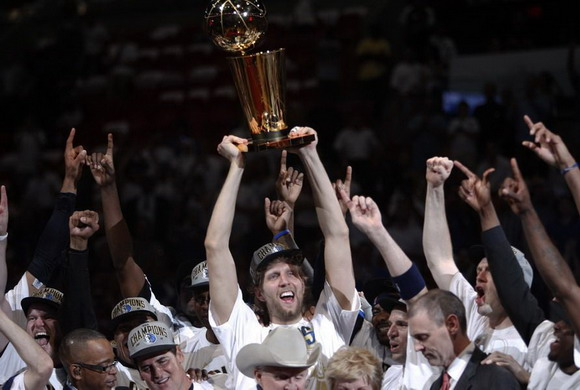
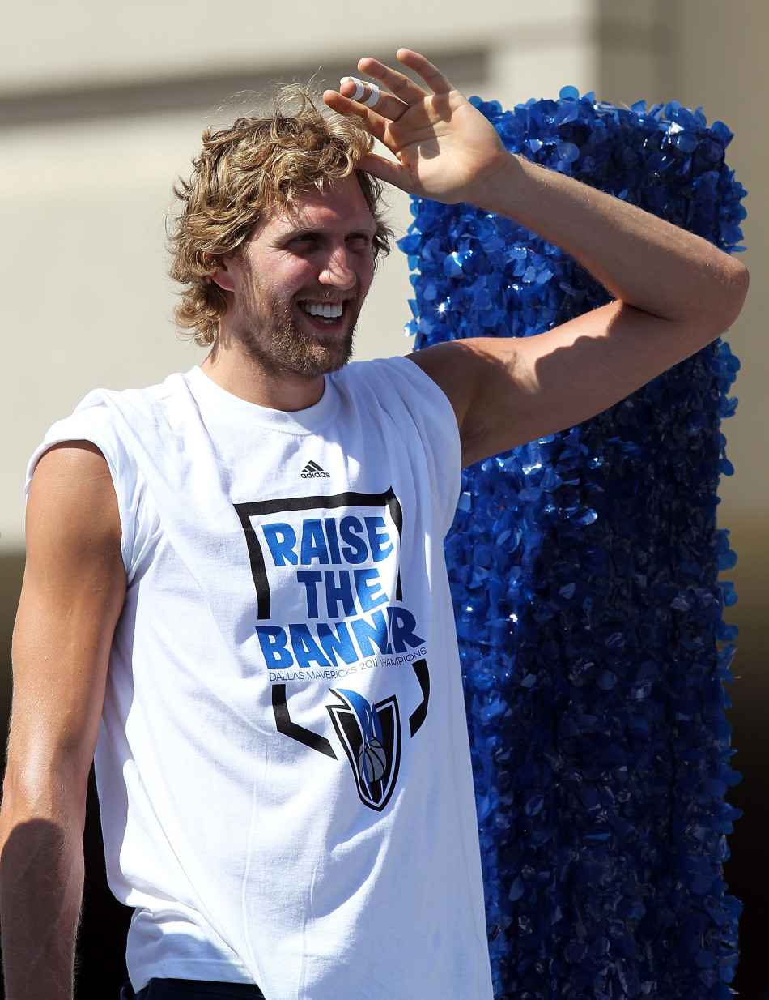
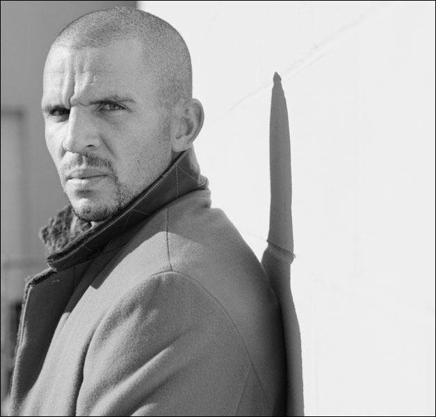
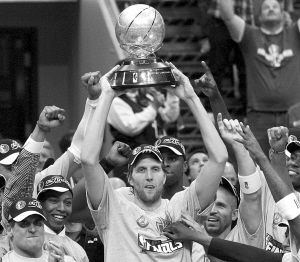

# ＜天璇＞人要如何战胜恐惧，直面未知？ ——小牛队夺冠后的一点杂感

**当时隔五年，再一次站在总决赛的赛场上时，他的眼中已不见当年的慌张和迷惘，只剩下沉稳和自信。****这种自信，只有经历过一无所有的人才能具备。****当你失去了一切，你才能明白到底什么最珍贵；当所有人都弃你而去，你才会清楚自己究竟是谁。****明确了“我是谁”和“我要什么”，一个人就能够对自己充满信心；既然再没什么可以失去，满是未知数的将来就不会让人感到畏惧。** ** **

# 人要如何战胜恐惧，直面未知？

#  ——小牛队夺冠后的一点杂感

## 文/王也（复旦大学）

### 一

在考研期间最黑暗的那段日子里，我无数次地问过自己同一个问题：究竟为什么还要坚持下去？会不会放弃才是更好的选择？明知道前方希望渺茫，身边也没有人可以相互扶持。到底有什么理由可以让我相信，如今付出的种种最终都能够得到回报？ 有人说，希望。不错，正是那留在潘多拉之盒深处的珍宝，使我们这个种族一次次从废墟里站起，于濒死中挺身。然而，希望的力量源自信念；面对充满不可知的未来，我们更多的时候却只感到恐惧。人类从来是理性的动物，且一贯厌恶风险，若没有确定的收益，很难为某项事业倾尽全力。而人生中有太多时候，我们发现自己彷佛处在一条无尽钢索的中间，前后是茫茫的黑暗，身下是无底的深渊，既无幸运女神在远方招手，亦无东方之星在头顶照耀。那么，在这种时刻，人要如何战胜恐惧，直面未知？如何能身处西西弗斯的绝境，却仍然保持对未来的信心？ 我不知道，在06年与近在咫尺的冠军奖杯擦肩而过，07年拿到MVP却被勇士首轮黑八之后，在所有人都嘲笑他的软弱，预言他与冠军无缘的那些日子里，诺维茨基是否也曾一次次地夜不能寐，心中反反复复地思考着类似的问题。我只知道，当总决赛第六场结束的哨音响起，看到德克用球衣捂着脸，跳过观众席，冲进更衣室那一刹那，突如其来地，莫名的感动夹杂着许多往事从心底涌起。 

###  二

事实上，我从来不是个小牛球迷。我笃信篮球场上有两条颠扑不破的铁律：“得内线者得天下”，以及“防守赢得总冠军”。然而这么多年来，小牛似乎向来没有遵从过这两者之中的任一。三剑客时代唐尼尔森的疯狂实验，把跳投和进攻融进了这支队伍的灵魂，也奠定了作为球队基石的诺维茨基依赖投篮和不擅防守的技术风格。 06年的总决赛，即便是在热火0-2落后的关口，我仍然坚信，总冠军奖杯将属于韦德和奥尼尔。因为火热的手感不会一直延续，在一轮七战四胜的比赛中，只有冲击内线和铁血防守才是赢球的可靠保证。当后四场韦德打出逆天表现，带领热火奇迹般翻盘，笑纳奥布莱恩杯时，我并不替德克感到多少遗憾。这是你自己选择的道路，不是么？优雅从容与赢取奖杯，除了魔术师和MJ这样不世出的天才，从来不可能兼得。 06年的总决赛之旅，似乎败光了诺维茨基进入NBA之后攒下的所有人品。在那之后，他的职业生涯简直就是一出悲剧：07年，小牛打出常规赛联盟最佳战绩，德克荣膺MVP，却在首轮被勇士黑八淘汰；08年和09年，分别在季后赛第一轮和第二轮输给年轻的保罗和安东尼；10年，以西部第二的战绩进入季后赛，却被马刺黑七……甚至连德克交往多年的女友，最后都被揭穿只是一个图谋钱财的江洋大盗。随着德克一天天老去，渐渐地，已不再有人把他和他的球队看作是争冠热门——即使他们年复一年地打出优异的常规赛战绩，即使他们的阵容日益深厚和完善。更多时候，他们被当成一个笑话，用以讽刺跳投球队在季后赛里的不堪一击。我至今记得新浪NBA频道讽刺德克拿到MVP的那段话： “德国人真正的伟大之处在于，能以一己之力，将至高无上的MVP奖杯含金量降到和烂铁相似。想想看，你穷发十载、增删九遍，终于完成一部旷世奇书，并且问鼎诺贝尔文学奖，然而发现，上一任的获奖者竟然是郭敬明时，会是怎样的一种心情？” 

 不知道，当这位编辑目睹诺维茨基举起总决赛MVP奖杯的那一刻，又会是怎样的一种心情？ 

### 

### 三

总会有那么一天，你突然发现，那些曾经无比熟悉的球员，不知何时，已不复当年模样。往日力拔山兮的鲨鱼竟然能扣篮扣飞，摸过篮板上沿的KG会经常抢不到板，麦蒂的干拔不再犀利潇洒，AI的突破亦不再风驰电掣，那个以稳定著称的石佛，已于悄然间淡出了20+10俱乐部。NBA仍然不缺华丽的扣篮和过人，只是奔驰在球场上的身影，早已都变成了你我的同龄人。昔日的王者在年轻人的冲击下七零八落，看似坚不可摧的王朝一夜间轰然坍塌。于是你知道，一个时代即将落幕。 那是鲨鱼和邓肯两位巨人主宰联盟的时代，那是费城3号一次次上演单骑救主的时代，那是国王炫目传球和小牛三剑乱舞的时代，那是灌篮高手陪你度过放学后时光的青春时代。 现如今，当年西部的伟大前锋群里，天尊和韦伯早已退役，KG和邓肯仍在苦苦支撑。只有诺维茨基，似乎时光在他身上没留下任何痕迹。一如既往的金鸡独立式丑陋跳投，抢不到篮板，被各种后辈打爆；除非作为背景，否则永远进不了十佳球。一如既往地被视作软蛋，这辈子注定拿不到冠军的loser，哪怕他身边站着也许是史上最伟大的控球后卫贾森基德。 

 这赛季开始之前，我和大多数人一样，觉得和对于德克、基德以及小牛队的一帮老将来说，总冠军已经是遥不可及的梦想。当下最佳的选择，莫过于抛掉对胜利的执念，开始尽情地享受篮球，享受职业生涯余下的时光——正像如今的纳什和希尔所做的那样。“伟大不一定需要用奖杯来证明”，我念叨这句话的时候，脑海中浮现出了另一个名字：罗伯特巴乔。那个没有赢得世界杯，却让我因他爱上足球，又因他的离去而远离足球的男人。于是乎，这赛季，每当看到德克面容上岁月蚀刻的痕迹，我都会对他平添几分敬意。毕竟，他是那个时代留存至今为数不多的巨星之一；毕竟，即使没有冠军奖杯，他的职业生涯也已足够完美。“别管什么冠军了，就这样打到退役的那天吧，德克”，我这样想着。 直到对阵湖人的系列赛，我才发现，我着实低估了德克和他的队友们，他们要的不只是享受比赛这么简单。当他们打出一个干净利落的4比0，踏着卫冕冠军的尸体闯入西部决赛的时候，我终于明白，对胜利的热望，仍然在诺维茨基34岁的灵魂深处熊熊燃烧。 

### 

### 四

这个联盟已经和从前不一样了。 在勒布朗宣布他的“决定“的前几分钟，我还信誓旦旦地跟人讲，他一定会去公牛，而非被专家一致看好的热火。作为联盟历史上也许最具天赋的球员，他不可能牺牲自己的历史地位去抱韦德的大腿以换一个总冠军。 我错了。 这不再是我熟知的那个时代：一个球员会因为忠诚坚守一支烂队十年，凭借一己之力把球队带进总决赛，并且拖着一身伤病去和史上最具统治力的中锋对抗。这更不是乔丹的那个时代：马龙、斯托克顿、巴克利、尤因、雷吉米勒……他们无数次被乔丹踩在脚下，却从来没有想过，放弃自己的球队，去和伟大的飞人联手争冠。 在今天的球员眼里，前辈们的做法该是多么迂腐可笑啊——为了那些虚无缥缈的信念，他们竟然甘心让自己的才华和青春在一次次的失败中消磨殆尽。与实实在在的财富和冠军相比，自尊、执着和忠诚这些字眼儿算得了什么呢？于是，这个夏天，我们看到了亘古未有的奇观：联盟中两个最好的球员宣布，新赛季他们将为同一支球队效力。 将近一年之后的2011年5月27日，东部决赛第五场，距离比赛结束还有不到四分钟，公牛领先12分。接下来的三分钟里，韦德上篮2+1，勒布朗三分，韦德打四分，勒布朗三分，勒布朗命中中投……12分劣势转眼间变成了2分领先，詹姆斯和韦德凭借自己过人的天赋，上演了一场不可思议的逆转秀。 于是，专家们开始抛出这样的问题：谁能阻止热火？在赛季之初，几乎所有人都不看好这支球队今年的表现。然而，勒布朗和韦德用超人般的发挥改变了人们的看法。在总决赛开始之前，ESPN的大部分专家都认为，热火是胜率更大的一方，而今年的总决赛不过是06年的翻版。 可是专家们或许不记得了，季后赛第一轮，他们曾预测小牛连开拓者这关都过不了，但他们错了；然后他们又说，小牛不可能战胜湖人，他们又错了。他们忘记了汤帅的那句经典名言：“永远不要低估一颗总冠军的心。” 

### 五

如果你看过东部决赛的第五场，恐怕你也不会相信小牛会是最后的赢家。06年一个韦德就让小牛天翻地覆，如今又加上了一个更为可怕的詹姆斯。一支并不擅长防守，以跳投为主要得分方式的球队，要依靠什么来抵挡两个魔鬼筋肉人的轮番冲击，同时还保持进攻的稳定性？ 小牛给出的答案是，经验、团队以及信念。 谁能够想象，基德38岁的老腿能够冻结闪电侠的速度，能够让皇帝俯首称臣？然而，他真的做到了这些。17年的职业生涯，使得基德在大多数时候都能够准确地判断出对位者的意图，从而在对方起步之前就上前封阻。更重要的是，在基德身后，队友给予了他莫大的支持。无论是挡拆之后的上前延阻和迅速退防，还是在詹姆斯或韦德持球后的及时包夹，小牛都做得十分到位。他们伸缩性极强，轮转极快的团队防守，消解了詹姆斯和韦德突破的大半威力。也许小牛不能算是一支防守强队，但在这轮系列赛中，他们无疑打出了总冠军级别的防守。 在进攻端，小牛队的突破无比坚决。巴里亚和特里一次次冲进对手腹地，或制造杀伤，或扯开空当。热火引以为傲的外线紧逼防守，在面对小个球员时显得办法不多，而其内线孱弱的缺陷则被暴露无遗。相比之下，突破能力更强的热火队反而显得缩手缩脚，不够果断。这显然已不是技术层面的问题，而是热火在取胜的决心上的确略输一筹。 更重要的是，小牛的跳投在这轮系列赛中并未失准，反而越来越具有杀伤力。投篮是篮球场上最简单，却也最难以控制的技术，因而也需要最为坚定的信念作为支撑。只有坚信下一球必能入筐，投篮才会发挥出最大的威力。因此，与其说小牛是赢在高命中率，倒不如说是赢在了比热火更强大的信心。 六场比赛下来，小牛的老兵们，扎扎实实地给热火的后辈们上了一课：想要赢得胜利，仅仅凭借天赋，还远远不够。同时他们也向全世界证明，坚韧与打球或者建队方式无关，一支单核心的跳投球队，一样可以在季后赛里笑到最后。 

### 

### 六

我要承认，今年的季后赛，让我对诺维茨基的印象彻底改观。 我们都听过那句话：“投手拿不到总冠军”。可我们忘了，从没有人把拉里伯德称为投手。 他是一个战士，如今的诺维茨基亦然。 他不再是那个只会跳投的大个子，第二场过掉波什的左手上篮绝杀还历历在目。 他也不再是关键时刻会在强硬防守中迷失的软蛋，我们见证了他一次次第四节发力，把整支球队扛在自己肩上。 我无法想象，在那些被所有人怀疑和嘲笑的夜晚里，他承担了多少压力和酸楚；我不清楚，究竟是什么力量使得他一次次从重压之下起身，去面对人情的冷暖和命运的捉弄。 我只听说，每年夏天，他都会回到德国故乡的小城，和儿时的教练一起训练切磋；我只看到，在遭遇一次次失利之后，他越来越沉默寡言，但身体却一年比一年变得强壮，冲击篮下的次数也越来越多。 

 当时隔五年，再一次站在总决赛的赛场上时，他的眼中已不见当年的慌张和迷惘，只剩下沉稳和自信。 这种自信，只有经历过一无所有的人才能具备。 当你失去了一切，你才能明白到底什么最珍贵；当所有人都弃你而去，你才会清楚自己究竟是谁。 明确了“我是谁”和“我要什么”，一个人就能够对自己充满信心；既然再没什么可以失去，满是未知数的将来就不会让人感到畏惧。 当一个人经历过了这些而未被击倒，那么，任何的挫折磨难，都不再能让他灰心丧气。这样的人，可以消灭，却打不败。 人要如何战胜恐惧，直面未知？诺维茨基已经用行动给出了答案。 谨以此文，向诺维茨基和小牛队，以及长久支持小牛队的球迷致敬 

(采编：刘一舟 责编：刘一舟)
