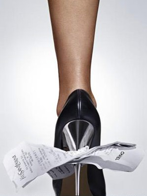
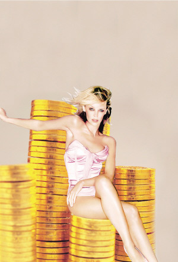

# ＜天璇＞他是个成功的男人，哇！她是个成功的女人，呃？

**很多投资人在被问到如何看创业者的时候，都提到了一点——“我会看他的妻子是怎么样的一个人。” 他们不会把一个漂亮却浅薄，可爱却没有学识，讨人喜爱却只知道顺从和取悦自己的女人娶回家。** **因为，只有那些最聪明的男人才知道聪明女人的价值。** 

# 他是个成功的男人，哇！

# 她是个成功的女人，呃？

##  文/彭萦（University of Michigan Ann Arbor ）

 

一、“他是个成功的男人，哇！她是个成功的女人，呃？”

一个男人可以说“对爱情的渴望，对知识的追求，对人类苦难不可遏制的同情心，这三种纯洁而无比强烈的激情支配着我的一生。”但是一个女人呢？不，她没有追求更多知识的权利。一个有学识的男人是有学识，一个有学识的女人是……第三类人。

一个强势的男人是自信的，骄傲的，有个人魅力的；一个强势的女人是刻薄的，让人畏惧的，自以为是的。

奥巴马和希拉里竞选的时候，朋友问我，你觉得谁会胜出。我回答，还用问，奥巴马啊。朋友说，为什么。我说，因为性别歧视比种族歧视还更根深蒂固。你甚至可能意识不到自己潜意识中有性别歧视。

我朋友也“歧视”我，他们说，啊，你真像是一个男人。难道一个女人就不能雄心壮志，有谋有略，雷厉风行，果敢历练？

我的父母也“歧视”我，他们说，哎，女生嘛，还是稳定一点好。难道一个女儿就不配得到父母更高的要求，更多的期望，不能像儿子一样去闯天下，去冒险，去实现自己的梦想？

别说了，连女人自己都“歧视”自己。当一个男人被问到，“你为什么成功了”的时候，他一脸那还用问的表情，说：因为我行啊。当一个女人被问同样的问题的时候，她们的回答往往是“我很幸运” “有人帮了我” “我工作很努力”。就是不好意思归功于自己。

可是，一个人如果连自己都不相信自己应该得到更多的赏识，应该拿到更高的工资，应该给予更多的机会，应该享有更多的成功，那别人怎么会认为她应该得到呢？

让我们承认吧，成功和讨人喜爱这两者，对男人来说是正相关的，而对女人来说是负相关的。希拉里在民意调查中得到最多支持率的一次是她在后台抹眼泪被偷拍到的时候。人们想，嗯，那才像是一个女人嘛。

二、 “我的人生理想是……有个男人爱我”

《非诚勿扰》有一期节目，最后的一个环节，男嘉宾站在台上问他对面的三个女人一个问题“告诉我，你的人生理想/梦想是什么？” 我心想，不错，挑选人生伴侣的时候这的确是一个非常重要的问题。

可是，一个女人的回答是“活得幸福” ，另一个女人的回答是“希望父母健康”，最后一个女人的回答是“我的人生理想是...有个男人爱我。”

天哪，这些都是什么人生理想啊。不知道自己要什么的人才会说一个非常泛泛无法度量的目标--“活得幸福”。“希望父母健康”这只能是个愿望，不能称得上是个人理想。居然还有女人说自己的个人理想是“希望有个男人爱我。”有男人说自己的人生理想是“希望有个女人爱我”吗？

有一次和一个男生朋友聊起他的前女友，他说，分手很重要的一个原因是，她太享受那种周旋于很多男人之间的感觉，甚至和我在一起的时候都暧昧不断，根本不会拒绝其他男人的追求。

我说，我就不和男人暧昧。嗯，再年轻一些的时候也暧昧。但是，现在觉得为了暧昧而暧昧真是浪费时间。因为，就是有一百个男人奉承我，讨好我，取悦我，从中得到的虚荣感，依然比不上我自己做了一番事业所带来的成就感。我有太多个人目标要实现，有太多梦想要追求，我怎么会愿意把自己短暂的人生浪费在无谓的感情或无聊的游戏上。

是的，我希望我能爱一个人，我希望那个人也爱我，但那不会是我的"人生理想"。期望从对另一个人的依赖而索取到幸福和快乐，认为只有得到了另一个人才能拥有美满和完整，不仅仅是危险的，而且是悲哀的。因为真正的幸福和宁静永远只能源于自己。

三、 “优秀的女人是没有好下场的，除非你找到了一个好老公”

女性主义者肯定会对杨澜的这句话颇有微词。我不知道她说这句话的上下文和真正的含义。但我想，也许可以从某一个角度来解读这句话。

卡米耶，一个才华横溢的雕塑家，却永远只能是19世纪末期艺术史上的一个脚注。人们提起她的时候，她只是“罗丹的情人” “C小姐”或者“某女艺术家“。她的雄性荷尔蒙，她对艺术的歇斯底里，她那无法抑制的才华和天赋，都让人毫无疑问的坚信，她会是一个伟大的艺术家。可不幸的是，她对罗丹的爱击垮了她，毁灭了她。

长达十余年的厮守在罗丹生活圈外那东躲西藏使她绝望和无力，罗丹的成功带给她的只是压在头顶的阴影和忽视，甚至她的情人罗丹都因为对她才华的嫉妒而对她刻薄批评和无情嘲讽，最后离她而去。她因为爱罗丹，把自我抛弃了；因为爱罗丹，她把才华碾碎了。最后，她疯了。

珊尔达，《了比起的盖茨比》和《本杰明巴顿的奇事》的作者菲茨杰拉德的妻子，是一个多么骄傲的女人。她不仅给菲茨杰拉德带来灵感，还被他作为人物原型写入小说中。可以说，没有珊尔达，就没有菲茨杰拉德。珊尔达最终不甘自己活在成功作家的阴影下，指责菲茨杰拉德偷了她的话来作为小说素材，自己也开始小说的写作。她在三十多岁的时候开始每天苦练芭蕾舞妄图成为芭蕾舞者，同时拾起画笔进行绘画创作。可是，无论是写作还是绘画还是芭蕾舞，她都不得不面对种种现实的挫败和年华逝去的无力。最终，她的痴狂和骄傲让她疯狂，在精神病院了却余生，最后在一场大火中离开整个让她热爱又让她疯狂的欲望世界。

一个优秀的女人，如果不能得到她所爱男人的欣赏，仰慕，珍爱和包容，那她的爱会是她的迷雾，她的牢笼，她的刑具，她的坟墓。

四、 “爱就是牺牲”

很多年前，美国文学泛读课上，不知道我们为什么聊起了女人与牺牲这个话题。女老师点我名，让我说说我的观点。我开口第一句就是"Well, I believe love means sacrifice..." 对女权主义和女性主义破有研究的老师满脸惊讶，甚至是略带失望。我想，她本以为甚至期望我会说“I would never make any compromise for any man in my life.”

很多年后，当David问我以后会不会回大陆，我回答，虽然回国肯定是我个人和职业发展的最好选择，但说不定未来的恋人想留在美国，那我可能需要考虑一下。

David说：“两个人在哪个城市生活，女人应该和男人同样的发言权和决定权。如果你以后爱上了一个男人，你为什么不能坚持让他和你一起回北京呢？带着他的事业，或者让他重新开始一份事业？也许你并不是特别在意你在哪个城市生活？我想起我的一个朋友，她选择了留在堪萨斯，因为她老公不想离开。现在，她和一个老公，一个孩子，一栋房子一起停滞在了美国中部那个鸟都不生蛋的地方，我为她感到无比遗憾。她来自伊朗，有博士学位，她非常聪慧，充满了冒险精神。她最终选择了和那个男人留在那里，同时幻想着他们在未来的某一天一定会去另一个地方，做真正想做的事情。他们说，总有那么一天。可我却觉得，是啊，没错，但是你们一直在等着。八年过去了，他们依然还在原来的地方，活在等待和想象之中。她的情况可能和你的不同，而且待在加州湾区或者美国东海岸的确和被困在堪萨斯完全是两回事，但是，我的意思是，女人不应该总是为了另一半放弃自己梦想和希望的那个。”

五、 “做女人难，做丑女人更难，做漂亮女人难乎其难。”

在《好想好想谈恋爱》里，谭艾琳要出一本书，结果华林出版社的编辑暗示要不就潜规则，要不就自费出书。她的朋友毛纳颇具侠肝义胆，决定为谭艾琳出书费用抛头露面。她找到老熟人刘总，一个洁具商拉赞助，设宴陪酒，终于把赞助费搞定了。

回来之后，毛纳和谭艾琳道：“我可算知道求人有多难受了，人家脸色稍一变，我就跟低三下四的老妈子似的，浑身燥热。我以后再也不会歧视傍大款的女人了。容易吗？那得有多么坚不可摧的意志和脸皮啊！”

谭艾琳严肃的问：“毛纳，你没有牺牲什么吧？”

毛纳说：“啊，连你心理都那么阴暗，太可怕了吧。怎么一个女人办成点儿事就让人往色情上联想？连女人自己都这么联想，男人就愿意这么联想了，什么叫人心可畏？就这是！”

我和XP说，“哎，有时候我真希望自己是哈佛或者其它任何一所最顶尖的大学毕业的...”

XP说：“你不应该担心这个问题。你优秀是因为你就是如此，不是吗？从哪毕业的不是那么重要。它能给你带来光环，同时也会给你带来阴影。”

“带来阴影？为什么？人们会因此给你设下过高的标准？”

“带来阴影的意思是，哈佛会在你日后任何一个成就上和你邀功。”

“哈？是吗？”

“当然啊。如果你成功了，人们会说：有什么了！你是哈佛毕业的。这是应该的。本来就应该这样。他们把你个人所需要付出的努力都忽略了。”

“嗯。有趣的想法。但我觉得你是对的。”

无论带着名校行头的毕业生，抑或身缠万贯的富二代，还是有着一张漂亮脸孔的女人，他们都是骄傲的，同时又是尴尬的。因为他们的优势同时又是他们的劣势。

“你成功了，那还不是因为你长得好看。” 有时候，漂亮女人自己也这样怀疑自己。

六、 “我不需要一个男人来养活我，但是我依然需要一个男人来爱我，让我爱。”

Before Sunset《日落之前》中，女主角Celine说“你知道，现在恋人们都非常困惑。我想这是因为，男人们依然希望自己是必不可少的，需要被重视的。这么多年以来，男人必须养活一个家庭的观念已经深入他们的脑海。但就拿我来说，在职场上，我是一个坚强独立的女性，我不需要一个男人来养活我。但是我依然需要一个男人来爱我，让我爱。”

总会有一些声音回响在一个女人的成功途中：“你挣越多的钱，你能选择的男人就越少。” “你学历越高，你就越嫁不出去。” “你越有权势，就会越让男人畏惧。” 是啊，现在的男人都是那么虚弱，那么没有安全感，他们甚至不敢欣赏一个女人的成功和名望。

很多投资人在被问到如何看创业者的时候，都提到了一点——“我会看他的妻子是怎么样的一个人。” 他们不会把一个漂亮却浅薄，可爱却没有学识，讨人喜爱却只知道顺从和取悦自己的女人娶回家。

因为，只有那些最聪明的男人才知道聪明女人的价值。

This entry was inspired by Sheryl Sandberg's superb speech at TED

[Why we have too few women leaders](http://www.tudou.com/programs/view/U37rsppas4s/)

编者注：本文转自作者[博客](http://blog.sina.com.cn/u/1823702565) 。

 

（采编：黄理罡；责编：黄理罡）

 
