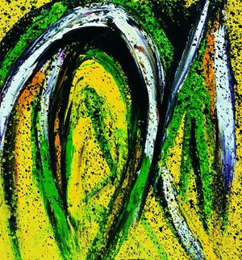
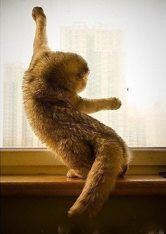

# ＜天璇＞代码，猫和理想主义

**写代码就是一个创作的过程，就像一个绘画的过程一样。码农用键盘，而画家用笔刷。码农要构造心目中独一无二、近乎完美没有漏洞的程序，而画家要画出心目中独一无二、近乎没有瑕疵的佳作。码农用一个个字符打造一件艺术品，而画家用一笔笔颜料打造一件艺术品。所以你不难理解为什么有的码农工作起来能到近乎疯狂的地步，因为你已经熟知一个画家的在凌乱的工作室里不眠不休作画的情景。你也不难理解为什么《硅谷传奇》里面有一句和艺术家相关的话”good artists copy and great artists steal”，因为一切目前广为人知的软件都是其中杰出的艺术品，你每天都在欣赏它们只是自己没有觉察到而已。** 

# 代码，猫和理想主义

## 文/余昊男（Purdue University）

 1. 

我喜欢写代码。

如果看到这一句话你心生厌恶、怜悯和不理解，那么我从内心深处表示遗憾。

同样的道理，如果别人对我说他喜欢捣腾仪器试剂，我觉得没有比那再枯燥的了。所以我遗憾他们一生中缺少代码，就像有人能为我一生中可能不会一件乐器而感到遗憾一样。

而使我真正同情的人，是那些摇动着计算机科学大旗，却鼓吹着自己不必写代码的人。他们觉得自己足够精明，参透了一切码农到最后都是流血、流泪出卖劳动力的道理，觉得老子搞的只是科学，又不是搞的代码。这样的人，如果最后能像霍金一样在轮椅上发光，照得世人眼睛瞎掉，那还了得，否则就得残废一辈子，因为里面的大多数人都害怕代码带来的挑战。

你可以想象我在谈论掌握一件乐器或者拿起笔刷绘画的能力，而不是在心里默默地想，这人又在这里装逼装专业了。你能这样假想的原因，是因为代码归结到最后是一门艺术。当然我喜欢这门艺术不代表说我已经登峰造极，就像我喜欢画画不代表我就是梵高一样。

写代码就是一个创作的过程，就像一个绘画的过程一样。码农用键盘，而画家用笔刷。码农要构造心目中独一无二、近乎完美没有漏洞的程序，而画家要画出心目中独一无二、近乎没有瑕疵的佳作。码农用一个个字符打造一件艺术品，而画家用一笔笔颜料打造一件艺术品。所以你不难理解为什么有的码农工作起来能到近乎疯狂的地步，因为你已经熟知一个画家的在凌乱的工作室里不眠不休作画的情景。你也不难理解为什么《硅谷传奇》里面有一句和艺术家相关的话”good artists copy and great artists steal”，因为一切目前广为人知的软件都是其中杰出的艺术品，你每天都在欣赏它们只是自己没有觉察到而已。

几乎每一个人从拿起画笔的那一刻，就立志成为一名伟大的画家，但大多数人的画也就是被摆在了街边或不起眼的小画廊里贱卖。天赋固然是里面一个因素，更重要的是大多数人都不堪忍受压力而草草对待自己的作品。他们不愿为了让自己的画有灵性而广游世界寻找灵感，因为那样会耗费青春和金钱。也不会始终坚持自己最初的构想数次撕掉画纸重来，因为身边的人都陆陆续续作了一些次品，赚了一些小钱。巨大的周边压力导致的结果就是，颜料还没干透画就被放上架贴上廉价标签开始兜售了。

事实上我能理解这样的人，因为现实的残酷让理想不值钱。 

 2. 

尽管我在本科的时候因为科学是一个崇高的话题而对学术动了一点点心，申了一个phd的项目，一直以来，我都觉得自己的兴趣不在学术界，而工业界将是自己今后的归宿。我不认为一个偏向工业界的人读了phd是某些人眼中的不识时务，浪费青春，我觉得一个人应该当对真理有所追求，哪怕只有过一次也好。

所以我带着短期做贡献的态度开始了研究，才发现原来许多学术界里的人对待自己论文和代码的态度还没有我这个界外的人诚恳。

大量的论文不开源代码，原因只有一个，因为藏在论文粉饰的华丽外表之下的是不能正常工作的代码，或者能正常工作但是不能和论文结果匹配的代码。对那些以保护知识产权为由进行辩解的作者，我想说的是出来混就是要公开代码的，否则你就学intel那样别发文章。

有的人经历了数月的程序运行之后，发现结果比理想偏差了一些，然后发现会议截稿期在即，再搞一遍确实痛苦，索性把心一横，涂涂改改，要么在代码里加点毫无逻辑的常数，要么给结果一个正的偏差，然后配上精美图文，提交。运气好的话，这篇论文就这么接收了。别以为我说的是一些无名小会，我说的事都常在自己领域top3的会议中发生。事实上，在计算机相关领域，尤其是机器学习和计算机视觉这一块，大家都心知杜明，尽管模型再新颖，名字再花哨，大多数都是不能工作的。

我觉得这些论文的作者才是真正的在浪费青春。

我一直坚持的原则是认真对待自己的代码和论文。在phd期间，我会开放每一篇自己的论文的代码。我会承诺除了必要的数值计算处理浮点数时有一些常量偏差在代码中，你会找不到任何hack的地方。我也会承诺每个能下载到的代码除了机器体系结构、操作系统和人为误差造成的偏差以外，论文中的结果能100%重现。我会保证自己论文的每一句话都以一种scientific的精神在叙述，而不是在敷衍reviewer。

庆幸的是，我的老板，包括实验室里的人，的确也都是一群理想主义者。7个人当中有2个已经35岁左右，其中一个是一直在研究所工作而居然忘记自己终身大事的华裔人。在他研究了将近10年之后，有一天猛然一想，妈的我还没phd学位呢，于是跑回学校继续念phd。另一位，也就是我常说的澳大利亚哥，读了三个本科学位，在一家电脑公司工作了也是将近10年之后，发现自己的理想原来在学术界。我虽然志向不在学术界，但我做研究时至少应该表现得足够诚恳。

我觉得一个人有一种理想和信仰十分重要，因为如果你像我这样用5个月的时间测试2个月写成的没有bug的代码只是单单验证背后理论的时候，你就不会有无力感和对自己工作的质疑。

我的测试仍然在继续，庆幸的是整个过程已经走上正轨。我放弃了用目前手中不成熟的结果写一篇论文投给下个月的会议而瞄准半年后的另一个会议。我觉得这样才是对得起自己的代码和论文，这样才不是在浪费理想和青春。 3.

我一直以来都很喜欢猫，长得可爱是其中的一个原因。

另一个更主要的原因是我喜欢猫身上一种孤独桀骜的气质。一只猫会对口令不理不睬，它会专注自己的世界。猫走路的时候优雅自信，一步一步，缓慢而沉着地前行，不像狗那样东闻闻，西凑凑。我一直以为，每只猫的脑子里都有某种理想根植。

所以，如果下辈子只能当动物，我会选择做一只理想主义猫。 

 

（采编：何凌昊；责编：黄理罡） 

