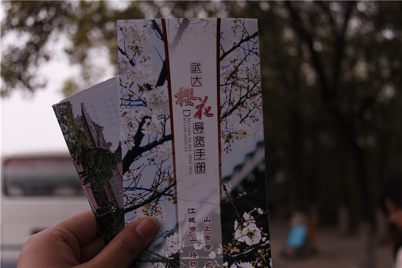
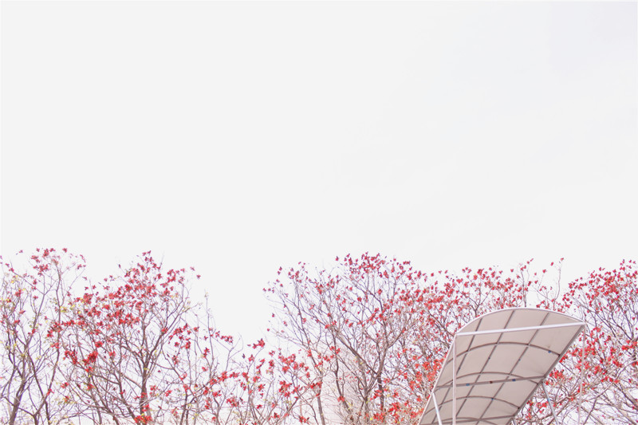

# ＜天璇＞以心相世界

**你去看油菜花，发现静下心来感受大自然鬼斧神工的人越来越少，更多的人，一直握着相机，这里“咔嚓”一下，那里“茄子”一下。似乎，相机看到的美景，比肉眼多得多。你去看樱花，无论走到哪里，也都是一样的场景。我们不悲哀么？我们匆匆走过一个一个的风景，用照片记录下永恒的瞬间，可是我们的心呢？** ** ** ** **

#  以心相世界

## 文/金婉霞 （华东理工大学）

你有没有发觉，相机已成为现代人出行必不可少的物件之一。一朵花，一棵树，一个人，一朵云，都可以成为人们抓怕下的模特，然后轻点手指，把它传到网上，与众人分享。有时候，我常常觉得，我们出行，不是为了体悟，不是为了行路，而只是为了多一点相片，多一点分享。是这样的么？

从现在这种状况来看，真的。你去看油菜花，发现静下心来感受大自然鬼斧神工的人越来越少，更多的人，一直握着相机，这里“咔嚓”一下，那里“茄子”一下。似乎，相机看到的美景，比肉眼多得多。你去看樱花，无论走到哪里，也都是一样的场景。我们不悲哀么？我们匆匆走过一个一个的风景，用照片记录下永恒的瞬间，可是我们的心呢？我们真的感受到美，体验过感动与幸福了吗？我们惊叹一句“好美呀！”然后就交给相机去感受、咀嚼这美了？这是不是很多人认为旅游比工作还累的原因呢？想当年，东坡夜游赤壁，用灵魂抒写赋辞，让今人都依旧能够感受到他当时的领悟与心绪，可是我们游赤壁在做什么呢？拍完照片，拍拍屁股走人了，到时把照片丢给旁人一看——哝，苏轼当年的赤壁我也是去过了。仅此而已吗？仅此而已罢！

相机永远只是为人服务的工具而已呀！怎么如今本末倒置了呢！ 我们什么时候才能够再次学会用心去看，去相呢？ 回过头来看看我们的这个社会，哪里不是“相机”呢？ 相机，只能留下事物的外在，抓不住的却是真正重要的内在，或者灵魂。 扪心自问，我们的眼睛是不是越来越相机化了呢？ 当下，我们看人喜欢看长相，看装扮，看衣着，于是人人驱风而动，长得丑的只好便宜了整容业，男生女生都跟着奢侈品的后边屁颠屁颠。可是，我们忘记了用心去看，这个人的人品，这个人的善恶；我们看物喜欢看造型，看品牌，看价钱，于是人人随波逐流，有钱的都要弄个“苹果”啃啃，没钱的也要看着苹果树数果子。可是，我们忘记了用心去问问，我们追什么，图什么，有意义么。 不能否认，社会的浮躁，是社会转型期间不可避免的副产品。春秋战国，社会剧烈变革，人们也是趋利而动，整个社会充斥了金钱主义，大部分人也是相机化的，可是我们不要忘了，那个时代仍然有少部分人执着地用心看这世界，领悟人生，告诉我们礼义廉耻，淡泊无为，老庄孔孟以心相人，以心相世，他们的思考若启明之星，指引那些迷路的机心者，并将这种思考传承至今。可是我们这个时代呢？有几个人是沉下心来，为我们增添一些内在的温暖与安慰的？只怕凤毛麟角吧！所以我们沉沦在这俗世，过着外表光鲜内心空虚的日子。 

我坚持不买相机，愿成为你镜头底下特立独行的那一个匆匆过客，在你用镜头记录人生的时候，我要用我的心去感受、聆听；在你分享照片，回味往事的时候，我要用我的心去品味人生的历练、成长；在你沉迷外在，虚度年华的时候，我要用心去活着。也许你的照片更能持久，但真正活过的，不是你的相机，是我的心。 什么才是有意义的？ 人总会区分。 

（采编：项栋梁 责编：项栋梁）
