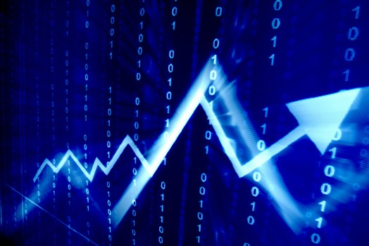
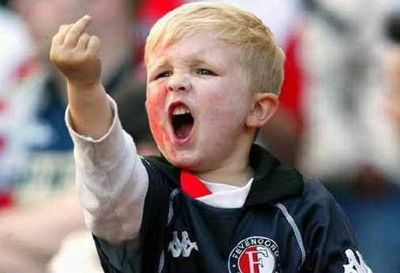
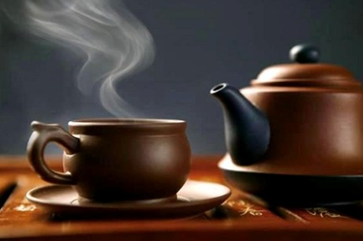

# ＜天璇＞以生活的名义

**政治这个东西，作为谈资是很好的，在特定时刻把妹也是很有效果的，我难道不知道吗？适当的谈一谈，没什么问题。** **别当作生活，别当作主线，更别让戾气充满你的胸。** 

# 以生活的名义

## 文/ 周远游（天津大学）

曾经有两本书，都叫做《以革命的名义》，苏联的那个拍成电影的，我始终没看下去，年轻时红色文学看了不少，当时对夏伯阳最有爱，对第四十一个最有感。但这本书我记得封皮实在太丑……至于起点那本，我记得我曾经引述过里面的一段话： **革命是什么****?** **革命是毁灭，她镇压一切反抗革命的敌人；** **革命是重生，她让所有受压迫的人获得自由；** **革命也是掠夺，她在向统治者讨还所欠的本利；** **革命更是获取，她能给革命者想要的一切！** ** ~~~~~~~~~~~~~~~~~~~~~~~~~** **呵呵，革命本来就是句口号而已，属于贫民们的暴政！以革命的名义从事任何暴力活动，才具备合法的外衣。这类合法，并非符合现行法律，而是历史的发展规律，被压迫者应该申述自己的权利与主张，也包括肆意掠夺贵族们的财产与女人，同样是在革命的名义下。** 但是，稍有常识的人都晓得，在人人网，或者在其他论坛，鼓吹革命还是改良，其实没什么意思，这根本不是你可控范围内的事情。温和派再怎么反对，革命的盘口如果来了，你拦得住么？一个聪明人，在盘口来时，就该果断推筹码去梭。你不梭，失去机会是小，祸害大家是大，比如22年前的波波。 同理，革命派无论如何聒噪，盘口如果没来，是你聒噪的了的么？盘口没来，闲家正常的选择当然是跟庄，凭什么跟着你推筹码？那你一推肯定赔个精光。自己愿赌服输没关系，别裹挟小弟好不好？ 

既然这和鼓吹的人没关系，按道理，我何必搀和呢？问题是，这里是人人网，不是别的地方。最近这类话题到处都有，各大主流论坛完全卷入，我却完全没有说话。 为什么？那里人是谁，和我甚相干？ 但这里是人人网，我这个号有很多人，是从未蒙面的，但是基本都是互加好友超过2年的。按说各自有各自的生活，我一般不去关心人家的私生活，网上的事情归网上。但是，最近弥漫的一切，本质上是戾气！ 戾气太重！ 一个社会处在转型期，戾气重是正常的，能不能渡过要看当权者的智慧。但是当权者是不是有智慧，也不是你可以决定的，你再有戾气，论述再精当，放的狠话再吓人，能如何呢？ who care？ 但是，要知道，戾气深重的人，生活很难快乐的，扪心问问自己。 我自己在人人网最活跃的时候是08年前后，想必有不少人还记得，什么wt了，什么扑克牌了，都有我一号，而且基本不用马甲，因此也造成当时那个圈子里很多人真名是啥我也不知道，如今似乎也失去联系了。 我自我检讨，那时候，我的戾气就太重，总觉得这也看不惯那也看不惯，而且那时候，听了李远哲一句话，说：**知识分子，如果不在社会转折时期站出来说话，以后一定会后悔。** 哇，当时那句话，简直让那时候不满20岁的我热血沸腾，加上从小口才便恰，知识面算很广，记性也很好，那阵子，在和众“五毛”战斗的过程里，几乎是横扫之势，那时候总觉得太有成就感了！天大夜里熄灯，于是我经常在室友们碎叫后抱着本本，把总网线从交换机里拔出来，然后熬夜继续战斗。总体来说，那段日子，基本上是重度网瘾少年。 可是，又如何？年轻时候难免会二一些，这没什么。我前后被封了20个号，有段时间认识的人都烦了，因为天天加，但那时候总觉得受了天大委屈，非得干到底。 这些事情固然作为青春一笔，将要留下印记，但是问问自己，这种生活，对自己是正效应么？对他人是正效应么？对社会是正效应么？ 

有件事情，我基本没在网上说过，因为没啥意思。不过很多人都喜欢晒资历，那就晒晒吧，其实这事情实在太操蛋了。 09年5月，我因为邓玉娇的事情也被市局喝过茶，起因无非是百度大学生吧的一个帖子和我鼓捣的一件文化衫。那时候我记得只有周逸飞打电话问候，当时那份感激吖。 当然了，那时候，在蜀黍面前，我也装小白兔，尽量避免被套话，但是说实话，那个蜀黍和那个阿姨，为人巨和蔼，巨慈祥，而且尽力帮我开脱，我没有开玩笑，没有讽刺，是这样的！由于当时学院的赵老师保护我，事情完全被控制在校园内部，连喝茶也是，对此，我至今依然表示感激。目前来看，这件事情对我没有造成任何负面的影响。 这么说不是别的意思，因为这件事我也很恶心，对这个体制感到恶心。但是，来跟我接触的俩人，我愿意用最大的善意去揣度他们，如果他们愿意，来整治一个在天津没有任何背景的穷学生，应该是很容易的事情。当然，你可以说，我人微言轻，人家犯不上。但是无所谓，我只看对我的正负效应。 目前为止，这个事情对我求职，再求学，没有任何影响。我希望不会再有影响，如果哪天被发现有影响了，再说。 如果给我算账的机会，起码这俩人，我是不会怪罪的，我还就装一回大尾巴狼了，行不行？ 好了，有些说跑偏了，大概是10年以来，从第一次考研败了之后，到现在为止，1年多的时间，我可能是总体上比较顺遂，也可能是在全国各地晃了一圈，见识了一些具体的事情，再结合书本，对很多问题可能有些看法的改变，因此戾气有所减少，顿觉生活也美好了许多。 当然，减少，但没有消失。不过由于码字的缘故，我可以很大程度把戾气发泄在里面，没事就让龙套死的很惨，脑浆迸裂什么的。 但是还是不能消弭。我看见有些熟悉的id的言论，还是会不爽，生id，无非直接拉黑就好，眼不见心不烦。熟人的，唉，我终究还是不习惯点名道姓的来，这和我生活里的直爽大不一样。 所以，唧唧歪歪说这么多没有用的，其实就算规劝一句。 平平心，静静气，鲜血能让人充满力量，能让人兴奋不已，但是鲜血的游戏你也不敢玩，何必徒增烦恼呢？ 人活着不就是为了生活么？你不生活你还想咋地？ 除了野心家和脑残，正常人所做的一切，大概其都是让自己的生活变好。我认为，在不危害他人的情况下，选择任何方式都是可以的。比如跑路，比如经商，包括吃皇粮！ 我没觉得吃皇粮就有啥原罪，我爹是教师我姑父是医生我爷爷二叔姑姑都是银行的，他们几十年兢兢业业的工作，对得起纳税人给的薪水，难道这是原罪吗？谁说这是原罪，那你的意思就是我生活圈子的人都是有原罪的了？没事把清算挂在嘴边，你威胁谁呢？我只能最温和的说，要警惕这种人。 所以说，发这篇文，大概也只是给那些还把周某人这个id当做网上朋友的人看，不喜欢请自己解除或者拉黑，昨天某人拉黑我我就很与有荣焉，因为事实证明我几个月前发文赞之还是自己太年轻看错了人。可是我这人嘴犟一般喜欢自己悄悄改但就是不说，但你主动黑掉我是你当时通过好友申请错了是你承认滴，对吧。 如果你们愿意看，那么，算是一点点谏言吧，减少戾气，真的，没有用，伤身体，影响生活质量，何必呢？ 政治这个东西，作为谈资是很好的，在特定时刻把妹也是很有效果的，我难道不知道吗？适当的谈一谈，没什么问题。 别当作生活，别当作主线，更别让戾气充满你的胸。 如今社会的戾气还不够大吗？真搞的不可控的时候，伤元气的可是每一个人。不要以为能独善其身。 

如果你认定没有希望，就去准备外语，我承认，自由世界有很多地方很美好，我也心向往之。 如果你认定还有希望，就去努力学习，挽起袖子，准备做一个建设者。建设者虽然在当世往往得不到公道，盛宣怀卢作孚到现在还没公道，但是刘少奇那句话说得好，历史是人民书写的。总有一天，历史会还建设者公道。而且，真正意义的公民，我想在心中，已经还了他们公道。 如果你想改变眼前这一切，我认为这是很好的想法，大丈夫立身行道，总得做出一番事业，那么，就去建立自己的知识储备，修养自己的高尚品格，锻炼自己处理人际关系，尤其是团结大多数人的本事，多去国家各地走走，体察下老百姓在想什么，工厂，矿井，农村，民工们究竟在想什么。真正的革命者，无一不是人中之龙，一定有渊博的知识，强大的气场，杰出的组织和动员能力，很遗憾，那两位意领及追随者们，是不够格的。而且这样的嘴炮除了激化你心中的戾气，还有什么用呢？ 无论如何，以生活的名义，让戾气走开吧。折腾了这么久，也该够了。 

（采编：陈锴 责编：陈锴）
