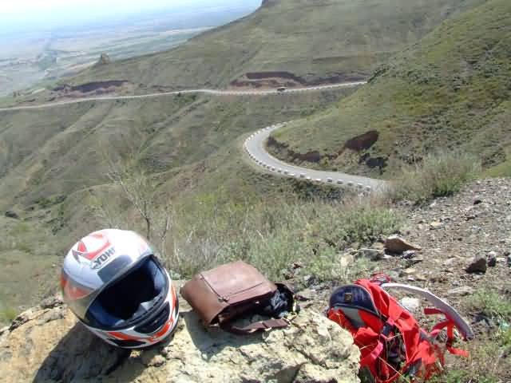
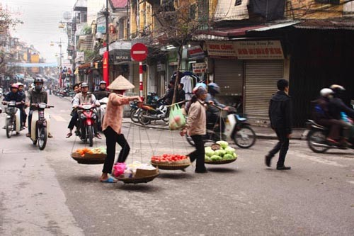
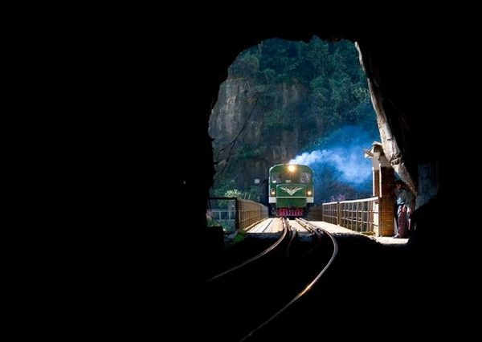

# ＜天璇＞休学那年的旅行

**这段经历过去快两年了，而我也快要毕业。当我回想自己沉闷的学生生涯时，不能不觉得这次长途跋涉是其中浓墨重彩的一笔。尽管现在觉得这不算是一次很成功的旅行——没有植物学和地貌学、地理学的知识，因而对丰富的自然现象缺乏观察和记录；胆量太小，一人独行，资金和日程又捉襟见肘，许多有价值的地方没有去探访；同情人们生活艰辛，受了过多的影响而心情低落；不懂当地语言，只能以英文和极少数人交流——但是那几个月中，还是有很多见闻和感触永久的印刻在了我的脑海和心灵中。**  

# 休学那年的旅行

## 文/熊小冀(北京大学)

 

2010年3到7月间，在休学期间，我做了自己的第一次独自旅行。

在此之前，我在北大哲学系读研究生一年级。学校生涯，从中学起对我来说就是一种需要经常自我鼓励才能撑下去的任务，尤其是高中时无穷无尽的考试和监狱般的生活让我对学校生出强烈的抵触，这种状态一直延续到本科毕业。但我不愿意垂头丧气混日子，对于求知我有着热烈的期望。为了给自己更充足的学习时间和选择，2009年秋，在北大的第一年结束后，我决心要进行一年的自我教育，于是办理了休学的手续。

那年冬天在图书馆里漫无目的地乱翻了两三个月，我很投入的看了几本书。我把《论语》等同于《世说新语》，当作故事来读，孔子的言语精神给我了我春风化雨般的感染，我觉得他像普通人一样亲切，但确是称得上“高山仰止”的一位真正的老师！我认真阅读了《歌德谈话录》等几本讲美学的书籍，了解到创作中题材的重要性，以及没有伟大的人格就不能成为真正的艺术家的道理，并试着区分软弱闭塞的文艺和强壮自由的文艺。我还通宵达旦的读了《第三帝国的兴亡》，对个人欲望在历史中左右大众的能量感到怵目惊心，原本在我心目中的那个高高在上、冰冷理性的“国家”的概念崩塌了，而代之以庞大却并不复杂的人群集合的形象。这种乱翻书让我“偶有所得，便欣然忘食”，不过现在想来这样的方式真是鲁莽，所以当时所看大部分都忘了，我也很快觉得有些烦躁了，毕竟“读书使身体疲倦”，而我更是闷的太久了。

这时我正巧读到了几个名人大漫游的故事，又看了讲述古巴革命英雄格瓦拉跨越南美大陆的电影《摩托日志》，受激励之下就想效仿。我做了打算，要从北京骑车去海南，因为途经的东部地区是中国大部分人居住的地方，而我那时对看人的兴趣大于对观察自然的兴趣，并且这条路线也远比去西部简单。我从网上的二手市场花了800块买来一辆旧山地车，找了一位长途骑行的老手打听经验，他告诉我，什么也不用想，要走就走就好。在他的撺掇下，我只隔了一天就收拾了下东西，背着书包，塞了两套内衣裤，拿了本地图，“什么也不想”的出发了。幸好一来没走什么太艰难的路，二来运气很好连爆胎都没遇上几次，我像中学生去上学一样的出门，换洗外衣也没带一件，太脏了就找水揉一遍拧干照旧穿身上，等着风吹日晒自然晾干，就这样居然也顺利无恙的走了将近4000公里。

3月22日上午，我从北大南门出发，穿过繁华的长安街，和南城延绵不断的服装、建材大市场，把沙尘暴肆虐中的北京城甩在身后，一样甩在身后的还有《摩托日记》中那让我激动的电影台词里说的“可怜的生活、考试和令人犯困的论文”。天气糟糕，我却被远行的热情激励着，下午就到了六七十公里外的廊坊，而在这之前我还从没有骑车超过十公里。廊坊城郊一位老大爷在放羊，听说我要骑车去海南，他一点也不惊奇，拉了一会儿家常，指了条路就继续放羊去了。河北省的农民有一种特别的平淡心，在城市居民中，在往南的省份的农民中就不常见到。

廊坊后是天津，我在这里停留了几天，好奇的到处乱逛。这是一座大城市，有着漂亮的西式建筑街区和宏伟的大教堂，商业区簇新亮丽，杨树在阳光下显得格外挺拔。我从西北角望东南郊区斜着穿过了整个天津市区，又挤在通勤的汹涌人群中乘坐津滨轻轨列车参观了滨海新区，大手笔规划的齐整的园区给我留下了深刻印象。我开始到处找路人攀谈。一位听说滨海新区开发热就跑到天津找工作的宁夏人跟我说了他在各地求职的经历，这本是普普通通的社会常识，在我听来却很新鲜，我后来发现像他这样没有受过多少教育的外来者往往对许多地方的社会经济状况的了解清楚、简要而实在，想来是由于他们出于切身经验，又行走四方，有了多地的比较的缘故。我又把天津和北京进行了对比，第一次直观感受到什么叫做“工业城市”，知道了城市的独特之处在于它的自然环境和历史的起源，以及聚集的各不相同的人群，虽然看上去都是街道楼宇，大同小异，却能孕育出不同的气质和生活方式。作为一个老工业基地，天津东南有大片大片的工厂区，我就暂住在这里，工人集聚的小区让我觉得衰败、萧条而精神不振，我为此而难过。

我以每天100公里左右的速度南行，穿城过县，车轮划过了广袤的华北平原，进入了山东境内。省境的两边尽管地理相连，但是燕赵之地和齐鲁之地的民风明显不同，更不用说看得见的经济等方面的差异了，这给了我深刻的印象，在此后跨越省界、国界的经验中，这种印象一次次加深。行政治理能够如此的塑造地方、人民的风貌，政治状况的深远影响，往往能超过地理环境的作用。我由此意识到，社会的管理者对其辖境确负有重大的责任。

往南，我跨过夕阳斜照下的黄河进了济南城。这座城市是一个行政中心，拥有美丽而历史悠久的大明湖和趵突泉，在古老的街区纵横着泉眼和沟渠，可惜很多已经干涸。在趵突泉的潭水里人们放养了海豹，我看的很新鲜。在这里我遇上了旅途中的第一次危险，在僻暗小巷一个卖各种诡异非法出版物的书摊旁，几个鬼鬼祟祟的人拿出道具来企图药翻我，幸好我及早警觉而挥舞车锁掩护着跑开，然后才发现车胎不知什么时候被放了气。这事之后，我就注意城市街头游荡的人，观察就业的状况。从此，我越来越体会到“安居乐业”这四字的分量。这是老百姓最切实深刻的愿望，我认为也是行政者应当最终归向的目标。

在当地人的推荐下，我参观了灵岩寺漆黑大殿里布满灰尘蛛网的五百罗汉塑像，这些罕见的北宋木雕具有穿越历史的神秘气息；登上泰山，在山顶远眺齐鲁大地，想象汉武封禅的情景，又拜访了泰山脚下一位被当地人尊称为“大爷”的修行人，许多教授和政府官员不远千里来向这位曾经的看门人求问，我静静的听他们的问答，体会到知识和睿智不是一码事；在曲阜，我惊叹于聚集在孔庙院内方寸之的成群白色鹤鸟，当地人告诉我这种鸟出了此院就难见踪迹，随后注意四周，确实如此，令我百思不得其解。

山东人民像传说的那样热情。我好几次受邀做客，东道主中有工人、生意人、航模教练和公务员。有一对煤矿职工夫妇，趁着周末骑车几十里来接我去家中过夜，为我准备丰盛的晚餐，临行时又把家里的药物塞给我许多。他们的善良我永远不忘！然而，这样的经历给我带来的并不只温馨的回忆。和他们的促膝长谈，让我了解到尽管职业和收入不同，生活对很多人来说却都是令人压抑的沉重负担。今天，当我回想起他们谈及生活不易时的轻声叹息，就忍不住要留下眼泪来。

越过泗水，再往南湖泊河流纵横，空气湿润了起来，在滕州的路边我发现到了第一株油菜花，这里是南四湖地区，农贸市场里的繁忙显示了水产的丰富。邻近的城市是徐州，徐州本是山东辖区，如今是江苏省的城市，在这里我又见到了政治治理塑造地区的力量。徐州也是座老工业基地，曾经国营工厂密集，现在失去了往日的光环。在破旧衰败的老工厂区，到处是散乱的小生意摊。囊中羞涩的我，为了省钱住进一家很小的旅馆，楼下是阴暗潮湿的小隔间，在里面住一晚只要十块钱，一些从山东来的花农挤在肮脏的床边抽烟，门口街道上堆着他们的泥泞花盆；我的房间旁边住着一些衣着单薄艳丽的女孩，半夜里我被惊醒，听到一个女孩歇斯底里的哭闹声：“我们也是人！”。我心情烦闷，天一亮就跨上车离开。

徐州往南一百多公里是宿迁，一过宿迁，自然环境、植被、语言和人的神气就发生了很显著甚至可称急剧的变化，让家在长江中下游南岸的我感到非常熟悉，这里就进入了江淮地区。沿着大运河，大片金黄的油菜花夹岸，在春雨绵绵中透出清新。这一带被称为里下河地区，地势低洼，人们修筑起沟渠和堤垸，将自然环境改造的适合生产居住。在长江三角洲的水乡，对自然的改造造就了生活环境，这种现象尤其是在长三角的南翼是很容易观察到的，我猜想可能是因为那里受到海水盐卤影响较大，逼的人们更加加倍努力改造的缘故。

经过当地人指点，我从扬州穿行过上百公里的油菜花田，抄田间小路来到江边，推着车上了小渡轮渡过长江。从宽阔的江面上望去，南京城虎踞龙蟠，气势宏伟。登高望远，开阔胸怀；临江而望，亦有此功效。

南京往东就是长江三角洲的工业区域，本是充满诗情画意的江南水乡，现在全变成了工业园，延绵不断的化工厂和大货车，污染了空气和河流，我试着和不同背景的人搭话，却发现他们大多数行色匆匆。这里聚集着四方来客，他们为了打工养家而离乡背井。这其中我碰到了同行的人：一位原来在无锡上班，刚在苏州找了新工作的打工者，他为了省路费而蹬车去新的工作地点，当然他那捆了一堆锅碗家当的车比我的破烂多了，我们在细雨中同行几十公里，我问他的未来生活的保障，他飞快的答道：“鬼保障吧！”。我又见到许多寄居在废弃集装箱里的外来务工者。那段时间媒体正在热点播报这些集装箱蜗居者，把他们作为房价房租畸高年代之“怪现状”，实际上他们默默无闻的住在这里有挺长时间了。我走到一些集装箱中间，看到这样潮湿阴暗的环境里也住着人，还有孩子在逼仄的空间里孤零零的一个人玩耍，心情有点沉重。

用脚步丈量过了一千多公里路程后，城市在我眼中越来越小，而一“省”也由一个名词概念变成了可以用直接经验把握的有限区域，我想印证和加强这种感觉。到上海后，我从曹安公路上的同济大学新校区绕了一大圈路骑车到徐家汇，当天夜里又从万体馆通宵步行到虹口体育场一带，穿过了上海老城区的一大部分。这样，我就有了直观的感受，人总在城市范围内活动，会极大限制对实际空间尺寸的把握，最后竟把眼见的狭隘事物当作了世界的全部。有了这样的经历，无论什么样的大城对我而言也绝不会再是能使我视野迷失的无尽丛林了。这是宝贵的体验，我慢慢拥有了一些以感性经验把握广大地域范围内看似繁多事物的能力。

天气变得炎热，在几乎令人中暑的烈日下，我行经中国的新火炉杭州，这里山环水绕，风景秀丽，尤其在富阳一带，展现在眼前的是活生生的《富春山居图》。继续往南，我感觉到浙江省的北、中、南部的人民随着居住地自然环境的变迁，而具有不同的神气。后来我看到明代旅行家浙人王世性对“山民”、“水乡之民”、“海滨之民”、“山居之民”的区分后，觉得颇有同感。

温州台州之后，地貌、植物的种类和形态都发生了明显变化，金碧辉煌的庙宇和祠堂越来越多。费力的翻过了浙闽交界武夷山脉的分水关，就来到完全不同的世界，这里是福建省，人民生活闲适，最常见的活动不是匆匆忙忙的赶路去谈生意，而是用精致小巧的整套茶具，一壶接一壶的品茗。在厦门的表弟那里，我修整了近一个星期，接着出发去广东省，岭南一样是水乡，却有着和江南不一样的风味。我看到大片的桉树林和香蕉林，以及从前课本里学到过的桑基鱼塘。但是除了农业外，这里也是广大的工业区，但是显然它的经济结构和人们参与经济活动的方式，以及由此而来的人们的思想观念，都和另外一个三角洲不同。到达广州后，阴雨绵绵，时断时续的暴雨整整下了一个星期，我就在一位好心接待我住的女孩家里闷了七天，只有在每天黄昏雨稍停的时候去出去采一些鸡蛋花来煲汤。

在广州时，我改变了去海南的计划，部分原因是没有了新鲜感，部分原因是在这样的工业区域停留太久，空气的污染，以及从开始起就时时感受到的人们生活的艰辛，连带着使我心情也烦闷起来。我拿起地图，目光投向了邻国的越南。我从没有出过国境，更别提是骑车出了，心里终归有些摇摆——不过都跑了这么远了，干脆一不做二不休出去吧。我到广州的越南领馆提交了入境申请，趁着等待的时间又在附近的珠海等地转了转，几天后拿到签证。这次为了节省时间，我选择了直接坐车到广西，自行车就塞到大客车肚子里。长途车夜间出发，前后邻座都是越南人，叽里咕噜说着我将去的那个国家的语言。第二天上午，客车到达一座边境小城，四围都是耸立的石灰岩小山，这就是凭祥，友谊关口岸的所在地。

找口岸的小贩子换了些越南盾，在越南海关盖上入境章后，我就推着自行车，第一次踏上了异国土地。这是一个受到中国文化强烈影响的国家，民间祭拜的是中国的神灵，神龛的两边贴着汉字的对联，甚至连赌场招揽的也是中国的赌徒，但是从宁静的公路和无法听懂中文的孩子们，就能直观的感受到，来到的是另外一个地方。我在一座座喀斯特小山头中间的平原上行进，经过著名城市谅山，谅山是一个军事要地，在它的北边有山峦阻碍，往南山头逐渐减少，而代之以农田平原，就是越南两大精华地区之一的红河三角洲，首都河内就坐落在这一片平原中，以带护拦的国道与北方相连，周围有一些日韩援助的工业区，吸引着无数的越南青年骑着摩托车前往找寻机会。我就夹在摩托车的洪流中在夜色中进城，靠着手势交流找到了市中心附近的旅舍住下。说是市中心，其实只是大片人流密集却杂乱无章的社区，颇像我国南方的老县城，街道上处处拉着红色条幅，同为社会主义国家，有着相似的氛围。我在河内街头到处乱逛，感觉有些地方有点像南方版缩小版的北京，英雄纪念碑，领袖纪念堂，广场，甚至还有列宁像，不过这种相似仅限于公共建筑的布局，拿风格来说，作为前法国殖民地的“东京”，河内，包括从北到南的其他越南城市乃至农村，都充满了欧式建筑和法国式的生活痕迹，例如满大街的café和早餐吃的法棍面包，阳台上吊满的花。说起咖啡，越南的中部高原盛产可可，使越南成为仅此于巴西的世界第二大咖啡生产国，咖啡早就融入当地人生活之中。随处可见的是各种咖啡馆或者路边摊，不像我国喝咖啡似乎是种小资习惯，在越南即使是贩夫走卒，奔忙之余也会自然的搬一角小凳在咖啡摊前，向头上扎着白毛巾的大娘要一杯ice co ffee，常常见到这样偷的半日闲瑕的劳动者。以前我国的街道上也有露天的茶摊，供劳作之余的小憩，想来是一样的情形，现在却少见了，主动被动的都登堂入室，价格也随之增加了地租的成分而“登堂入室”，飙升到让人无法亲近了。这里，无论路边摊还是室内只需要2、3块人民币就可以喝到非常纯正的磨制咖啡，口味不逊色于星巴克里动辄几十块的。爱喝咖啡的我直到很久都想念越南街头咖啡的浓郁香味。

来自与越南有极深历史纠葛的中国，在越南旅行，常会感到尴尬。河内的博物馆里，都会这样介绍越南历史：“越南的历史就是一部和北方侵略者不断抗争的历史”，接下来就要从古至今地展出战争的资料。而在这种教育下，普通的民众也有了对我国的民族情绪，之后在胡志明，曾有个当地女孩喝了几杯酒，当着我面咒骂起中国人，不过我也没有反击她，毕竟人的观点是难以改变的，而他们听闻的，也未必是没有一点历史真实的。但是，我又感觉到，越南人对中国的感情是很复杂的，即使表面诅咒你的人，也并非一味仇华。我想，这是因为同为东亚国家、发展中国家和社会主义国家，而两国历史和人民生活从古都是纠缠在一起的缘故吧。

越南是一个狭长的国家，从北到南延绵近三千公里，安南山脉纵贯全境，只沿南海山麓有狭窄的平地。山脉的两端是两个经济重心地区——红河三角洲和湄公河三角洲。胡志明市就坐落在湄公河三角洲上，它是越南的最大城市，也是工商业的中心，交通便利，经济活跃。我在一个空气清新的早晨到达胡志明市，尽管即使和中国的中等城市比起来，胡志明市的市容也略显陈旧，但站在市内水路边你却能感受到一种大都会四通八达的气势。它所处的地理位置可谓优越，有大海港，内河交通有水深江阔的湄公河通往上游东南亚各国，向北有铁路和国道连接越南其他城市，又占据着几千公里湄公河在入海口馈赠给人类的肥沃广阔的冲积平原。这样的地理条件，使胡志明市在被安南山脉阻隔的中南半岛上天然成为商业中心，我想如果不是国境线隔开了老挝、柬埔寨两国，这座城市的腹地将不仅仅是越南南部地区，而将成为整个湄公河流域乃至中南半岛人物辐辏的地方。现在的胡志明市，它的工商业集中在市郊堤岸区一带，其规模约等于中国中部省会城市的工业区，以纺织、食品、电缆等产业为主。而这些产业很大一部分掌握在华侨的手中，工厂和贸易公司的招牌都在越南文下标以繁体中文。这个抓住一切可资宣传的场合（如历史遗址的说明）大力宣扬其历史与北方邻国独立无涉，刻意贬低华人在其众多民族中的地位的国家，它的最大的财富制造基地却充斥中文，可以想见越南宣传部门的尴尬——当然这种尴尬其实从很多地方宣传文字的微妙措辞中也可以感受出来。

越南有八九千万人口，国土广大，在东南亚国家中鹤立鸡群，难怪它曾经西进柬埔寨，要实现做中南半岛小霸主的梦想，也只是在中国人的标准中是个小国家。我就因为这种印象做了错误的估计，计划骑车纵贯越南全境。但是四五天之后，我就意识到，越南的最南部纬度近于南沙，甚至离开澳洲也没太远了，我已经骑了四千多公里，体力和财力不可能再支撑又一个四千公里，只好放弃了计划，跨越大洲万里远行的计划就放到以后实行吧！我把车卖掉，开始乘坐火车和汽车。一位火车邻座的越南女孩、演出公司的主持人邀请我去她的家乡、越南中部港口岘港游玩，又利用假期带着我去了邻近的其他地方。我和她的朋友们在一起，像越南年轻人那样三五成群的带着头盔，骑着摩托车四处游荡。我们登上山顶，蜿蜒曲折的南海海岸展现在眼前。不同于众多多沙河流汇入的东海，南海的海水清澈碧绿，海中诸岛在海天一色中若隐若现。我们在街头巷尾围着咖啡摊聊天，我了解到越南男少女多，经济又无法提供足够就业机会的窘境，这些年轻人中很多都是做着非常临时性的工作，无法找到稳定居留的工作地点展开生活和事业，迷茫的情绪弥漫在他们中间。最让我觉得匪夷所思、甚至感同身受到羞耻的，是在一个海滨旅游城市看到许多退休、或是休假的60、70岁的欧洲老头租住在小楼里，日夜和17、18岁的当地女孩出双入对，对这种公开的状况，当地的民众只能私下里叹息，表示无可奈何，末了又要强作笑颜奔前跑后的伺候好这些财神。

越南是个经济快速发展的国家，这从随处可见的建筑工地可以看出，然而在我的经历中常常感到那里普通人的迷茫和焦躁，这和它的邻国、同样也是经济起飞的老挝给我的感觉是不同的。经济发展现在在各国的议题中都占据着中心的地位，各种统计数据充斥着人们的眼球，然而如我所见，同样蓬勃上升的数字，背后却不是同样蓬勃健康的社会状况。由此我想到，经济工作，如economy一词的希腊词源本意所表明的那样，是管理“家务”的实践活动，不是在做物理天文那样的科学研究，脱离了人们的切身感受，将会背离这个简单直观的根本目的。如果能把社会组织好，使人们居食无忧，各得其所，乃至可以心情舒畅的各行其能，就算得上“安居乐业”，可称为成功的管理者。社会的变迁和资本的需求，脱离了人们群体的认知和控制，反过头来控制了人们身体和心灵的自由，必然造成普遍的不幸福，这是我一路上不断体会到的，而其最甚者莫过于上面看到的那种因为人口结构和经济结构不相匹配而渐渐造成的屈辱了。

越南才刚处于工业化的初期，车行所经之处都是翠绿的田野和山峦，没有工矿采挖留下的裸土疤痕，夜晚清晰可辨的星空令人心旷神怡。在一派田园风光中，我在越南朋友的相送下从一座中部山地小镇穿越国境去老挝。

老挝是个穷国，乡下的人们大多还居住在木头、苇席搭成的小房子里，但却是一个异常平和的国家。老挝全民信奉南传佛教，孩童幼时都要在寺庙出家学习几年，长大了的言谈举止都有着佛教徒的淡然。尽管外国援助和资金涌入，南北各地工业园区蓬勃涌现，它给我的最深印象终归还是“宁静”，难怪遇见的西方人把老挝称为“19世纪的国家”。我从南到北，经过几座城镇，又步行了几个村庄，这段安静的时间算是漫长旅途后的休憩。时间隔的远了，印象淡了，但“微笑的老挝人”的形象还在脑海中挥之不去。到底是信佛让老挝人变的淡泊，还是他们的天性淡泊，因此选择了佛教呢？

经济发展会带来新的社会现象。在万象市外国人聚集的湄公河畔，我曾被妓女搭讪，被兜售毒品，看到豪华跑车呼啸着招摇过市，这些和我对万象、老挝其他地方的印象格格不入，这些现象会慢慢扩散开吗？对这个问题我心存好奇。我希望若干年后能再访老挝，看看经济发展和社会变迁会不会改变那里人们的恬静。

四个多月的东游西荡，我的“资金链”就要“断裂”，在当地找份临时工作挣旅费终究不可行。在泰国边境我“望界兴叹”，只能把南行去印度尼西亚的想法放到以后了。我厚着脸皮，向街头食摊上的旅行者搭讪：“Can I borrow one dollar from you?”，以此蹭吃蹭喝，用仅存的二百来块钱买了车票，饿着肚子坐了一天一夜回到了中国境内。在弹尽粮绝的时候，我幸运的碰上一位湖南驴友，与他相谈甚欢，他慷慨的资助我，一起去了震后不久的青海玉树。我们在牧区巴塘乡拉吾尕小学的大帐篷里生活了十多天，这让我第一次对藏族人的生活和想法有所了解。他们的爽朗淳朴感染了我，我永远也忘不了有那位每天早起烧起牛粪，为我们热好酥油茶的阿妈送我上车时眼里的泪痕。我也永远也忘不了开满野花的辽阔草原，我记得有一天黄昏时雷声轰鸣，我从狭窄的帐篷里探出脑袋，看到浩浩草原的尽头，两座雪山之间闪电划过，瞬时亮彻天际，天地间宏伟的景象深深的让我震慑！

这段经历过去快两年了，而我也快要毕业。当我回想自己沉闷的学生生涯时，不能不觉得这次长途跋涉是其中浓墨重彩的一笔。尽管现在觉得这不算是一次很成功的旅行——没有植物学和地貌学、地理学的知识，因而对丰富的自然现象缺乏观察和记录；胆量太小，一人独行，资金和日程又捉襟见肘，许多有价值的地方没有去探访；同情人们生活艰辛，受了过多的影响而心情低落；不懂当地语言，只能以英文和极少数人交流——但是那几个月中，还是有很多见闻和感触永久的印刻在了我的脑海和心灵中。

穿行于城市和乡村，把足迹留在辉煌的街市和阴暗潮湿的小巷，一次又一次，我体会到我国经济的落后和不均衡，物质生产不足以支撑大多数人除开基本生活需求以外，那卑微的对于个人自由发展的需要。后来我去印度旅行，同行的中国人往往嘲笑印度的贫穷，我心里却会想起那些朋友的叹息，不由心痛起来。我国的众多人民，也在为了基本的生活需求而不得不忍受无法令人满意的生活。我们这里的基本生活水平比印度要高，但又有什么本质的区别？那样的嘲笑，不过是因为不知道社会的实际状况而五十步笑百步而已。更让我体会深刻的，是滞后的文化无法引导人们和缔造更美好的生活。如果说文化、艺术的目的是创造丰富的意义世界以涵养人们的生活的话，那么建造更多电影院和公共图书馆，上映更多电影和出版更多书，未必就能达到这个目标。（当然硬件的建设是当务之急，在大多数县城里，都没有一个稍微像样的图书馆！）借用之前说过的歌德文艺观点，我觉得我在各大城市看到的情况是，占据优势地位的文化是“主观的”、“软弱的”，它们能短暂激起人们的情绪，却未必能引导人们向更自然、更茁壮的状态前进。这尤为可惜，因为我国各种民族聚居，自然景物又极其多样，本具有特别丰富的文化资源可供利用。

旅行的意义主要在自身的转变。我看到无数人生活在糟糕的物质和精神状况中，知道自己未来将要面对的是怎么样的一个世界。这让我在很多问题上变的严肃起来，也比从前更认清了自己的道路。这些，只有在努力奋斗了之后，才有资格去论说。然而我想，不管成功失败，试过为更向上的目标承担风险，而不是因为对未知的恐惧逡巡退缩，就永远不会为自己的懦弱而羞耻和后悔。

最近，我又读了几遍《法显传》。法显因“慨律藏缺失”，于近七十之高龄，不顾安危，翻越帕米尔高原，远赴印度求学，又经数年海上漂流，将经书带回中国。当我读到那质朴而令人心悸魄动的旅行记录，就感受到这位一千多年前的旅行者越高山，涉流沙，不畏万里艰途去寻求知识的信念。

 

（采稿：何凌昊；责编：何凌昊）

 
