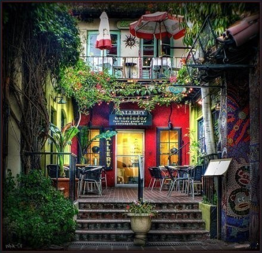

# ＜天璇＞何处不是围城呢

**我变成了另一个幻想中的完美的人。我努力一生想要变成的人，正在努力她的一生，成为另一个人。而我们只是变成了人。所以人的情感和痛苦，以及无法停止的思考的属性，将如同萨特笔下的苍蝇，如影随形，继续成为我的负担。** 

# 何处不是围城呢

## 文/汪海鸣（上海戏剧学院）

 

我知道印度洋里有一个海岛，我现在坐十六个小时的船，十五分钟的飞机，搭一辆牛车，我就可以到那里。我知道那里的沙子比大连、蓬莱的都要干净细嫩，海水像一颗裸露的钻石。

我知道我可以去那里生活，那里只有北京的十分之一大，没有地铁和火车，每个人都很友好。外地人占领这个岛屿，因为都是侵入者，所以享有平等的权力。

我知道我可以离开这里，我不是每天都在抱怨么，为了把时间花费在对自己意义甚微的工作上，和最亲近的人争吵，口口声声要去征服世界，却连下床的动力都没有。

我为什么要下床呢？每次睁开眼时我想着那个海岛。我像一个真正背井离乡的人一样热切怀念着家。我想象我在那里生活已久，我赤着脚走过海滩，棕榈树的影子和有着热带植物的白色别墅。空气里充盈着栀子花的香甜，每天会有数百种鸟叫我起床，而我愿意去工作，我知道我只用辛苦半天，就可以享受一整个下午的清闲。

每天花很多时间和旅行者交谈，我带他们去看我屋后的榕树花园，我的心情会很好，因为旅行的人都不暴躁。时间会挤眉弄眼地为无法进入我的岛屿而气急败坏。时间在这里有意义么？

我知道我可以去那个海岛，我可以放弃这一切，放弃我永远写不完的糟糕电视剧，放弃二十四小时便利店的关东煮，放弃一台电脑，放弃现实世界里倦怠且无聊的生活，放弃虚拟空间里嘘寒问暖的假意，所有人都在努力，他们认为努力是对生命的一种珍惜。

我着手开始准备了，我没告诉任何人，因为一个人的消失对周遭是没有意义的。像一滴水，慢慢流进印度洋，我知道那里有一个岛屿，我会晒黑，我会变得更漂亮。我知道那里没有人认识我，没有人知道我阴冷的过去，没有人关心我糊涂的未来，我就可以随心所欲地打扮自己，穿得像个怪物，可所有人都会觉得美好。

可即使在世外桃源，我也将很快堕入生活的单调。我重新成为那里愁眉苦脸的一个当地人。我会抱怨太多的空闲，太少的娱乐，我会想念我每隔一小时就死机的电脑，一边砸键盘一边喝的豆浆，我会想念我的食物，和我鸡毛蒜皮的同伴，想念酱油和青菜，所有让我抱怨过的一切，恰恰是我存在在这里的理由。

我来到这海岛了，我来到了只有别人分享的图片里才会看到的岛屿。我从空中俯瞰，这块印度洋里的伊甸园，我想在这里老去、死掉、尸体喂鱼，被一起生活过的人吃掉。我看到了白色的房子、彩色的船、奔放的女人，我看到了街道尽头白色房子里的床上，另一个我正在困惑着一座城市，困惑着时间、空间的把戏。并且仍然不愿下床，恶心着窗外皮肤黝黑的男人，以及健硕的女人，哪怕窗外百鸟的声音嘶哑，和高架上的车流无异。

我知道我可以去那个岛屿，那里福利一流，没有污染，食物天然，钱是多余的累赘，我知道我抱怨过的一切，都不在那里。而我也知道我可以去的十万八千里以外的土地，只是从佛祖的掌心航行到了指尖，所有困惑我、减损我的，都在我所要去的远方等待着我。

我变成了另一个幻想中的完美的人。我努力一生想要变成的人，正在努力她的一生，成为另一个人。而我们只是变成了人。所以人的情感和痛苦，以及无法停止的思考的属性，将如同萨特笔下的苍蝇，如影随形，继续成为我的负担。

有一天我们的国家变得更好，有一天这个地球变得更美，我的海岛依然只在意识的海洋深处，遥不可及。我们之间将永远隔着十六小时的船，十五分钟的飞机，一辆牛车。

我永远无法逃脱我不知道的主人，毫无真正的幸福可言。国家，地球，连那主人也是我意识里一个荒凉的岛屿。

生命啊，就是人在思绪时空里的漂流，还要不断拿着无法抵达的远方，来安慰此刻以及永恒的无望。何处不是围城呢？

 

（采编：董一儒；责编：应鹏华）

 
