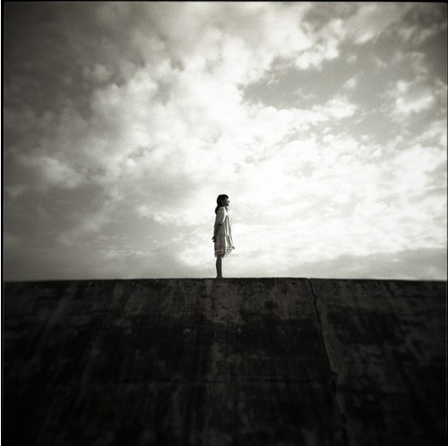

# ＜天璇＞你与这个世界

** 有时候我会想，谁也别装蒜，你我都在为某一个结果活着，不管这种结果是最后的衣食富足，还是名垂青史。在这过程中我们所付出的所有代价，都是为了那多少年后结果所在时间而言上的某一个点。仅此而已。到达了那个点，便是所谓的实现理想，而其中过程的精彩程度，已经被现实所绑架。**

# 

# 你与这个世界

## 文/大西杨（西南政法）

每一个没学过当代史的公民都知道，今天是一个特殊的日子。学过当代史的话，你就不一定知道了。

如果你能明白这一点，你已经参透了我国教育体制改革的玄机。 以上说的都与本文无关。与本文有关的是，我与我讲故事的话语权。那些年前的那一天，恰好成为了我的生日。我以前曾无数次幻想，在一个黄沙袭面的傍晚，我被路边的一个盲人算命先生拦住，先生说这孩子天庭饱满、地格方圆、骨骼清奇，眉宇间隐隐有英毅之气，且生日如此独特，定有精神分裂之命。我说为什么？先生掐了掐手指决绝地说：因为你是双子座！我说算得真尼玛准！我确实是双子座！然后扔下一百块钱得意地消失于晚霞尽头。夕阳照耀下，盲人老先生映着余光举起人民币端详着有没有主席头像······· 而其实，每年的某一个日子都在发生着无数悲欢离合的故事，日子不过是日子而已。日子的交相更替只不过是生命历程的不停轮回，后来因为我们的故事而被赋予了特别的意义。就好像每年临近高考的这个时候，我都会无病呻吟般地感慨物是人非、沧海桑田。这不仅是因为我对于高中时代的念念不忘，更在于每年的这个时节，会有数以百万的青年，去通过高考脱离了思想的樊笼，像当年的你我一样，去喝酒，去K歌，去表白，去被表白的人拒绝，以告别自己的高中时代，怅然若失地怀疑自己丢掉了青春，却执着地认为自己开启了理想的大门。在我看来，那样的生活才是生活，而这种生活已经距离我们很远了。留下的只是想念。 

 法定结婚年龄的到来，不仅意味着我们不能再看动画片了，更意味着我们的成长路程告一段落。自己的故事会慢慢被时代与社会所左右，若干年后，你我的理想要么改变了这个世界和某个姑娘，要么被这个世界和某个姑娘所改变。悲剧的是，事实往往是后者。原因在于，以往的教育让我们特别习惯于甘于平凡和鄙视关怀社会者，深知个体的力量往往不足以抗衡这个世界既有的规则，而彼此都力不从心去试图让所有人认同。比如我们的身边聚集着形形色色的人们，我们和每一个个体一样都过着自己独善其身的生活，每一种生活方式都在体验着不同的酸甜苦辣，构造着自己的生命历程，我们没有任何能力与权利去试图影响他们的人生进路。这让许多以启蒙者自居的人们往往变得无所适从。 在一个正在形成的公民社会中，我们的身边会浮现出越来越多的政治青年以及各种是非交错的言论，这让我一度难以自持，公然发表与《新闻撩拨》描绘的人类理想图景相悖的言论。某同学对我这种行为最为中肯的评价是：丧心病狂，寻衅滋事，自以为天线宝宝，到处充当迪迦奥特曼，且虐待小怪兽，唯恐天下不乱，大有炸平庐山，停止地球转动之势。至今我仍觉得此番评价相当之中肯，如果我们认为这个世界上的一草一木可能与我们无关的话，结庐在野、独钓寒江其实才是最高的境界。虽然我们从小到大看过的所有动画片都告诉我们，维护世界和平，伸张正义是每一个圣斗士的使命，即使你没有小宇宙。悲剧的是，这个世界上的一草一木确实与每个人息息相关，当你放目远眺街上的车水马龙之时，你目所能及的每一片背影都在组织着社会的成长。关注与讽刺这个世界不是因为我们荷尔蒙分泌过剩，企图以此表现出自己掌握了真知灼见，而是因为只有让每个人掌握属于自己的话语权，表达每个个体不同的意愿，无论正确与否，我们和时代才会共同成长。然后有一天我们老了，可以和身旁的老头老太太们说，我们不因虚度年华而悔恨，不因碌碌无为而羞耻，因为我们曾经有过多么精彩而富有意义的青春。 退一步而言，如果你不愿意去拷问社会与体制的弊端，不与世界妥协其实也是一条不错的进路。我高中时有一个哥们，他每天在清晨啃着五个包子就着邦德咖啡去上自习。一般他吃什么馅的包子，教室里就时常充斥着什么样的味道。如果他打个嗝，全班都能知道他今天吃了三鲜馅的。该生向来以如此之不修边幅著称于世。后来此人高考失常且毅然而然地放弃大学学业后，全班同学都惊讶地打出了三鲜馅的嗝。三年后的某个清晨，我们还在大学食堂吃三鲜馅包子的时候，此人已经阅书百卷，月赚万元，并时常充当同学们的人生导师。这样的结果是对大学教育体制莫大的讽刺，而令人困惑的是，每个人都知道现行教育体制是在如何地扼杀精英，然而精英们却都在努力地顺应这样的体制，有些人称之为忍辱负重，有些人称之为苟且偷安。 

 我的两次高中毕业典礼，都与生日“不谋而合”。每年的那个时候，我都会由于对于考试的过度焦虑而失眠成性，有时候在凌晨三四点的时候会爬起来看窗外的风景，并随地吐痰，以至于被吐到痰的宿管大爷以为我要跳楼，并要求老师对我进行了前所未有的心理干预，后来这种谈话基本上都演变为我为老师们讲解如何克服失眠的讲座，我的语文老师甚至还记笔记听讲。毕业之后回想起来，当时为高考所做的一切到底值不值得，那个时候我们都抑制了基本的人性，不能享受偶尔逃课的自由，不能打架，不能谈恋爱，不能喝酒解愁，不能夜不归宿，仅仅是为了寻觅一个结果，就如我们今天忍辱负重、随遇而安的日子一样。记着我当年五一放假回家的时候，为了控制自己不看电视，把我们家电视的天线接头给踩碎了，然后第二天实在受不了，自己又买了一个接上看得津津有味，那一刻感觉自己是如此幸福。有时候我会想，谁也别装蒜，你我都在为某一个结果活着，不管这种结果是最后的衣食富足，还是名垂青史。在这过程中我们所付出的所有代价，都是为了那多少年后结果所在时间而言上的某一个点。仅此而已。到达了那个点，便是所谓的实现理想，而其中过程的精彩程度，已经被现实所绑架。 上个月梦见自己重新上小学了。一个刚毕业的支教老师给我们讲理想，他说理想是自己与这个世界之间的契约，也是酒后喝多了和各种姑娘吹牛的资本。然后向所有小朋友提问每个人的理想是什么，没有一个人举手。老师说那位用别人的手擦自己鼻涕的秃子，你长大了想干什么？我站起来，说我想到少林寺学功夫，然后消灭邪恶、伸张正义。 老师说，在这个嘈杂的世界里，你丫根本分不清正义与邪恶。你现在应该做的，是走出这个荒芜人烟的小镇，去看看外面这个广阔的世界。明白了吗？ 我用手擦干了鼻涕，说：“明白了……” 作者注：此文写于2011.6,4。 

(采编：徐超 楼杭丹 责编：黄理罡)
