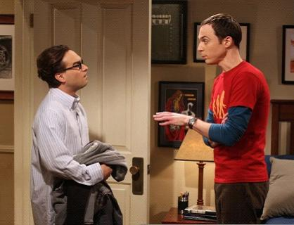

# ＜天璇＞你爱我，只是因为没有其他人让你爱

**有时候我一边迷恋工科男，又一边害怕和工科男谈恋爱，因为我对工科男总有一种刻板印象：认为他们中的很多人长期接触到的女性较少，而希望找一个文科女来丰富娱乐生活的愿望又十分强烈，而对自己为什么要喜欢这个女生思考得较少。万一我突然近身前去，乘其不意攻其不备，难免有胜之不武之嫌。更怕就像你给一个饿的要死的人端上一盘好菜，他狼吞虎咽之后说好吃，你问他哪里好吃他也说不清楚，反正是有吃的就好吃。这时候就不免想到爷爷的也许给他端上点比屎好吃一丁点儿的东西，只要能吃他都说好吃，枉我之前苦苦用心。** ** **

# 你爱我，只是因为没有其他人让你爱

## 文/ 米粲（武汉大学）

 《生活大爆炸》里我最讨厌sheldon，虽然我不否认他是灵魂笑点，但我不喜欢太强势的人：要求所有的朋友都围着他转，从来不觉得自己是其他人的困扰或是麻烦。相比之下我最喜欢leonard，友爱谦逊又充满麻烦地活在sheldon身边。在我看来他才是人际关系中的领袖人物，他的善良和奉献使五个人既勉强又紧密地联系在一起，像一辆舒适的破车般载着大家轰轰隆隆又磕磕绊绊地前进。所以我既因为他的善良爱他，又因为他的忍让而同情他。 leonard身上，我看到很多人的影子。他的爱情好像最正常，又最别扭。大约是母爱的缺失，让人觉得他始终是一个爱情的饥渴者。每当身边出现一个适交的女人，都急不可耐地想收入囊中。无论是女同事、女邻居、朋友的炮友、朋友的妹妹，只要是肯接受他的爱意的，他都迫不及待又全心全意地去爱。他那么努力，对每段爱情都认真地抱有想走到底的强烈意愿，而且在分手后都控制自己当一个不哭泣不挣扎也不骚扰的君子形象。我越看越觉得，他想要的并不是爱谁，而是找一个人释放他的爱，而这个人到底应该是谁，他也实在想的不多。爱情于他，好像并不是倾尽囊中去买一件心仪已久的奢侈品，而是依自己能力买一件手边的方便的适用的耐用的日用品罢了。我总在戏外，为他想不出自己所爱的究竟是哪样的人而暗自抚胸捉急。 

毫无疑问和这样的男生谈恋爱是安全和舒适的，白天是钱包晚上是抱枕，做个爱都像小学生讨好老师一样使劲儿问你“舒服不舒服”，还经常展露点儿自己的渊博和才华、悲伤和弱点，让人深深地仰望他们又同情他们，在他们面前既像母亲又像女儿，爱意顿时泛滥起来。想来扎实的爱情，不就这么回事儿么。可深受偶像剧毒害的我，总觉得leonard的爱情里总是缺了点什么，你能看懂他是怎么样去爱一个女人的，却不能理解他为什么要爱这个女人。而且戏中leonard的几任女朋友，想来都挺像的，都挺活泼开朗，大方有趣，且对leonard的性能力不说大加赞赏吧，也是基本满意。所以他到底是就喜欢这样的女人，还是戏里面出现的女人他都喜欢，我也有点茫然了。 为什么爱这个人？为什么认定这个人？不应该是一个在婚姻仪式结束后才用婚戒回答的问题，而应该是在恋爱里就一点点坚定起来的信念吧。譬如说这个人是不是和自己的生活习惯相同，是不是没有自己接受不了的作风和习惯，是不是和自己有相同的价值观消费观，是不是理解并支持自己的爱好，甚至是不是能敏锐地察觉到互相的心思，是不是能最适当地给予对方不能替代的安抚与平静，甚至是不是能与彼此的家庭、朋友、事业圈子融合到一起，是不是真的能忍受在一起四目相对几十年……太迫切太不顾一切的爱情，我总觉得更多是身体作祟，万一激情散去，精神和身体都因看着沉睡的枕边人而激发不起一种浓重的爱意来而感到无限的空虚，那时候怎么办？ 对爱人的标准，不仅“男的，活的，有五官”不够，“175+，官二代”也不够，“照顾人，会做饭”还是不够，一切标准都显得不够，而一切标准又都显得多余。只有小心试探，慢慢磨合，轻轻润滑、缓缓进入才能知道到底是不是这个人。我不想要leonard的那种安全爱情，我还是贪婪地想要爱情里有自己的独特性，就是那种女猪脚一换整个戏就塌了的感觉，而不是随便是个人都能拍的桥段。大概这种感觉，就是为什么征服一个浪子比征服一个处男成就感要大得多的原因。我并不是说挑挑拣拣的总要比一见钟情的好，而是挑挑拣拣之后所选择的，明显比一见钟情的更能面对之后选择的风险，因为毕竟是已经经过一轮考验和筛选的啊。 有时候我一边迷恋工科男，又一边害怕和工科男谈恋爱，因为我对工科男总有一种刻板印象：认为他们中的很多人长期接触到的女性较少，而希望找一个文科女来丰富娱乐生活的愿望又十分强烈，而对自己为什么要喜欢这个女生思考得较少。万一我突然近身前去，乘其不意攻其不备，难免有胜之不武之嫌。更怕就像你给一个饿的要死的人端上一盘好菜，他狼吞虎咽之后说好吃，你问他哪里好吃他也说不清楚，反正是有吃的就好吃。这时候就不免想到爷爷的也许给他端上点比屎好吃一丁点儿的东西，只要能吃他都说好吃，枉我之前苦苦用心。 

女人在不能得到爱的确证之时是最为焦躁的，就像大姨妈没有及时来担心怀孕般那么焦躁。有时候你可以安慰她说“男的就是这样，一时一时干自己的事儿就容易把女的忘了”。一时又想狠毒地说“他舍得这么对你，一定是他没那么爱你，分，果断分，赶紧分！他要爱你他能不着急联系你？他要爱你舍得你一个人走夜路？他要爱你舍得你吃苦攒钱给他买单？！”这种语言的力量绝对是巨大的，所以一般我不说，但也不代表我一定不说。容忍是一种办法，可心死了再找地方重栽也是一种办法。谈恋爱谈得多又怎么样？我披荆斩棘尸横遍野鲜血淋漓地才找着了你，你凭什么不为我骄傲还要嫌弃我？你爱我绝对不能是因为没有其他人让你爱，而要是你爱其他人的程度都比不上爱我。爱我让你就算是哑巴也想唱歌在睡觉的时候哄我，就算是文盲也想写情诗来讨好我，就算是饿得快死也想要精尽人亡地喂饱我，这样才够。我在你的世界里，不仅要是好和合适，还要是独一无二。少了我你的世界就要永远塌陷一块，你在我的宇宙里也要如是。这样我们才能互相忍受几十年，免得结也匆匆离也匆匆给娃造成心理创伤，知道了咩？ 话说我对爱情的理解一日三变，三日二十七变。等到写到这已经把之前到底想说什么忘记了。木有对象推倒的女人就是自在啊，自在得好可怜啊，意淫这么多有什么用啊，对爱情要求越高越找不到对象啊，哪个男的能受得了我啊，直想抚胸长嗟——爱漫漫其修远兮，吾将坐以待毙…… 

（采编：陈锴；责编：陈锴）
