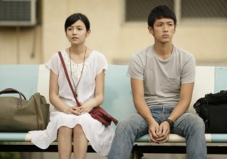
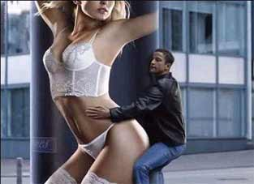
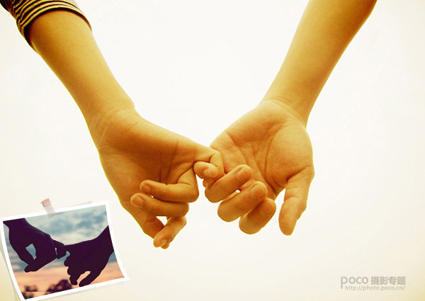

# ＜天璇＞你的男朋友是帅哥吗？

**帅哥不等于型男潮男的标准，帅哥的气质是自己惊艳于人而自己毫无知觉，可以臭美但不会自恋地45度角仰拍，可以耍帅但不会带伞不会涂防晒霜。我眼中的帅哥是永远的少年，永远的李健和安藤政信，瘦，眼神干净，坚持自己。我相信人们追求瘦的原因不一定是为了穿衣服好看，而是那种永远少男少女的线条感。永远吃不饱，永远没有贪婪，永远对未来充满向往，相信自己是独一无二的，未来是属于自己的。** 

# 你的男朋友是帅哥吗？

## 文/ 叶诗琦（中国传媒大学）

** ****** **这个问句现在几乎已经在我这个年龄段的女孩圈内绝迹了。** 相比较于男生们万年不变的“你的女朋友是美女嘛”这句话，女生们对男色的追求反而有些不务实。务实派会问，他有房有车嘛？打温情牌的会问，他对你好吗？一个有物质，一个有感情。可是都没有谈到外型，如果谈到，大部分的回答也是一句，看得过去，不胖不瘦。 时间倒退四五年，我曾与一位尚读王小波的模特身材美女朋友讨论过这样的问题：是找帅哥呢还是才子呢。美女给我的答案是：当然是帅哥！才子的才华是他自己的，帅哥的帅却看得到摸得到。当年的这位朋友，在经历了若干北影摄影系中央音乐学院作曲系法国男模台湾留学生的狗血男朋友后，终于从良回家乡与她的初恋破镜重圆百年好合了。但一问，这位初恋居然是在银行下象棋的奥特曼----又帅又搞艺术的官二代。所以本文的两个关键词，一个是男朋友，一个是帅哥。 男朋友的定义很简单，恋爱的对象，准备结婚前的考察目标。今年熟识的一位朋友，提起一年前我们初次见面时我说的话，我自己居然都忘掉了“欢乐谷是个神圣的地方”。当时她邀请我工作日一起请假去Happy，我回敬了这一句；一年后，她有了亲身经验后再次唤起了我的向往。北京四年，上海两年，无数次别人的邀请我都拒绝了，甚至偶尔都忘了这么个地方存在。 同事里有位90后的小MM，很抓狂地向我哭诉“求男盆友”，“有男盆友就可以去做摩天轮了！就可以去吃蛋糕了！就可以手拉手去嘉年华抽娃娃了！”，然后我们就一起YY，买一包彩虹糖，你一颗我一颗；买一盒冰激凌，你一口我一口；大头贴拍起来，围巾十字绣织起来，恋爱日记写起来。多美好的少女情怀啊！没有三十六计，没有七十二变，好像坐在巷口的那对男女，可以说个不停可以一言不发。这些都是恋爱中非常美好的状态。 至于对帅哥的要求，我先举几个相对的例子。曾经有不止一个自以为是其实外型只有50分的男生吹嘘：我一定要找美女做老婆。顿时我心里就鄙视之：你有什么资本？这种心理就跟当年李敖娶胡因梦时，自夸：以前女明星都嫁导演或富贵，这回选择终于嫁了作家。变态的自卑情结。即使是有钱有势的人，说这种话，我也会鄙视，将外型作为择偶普遍价值观的第一条件，不是纯粹出于欣赏而是为了满足虚荣心。 

 帅哥不等于型男潮男的标准，帅哥的气质是自己惊艳于人而自己毫无知觉，可以臭美但不会自恋地45度角仰拍，可以耍帅但不会带伞不会涂防晒霜。我眼中的帅哥是永远的少年，永远的李健和安藤政信，瘦，眼神干净，坚持自己。我相信人们追求瘦的原因不一定是为了穿衣服好看，而是那种永远少男少女的线条感。永远吃不饱，永远没有贪婪，永远对未来充满向往，相信自己是独一无二的，未来是属于自己的。青春少年是样样红。当然有一类帅哥并不是年轻的，如陈丹青，年轻时候除了眼睛大而圆而有神，面目乏善可陈；但修炼得当，人到中年后透出一种锐利，是年轻帅哥们难以企及的；同理还有若干老男人不提。 套之前一个版本对女生的要求：我理想中的另一半并不需要和我在兴趣爱好上有太多共同语言，我不要求他和我看一样的书听一样的歌看一样的电影，我倒希望他是一个喜欢运动、电玩、桌游和喝酒抽烟的男孩子。有人不明白我为什么放弃深度选择这样与我内在完全不搭调的男生，我的回答是：有文化的男人装B，没文化的男人傻B，一定要做个选择，我喜欢真实的人。更何况，钱我可以自己挣，学问我可以自己看书，但养眼的人儿我自己造不出来。 我相信，运动、电玩、桌游和抽烟喝酒，这是大部分男孩子的天性，只要还有保持这种简单的爱好，那么这个男孩子的内心就对那些高大全假大空的东西产生了免疫的基础。而他的女朋友，想向他兜售波伏娃的《第二性》，也必定会难上几分。需要做的，只是卖乖撒娇，那么便可以得宠。 相比较那些“坐在宝马车里流泪”的女孩，我想她们是为自己的价值观扭曲了。如果是一心追求富足的生活，那就不要做让自己遗憾的事情，鱼与熊掌不可兼得。邓文迪的巴掌事件出来后，她对媒体坚称自己是为了爱情结婚；我相信，会有她这样，和翁帆一样的女人，因为男人的伟大而忽略他的年龄和老态，那是一种人格魅力。那是一种超越了松弛的肌肤、疏松的骨骼、丑陋的老人斑和可有可无的床上运动的精神，不为了名利。 这两天重温宫崎骏工作室的一些动画片，在这里以少女为主角的故事中，主人公无论是千寻、梦幻街少女、幽灵公主、宅急便小魔女、还是金鱼姬波妞、借东西的小人爱丽埃特，她们都是短发的摸样，目光坚毅，望向远方，相信自己追求最真的东西，无论是健康的身体、渊博的学识、富足的物质，无论是帅哥、才子、富翁。 坦然面对自己的欲望，这才是美好生活的开始。That’s all. 

  

**（采编：林静；责编：陈锴）**
