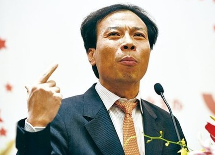
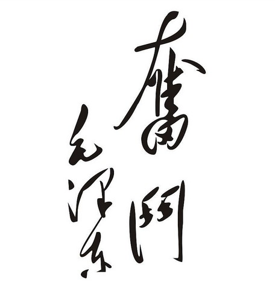

# ＜天璇＞你要闹哪样

**抛开那些趾高气昂的人，很多做出成就的人常常会说，是命运加上自己的努力带来了成功。在某个恰当的时候碰上恰当的机会，恰好自己认识什么恰当的人擅长做恰当的事，于是自己就成功了。虽说一路吃苦，却仿佛成功是天上掉下来的礼物。很多人不信，总觉得他人的人生可以复制，而且非要拽着人家要复制程序和密码。所以，可能并非是成功的人非要给人讲成功秘籍，而是人们非要觉得成功人士有秘籍。秘籍的本质，就是捷径和标准。** 

# 你要闹哪样

## 文/张亦（东北师范大学）

 

在大一刚开学的时候，学院请来几个学姐学长，让他们给我们这些小毛孩子讲他们的成功经验。他们有的是刚支教回来的，有的是刚一毕业就拿了高薪的，有的是保研到名校的，有的是申请到外国名校硕士的，还有的是自己创业办公司的。总之，学院称之为“成功人士”，是脑子里藏着成功秘籍的牛逼青年。当时他们具体讲什么我现在忘记了，事实上我所听过的所有励志型讲座、成功经验分享、潜能激发类教程，我都忘记说什么了，因为他们讲的好像都是那么几点——勤奋，定位，毅力。

刨开那些趾高气昂的人，很多做出成就的人常常会说，是命运加上自己的努力带来了成功。在某个恰当的时候碰上恰当的机会，恰好自己认识什么恰当的人擅长做恰当的事，于是自己就成功了，虽说一路吃苦，却仿佛成功是天上掉下来的礼物。很多人不信，总觉得他人的人生可以复制，而且非要拽着人家要复制程序和密码。所以，可能并非是成功的人非要给人讲成功秘籍，而是人们非要觉得成功人士有秘籍。秘籍的本质，就是捷径和标准。

倘若我现在也是成功人士，出类拔萃，那么我也可以给后生们分享成功经验，讲勤奋、定位、毅力，而且自认为会比那些人讲得更动听。这些成功经验好比“好好学习天天向上”，所有人都知道，所有人都可以讲，从理论到实证，从心酸到收获，我称之为“正确的废话”。但问题是，这些经验不只是经验，它们还是“成功经验”，所以只有成功人士才有资格讲，只有成功人士讲了才有人听。而一件事物要想牛逼，有一项是必不可少的，那就是稀缺性，成功人士因成功的稀缺而稀缺。

迄今为止我算是一个十分平凡的人，甚至可以说是连平凡都不够格的人，因为“平凡”在理想主义者眼中意味着平凡的事业、平凡的家庭、平凡的薪水，意味着将自己卡在社会的机器里成为慢慢运作至死的齿轮——我连这个都不够格。此刻我赋闲在家，两次考研失败，工作尚未稳定，作息时间紊乱，后天要去他乡面试。所以，我的人生经验是失败经验。在这个社会里，失败的人没有资格说话，只能做成功人士的陪衬，只能被旁人走过来拍拍肩叹叹气，只能搬个板凳抬头45度仰望过来人讲人生的真相。倘若失败的人张口想说“志趣”、“我觉得”、“我不喜欢”，那简直就是僭越是罪过。

可是我偏要说。

我要说，人家考上了公务员在你眼里牛逼，这关我屁事；人家有了儿子买了车在你眼里牛逼，这关我屁事；人家考了注会进了四大在你眼里牛逼，这关我屁事；人家喝趴下了一下子签了大单挣了20万在你眼里牛逼，这关我屁事；人家靠上了某某牛人成了行业新星，这关我屁事；人家请客吃饭花了巨款却有单位签单在你眼里牛逼，这关我屁事！

面对谆谆教导我的人，我不好对他们说“这关我屁事”，因为他们会觉得那么牛逼的人我竟然如此不屑，我肯定是“好高骛远”无疑了！我总是面临这样的状况，却无法与人坦诚的交流。不是因为我不想说，不是因为事情复杂，也不是因为对方不想听，而是因为，因为傲慢的社会给好多事情已经预设了模式和答案。

社会的傲慢有方方面面的原因和理论，第欧根尼说是因为太阳被挡住了，马克思说是因为资本，卡夫卡说是因为异化，萨义德说是因为霸权主义，蔡元培说因为缺乏美育。我没有什么元叙述去解释社会的傲慢，但我有深切的感受，它集中表现在——认为所有人都该符合某种标准朝同一个方向奋斗。我对行业职业是没有偏见的，公务员挺好，白领挺好，挣大钱挺好，没有行业职业是有原罪是缺乏道德基础的，毕竟大家靠自己吃饭，不偷不抢，既或是有分配不公那也算不到个体人头上。所以，你眼里的牛逼，我没有不屑，只有尊重甚至敬重。可是为什么我不愿跟你做同样的事情就成好高骛远了？我又没说不想挣钱不想做有益的事，更没说自己就等着别人给我喂饭吃，我只说你想做的事我不愿意做，而社会的傲慢难道已经让“我不愿意”成了立不住脚的借口了么？

最近有一些大学同学来给我讲道理，说我如何好高骛远，在大学时候就觉得我喜欢瞎琢磨，高薪水的工作不去干，作为朋友为我感到担心。面对这些打着“关爱”的名义送来的批判，我只能苦笑接纳，说：“对啊，当初报考那学校是挺好高骛远的，怎么可能考上嘛。”我知道，在他们眼里，报考名校确实是件好高骛远的事。但事实是这样的，就跟所有的这种事一样：做成了，你牛逼；做不成，你傻逼。就好比起义成功的人是英雄，起义失败的人是叛贼，追女人没追到都可以被算作好高骛远。既然历史和人生贯来如此，那么做自己想做的事被看做装逼也就不怎么奇怪了。

人生该奋斗，这是对的。人生该追求成功和充实，这是对的。可是“奋斗”、“成功”的标准各在人心，不需要也不应该由他人去定义，更何况好多所谓的成功根本就是忽悠。我听过很多人跟我讲他们的生活，有诉苦，有困惑，有鼓励，有伤心。这都是活生生的人类，有着喜怒哀乐，有着父母亲朋，有着爱好是非，你未曾参与到他们的生活又凭什么给他们制造生活标准了？你还说你不傲慢？

二十三四岁的年轻男人们，要出走家庭，要求得生存，要经营生活，要担当期望，要寻找方向，要承受孤独，要避免矫情，要防止迷失，要抵制蛊惑，要树立尊严，要快要准要狠要“一个人像一支队伍”去争夺资源——尽管知道古今中外皆是如此，尽管知道自己只是一批批向前冲的人群中的一员，尽管知道只需“做最好的自己不要着急”，尽管知道所有同龄人都在一样的慌张不安，但是个体面对人生剧变总会体验自己独特的痛苦、难堪和挣扎。个人的历史才是人生，谁都没资格指导和嘲讽，因为谁也拯救不了。

反成功学，张扬自我意志，这是老早就有人提倡和反思的事，简直是政治正确了。所有涉及人生的话语，大抵显得私密且无趣。我本不想再废话，只是近来总碰见人生导师，我的两只耳朵都不够用了，故而写了给他们看以示心思，告诉他们一群人对另一群人不一定非要羡慕嫉妒恨。

我想跟他们说，我是决计不会认输说自己是个失败者，经历再多的失败也不会，但也不怕你给我贴“失败者”的标签。在未死之前，我都不算失败者，这关乎尊严。倘若你非要问我究竟想要什么，我也不会说，因为拿着喇叭喊的东西通常都是假的。某人说，“先帝有大智慧，我想念他”。我说，闷声发大财，我也想念他。

 

（采编：楼杭丹；责编：应鹏华）

 
