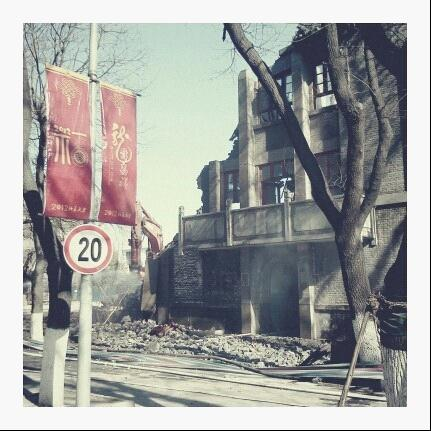

# ＜天璇＞倒掉的北大

**没有人苛求这片园子永远静好，只是希望那些曾经存在过的楼宇草木，不要在人们的脑海中淡忘、遗弃。** 

# 倒掉的北大

## 孙术乔（北京大学）

壬辰年初，北大南门25号楼拆除动工。这座见证了北、燕两校合并以来，新中国60年北大校史的古朴建筑在机器的轰鸣中解体，虽未近开学，已引得嗟叹声随处可闻。然而很多人并不知道，她的整个拆除过程历时之久可谓稀奇，那座“新闻传播学院新楼奠基”石碑，已在楼前孤零零地伫立超过两年。其间关于她的去留发生了怎样的纠葛我们无从查证，或许是文物部门的干涉，又或许是搬迁程序的波折，唯一可以确定的是，25楼的倒掉缓刑两年之后，原判行刑。

很少有哪片园子能在岁月的变迁中留下这么多让人魂牵梦萦的传说，燕园恰恰是这样一个有故事的园子。美中不足的遗憾则是：每段故事的广为人知，总要以失去些什么作为杀青，仿佛只有让校园的一角成为废墟，才配的上完美的祭旗。所以，也许是时候纪念一下它们了——关于这里曾经发生的那些事。

故事回到九十年代，当时的北大身陷那股浮躁至极的“教育改革”大潮，全国高校无节制的扩招，“建设一流大学”的口号扰乱了一所大学应有的平静。老校友回忆彼时的艰苦环境——老二教教室吃紧，学生们挤在空地上搭建的临时校舍上课；宿舍不够用，甚至有学生被要求自己解决住宿问题——除了风光依旧的湖光塔影，校园的其他角落看不出任何“一流大学”的风气。建设的混乱贻误了大学发展的黄金时期，乃至今天的北大还在为水电煤气等基础设施偿还那时的旧帐。在这样的环境中，1998年北大迎来了隆重的百年校庆。校庆工程的标志建筑之一——北大图书馆新馆尤为引人瞩目，李嘉诚捐资，是年5月4日校庆典礼当天落成。堂皇背后的消逝，是曾经的浪漫主义乐园——大草坪。

老图书馆的东边，也就是现在图书馆恢弘的东门坐落的地方，是一块面积很大的草坪。1984年，一个名叫朴勋的朝鲜族男生抱着吉他在这块草坪坐下开始唱歌，引来学子们的围观和赞叹，也自此开始了北大独有的新景象——越来越多的人开始聚集在这里，弹吉他，唱歌。八九十年代的北大是校园歌手的天堂，学生们从图书馆繁重的功课中走出来，来到广阔的草坪上，明媚的阳光下是阵阵的歌声，和寻着歌声看到的纯真的面孔。那个年代，那块草坪孕育了许多——其中一些，我们后来知道了他们的名字，比如弹唱《星期天》的，20年后成为新东方董事的徐小平；也有一些，我们记住了他们的歌，比如许秋汉那首令人心旌神摇的《未名湖是个海洋》。

与图书馆大草坪相比更鲜为人知的是讲堂翻修前后的变化，这牵涉到另一个朴素的名字——柿子林。老讲堂的门前是一块空地，上面栽上柿子树，成为曾经风云的三角地旁唯一的宁静之地。每至黄昏，林外喧闹的人群与林内细碎的虫鸣对比鲜明，使这里成了情侣幽会的极佳场所。那时，柿子林里常常零乱地摆着自行车——那是学生们去讲堂看电影了，而散场之后嘈杂伴着北大人对电影的尖刻点评离去，留下一对对恋人浸泡在皎洁的月光和柔和的树影中。这是属于幸运儿的记忆。更多人回想那时的林子，想到的则是跳蚤市场和没完没了降价的书市，无数学子流连于此，掏出口袋中屈指可数的几张零钞，只为把一包破旧的书抱回宿舍，爱不释手。据说在尼采热的时候，柿子林书市创造了一天卖出两千本尼采文集的记录，北大校友许知远回忆那时的情景，说林子里一定满是疯子，可爱的疯子。柿子林还是一个集会之地，在那个真正自由的年代，这片黄金地段常有热血青年慷慨陈词，围观的师生们或赞美或谩骂，或鼓掌或嘘声，至少在那些时光里，每一个演讲者都有听众。后来大讲堂成了百年讲堂，柿子林成了广场，树林里曾经充满的演讲，广场上却不再有，唯有留在三角地一角孤寂的新华书店，带着断壁残垣，坚守着属于那个时代最后的一点往昔。

提到三角地，不得不提的一处，是曾经与一塔湖图齐名的三角地公告栏。北大荡气回肠的历史中，她座落在涌动人潮的中央，成为了“兼容并包，思想自由”当之无愧的代言。学生们无数次在此发出呐喊：1957年民主墙运动，大字报写出了北大青年“常为新”精神的心声；七八十年代大学自由潮，年轻的诗人在这里张贴作品；八十年代末春夏之交那场风波，这里则是报名前往的聚集地。再没有哪个公告栏能像她一样声名远扬，物质上，她只是一个生满锈迹的铁板，精神上，她却是无数人信仰的寄托。然而，毁掉这寄托的正是她脆弱身躯的拆除，2007年深秋，北大在一个平常的夜晚悄悄地将她连根拔起，从此这里只留下一块三角形的草地和几颗苍翠的柏树。从风云到湮灭，中间潜移默化地发生了许多事情：到了九十年代，大学精神的没落和市场的席卷带来了太多嘈杂，学生们被无形的压力笼罩，失去了往日的风采。公告栏上逐渐充斥密密麻麻的商业广告和考研出国信息，曾经杂乱的美妙变成了混乱的丑陋，慷慨激昂的演讲变成了冠冕堂皇的推销，直到2000年后，她逐渐成了校方的眼中钉，奥运前夕的教学评估期间，以“影响校园环境面貌”为由，她被学校从名单上除名。这样看来，直至彼时，原本在脆弱载体上承载的强大精神力量也已经变得一推即到，这种悲哀是不能归结在哪一方身上的，它属于所有人。拆除三角地公告栏的痛心疾首，老校友比当时的在校学生更能体会。一位八十年代的校友为了大声疾呼，特意来到北大采访学生，当他见到学一食堂一名吃饭的学生茫然地抬起头对他说那里“实在太乱，拆了才好”的时候，一瞬间恨不得冲上去揍他一顿，平静下来之后却又感到无尽的苦涩和哀伤。另一位老校友则在网上绝望地说，“把三角地还我，非要拆的话，你们把博雅塔拆了吧……”

青年人不会整天像毛主席说的那般伟大，草根生活有草根生活的苦乐，而对很多在躁动环境下顽强生长的九十年代北大人而言，这些苦乐就是成府的万圣书园。如今华丽坐落着光华、经院、法律、政管大楼的那片土地曾经是成府园大片的四合院平房。相比同时期南墙的大规模商业街开发，东门边的这个园子能让人们寻到难得的闲适，1993年，万圣书园应运而生。从未名湖畔东行过去，穿过东操场，拐入几个巷子，穿过几间草房，便来到这间小书屋：一户门面，几级台阶，小小的两块招牌，外表破旧却又生意盎然。很难想象这间其貌不扬的书屋，竟是寻找精品书籍的必去之所，教授学者的第二阵地。徜徉在密密麻麻的卷册之中，浏览被店主从良莠不齐的出版物中精心筛选的藏书，或温习专业，或寻找志趣，时常听得相隔三两个书架，老先生对爱徒的谆谆教诲，青年学生之间固执而专注的争论，又瞥见同行学者沏一壶清茶，坐而论道，相视一笑，可谓是“谈笑有鸿儒，往来无白丁”绝佳的写照。平房的拆建充满了变数，万圣的辗转也几经周折，然而她作为知识分子精神家园的地位从未改变。如今校园东侧的建设使她远迁到成府路深处，不再是学生途经休憩的凉亭。但也或许在那个相距不远的地方仍然栖息着一群充满情怀与热忱的人们，此刻仍在碰撞出各种火花，酝酿着又一段佳话。

未名湖以北，是朗润、镜春二园，晚清时这里曾是亭台水榭独具匠心的皇家园林，自燕大以来化作校园北角的一片洞天。破旧的平房逐渐影响了园林的迷人精致，只是随处见得的大小池塘留得一丝神韵。在这里安度晚年的季羡林老先生亲手种下的“季荷”，亦是由朗润的湖水天然养成。相比现在学校竭尽全力留得未名湖一池清水，那时的燕园不需人工维系便自成山水风光，圆明园水系的甘露源源不断地汇入朗润镜春形态各异的湖中，构成如诗如画的景色，在当时争强好胜的北大人眼中，远不必未名出马，任拿出这里的一个，与清华的名胜：荷塘相比都丝毫不落下风。2006年镜春重建，作为老燕大“德才均备体健全”七斋之末的全斋计划落架重构，引起当时媒体以“北大拆迁主校园”为题的大肆炒作和学生的忧虑，好在时任许智宏校长主持大局，改造工程进行得妥善而用心。复建后的镜春园既整治了往日的破败，又恢复了古典庭院的精致韵味，这在校园建设上是让人欣慰的进步，而在校史的长河中又何尝不是岁月无情的更迭。

不是所有的拆建都能赢得众望所归，更多情况下是守节与革新的无奈抉择。人们说建筑是凝固的音乐，然而当这样的旋律都已曲终人散的时候，你又能从失望的人群中期待什么呢？

故事来到2007年，南门建筑群开始拆除。

从旧时北大的南门走入，映入眼帘的是一片风韵独特的景象，这片由16至27楼组成的建筑群与西校门附近的山水园林、东校区一代的现代高楼都不相同，拥有属于她那个时代的气质。50年代初燕大北大并作一校，校舍缺乏，按照梁思成的建筑思路，李瑞环带领青年突击队修建起了这些建筑，十二座楼以三合院为一个单元分建三组， 青砖瓷瓦、雕梁画栋体现出传统建筑艺术之精美，凹形的设计则传达出梁先生一贯注重的空间协调，加之以“解放风”的质朴与沧桑，使得这批建筑在天时地利人和的完美交集中浑然天成。07年，这些楼中细节最为精致的27楼被拆，开了拆除南门近现代建筑群的先例，新建成的教育学院大楼虽在扩充教研功能性的同时极力试图体现中西合璧的理念，仍难以留住老楼饱经风霜的传神。离北大师生更近的是2011年16至18楼的拆迁，由于工程浩大，又毗邻三角地敏感地带，在学生中间引起了不小的波澜。那年初夏的“砍树事件”，更引起了众人喧哗。北大从来是不缺乏异见的，这些是是非非在持续的纷争中永远不会有定论，唯一和谐的是萦绕不散的怀旧心情，和对自己大学故事的一刻回望的感伤——有些东西是失去了才想到留恋的，比如校园，永远的校园。

故事是讲不完的。大故事淹没了小故事，却总有那么一些琐屑的情节让人反复玩味，不能自拔。没有人苛求这片园子永远静好，只是希望那些曾经存在过的楼宇草木，不要在人们的脑海中淡忘、遗弃。

孙术乔

2012年2月3日夜

于燕园

 后记： 

这不是一篇喟叹“北大已无蔡元培”的骂文，只是北大人爱北大，从不是恃才傲物，不是溢美之词。而且提到的很多工程笔者是支持的，不过时光轮转，怀旧心情难免。写这篇文章目的有二：其一，想要为留住即将消逝的过往记忆做一些挣扎；其二，与其诅咒黑暗，不如燃亮灯火，用自己的光，照亮前行的路。

 

（采编：楼杭丹；责编：应鹏华）

 
