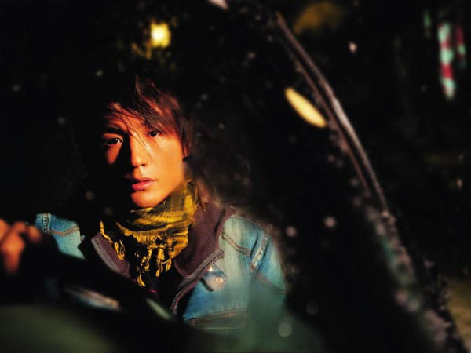
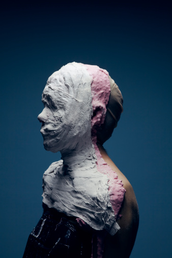

# ＜天璇＞傻子才悲伤

**不过我依然不喜欢圆满优秀。我喜欢是藏得很好的遗憾和缺憾，喜欢所谓的能感染人的正能量。我喜欢的是已经被时间治好了的遗憾和缺憾，因为它们留下了很迷人的痕迹。**  

# 傻子才悲伤

## 文/ 车宇佳（中国人民大学）

听说朴树这个傻子因为昨天晚上的演唱会彻夜失眠来着。听说他还穿了他妻子的裙子。 

听说他说：“我想无论这个夜晚有多糟糕，都会过去；回头看，无论发生了什么，都有被记住的价值。谢谢你们，是你们帮我撑过今天。” 

听说他说过，开这个演唱会不是为了纪念什么，我不想被纪念，我想做的事还没开始呢！ 

看网上的照片，他和我春天见到他的时候没什么变化，很短的头发，穿纯色的t恤，忘词，然后再唱一遍。但是好像没那么拘束和羞涩了，也偶尔会笑一笑，多说一点话。大概在12月15号的北京再见到他的时候，他状态应该会更好。那时，就已经是冬天了，距离传说中的世界末日，不到一个星期。 

那天去看演出，同行的石同学问我，你为什么喜欢朴树啊。我居然说的是，因为他病态。 

现在想一想，我怎么能那么回答呢？难道不应该这么说么：因为他眼神执拗而宁静，唱歌的时候专注而用力；因为他有我最喜欢的态度和腔调，是个低调却拥有不羁灵魂的人；因为他是我音乐启蒙时候撞上的宝贝，又让我求而不得这么多年；因为他年轻的时候是我小时候喜欢的类型，复出后又变成长大以后的我倾慕的模样，而且一回来就被我等到现场看得失声痛哭然后再不能割舍。我不是应该这么说么？要不然也得说个“没有理由啊，我就是喜欢他。”之类的话。 

我一定是渐渐失去口头表达和措词造句能力了。 

小时候家里有一张他的专辑——《生如夏花》。封面上黑暗背景中明亮的是朴树的脸，没有焦距的眼睛却一直看进我的心。那时候我们家在星期六日的早上会放CD，有阳光的时候我才听这张，可以消磨大把时光。那时候的朴树已经更加成熟，我初中的时候他还参加了湖南卫视的《名声大震》，扮成海盗船长和刘璇唱《蓝精灵》。他妻子悠悠唱着《野花》，他坐在旁边用吉他伴奏。偶尔在《同一首歌》里，他也出来唱一首《Colorful Days》或是《生如夏花》，头发遮住眼睛，站在一个定点，晃动话筒，目光坚定。然后我才听了《我去2000年》，里面表达着的是一个更年轻更横冲直撞更忧郁更目光游离更不溶于这世界的朴树，这是我所有他的专辑里面最喜欢的一张。我和那些说《那些花儿》是范玮琪唱的人吵架。我说你们听过么，你们听过朴树唱的啦啦啦啦啦啦啦啦么？你听那才是经过时间和分离才有的动人歌声啊。你们听过里面女孩子的笑声和海浪声么？你们听过朴树沙哑的漫长呢喃和呓语么？他随便唱的那段都让他唱得像飞起来一样自由，然后我都哭了出来了。 

五一时候我去看他的现场，下面的观众都抱一块哭，喊什么等你等得都老了，喊我从远方赶来赴你一面之约。我感觉我们都老了，可是朴树却依然是我心里永远的少年。他剪短头发后露出来的眼睛依旧清澈如故，穿暗红上衣绿色裤子。他说好遗憾，今天嗓子不舒服；他说这个开始不够好但毕竟开始了；他说他在变成更好的人；他说他要出新专辑，结果这几天我就听说他和乐队在我们最熟悉的琴行那边开始排练和录音了。 

mmax大爬梯的时候，大屏幕反复地播放他接受采访时说的话。他说：“每个人都是这么长大的，从一个孩子，然后，要去接受挫折，接受冲击，真是傻逼事儿干了一堆，现在想起来挺脸红的。但是那些事情有他们的价值，就是这些事情在改变我。所有经历的那些不好的东西，挫折也好，熬不过去的那些，那些都是应该发生的，而且无比的有意义。对，我觉得该允许混乱，允许失败。对，我觉得应该这样。对，那种不安定感太强烈了，哪怕你在街上走，你看每个人的表情，都能感觉到他们身上的狂躁，就是他们想急于去获得什么。或者说那种不安全感。人的感情越来越少，真的越来越少。世界如果活成这样就太糟糕了。对，各种人选择他们的各种生活，我觉得都很合理。即使他们的生活是被动选择的，被强加的，但我觉得生活就是这样。有美妙的一部分，然后还有特繁琐的一部分，不痛不痒的，在我看来，一切都是生活。” 

我突然想到，其实说喜欢他是因为他病态也没什么错。我喜欢不完满的人，我喜欢有遗憾和缺陷的人。小时候我曾经认真地考虑了一下，应该喜欢忧郁的诗人还是暴躁的乐手。总之我小时候并不喜欢积极乐观又优秀大方的人。我喜欢看班里的男生哭——他们一哭我就忘了平时他们瞎疯瞎跑，玩些幼稚游戏还瞧不起女生的傻样子。后来我也一直喜欢抑郁和自闭的人，喜欢没有表情也不愿意多说话的人。为此我还积极地想把自己打造成一个治愈系的温暖女孩好和他们相配。所以一段时间我喜欢的类型是完全一样的，聪明狡黠甚至自负，对世界不满甚至对一切都不满，读点书听点歌看点电影，有时候说话有趣有时候有点阴郁和迷茫，感觉平时没什么波动但是总觉得应该情感丰沛尖锐。这是我愿意背弃世界去拥抱的那种男孩。 

可是后来我越来越大，遇见的事越来越多，勇气越来越少，对未来越来越不确定。比起我原来想做的向日葵一样的人，我现在更是一个有温暖外壳的黑洞，比起治愈别人，更愿意舒舒服服地吐苦水和接受正面能量。我喜欢的是已经度过或者即将度过混乱期的男孩。我已经不再宽容男孩子的幼稚和自以为是。我愿意见到的是宽容内敛，是平和包容；是不妄谈将来也不谈起从前；是无论过去多么波折动荡现在已经能够直视别人的眼睛；是在听到挑衅和狂妄之后能够笑起来的；是可以剪短头发，然后更坦诚地直面现实的男孩。可是我无论如何，也无法和这样的人相配，因为我太幼稚太弱小，就变成被放弃的一方。 

不过我依然不喜欢圆满优秀。我喜欢是藏得很好的遗憾和缺憾，喜欢所谓的能感染人的正能量。我喜欢的是已经被时间治好了的遗憾和缺憾，因为它们留下了很迷人的痕迹。 

我觉得北京的秋天是以银杏树变黄为标志而开始的。那时候我也开始戴围巾，那些灰色黑色或深蓝色的围巾。我每次一圈一圈地围上，把下巴埋进围巾里面的时候，都觉得无论多冷我都能平安度过。而且有了要去看朴树的念头，心里好像也满满当当的了。 

悲伤很美味，孤独很甜蜜，通通吃下去却只会越来越饿。黑夜很迷人，雨天很鲜亮，都穿在身上却只能越来越冷。 

马上就要冬天了，只有傻子才悲伤。   

（采编：黄梅林；责编：徐海星）

 
