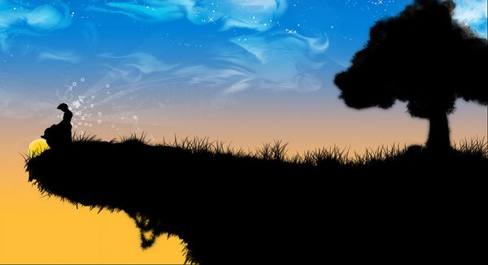
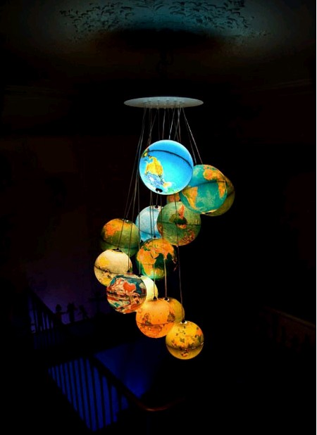

# ＜天璇＞光年是可独立的借光体

**人的痛苦，大抵上是来自于对自己无能的愤怒吧。总是在复杂的，纠正自己所谓的一些规则，最后没有体系的活着。也许我真的停留在某个十五岁的少年的步履情怀里，再也没有出来。最后你的背影只配合了我的一句“再见亦不知是何时”。心总是毫无缘故无法控制的沸腾。来自于十五岁的嘶吼，幼稚天真，存在于课堂上我给你传得纸条的字里行间。你所看到的和你未看到的，都在这沸腾之后的无尽的翻腾。** 

# 光年是可独立的借光体

## 文 / 周冰（北京人文大学）

 

后来的后来，我才渐渐地发现，你我都是被写在了人生边上的人物，而你是历史之外的男子。

——疯言疯语

 **【2:13】** 我还醒着。DIABLO还在缓慢运行着。而且，在想着一些不着边际的虚妄。黑夜必须拿来熟睡么？还是，惧怕黑暗的人，才需要一个亦真亦假的梦境作为一种柔软的保护体呢。手边的睡眠面膜从来都是醒着的时候用的。睡眠之于我，从来没有完整地被享受过。其实我是大事没有小事一般纠结一大堆。少女情怀总是“堆”。  **【2:19】** 我还醒着。距离七分钟以前，我更加真实地感受到了寒冷的意味。寒冷是怎样的呢？寒冷对于我，是传递了一个友好的微笑却掉在了地上；寒冷对于我，是热情打电话收到“嘟嘟嘟”的结尾；寒冷对于我，是一杯冷却的咖啡，汰渍印在雪白的咖啡杯上；寒冷对于我，是你大声地制止我对你怯懦地偷看。你从来不问爱意满满的心。你只负责上扬起冷漠的嘴角。  **【2:26】** 我确定自己还醒着。听静静的音乐。我在等待什么，我不好意思告诉自己，怕自己听见自己对自己说的话，羞红了脸。在这安静的夜，没有什么谎可以说。Setup -> Available -> Playble，是这么一个过程吗？为什么我们再也没有坐在图书馆里看书，为什么我们再也没有手拉着手去图书大厦，为什么我们再也没有在一个寒冷的雨夜站在亭子里争吵，为什么我们再也没有因为思想的分歧争得面红耳赤，为什么我们再也没有往对方的碗里不住地添菜而是默默地吃着自己眼前的饭菜，为什么你沉默了下来我也安静了下来。你从来不回答我的为什么。你总是在我哭泣的时候安静地看着报纸或者某本你挚爱的书，等我哭得累了倦了，带我去吃我最爱吃的火锅。你总是不制止我的哭泣，于是我的眼泪都是为你而流。最后也不过是羽化，不疯魔不成活。  **【2:35】** 我确定自己还醒着。对于这个世界，我已经无法发问了。无处发问。手边的牛奶凉了。音乐放到了JAY的《水手怕水》，很欢乐的一首歌曲，我的心情被迫无节操无下限起来。有时候，想想人生短短数十年，倘若走走停停，看一路忘一路，只是偶尔地驻足片刻闻花香，也是很美好的，不是么。心若居无定所，类似流浪。我所要追寻的，也不过是一些模糊的片影。残不成章。在路上，总是忘记要停下来，停下来，总是忘记在路上。人生处处充满了悖论。杂乱无章却又井然有序。对立的对面总是截然相反的吗？我们走一路，两边有的，仅仅是镜子吗？你无法发问，看不清道不明。你只有迎着朝阳或者披着夕阳。SETUP还在继续，PLAYABLY还未到来。  **【2:49】** 我被挂在了半梦半醒之间。总是想着，有一个历史之外的男子，拿着一本历史之外的书，一起生活在悬崖边，住在小木屋里。美好的童话故事大抵如此。每日一起看书喝茶，晒太阳暖洋洋，直到我们老的走也走不动。他带上我亲手为他织的围巾，我穿上第一次约会时他送我的红裙子，漫步在夕阳里，走向悬崖边。美好的童话是不是该配一个貌似残忍的结局才叫真正的凄凉美，才能深入到一个叫做心的地方。悲剧，就是将美好的事物撕碎给人看。你看了，是选择心有所想、有所向，还是无动于衷？你只会迷失于自己的世界，你只会溺于自己身边的水之中无力挣扎。  **【2:59】** 我被挂在了半梦半醒之间。你说的没错。你和我一个是白天的一个是黑夜的。你说的没错。记得以前的我，总是按时给你发天气预报，你总是回复我：“谢谢，晚安。”我的晚从来没有安过。现在你在做什么呢。半夜还保持开机状态么。还会接到像我这样不靠谱的人的午夜电话吗？过去的回忆，哪怕是一个微粒子我就彻底崩溃瓦解了。只想躲进虚妄的光芒里。我不许你唱情歌。  **【3:23】** 我呈现在虚假的梦境当中。我从未敢去试想一个根本不可能存在的旅程。正如现在。而我，却总是纠结其中。人的痛苦，大抵上是来自于对自己无能的愤怒吧。总是在复杂的，纠正自己所谓的一些规则，最后没有体系的活着。也许我真的停留在某个十五岁的少年的步履情怀里，再也没有出来。最后你的背影只配合了我的一句“再见亦不知是何时”。心总是毫无缘故无法控制的沸腾。来自于十五岁的嘶吼，幼稚天真，存在于课堂上我给你传得纸条的字里行间。你所看到的和你未看到的，都在这沸腾之后的无尽的翻腾。  **【3:33】** 我呈现在虚假的梦境当中。我只有把手伸向未知的书籍才能感受到一点残余般的温热。没有光合作用，植物是不能成长的，那么没有光亮的我们，又要如何去蒸腾？百年孤独一般地等待着，不过是为了一个PLAY键罢了。而，当真正的按下这个键又能如何呢？你的STOP键早已丢失了。所以，不管你是开心的，还是痛苦的，亦或者幸福的或悲惨的，你都停不下来了。这些的这些，那些的那些，交织在一起，纠缠和反被纠缠着。  **【17:37】** 故事早已告一段落。但是有心的人，总是能再续，殊不知，文能再续，情以无续。 我一个人就是一个星球。 

（采编：黄理罡；责编：黄理罡）

 
