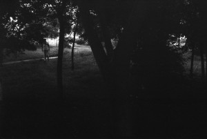
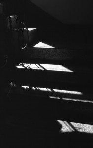
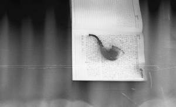
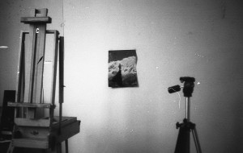

# ＜天璇＞八月随笔——孤独.畏与烦.爱

**书写的持续，显明意指我的孤独是为孤独，我并不能在孤独中持续的孤独，而书写正是将孤独消解，或称作：“带镣起舞。”我与孤独共舞，我持续的与他保持距离，他始终在我身边，我尽量不与其对视，可眼光总是咄咄相觑。是的，我是不愿与无法交流的人对视，那样的尴尬只会让我堕入阒暗无底的沼泽，我的良善迫使我不能保持自我的心智，我的良善恰恰是我的懦弱，所以当我与无关的人对视，对话，我只好天然的讨好似的顺着他的龌龊一步步迈入我的龌龊，溅一身泥，靠着文学的水默默清洗，这样的比喻我只好用用，因为我的笨拙，我的懦弱，我的健忘，我如此痴痴的僵硬的躲避这些无关的人与事，而我的得意并不是自喜，这是唯一庆幸的事情，我仅仅只因为保持或越发的清静而远离无关的人。 **  

# 八月随笔——孤独.畏与烦.爱

## 文/郑皓中(中央美术学院）

 

五月的风让我品尝到人生之沸腾，信马由缰的趟过人生的绝点，磕绊中为自己的执念划上了一颗诀别的念想。 

五月份喝过几场酒，闯入了自设的雷区，跌撞着看似无可奈何，实则为自己开脱，开拓了一块荒诞的物性。 

我之将至，我的爱人。我竟会惭愧于我未曾谋面的你，而心照不宣的自我，一分博大的骄傲变成了然于胸的自信，催逼着自己，度过了漫长的钟点。是的，有谁能够读懂我之意，非浅非深。 

我之将至，我的爱人。我也深明着华服之小丑，终究是无戏的悲哀，可是我的诚恳却始而渐入这份爱的佳境。 而旁人以无终了之意，于你于我，是这样的情与意，非义。 

我之将至，我的爱人。我可是会无过于心的狡猾，长此以往的孤独，唆使我于你一份真爱。 

我之将至，我的爱人。我的无争无味的爱，将永不长眠，永远的诀别。 

我算是一个孤僻的人。为什么会用算是呢，因为我的孤独并不只是癖好。癖好是一种执意并且违背常态的举止，而我的孤独仅仅止于独处的需求，有独处的需要，也会有交往的渴求。这是出于自私的注解，现实往往是因为不得已才自私自处。人与人的照面多数不存在交流，对话仅仅是各说各言，自己的见解说出去，像是撞上了墙壁，墙壁上的白灰蹭了一身，知己仅仅是一个你喜爱的对象，你的语他愿意倾听，你也甘愿倾听他的言。自说自话是一种高贵的品质，高贵即是大善，自言即是修行。夜晚自己躲在斗室，安静的自言，这一堆堆的字积累着，当我深感寂寞无助之时，我就会把他们扔出去，漫无目的地扔出去，心里自忖着一丝炫耀，可因为无目的，往往与自忖相悖，失落变成一股嚣张的怪力，也罢，暗自绷着仇恨，装的和潇洒差不多，心里想着，随他去吧。 

我所纠结的即是自己的炫耀，原本是自言自语罢了，却是含着这些个炫耀，拖累了自己，字无辜的充当了消解寂寞的戏子，可悲的自己往往可恨。 

我曾说过“绝而后望”在绝望这片沼泽里，我的虚荣也会旋即坦荡着，骗着自己，向后望吧，望着兴许会有新的愿景，实则在望之初这个多情的想法已经准备好了，所以，我的孤僻仅仅是算是。我并不是像自己所敬佩的人那样独自面对孤独，享受孤独，笃定的闲庭漫步，超凡脱俗，对于功绩与名利仅只笑笑淡泊，而我的孤独是出于慌张吧，不是享受寂静中的禅定，只是独自面对慌张，我也说过，在文章中引用旁人的见解来证实自己的言，像极了自己势单力薄，只好叫上些大佬为自己充充场面，好看，却不见真言。 

舍勒说人的意向性情感源自畏与烦，这倒是有见解的，恐惧与抑郁是阻碍人生出智慧的，佛法讲戒定慧，因戒而生定自出智慧，我的慌张便是在自言自语中偶尔生出一点定的举，兴许会出一点点的智慧吧，智慧与聪明的不同在于智慧是见解，而聪明是讨巧的，见到触碰到了真理，而无法解。 

人有原罪真的要因人而异，而且原罪也未尝不是一种动力，原罪驱使人向真理接近，人的精神欠负是来自身体，不平衡的欠负就会生出畏与烦，而欠负也许永远会伴随人的一生，那么之前提到身体与身位的关系，有信仰的人会对身位有体会，而肯定自己的人性独自面对人的恶时，那样的畏与烦让尼采与其信徒的超人观念面临尴尬，人性的自私无疑是现实的，而身位的替代的确会让人活在一个自我构筑的幻境里，而现实的畏与烦难道就不是我们自身构筑的幻境吗？ 

我守着自己苍老的灵魂 

在欲望的出口与入口暗暗自忖 

我的幻境与现实 

终究是迷  **7.30** 

孤独，孤独，孤独用享受和躲避来修饰都不真实，有谁可以说自己在享受或者躲避孤独，我的意思是指孤独并不能也不会用来享受和躲避。孤独和寂静的区别在于人的愿念，当人自愿选择孤独，那么这时处在寂静的状态，假使被迫选择了孤独，去躲避，孤独只会贴的更近，孤独就是你的影子，你的身与心被孤独占据。 

我已经习惯孤独，在与孤独相伴的绝大多数日子里，我试图与其和谐相处，相濡以沫。在清晰的梦里我才能与孤独分开，梦里的时间很短也极长，我们的生命即是梦幻，空里隐含的实相，而实相恰恰是附着空，而我在虚与实，实与空里颠颠倒倒，沉迷的并不是自心，而是我的言语我的表象，只有我自己才能看清楚自己的自心，我不相信你们的言语，可是我愿意倾听，赞赏，可是我并不相信。 

沉甸甸的文字，形成体系，系统，用着繁琐的语言，表达自己的醍醐。而我更愿意直接将醍醐扔出去，短短的，足以见效。 

我与自己对话，自言自语言语的禅修，我与自己对话，我的自己之所以是我的因为我有很多不同的我。 

坚定，我不喜欢坚定，坚强，我也不欢喜，铁石心肠的人往往坚定，善良的人多变柔软。 

今天读到舍勒说起“悲剧的罪”。似懂非懂的体会到了一些密乘中疯行瑜伽士的意思。这样的罪并没有直接悖于道德与法律的要求，可是又不属于良善的范畴，那么这样悲剧的罪接近尼采的超人，接近自我价值强大的人性，可是悲剧的罪又会拥有神的身位吗？ 

一个拥有智慧的人口无遮拦便是可喜可敬的佳事。 

在你高估自己的同时恰恰也高估了别人。 

我谈自己我谈我，我叙述自己的心性，我尊重自己。 

眼睁睁看透人的思想，惨不忍睹。 

观空，持续的观空，需要真诚。 

我所纠结的是：做，出现，沉寂还是展示？展示即是需求大的实，实过后继续空，看明白会更纠结。 

存在即有罪，空无罪无功，看来功绩不像罪是与生俱来，所以罪是趋向空的动力，而功绩才会是障碍。  **7.31** 

罪，现实中的律法触犯即构成罪，道德的准则相悖即可构成罪，宗教中则提到原罪，人在罪即在。罪不仅仅是构成身体惩罚的结果，罪在人的心中，在人恼怒，畏惧，厌烦，愧疚，忏悔时罪即可生成。当人有意识之时，罪已在心中。 

宗教中均有忏悔这门修行和所谓清净的方式。罪孽正是人的内心生出变换的根源，忏悔正是消解或转换罪的方式。 

罪是人类文明前进之动力，罪产生的初动力（与欲望不同）使得人去消解替换的同时制造更快捷既得的产品。罪产生了尴尬的心理，罪会使人认识到自身的狭隘，而光明仅仅在最后我尽头，人生绝大多数在罪孽中度过，梦境也是排解罪孽的方式。 

罪并不可怕，罪是人的影子，没有影子的人，宗教的真神。罪的彻底灭亡有两种方式自戕和成道。 

宗教中提到身体与身位的关系，是替代罪的概念便捷法门。观想自己即是神，而内心感恩众生与真神，谦卑中生出真阳，罪会一点点减轻。 

忘我即是忘掉罪孽。 

罪是负担，我是负担，可是当人习惯黑暗是，快捷的光明难免刺眼。 

罪，我的挚友，谢谢你。 

 **8.1** 

近几日颇充实，时间被自己的琐碎填满，好在琐碎的多数源自我的乐意。每日抽出时间零散书写，或称做“自语”，又能兼顾着绘画与摄影，想想该是见令人愉悦的事了，可是我总会贪恋悲情，深陷在绝望里，犹如一只陷入泥潭的囧兽，在双腿僵住之际，贪恋的张开手欣赏着头顶晴朗绝然的蓝天。 

人最大的悲哀是蒙在鼓里，而颓丧便是清醒的看着自己踏入迷途旋即顿悟再接闯祸仍旧清明。 

美是怎样的感受，我认为美是一种快感，持久的快感与短暂的快感都脱不了美的干系，快感不是速度的感受，而是快乐愉悦之感，哪怕是一瞬因为像而产生快感便是因为美，快感虽不是速度的感受亦不仅仅停滞与愉悦之感，还包括忧伤与虐感。美的快感正是来自我们所心的根源缺口的弥补。美源自像，无像何来美，形式中的无像本身仍然是像。如无意识状态已然是在有意识下的无意识，又譬如在禅修中观空实则是大实所为。 

呈现艺术的本身该是怎样的作为，呈现是用着一堆堆的有来换取有呢？还是无所换取，即便是无的对待，其实文学的本体即是自言，自言的自不仅仅是一个狭隘的自身，而是自性，自性便包含了我们人类的全部，艺术在福楼拜的那句名言中“呈现艺术，退隐艺术家”说出之时，也许就已经道出了呈现与回应之间的关系了吧。 

胡兰成言文学家在谪居中写出了伟大作品，而在亡命的途中多出现革命家，可见绝望中求光明才能绽放出雄浑的卓越，实则是在罪中的不屈。 

我所敬爱的先生，正是因敬爱之极，才会始终迟迟不谈，我会觉惭愧，耻于谈。  **8.2** 

爱之生来自欲，欲念指占有。爱是贪回报的，即便是没有物的报答，实则在自我的潜意识下暗示回报了善果。爱的支撑是回报，两边的平衡正是合适的因缘。爱生恨的佐证，因为爱并不纯然是无私与给予。 

纠缠的爱虚妄痛苦，实则享受痛苦，痛苦成为享乐的替代，在看似窘困的处境中，双方暗含着对于快感的执着，期待的念想正是促成所谓失爱后的执念，执念在过后的境域中代替了爱，称之为“爱的错觉”。 

爱的可贵因其真诚，一股真阳之气，喷薄的明明白白，胸臆朗然。爱的忘我与无私实则为责任，责任是义务，与爱无关。 

无定数的爱游荡在虚空中，爱神的箭矢怀揣着真情悄然撩拨人的情愫，人因爱的慌乱竟收获爱的充盈。荡然于胸的真气，支持的人在绝望中昂首阔步，忘记终点的虚无。 

无爱便无恨。爱与恨何止紧邻，恰似兄妹，此起彼伏。爱为虚，恨为实，虚实中间无空无寂静无涅槃，静止的皆为梦想，所以心经有言：“颠倒梦想”。 

爱，请相信真爱。相信空的，忘记实相。实相是真实，可真实与空相并存，也就无所谓真实，如同在梦中的梦中是真实，还是现实的现实是真实，身心在此处，此处即是真实，心存真爱的确是有福报的善果。  **8.3** 

该当言诉我的欲。我的欲念大，如漫天雪花，铺铺陈陈，忽的随风之唆使狂暴无情，忽的因其自知缓缓坠下，雪花便是我琐碎的爱，若只坠入一片极地，仅仅的这一片，我的欲会因无休止的生发，坠落，泛滥。好在，幸而，有我的真诚，携着欲念，包裹着爱意，漫山遍野，充盈着我的爱，我的欲，我无休止的真情。 

爱单一个字，一种义，却承担了诸如责任，道德，坚韧，博大，永远。负债累累的爱，只因为嫉妒。 

艺术有韵有律，西方名节奏，节奏也有休止符，如东方之留白，兰成先生言东方之理不仅仅如西人那般的物理与数理，中国暗藏天理，人心知天理，明天数，艺术的韵律才是其自性。 

嫉妒，去看培根，这是木心先生的教言。嫉妒去看看自然，我的开导。 

意识流与文艺在如今变成了一个浅显的符号，随口套用文艺与意识流当真是在造孽。 

人的占有在睁眼恍然初生的一秒过后便开始狰狞。 

诸位言你像某某，实则是诸位在应着心中的某某扣在你的头上，好让诸位的尴尬与慌乱稍稍平息。 

参透后的清明可不是所谓彻悟后的无欲无求，因心中怀有仁慈与良善，世间的荒诞与谵妄该如何睁眼看下去。只好是孤僻，孤独。可是诸位，你看不到自己欣喜的得意后那刻冷漠的心吗。我的修辞止于文艺腔。 

图像的命理，我用性命去扶乩。  **8.4** 

夏末，天空开了眼，云彩也开始疲于奔命。我孤坐于斗室，心里总算是难得的无奈了，若说不甘，还是有的，不过心中的欲念淡了些，那不甘的心也就貌似凝芷了。 

是的，我的倾诉总归离不开爱与孤独，我自设了一个陷阱，心甘情愿的在其中徘徊，徐徐的行进，陷阱里的黑暗被外围的光静怡多了。 

假如我始终的沉湎与黑暗也好，实则我自己的不定性也会蓦地欣喜起光明，黑暗与光明我总在两个极点徘徊，我了解自己会在暴露于光明时旋即逃离，可是身在黑暗的自心倒也想去嫁祸光明，我的纠结便是无休止的。我的下场也会负伤，自损。  **8.5** 

我的跌宕起伏，涵着大义。 

头脑里的空，因为被虚无填满了，假如心生欢喜，持续的渐进生出大乐，空的虚无是否形成了觉悟？人的七情六欲，被人的性描摹的栩栩如生，栩栩如死。女性与男性的不同在于坚韧，女性得到坚韧便焕发出真阳，自上而下的通透，羡慕人，可我的羡慕仅仅止于修辞。 

我曾经厌恶夏季，因其猛烈无顾忌，且使人的性征暴露，人与人的性征相遇，因为我本性的虚荣，竟是换来了尴尬，可是我的贪得无厌，幸好会因为羞怯止步。 

我是从心底里羡慕知识的极大拥有者，那些真正的尊者，把知与识分开觉悟，那一份大大的觉，当真越过了人的寂寞。 

摘抄一段昨日写于纸上的文作别今日的随笔： 

五月的风让我品尝到人生之沸腾，信马由缰的趟过人生的绝点，磕绊中为自己的执念划上了一颗诀别的念想。 

五月份喝过几场酒，闯入了自设的雷区，跌撞着看似无可奈何，实则为自己开脱，开拓了一块荒诞的物性。 

我之将至，我的爱人。我竟会惭愧于我未曾谋面的你，而心照不宣的自我，一分博大的骄傲变成了然于胸的自信，催逼着自己，度过了漫长的钟点。是的，有谁能够读懂我之意，非浅非深。 

我之将至，我的爱人。我也深明着华服之小丑，终究是无戏的悲哀，可是我的诚恳却始而渐入这份爱的佳境。而旁人以无终了之意，于你于我，是这样的情与意，非义。 

我之将至，我的爱人。我可是会无过于心的狡猾，长此以往的孤独，唆使我于你一份真爱。 

我之将至，我的爱人。我的无争无味的爱，将永不长眠，永远的诀别。 

文字与书写，是一份虔诚，担当起虔诚的字即该挡着敬意。 

木心先生的绝别之际。横卧于病榻，说出：“文字在于玩笑，文字在于痛苦，文字在于悲伤。”这份对艺术的担当，就如同密乘中修行者最大的担当便是在死亡之际的担当。先生确是大彻大悟的人。 

摄影者所选的视角，即是当下的感知，影像的当下意义是捕捉其空性，这样矛盾似的捕捉便是摄影本身的意义。 

虚拟的网络恰恰给人拥抱真实的可能，以上的公案可说本无实相。  **8.6** 

《画者肖像》已发布  **8.7** 

书写的持续，显明意指我的孤独是为孤独，我并不能在孤独中持续地孤独，而书写正是将孤独消解，或称作：“带镣起舞。”我与孤独共舞，我持续的与他保持距离，他始终在我身边，我尽量不与其对视，可眼光总是咄咄相觑。是的，我是不愿与无法交流的人对视，那样的尴尬只会让我堕入阒暗无底的沼泽，我的良善迫使我不能保持自我的心智，我的良善恰恰是我的懦弱，所以当我与无关的人对视，对话，我只好天然的讨好似的顺着他的龌龊一步步迈入我的龌龊，溅一身泥，靠着文学的水默默清洗，这样的比喻我只好用用，因为我的笨拙，我的懦弱，我的健忘，我如此痴痴的僵硬的躲避这些无关的人与事，而我的得意并不是自喜，这是唯一庆幸的事情，我仅仅只因为保持或越发的清静而远离无关的人。 

方才火机呯的一声阻止了我的恓惶，呯的一声仿佛开了新天地，进入嘉年华。我凝视窗外，暂时的清净令我自喜，由远及近的车轮声徐徐的行进，间奏的喇叭，极小的声音陪着流水的鸣奏，还有更远处敲打建筑物的回音，这便是我耳蜗之全部。我的目及之处，傍晚的日暮没有火气，一派温柔的情谊静静泼洒在楼宇的肩膀，斜下的蓝色光影只是斜着，斜着。 

正如之前呯的一声开了我的新天地，再一次的方才我因为手机的催逼打断了自我构建的天地，我尝试这样书写自己的所谓清净，便可揭示我的无知，我的脆弱，我的杌痴。 

暮色的光在我书写自己的杌痴之时，抬头之际悄然的，许是于他是终于，消散，暮色逐渐无色，光的垂危，夜的告白。自然的挣扎被人的有情荒芜，自然的安逸使人肤浅烂漫。 

自然是生，自然又是死，自然是所有的一切，当一切静止亦是自然。而人的生仅只是生或死，人的死也仅只是生或死，人是所有一切的无而不是一切。 

我要燃一支纸烟陪同这夜一起降临，纸烟与我一起是欢快的，他的消亡之烟气并不会如他者猛力的吸入自己的肺部再顺直吐出，连同自己的悲喜一起吐出，而我的纸烟之烟气是生的气，他在我嘴里停留，再悠然出自鼻孔，化为氤氲，消散，殆尽，自身自灭。 

暮色现出惨烈的红，是在挣扎，是挽别，是不情愿，是不甘，是自然。暮与云交织在一起，想在临死之际拖下自己白天的挚友，殊不知自己的惘然。 

夜迟迟的不愿降临，正如我卑劣的拟人，用尽气力也摆脱不掉他的修辞，我的纸烟，我的朋友已燃熄，夜仍不来。 

再一次被人的问候打断，开门的时候，我迈出户外，抬头望向落日，原来并不如我所想的那般惨烈，落日阆阆开阔，而之前的残阳是我的臆测，我的心思。踅回斗室取相机把落日的景致掠夺，路人顿足乜斜我之异举，而我的羞恼形成固体，象尊诡异的雕像，径直返回斗室，我的背后是他的目光，目光又是我的揣测。 

屏幕亮的刺眼，夜当真是该来了，我期待夜，因为自己的痴騃，我的诚悫。 

夜仍迟迟不来，在最后的末端悬着，斗室的夜来了，窗外的夜未至，而我的催逼撺掇我的耐心，如同我的计划，永远的在变化，而我的不变目前看来即是我的生，我的诚悫。 

我不等夜，我将踏入夜里，与他一起濯黒，与他一起变为夜的全部，而我所有的情愫，我的揣测，我的畏与烦，连同这拟人的夜空一起荒芜。 

 **8．8** 

与顾盼为友，损友。与期许为妻，休之。与怀疑相伴，阒静。与我的全部孤独谓之安宁，我的欲念，我的懦弱，我的我之主语与我原本身体的自己，而我的身位，我的精神逃遁到一片无望无边的境地。 

又同昨天同样的期许夜之来临，衔着烟斗，期待着我的欲念早些到来，我的宁静因为欲念完全搅乱，缘由是一部相机，我想得到，历经波折总算买的，而在路途上，并未抵达我的手中，我的期盼就是我的恓惶之由。我深知在到来之时所有的快感终将换为乌有，而剩下的相伴才是我与这步相机能否终成的期许，旧的期许终结，新的期许到来，若没有期许，生活便是死寂。 

我从风中来，裹着犹太人的葬礼，带来马太福音之书之术。 

我从土中来，携永生之困苦，兀自躲避于太乙山之寂处。 

我从火里得永生，因为纪德之自由，我坐在木心先生的门前，看宇宙之缘起。 

我在我将要去的终点，环顾四周，并无一处是我的爱，我的恨。 

我终究回到死里，因为生并不是我的所在，而永生正是死之全部。 

我在夜里，我拥抱着黑色的云朵，因为无知的人从不会向远处更黑的方向探求真理。 

我在我所构筑的房间，轻声的歌唱，我的喉轮便是你所谓的净土。 

我的我的我之所有的一切，因为这一刻的时光终止灭亡。  **8.9** 

今天写写见闻，读梁实秋先生文章，似丰子恺先生的画，含雅趣，这样的文字是难遇的，因为要拥有深厚的底蕴，自己把沉甸甸的底抛去，因为性情中的诚悫，剩下的蕴与韵真难得。想起阿城先生的文章似绝伦的白描，朴素大气，封顶。参透生死的人才能有如此的智慧。 

文章中含着体会，携见识书成文，不见的必须有学识，可是一旦有学识却又能再生活中体会五味杂陈再形成文，尤为难得。 

再读陈巨来先生的《安持人物琐忆》开篇即讲到大清国末期的皇族后裔傅儒先生，先引出傅儒先生的来历意指其的底蕴，并无半点虚意，而傅儒先生的为人，书画皆为极品，其真率，担当起悫士之称，我是有雄心的人，当看到令我望尘莫及之人，自己的羞惭，当真的寡薄。 

昨日因家中琐事搅乱了计划，身陷绝望的境地，惶惶不可终日，我便想起了木心先生写的《同车人的啜泣》，自己的卑劣再次升起，竟然在惶惶然中暗自惊喜，惊喜自己的联想，当然因先生的文，是我的朝三暮四。 

他在情感之沼泽中打滚，常沾沾自喜于自己的痴騃，而所谓的伤痛不过是强化快乐的种子，而他的喜乐仅仅源自庆幸。  **8.10** 

适才在网络上读到一则留言：“有节制的思考比无度的展示有益。” 

我如此时间每日的书写累计成习气，暂且并未转入任务的牢狱，我这般的书写是否就如上述所言为“无度的展示。”我看似与寂寞为伍，书写着自己的所感，实则是假定了一位读者，也就如我之前所言的并不是能够耐住寂寞才去书写，而恰恰相悖，我正因打发寂寞才如此选择在这个荒芜人际的时刻与地点来消解这一天的寂寞，我的心在此刻是愉悦的，即便是我的暂且称为文的要义中传达出悲凉的意境，其实当时我的心之本位是愉悦的，假如我在沮丧中，当真沮丧，我是无法坐在此处书写我的沮丧，那么，可以这样的阐释，我之孤独与寂寞之境地自享，我之所谓自言之荒诞，我之悲伤与凄凉实则是在愉悦的欲念。在此刻之前的大段光阴，我持续的读，持续的忘怀，实则在真正的孤独里暗自沉默，而此刻才是我的自喜，我的大乐。 

深意里其实是反义，譬如我刚刚所言，我的书写在传达悲意，其实是快感之愉悦在支持我的悲意抒发，再如我的寂寞自语，实际是在自我假定的读者面前愉悦的阐述我的自喜，这里再一次印证的悲与喜，虚与实这样的所谓对意，实际是在相和谐之时才会产生自然的光，艺术便是在这样的对义中生出反义进而传达持续的光芒，熠耀众生，可以解释为什么人在看似沉迷所谓痛苦与悲凉如此痴迷渐进，实在是因为在痛苦与悲凉的反义里装着愉悦，这就与阿城先生之前所说有些人在诉说痛苦，其实在享受，我们别打断他。 

我又联想到阿城先生说的中国画是一个审丑的系统（对应审美），的确，我们的水墨画多会有这样的孤寂与悲凉，与西人的油彩之繁盛堂皇完全不同，我们的寥寥几笔，寡淡，枯枝，艰涩，曲中见直。而西人的造型追求浑圆，体量，力与美，理性之光彩，而我们遵从天意，天理，而且有示天地不仁。 

木心先生所言极是，人在沮丧里只有沮丧（大意如此，望先生赎罪）。可见在阴郁与快乐这个两极单一的沉迷都是一种沮丧。那么从此来看孤独与寂寞这样的心境是否是假象，而唯有人在沮丧的时刻才是人的实体（身体）的回归？  **8.11** 

前幾日總有些許瑣事，之前所說的書寫的習氣就彼已斷了。此接彼處書寫的舊習，當是寫何如，目下只有疲憊的手，困乏的心與虧空的胃了。我想起之前一位在西藏修行多年的出家人，他剛去西藏的時候，自己所處的地域是極偏僻的，能夠果腹便是理想，他每日臥於院落，不念經，不禪修，僅只望著根根煙筒，看哪家出煙就奔向那處，日後他的經文到沒有念的怎樣出神，卻練就了單看煙的濃淡顏色就能了知這家人的伙食。可見修行與欲念之間的關係錯綜。 

寫完上述零星字數，我就奔回家中果腹，雖不致饕餮，比前幾日的節食也能稱作暴食了。文字的書寫就會有窘迫的時候，比如有些事情不能夠直接書寫，畢竟是成文的字，隨口甩出去的糟粕總礙於面子難以書寫，只好我在心裡，人與人之間的交流是重要的，木心先生曾說因為文化我們會有相遇后淡淡的窘，幽幽的尷尬，和微微的不堪（大致是這意思），假如沒有文化，僅只剩下爭鬥了，文化一詞是新文化運動時直接從日本扒下來的，在我們這邊把文化等同於知識了，其實文化和知識無直接關係，文化的意思是文的概念都融化的骨子裡，所對應的武就是爭鬥，是野蠻。 

可文會與武轉化，就在尷尬與不堪走入絕境時，一股厲氣，升起來，好在好在有文，總會消散的，所以中國人的智慧在於避免傷害，有大局觀，我在這方面用西人的數理來比喻，是負數。 

摘抄一段昨日的詩，很久沒有這樣噴薄出的文字裡。 

我的土地里埋藏了無盡的黃

夏季草兒上白馬輕輕跳著自謐的舞步

春無憂似的樹木開始了自我的生髮

秋季貯藏了我隱匿在原野的愛意

冬天的朔風看似無情實則偉大無畏

我多愛你

摯愛的人

我多愛你

河水中之肥皂

我多愛你

把鋤頭壓彎了的小草

你聽啊

風已經把憂慮吹向了遠方

而我的憂慮隨著你

愈來愈清

愈來愈晰

我將輕歎我之愛情

 **8.14** 

今天閱讀了紀德先生的《窄門》，我每每閱讀紀德先生的文字，便感到自身被文字閱讀，文中提到了宗教倫理之間的衝突，紀德先生持續關注的命題。而我再此處只想談談愛情，愛情與倫理之間的尷尬。 

愛情是不純粹的，可是愛情中的熱忱是可貴的，寫到這裡我如鯁在喉，停止吧，讓我在書裡重新思考，再敘。 

我該如何談論愛情，因為愛情在我的處境中只剩下憂慮，我的憂慮來自相思，而我能看到等待我的是無望，所以我的絕望就在我身邊。  **8.15** 

接连有三日为书写笔记，之所以称之为笔记，首要因其用笔来书写，而如今用键盘敲打着，恍若钢琴手，笔记成了复古，成了一桩奢侈多情的琐闻了。 

沉湎于摄影，岂止荒废，停止了钟爱的书写，我，当真不后悔，只留下了颓唐与恓惶，恐时常的伴随我，因为时常，所以总会忘记他的存在。我所期待的禄来35这部机器总算到来，持续兴奋再由生理疲乏这样的借口，总算免去了累日的书写，可是报应，果真是报应，禄来35竟来了病故，他的身体之快门发生病变，我的执拗，斑斑累累，不可平复，径直在这条执着的意气上横行，而之前持续的书写，一再停滞，倒回在初点至荒废。 

另有我的一部老苏俄机器，我之前在《四月随笔》中提到的那部古朴典雅的相机便是尊驾，他的来临破费周折，因为我的寡薄，又不通外文，导致此机器转至青岛停留，另需缴纳于我而言多余的赋税，慌乎，呜呼，总算煎熬的回到我的斗室，可是，可怕的劳烦的可是，我总共有三卷胶片，三卷满满荡荡的心思与期盼毁在他的 可憎的卷片器上，当然是我的罪过，我的莽撞，我的一厢情愿。 

面对再一次的当场作废，如此的沮丧，这原本一张张的有变成了虚无的曝光了的黑色。 也罢，即便是有，该有如何，无非是功，胜，得，一片嘈杂喧哗，而无呢，放眼去看，终归是无，况且，世界，宇宙皆无中生有，而我们的愿望到底又是悲哀罢了，这便是真相，真就是空，就是一览无余的荒废啊。 

图生相，相是图之实相，是万物的成与毁，生与息的律与韵，而我的像却是心中的虚妄。 

望远处看，我们的功绩是不可靠的，再望远处看，我们的罪也并不成立，我们之所以为我们，仅只是因我们为生，而死的生，所谓生之墓园，死亡生赋，起于人的贪婪，那么我们的健硕，无畏的生着，这便是我们的全部，我们的所有。 

是这样的，并不因悲观，我们的艺术，我们的摄影，我们的绘画与科技以及音乐，不过令情绪更快捷或记录，顶多称为预言或寓言。好吧，您的预言又只是该发生的悲观，由此看结局无所谓功与过，因为无望，你的所有一切，皆不成立。 

以上来自昨日酬酢后的酲言。  **8.18** 

我不得不言说，当我还有余兴（并没有彻底沮丧之时），我已经无法随时提起笔，或该这样说，我无法把我的全部欲念供给绘画，我的涣散来自于本我对绘画在技艺上的片面沮丧，我的所有展示，所有执念上的追逐，都因为“无用”，因为“绝望”而止住，可我又是“生”着的，所以“止”并不能在绝望中停滞，而当欲念升腾时，我再一次的执笔，并不能持续，再一次涣散成书写，摄影，绘画。他们每一阶段的止，全因我内心对于“无用”的思辨而懈怠。我的欲念并不是持续行进，而止于“无用”也当真是不可逆的。我只好如同观电影的“者”，渐渐冷眼于自己的行为。 

再一次揭穿自己，其实强调“无用”时，自己已然对“书写”，“摄影”，“绘画”觊觎了“有为”，而“失望”正是因为在“有为”上收到了谴责。是啊，我是在用这些“有为”换得价值，我“生”的价值，我的自私，我的刻薄，来自于我以目的的价值上带镣起舞，这副虚荣的手铐是我亲手佩戴，而我的舞也将永不安宁，永无休日。 

我是一个自私的人，阴郁的人，悲观的人，可我的不屈，我的执拗，我对“真”的热爱，让我变得良善，自由。因为欲念，我贪图虚荣，如同我写下的所有，并不该是呈现于众，而我的虚荣令我无法安奈，所以用我仅有的，我全部的“真”，换来喧哗。可是诸位，我终究会离开这虚荣构建的华囿，继续自私，阴郁，悲观，自由。 

于我而言，唯一不能书写的便是爱情，所以我的爱用像来表达。 

我眼睁睁凝视窗前的针株日渐枯黄，却始终没有零落，这像极了我的生命，我的全部欲念。 

 **8.20** 

这次的书写之前我已在行走中，吃饭时，想着该怎样开始这几日终结了的随笔，先是想到用“近几日未书写源自一场酬酢”，又想到“耽搁了每日的书写，愧疚的心......”，看来这累日的书写已然成为一种义务或负担。 

在我打开本子，面对屏幕或纸张时，我的心里会因为前几日未书写的愧疚而惆怅，这份承担书写的纸张变成了一位旧友，终日立在身旁，挂念着我，不可宁日。 

是的，这几日的书写终结于一场酬酢。前日傍晚，我没有如约坐在斗室，打开笔记本里的文档，会面旧友，而是挣脱似的奔出了门，仿佛逃离牢笼的困兽。我用一场大酒浇灌心里的爱与恨，用酩酊酲然做戏是的忘记所有的伤与愁。一夜过去，清晨的宿醉使我全身酸痛，头也懵懵然，轻轻摇晃，脑中像有块铁球撞得四壁生疼。我是不堪忍受连日无法画画，所有酿造了摄影，哪想到因为相机的劣质，连续失去难得的图像，而书写又因为绘画与摄影的持续糟糕终于凝芷，这悲与喜的导管，堵塞了悲，又流不过喜，木心先生言“将面临疯癫”，所以我想用这场更劣质的酒将导管里的悲与喜冲走，冲垮，冲飞。 

宿醉的上午，下起了久久止在天际的雨，又是前几日夜晚的雷声，狂暴肆意，可雨仍旧未下，我猜想天的导管也堵住了吧，我与天同时酩酊，一起宿醉。 

空空如也的头脑与身子，总得需要欲念来填补，“我的情欲大 纷纷飘下”，来自木心先生的诗，而我大的出奇的欲念是物质，不是情欲，我决意要买一台相机，相机中的贵族“莱卡”。 

这个堂皇的品牌因为布列松先生与其狂热，痴迷的追随者愈加堂皇，愈加奢侈，好在实至名归，当我的胶片与情感多次因为相机的劣质毁于一旦，更让我下定决心，满足这个颇大的欲念。 

经过网络上的调研，寻得我心仪的“莱卡”——M5先生。 

为引出他的真身真意，该粗略概述莱卡M系列的历史，莱卡最堂皇的M系列从M1直到数码M9，我们只谈胶片，M系列止于Mp，莱卡的辉煌字M3开始绽放异彩，M4又延续其经典，并无多少进展，莱卡机身古典，悫素，性能卓越，令使用者踏实无忧，可经典往往易使人固化，而绝大多数莱卡的使用者同样固执，莱卡公司决定推出他们准备已久一款超越经典的机器-M5，可是结果令莱卡失望，仅仅生产了三万多台，险些破产，不得以莱卡公司继续生产M4和延续M3的经典，而M5这款莱卡寄予厚望，深思熟虑的机器如同夭折的怪婴，在众人的冷眼中默默隐匿，可是时间是冲淡一切也是证明一切的过失，时隔四十年M5逐渐绽放光彩，可是在大多数莱卡人眼中他仍然被排挤在边缘，独自悲壮。 

M5的机身比其他M系列机器要大一点，机顶用料考究厚实，而且机身性能卓越，他把自己的才华隐匿在结实的身体中沉默不语，可当他一开口，便语惊四座，正是因为这隐忍的个性，才会让那些眼见为实的人口无遮拦，当我了解到M5先生隐忍之性格，诚悫之品格，卓越之性能，我深感相惜，在这个被称作“悲剧英雄”的机器里我生出恻隐之情，我甘愿俯首，甘愿并驾。 

可是，再多的热情终归要消退，而真的常理隐于大道，与M5携手，动力与压力也是齐驱。 

窗外的雨停了，秋意亦至，风有了萧萧的味道，凉意煞着肌肤，感到秋天肃杀之气，因为这过去的夏季，这阴霾的天空，更因这秋意的突袭而感怀，仿佛我活到如今的时节之前每个秋季都是这样伤愁，我闻着凉谧的空气，想到高中时在学校的小卖店，也因秋之突袭，我并未添置厚服，独自快步徘徊于店铺等待开门，又想到初中时在秋天夭折了的爱情，我继而看到自己为了一台M5伤愁，窘迫，如愿，欲满。我想我的今后更会是如秋一般的悲凉吧。 

生于秋天的我，一身戾气，当真是因为良善才会满怀着“生”的欲念，而自己的悲意出自读透了“真”，也看明白自己的劣迹，自己的恶，又在这个悲凉的初秋，我的一位学生离开了画室，前几日便说要走，迟迟未来取画具，看着孤零零的画具，心里颇感荒芜，而如今总算在不愿的期盼中来了，面对分离，人都是无措的，在下楼梯的一瞬，我觑看她的脸，他赤红的双眼憋住哭泣，我的心竟然畅怀，我想到我们在这个悲凉的世界里，正是因为感动才会让我们“生”的欲念大于“死”的究竟吧。 

可这些感动又会随着时间所剩无几，这才是最终悲凉，永恒的真理。  

(采编：何凌昊；责编：何凌昊）

 
