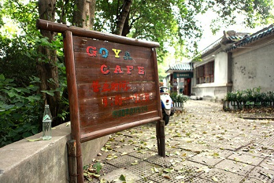
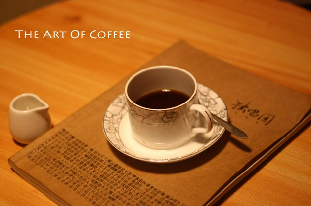
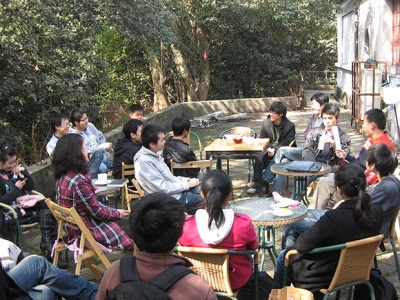

# ＜天璇＞关于戈雅的记忆

**编者按：** **戈雅咖啡是武汉大学狮子山樱花城堡上的一家咖啡厅，零八年开始营业，因为消防隐患原因（戈雅位属于老斋舍全国文物重点保护单位之内）于2012年2月18日终止营业。戈雅咖啡曾是诸多武大校园沙龙的活动地，本文作者所参加的为武汉北斗沙龙。** 

 **戈雅里开着暖气，昏暗的台灯光亮，棕色的木质柜台和墙壁，软软的沙发上没有几个客人，整个咖啡厅里烘托着那种特别朦胧而温暖而祥静的氛围，这是我关于戈雅最初的印象。** **自从出国之后，我已经有很久没有再认识那么好的朋友，很久没有好好的看一本书，很久没有和一个合拍的人懒洋洋地聊上一个下午的天了。我总是时不时地在深夜里忽然发觉到内心深处某一片情感区域的支离破碎，那些东西，我曾经在戈雅找到过。** **谢谢，戈雅。再见。**  

# 关于戈雅的记忆

## 文/榕晨（武汉大学）

 

在戈雅咖啡终止营业的前一天，我才得知这个消息。我不过是一位的老顾客，在那里断断续续的喝了两年多的咖啡，关于戈雅的记忆并不很多，但是终身难以忘记。

第一次到戈雅是零七年的冬天的一个傍晚，那是我的大学一年级，我第一次离家千里之外过一整个季节，我第一次看到有雪的冬天，第一次知道零度以下的世界是什么样子。戈雅里开着暖气，昏暗的台灯光亮，棕色的木质柜台和墙壁，软软的沙发上没有几个客人，整个咖啡厅里烘托着那种特别朦胧而温暖而祥静的氛围，这是我关于戈雅最初的印象。

开始走近戈雅，是从武汉沙龙开始的。时间是零九年初，我的大学二年级。

那个时候大概是我对政治和社交网络兴趣最大的一些日子，通过校内网认识了好些人，我们就想在武汉也办一个沙龙定期组织活动，地点自然没有比戈雅更适合的了。武汉沙龙基本上是雷赟一个人搞起来的，他负责选题和主持和演讲，我和古乐还有其他几个人负责热心参与和专心听讲和点头鼓掌和积极讨论。大概是这样，我们的沙龙就在戈雅开了起来。

当时雷赟还是一个热血沸腾的哲学小青年，走到哪里手上都带着一本哲学著作，解释任何事情都可以分条分理一二三四；古乐那个时候倒不是那么健谈相当深藏不露，印象最深的是他抽烟时候的样子，好像烟头在他的手上就特别的小；杨博从我认识他第一天开始，就给人很友善很可靠的感受；易康是工科生逻辑思维也很强，知识面很互补；文祥就是那种文昆型扯什么都能扯上一通而且扯的非常幽默的人。我印象中的大家，大概是这个样子。

那个时候我是什么样子？我只知道，那段一年多的时间里我最纯粹的一段读书求学的日子，我开始逃掉我所有觉得不值得上的课，去听许多的讲座和其他学院的课，再也不是像中学那样为分数而学，也不会像现在这样挂念自己的薪水，那时候只是单纯的求知欲想让自己懂的更多。而且不单单是知识的积累，那段时间里我的人生观价值观道德观也发生了很大的转变，那时候我才开始知道，我要成为一个更好的人。

图by金梦瑶

晓辉老板是我所见过最不像是老板的老板，他的样子不像一个老板，更像是学生，非常温和而礼貌，他的性格也不像一个老板，他的性格里充满许多的文艺气息，一点儿铜臭味也没有。我有很多关于这样的记忆。诸如一开始我们办沙龙晓辉就对我们特别特别的支持，还参加我们的策划，有时候还会搬张椅子听我们讲。诸如有一次宇翔来戈雅，晓辉听我和杨博一介绍，坚持就不肯收我们的钱，中午还请了宇翔在小观园吃饭。诸如有一次他邀请了本校外校的好几个文化社团包括学社，剧社，校媒负责人讨论怎么样把戈雅办成武大的文化活动中心。晓辉后来也确实组织了不少的活动。其实，就算你都不知道这些，只要你有机会走进戈雅的屋子看看墙壁上的武大老照片，看看这里手绘菜单这里的图书，你就会知道老板是一个怎么样的人。

可惜的是，大概没有这样的机会了，戈雅的门从明天开始，就再也不会开了。

我一直在想，武大樱顶之上能有这样一个咖啡厅，能有这样一位真心热爱文化的老板，而不是一切追求经济利益最大化的老板，是武大的幸运。

由于特殊的学制，我在武大只呆了三年的时间，如果还有第四年，我想我会很经常到戈雅去。聊天，喝咖啡，看书，晒太阳，我在那里可以享受很多事情。

去年暑假回国的时候前，我特地在巴黎买了几本法国特色的月历，一本想要送给戈雅，后来见的人太多了不小心就都送光了。最后一天在武大的时候我抽时间去了一趟戈雅，晓辉却刚好不在，我看了服务员也都没有一个认识的，就走了。那天下了很大很大的雨，但不知道为什么戈雅里客人特别多，有一些喧闹，完全不是零七年雪白的冬天里我第一次走进她时候的样子，也不是我们办沙龙时候的样子了。我大概也没有想到，那就成了我与戈雅的最后一面。

然后我就彻底毕业了，时间是二零一一年的夏天。我再也不知道自己下一次还会回珞珈山的时间，那个时候戈雅也不在了，晓辉也不在了，沙龙也不会在了，还有那些朋友也不在了。我还记得，晓辉，杨博，济宏，陈尉，文祥，易康，冷娜，梁颖，雨然，玲玲，钊健，我和等等这些好朋友都是在戈雅第一次遇见。友谊会是天涯海角，都从这里开始。这里是戈雅，关于戈雅的记忆，关于大学，关于岁月，关于友谊的记忆，交织在一起，美好如梦。

自从出国之后，我已经有很久没有再认识那么好的朋友，很久没有好好的看一本书，很久没有和一个合拍的人懒洋洋地聊上一个下午的天了。我总是时不时地在深夜里忽然发觉到内心深处某一片情感区域的支离破碎，那些东西，我曾经在戈雅找到过。

谢谢，戈雅。再见。

榕晨

武大二零一一届毕业生

二零一二年二月十七日

于法国巴黎

 

（采编：楼杭丹；责编：应鹏华）

  

