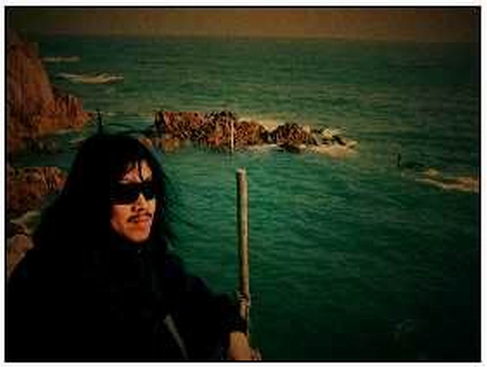
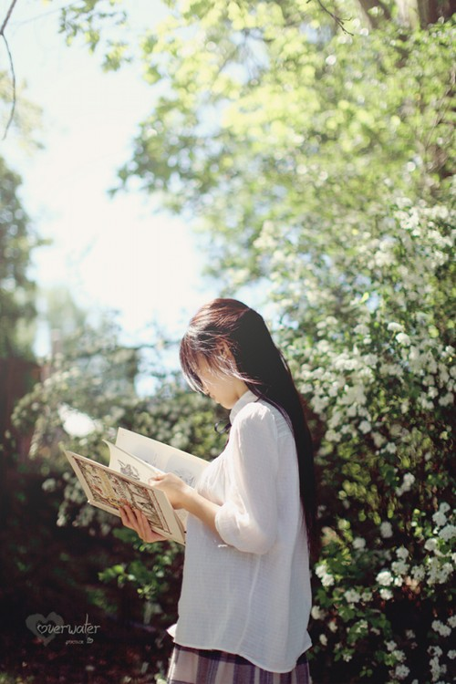
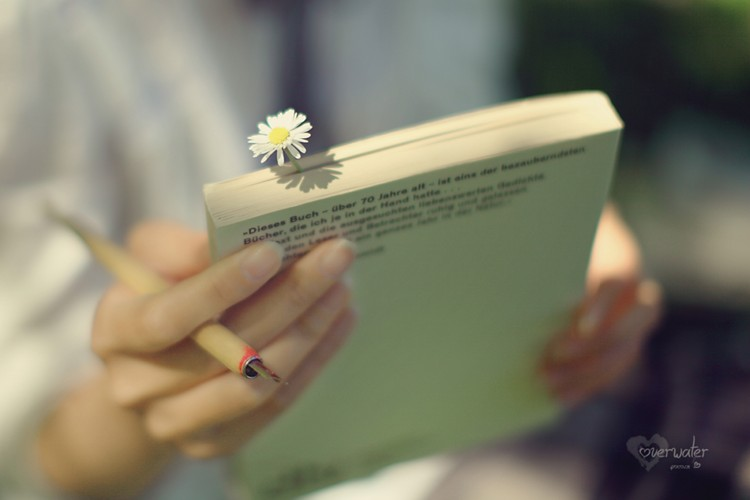

# ＜天璇＞关于诗与周云蓬：我在这个世界的边缘生活过

**你从来都没有怀疑过自己吗？你从来都没有否定过自己吗？你有没有觉得自己在做的事一无所值，就算腰缠万贯还是一无所有？你的生活看上去井然有序，安稳，可安稳得让自己心里没底？你认为自己要么是丢失了自己的土地，要么是在这块我们的土地上，你还是终将无家可归，流浪四方？** ** ****时至今日，你还能清清楚楚地说出，自己走过的每公里路途、流过的每一滴眼泪，都是曾为了谁吗？** **如果这就是你，那么我与你相仿的是，我们都曾在这世界的边缘生活过。** 

# 关于诗与周云蓬：

# 我在这个世界的边缘生活过

## 文/李维恩（北京师范大学）

 **好像回到了几千年前那个不属于我们的时代，大家都把他看作眼神明亮的诗人荷马。**

**——小河谈周云蓬**

 **1.** 最近心情不错，很难得地去认真听了一节大学国文课。 那节课的内容是《诗经》，大概在快接近尾声的时候，一个戴着眼镜、说话声音比大部分男人都粗糙的女生站起来：“相比而言，我读古诗比现代诗更舒服，古诗都是有灵性的，大部分现代诗的内容都是在诗意的装B。” 然后台下绝大多数的人都赞许地点了点头，我依稀听到其中几个在低语： “她一下把我心里的话说出来了！” “嗯，最近我也在走中国风的路线！” 后来仔细思考，可能是由于个人文化层次的问题，我一直觉得老师自幼教导我们说读课本上的古诗能修身养性陶冶情操这件事——和大学里说读马列上思修能提高思想道德水平是一样的。 唯一的不同在于，前者骗的是孩子，后者糊弄的是青年。 记得我妈告诉过我，在她年轻的时候，经常有空就骑车到市医院对面的一个刊物发行中心。她已经忘记了那个门面的名字，只记得门前停满了绿油油的邮政车，屋子里空调很凉快。有一整墙的过期杂志，每本只要两三毛钱。 她经常用兜里面皱皱巴巴的饭钱换几本文学杂志。那个时代很吸引人的一点在于，人们会特别珍视手中的文字。 那是一个无论处在怎样年龄的人都会仔细阅读报纸的年代，就连被小贩加在里面的性药广告也不放过。 

我妈说经常记得里边有一句诗，好像是骆一禾写的： 如果我们做一个梦，一辈子都没有醒，那么，这个梦还是梦么？  **2.** 初中升高中的时候，正是做梦的年纪。我经常把一些没什么由来的词句片段抄在本子上，有时候同学几个之间也会互相传着看。 那时班主任是语文老师，有一天她让我们到讲台上读一句自己最喜欢的话。 我当时特别慷慨激昂地站上去，背了一句其实当时也不怎么理解的鲁迅的话： 有杀不完的贪官污吏，有救不完的百姓黎民。但是，还要杀，还要救。 底下的人都笑了，不是赞许的那种。 我无辜的看着班主任，班主任则略带喜悦地看着我。 后来她找我谈话。她说，我很担心你的性格。也许以后你会做出很大的事情，也许你会一败涂地。我挠挠头，不知该说点什么。 在那个年纪，若是有老师肯和你谈点人生和理想，那一定是无比感恩的事情。 令人开心的是，我那时喜欢的话肯定现在更能剑指人心。 

到了高中我很拼命地读诗，大都是近现代作品。我对普希金、波德莱尔、莱蒙托夫、纪伯伦、穆旦、顾城的兴趣要远远大于数理化的公式。这是因人而异的事，我的高中是一所理科见长的学校，我却是一个不太合群的、认为读一本陈省身自传远比学整体微分几何意义要大的人。 我清楚记得，高三时候数学老师看到我密密麻麻的随笔本，惊讶的几乎跳起来： “都高三了，你到底还想不想高考了！” 当然是一直都不想。我只是选择接受，不是投降。 有些人可以活得像一部史诗，有些人也可以活得像一堆废话。 小时候觉得能打出魂斗罗水下八关的人就是英雄，长大后我渐渐发现了世界的原貌。 白雪公主担任了调教冰恋正太的代表人物，孙悟空变成了丝袜制服SM的终极传说。 妓女卖淫被警察抓进局里的时候，提包里搜出一本《文化苦旅》。 还好，余秋雨当时不在现场，不然以现代人的眼光你觉得能说明白么？ 你的纯真永远会成为别人嘲笑的对象。 有时候你不得不随他们荒诞，学着他们说话的方式来说话。 因为他们总会叼着一支烟，翘着二郎腿和你说：孩子，认真你就输了。 你只能安慰自己，唉，没办法，就当是我成熟了。 可是，纯真是需要一点固执的。  **3.** 说来惭愧，听周云蓬的歌也是最近几个月才开始的事。毕竟对于偏爱枪花、Radiohead、U2这一类的我来说，经常认为自己对民谣的没什么品位的。 但是听周云蓬越多，我就越是容易否定先前的自己。 没有人当他是盲人，大家都当他是眼神明亮的诗人荷马。 在周云蓬面前，我们都觉得失明的人是自己。 世界就像是一个大合唱，我们贪恋视觉听觉的刺激，很少肯闭上双眼，聆听周围的心跳。不过在这个城市的慌乱之中，你知道，其实这并不容易。 

歌声响起来，远方也铺张开。 这是一个盲人歌手用他内在的光明引导你投身其中的远方。 死去的海子，死去的张慧声，那个用身体和灵魂歌唱作诗的年代，随歌声复活。 譬如那首算作他唯一的情歌《不会说话的爱情》，百听不厌。 他对主体的强调让昔日与明日、恋与死变得真切起来，仿佛他在唱着的不是别人的发现，而是自己的经历和感受。 这也是盲诗人最贴切的爱情观： 难以启齿，难分难舍，相依为命，若即若离。 在最美好的时候中断，在最虚幻的时候复活。 我们不会说话地恋爱时，便只有双眼凝视，泪流千行。 我们在麦田中奔跑，双腿如剪刀一般，收割下整个秋天的金黄。 夕阳低落的时候，我们还在山头徘徊，我们脑海中只有彼此。 要不是《牛羊下山》为我们带路，我们早就迷失了回家的路吧。 在《牛羊下山》深情的眷恋中，那些古今名人不再被隔离在遥不可及的每一个朝代，而一个个端庄地穿梭在彼此的梦境里。 他们在诗词曲牌里纵横延绵的那个山河终于不再是断裂的，而是“今夕复何夕，共此灯烛光。 比起歌手，周云蓬更是一个诗人。他不需要挤破脑袋想象一个意境，不需要惧怕被繁世困扰，不怕记不下一个梦。他活在一个梦中，然后紧密嘴唇，对抗着整个世界的坠落。不管是用《沉默如迷的呼吸》，还是讲述《中国孩子》的悲剧，抑或是用清炒苦瓜的淡淡香气，来烘烤这个世界的浑浊。 “牛羊从山上下来，我和它们在一起，想你有衣暖身，有食果腹，有水解渴，有我入你异乡人的梦。”  **4.** 说来突兀，我从来不喜欢太自信的人。 你从来都没有怀疑过自己吗？ 你从来都没有否定过自己吗？ 你有没有觉得自己在做的事一无所值，就算腰缠万贯还是一无所有？ 你的生活看上去井然有序，安稳，可安稳得让自己心里没底？ 你认为自己要么是丢失了自己的土地，要么是在这块我们的土地上，你还是终将无家可归，流浪四方？ 时至今日，你还能清清楚楚地说出，自己走过的每公里路途、流过的每一滴眼泪，都是曾为了谁吗？ 如果这就是你，那么我与你相仿的是，我们都曾在这世界的边缘生活过。 

没有人的空山，没有鹰的蓝天，没有梦的睡眠，都随着没有故事的流年逝去。最后，一只独自在蓝天中潜伏的蓝色老虎，忍受着春天的责备，害羞地走开。在专属于你的某个夜晚，想象和被想象的都是在纯然黑暗的世界中绽放的白色花朵，它向内开放，有透明的现实质感，也有幻梦一样的光晕。 我曾甘心在自己的世界边缘生活，我知道在那狭小的空间有着生命不可替代的完整性。一室被放大如一国，一夜被拉长如一生。外人眼里再怎样的平庸卑下，你的生命也有着它无法遮掩的光明、幻影与美。 我知道那些细微的人生是如何像风一样的聚拢扩散，我知道在暧昧不明的暮色里，一格一格的窗子已经为黄昏预备了灯火，我知道在厚重的云层之上，云海展开如万象起伏的森林，永不衰竭的光辉在万物中无尽的流变。 东方破晓，另一个白天又为炎热和寂静做准备。 晨风在海上，吹起了波纹，掠海而去。 真正的游吟诗人从来都不是文人墨客，一个失明的诗人陪我们端坐在梦里。 他说，孩子，你想得到什么，就告诉我。 然后我告诉你，没有它，你该怎么生活。  **5．** 1936年，在维尔诺，诗人切·米沃什看到了这样一个《黎明》。 他觉得“不够。只活一次还不够。我愿再次活在这悲惨的星球、在孤独的城市、饥饿的村庄”。因为他还心怀理想，他还想“看看所有的邪恶，看看腐烂的身体。探究受制于这个时代法律，和在我们上方风一样嚎叫着的时代。” 现实，远比想象简单，但也远比想象繁乱。 每一天，生活都按部就班，而每一天，生活也在流血。 诗人不可能永远活在堡垒里，他总得也必须让自己的身子沾染些许烟火。然后，在巨大的阴影之下，窥见那一抹光。周云蓬与旁人不同，他对现实的洞若观火，正是源自心底的光亮。而且，这些光亮，无不暗藏着疼痛的河流。 诗人之痛，并非那种居高临下或者故意拔高的悲恸，而是以旁观者的触角，上溯到人类自身的孤独与怜悯。诗人看到的是一场场罹难后面的“人”，而不是空洞的泪流满面，也不是那种莫名其妙的悼念与指责。在这个偏爱小清新小感动小可爱的时代，我们也必须记得与大声音大情怀大境界碰撞，感受珍稀的“辽阔”“深沉”与“温暖”。 说到这里，古诗与现代诗又还有什么分别呢？诗人的灵魂或许是共通的。 大自然，将会有岩缝给我藏身， 有无人知晓的河谷让我清清静静地痛哭。 她会在夜空张挂起星星，让我在外摸黑行走时不致绊倒， 再送长风抹平我的脚印，不让人跟踪害我。 她将以浩淼之水洁净我，用苦口的药草调治我复元。 最终把自己的灵魂也挂在悬崖绝壁上。 ——Oscar Wilde《自深深处》 愿你们不必再生活于世界的边缘。 愿每个人都能被温柔的对待。 

（采编：安镜轩；责编：黄理罡）
