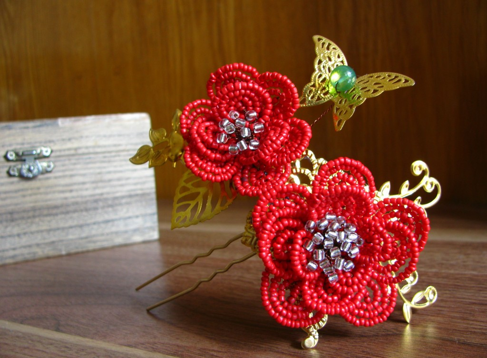
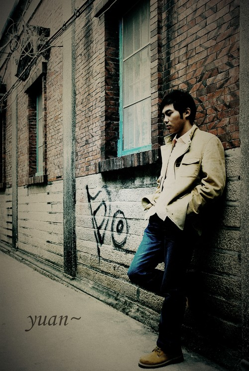

# ＜天璇＞再彪悍的人生也需要结婚

**亦舒曾说，人们爱的是一些人，与之结婚生子的又是另一些人。我深以为然。以爱情为支撑的婚姻终究撑不下去，如若爱一个人，便往往很难做到退让与宽容，婚姻又将以何来面对日复一日退却的热度，渐老的容颜，以及充斥着油烟气、洗衣粉味与孩子哭闹声的数十载年月？**  

# 再彪悍的人生也需要结婚

## 文/ 麦静（中山大学）

 

这日读了一篇文章，叫《彪悍的人生不需要结婚》。大抵是说，结婚是出于对爱情的不信任，婚姻是一种具有约束性的承诺，而选择不结婚却能坚守爱情的人是个传奇。然而，在我看来，婚姻与爱情，根本就是两回事。

前些时日重读张爱玲的短篇集子《倾城之恋》，才蓦然觉得多多少少读懂了一点滋味。张的小说，实在半点不涉爱情，所谈种种，不过是一个又一个的女人在这苍凉世上为了生存所作的种种挣扎，然而女人的命运，几乎总也离不开婚姻。从前我没有注意到《鸿鸾禧》这个小短篇，这次重读却深感关于婚姻，几乎没有比这更透彻的文字了。

几个月前我为一个不甚相熟的师姐做婚礼上的姊妹，算是临时凑的数。在婚礼前夕，我的悉心准备恐怕也不亚于新娘，那日我笑意盈盈地站在新娘子身旁，心里想起的却是《鸿鸾禧》里的话，她是银幕上最后映出的雪白耀眼的“完”字，而我则是精彩的下期佳片预告。而到如今，我也被推到了婚姻的面前，这才读懂了娄先生娄太太的种种。他们凭媒结婚，这婚姻里本无爱情可言，而做了三十年的夫妻，他们对彼此的了解也依然相当有限，然而日子却过得四平八稳，不起波澜。娄先生曾出洋回国，想来当年也是有过一段旖旎记忆的，然而他是个明白人，婚姻是婚姻，爱情是爱情，这两者不掺杂在一起，也就没有《红玫瑰与白玫瑰》里振保的烦恼。

婚姻从来不是爱情的延续，也不是爱情的衍生。诚然，婚姻是一种具有约束性的契约形式，然而却终归是可以解除的，想以婚姻来维系爱情，从一开始就不可能成立。那么，婚姻是什么？婚姻是“头发不要剪成鸭屁股式好不好？”，婚姻是“不要穿雪青的袜子好不好？”，婚姻是“只知道丈夫说了笑话，而没听清楚，因此笑得最响”。

婚姻不过是一种生活方式，与爱情无涉，亦与承诺无关。

亦舒曾说，人们爱的是一些人，与之结婚生子的又是另一些人。我深以为然。以爱情为支撑的婚姻终究撑不下去，如若爱一个人，便往往很难做到退让与宽容，婚姻又将以何来面对日复一日退却的热度，渐老的容颜，以及充斥着油烟气、洗衣粉味与孩子哭闹声的数十载年月？

而爱情却不一样，它似是而非，难以捉摸，无法掌控。我常常想起《恋爱的犀牛》里那首《给你的诗》，“你是纯洁的，天真的，玻璃一样的/你是纯洁的，天真的，水流一样的/阳光穿过你，却改变了自己的方向”，这才是爱情，你无法决定，无法选择，甚至有时它强烈得让你无法控制。前几日常远在文章《远了，近了——有关异地恋》里提到，异地恋没有未来。但要我说，爱情本就没有未来。

理想的爱情，是炽烈灼人的，毫无理智与未来可言。拉丁文里有句谚语，“Amantes, amentes”，前一个是“爱”的现在分词，后一个是“疯狂”的现在分词，只差了一个字母。而理想的婚姻，是一种能令双方各取所需的生活方式，并且为对方保留空间。

茫茫人生，好像荒野，有时我们不过是想捉住一点温暖。你愿意夜半醒来时枕畔有个温暖的怀抱，你愿意与另一个人共同抚养一个孩子，那么你就需要结婚。

彪悍的人生不需要结婚？不，再彪悍的人生也需要结婚，只要你愿意选择这种生活方式。说到底，婚姻不过是一种对生活方式的选择，又何须与彪悍扯上关系呢。

 

（采编：陈锴；责编：陈锴）

 
