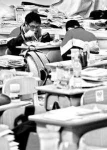

# ＜天璇＞再见，高考

**很多人怀念高考，并不是因为自己光耀门庭，跨马游街；也不是一朝白眼终得雪，更多是怀念自己当年的那份纯劲儿，那份执着和那份天不怕地不怕的胆气。就像怀念自己的初恋，并不是当年的那个楚楚动人的恋人，而是那份青涩清澈见底的纯真的劲儿。**

### 

### 

# 再见，高考

### 

## 文/ 卞海鹏（重庆三峡学院）

### 

### 

在网上和朋友聊天，最后时候往往习惯说：“再见”而不习惯说“byebye”。始终感觉“再见”是再次相见，充满了何时共剪西窗烛的曲调。而byebye却始终没有感觉到却话巴山夜雨的情景，倒生出扭头不见，人走茶凉的悲哀。 这几天，天空弥漫着淡淡的乌云，时而小雨滴答，在肥大的芭蕉叶奏响宁静的古曲。静心听时，有些许像《广陵散》，于缓慢中透露出一丝的忧愁，些许忧愁中却显现半杯洒脱。乱心听去，自然就听不出是曲调了，仅感到无尽的烦躁，欲起欲卧，欲静欲闹，左右始终不得舒畅。 大学中的毕业季又开始了。刺眼的阳光从林荫稀散处透过，在道路上留下几个光斑。校园中处处留下因酒后而造成的凌乱。 在茫茫无期的等待毕业中，在整日浑浑噩噩的度日中，除了同学间的散伙饭，就是无聊的填表，无聊的等待了。学校的在办事效率在慢半拍的老样子里送走了一批又一批的毕业生，自己又得到了新一年的招生花里胡哨大广告。 散伙饭吃了一次又一次，伙还是没有散；表填了一张又一张，会开了一次又一次，还是没有拿到由一麻袋钱换取毕业证。只好等待，除了等待还能有什么事情可做？宅男宅女们在没走出狭窄的出租屋奔向广阔的新天地时就在大学喧闹拥挤的寝室中过早充分尝试蜗居的日子了。 高考，就在每年的这个时候，如期而至。 很多人谈高考，说高考，高考这不好，那不好的言论此起彼伏；还有一些人倾向于废弃高考，说高考埋没人才，一无是处，一考定终身弊病太多，没有存在的必要，不如干脆废掉。多年的讨论也没有理出个趋向更理性的渠道，来进行高校的招生，高考还是大摇大摆的一年一度的进入老百姓的眼中，触动神经。 

 高考自然都想读名校，清华北大自然是首先选择，清华北大美名遐迩，连家长给孩子起名字都用上了。 我有几个同学都是取了清华这个名字。这些名字叫久了自然就去除了清华大学的光芒，没有一丝刚认识时的心中偷笑，反而越加感觉，清华这个名字，无论是男清华，还是女清华都透露着习惯中的亲近感。当然我的这些男清华，女清华同学，没有一个考上清华大学的，但也考取了不错的高校。假如你也属于男清华，女清华之列，要是你成为了一个厨师或者售货员，有的人就会说出“糟蹋清华美名”了。尽管是这几年清华大学被糟蹋的事情，屡见不鲜。清华的美名还是深入到平常百姓的言语中。男清华，女清华，如同女孩叫个玲啊凤啊，听着也顺耳，我还有一个同学美名为北大，几年过去了，不知“北大君”过的如何啊。 回首充实的高中生活，很多画面都成为在无聊的大学生活中，寝室中的聊天话题。 书籍堆积如山，用两个书立一夹，便可高高筑起，上面再放上点试卷啊讲义什么的，兀自躲在书山后你就是舞刀弄剑，讲台上的老师也无法看见。这都是缺书的日子里，看闲书的最佳方式之一。在我那高中，除了老师定期发放的《读者》外，其余都属于闲书行列。老师没收闲书那更是常有的事。去办公室，老师往往在津津有味的看着没收的书籍。看闲书还有一个方法就是买盗版书来，撕为几半，薄薄几页纸的许多份。有如此佳品自然独乐乐不如众乐乐了，均而分之，夹在教科书中，平心静气的大肆遨游。 如此的时光在大学中，消失的毫无踪迹，连一根毛都没留下。当年对于书籍的如痴如醉，早不知道抛到何处了。丰富的图书馆恐怕也只有在大一刚刚入学的那段新奇劲中去过，就再也没光顾过的帅哥美女大有人在。 经常在优酷上看些回忆清纯学生时代的原创短篇，看完后总是不禁感伤一番。《老男孩》疯火网络时候，很多人都说看了一年的电影，钱都白花了。 高中的小爱情，总是在偷偷摸摸中进行的。这里的爱情，有的是青涩的爱情，也有的是同学间的相互嬉闹玩笑下的指鹿为马，有的是你我都说不清的那份情感。 我所在那所高中是命令禁止学生谈恋爱的，若发现（各位人类心灵工程师不定期的查学生的寝室和桌子）大抵就是开除学籍了，不过我在那直到毕业也没见过或听过因谈恋爱而开除的学生。 虽不能烟柳依依，你侬我侬，但也会鸿雁传情，倾诉衷肠。传纸条的岁月那是最值得回味的日子。从前边的位子传到最后面的位子，或者从最左边的位子传到最右边的位子，同学们心照不宣，彼此照应。鸿雁有的是几页纸，有的就动辄几十页，厚厚的一叠，用印着花，透着香的纸张写成，心中彷徨踟蹰间，便在众同学的帮助下，传到了心仪的那个人的手中，不知何时她心里揣着兔子把那“小情感”小心地轻轻地放在英语课本下面。 老师仿佛都在一瞬间成了福尔摩斯，找寻这些“犯罪证据”，犹如探囊取物。但道高一尺魔高一丈，总是会小心翼翼把情书藏在各种隐蔽的地方。藏在堆积如山的书中是采取的方法之一，那堆砌的如金字塔般的各种高考资料，参考书，随便藏在其中一本当中，有时候就连自己都要找半天才能找到。老师不能天天翻找这些东西，但是那些小女生小男生却经常反复的回味。藏的隐秘，有时候连自己都无法找到。找不到时，反复在书山中强忍着心跳，一页页中苦苦寻觅，没找到时，不停的怀疑被老师翻去的种种后果；找到后轻轻一笑，疲惫悸动全部化为乌有。 

 其实那时没有了谁和谁好的各怀鬼胎的谣言和狂笑，而成了相互照应，相互传递，鸿雁传情。那都是无聊匆忙的高中学习中的一碟开胃小菜，开胃醒脑。那烟雨朦胧中，清风拂柳时，青涩的年纪佯装着所谓成熟书写出的文字，唯有那份真诚中的清纯值得回味。少年不知愁滋味之时，假装晓得愁为何物的几笔文字，成为多年后谈及的哈哈一笑而过。但要是把这开胃小菜，搞成了满汉全席，恐怕就会撑坏肚皮了。 高考前的日子就在这样的点点滴滴中慢慢的度过了······· 高考短暂的两三天心情惬意中就很快过去了，一咬牙也能挺过去。等待分数的日子，那才叫做煎熬。邻里间的有意无意的一句“考的怎么样啊”就会让你猜其用心，几个通宵。那些平常成绩很好，高考瞎了的考生也有不少。寒窗苦读十年书，一朝梦想成功名，苦苦等待着，茫茫不知所以然。 等待是美好的，毕竟是怀着美好的希望，拥有着绚烂的梦；等一切水落石出，无论是功成名就还是名落孙山，是一鸣惊人还是如其所料，理想实现者的快乐和前途不明者的疑惑，都明明白白清清楚楚的摆在了面前，灿烂的梦如同绚丽梦幻的肥皂泡瞬间，砰地一声，破了，四溅的水滴迷失了双眼。 很多人怀念高考，并不是因为自己光耀门庭，跨马游街；也不是一朝白眼终得雪，更多是怀念自己当年的那份纯劲儿，那份执着和那份天不怕地不怕的胆气。就像怀念自己的初恋，并不是当年的那个楚楚动人的恋人，而是那份青涩清澈见底的纯真的劲儿。 读大学后，那年的灯下读书，浑然不觉窗外风雨的劲是否化为了整天不离电脑的游戏升级？ 那年月光朦胧，明亮如水的双眸中表露的情感是否变成躺在床上骚情外露盯着鼓鼓的钱包？ 那年月黑风高，寝室中偷偷喝着酒吃着花生米的欢声笑语是否变成尔虞我诈不是你死就是我活的升职梦？ 再见，高考，就是byebye了，鲜有人可以几年如一日执着的参加高考，那是考试机器，也就没有什么借此炫耀的资本。 再见了，高考，却无法忘记那执着清澈的劲儿！ 

### 

### 

（采编自投稿邮箱 责编：陈锴）

### 

### 
