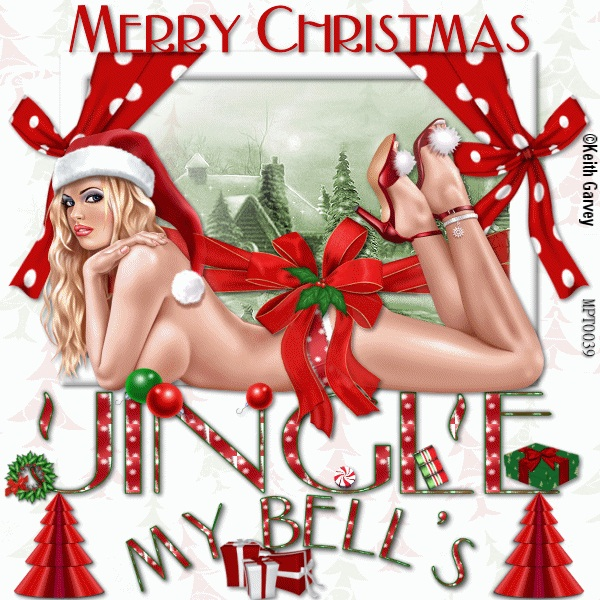
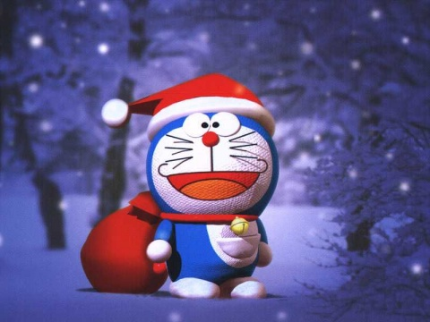
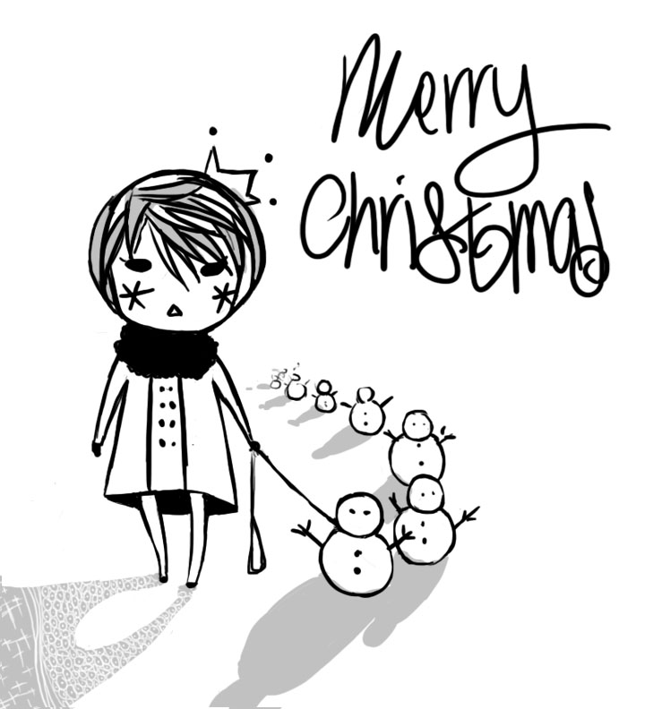

# ＜天璇＞写圣诞卡的那些年

**然后有一天，我们似乎突然开始了真正属于自己的生活，上了不同的大学或者工作，“自我”开始变得鲜明和庞大。我们做着最有利于自己的选择，过着自认为“自由自我”的生活，眼里渐渐没有了别人。爱、友谊、信任、付出、责任逐渐变成一些古典的名词，显得遥不可及而不切实际。** **于是过度的“自我”事实上变成了对个人欲望的不加控制，对一些具有崇高性的概念诸如爱、友谊、责任的背弃，成长变成了舍弃纯真，走向无节制的自我放纵的过程，然而人性的放纵往往只指向卑劣、冷漠以及自私的结果。**  

# 写圣诞卡的那些年

## 文/麦静（中山大学）

 

记得初中的那几年我总是很期待圣诞节，每年节前都郑重其事地买下一堆贺卡，一笔一划地写给要好的同学和暗恋的男生。给好友的，总是写一大段感情丰沛得近于矫情的话；给普通同学的，往往是满满一大版的正经祝福；至于写给那暗恋的男生的，却往往只是格外工整的“Merry Christmas and Happy New Year”，带着一点点的矜持，又有点既怕对方知晓又怕对方不知的做作。当然，挑选给他的贺卡必然是最贵也是最漂亮的，总暗暗期待对方能从这差异当中感觉到什么不同来。

高中的时候，写给男朋友的圣诞贺卡总是买贺曼的。那时大费周章地跑去吉之岛买，觉得三十块钱一张的贺卡是昂贵并且美好的，希冀着这格外精美的贺卡，以后能放在他的抽屉里度过漫长的年月。那时我想，纸质那么好的贺卡，即使过很多年也一定如最初的时候一样，如同我和他的感情。

后来，十八岁以后，我竟再未写过圣诞贺卡。

潜意识里似乎总觉得那是很孩子气的事。正如似乎也渐渐觉得以一种郑重其事的态度去对待感情，是件很幼稚的事。

那些年我们没有钱买一件像样的礼物送给对方，我们没有办法作出什么可以兑现的承诺，我们被禁止早恋，我们笨拙而认真地去爱，没有未来，最后彼此伤害然后分开。

那些年我们精心挑选不同的圣诞卡，一笔一划地写下祝福的话语，再亲手交给珍视的人。

那些年我们除了一颗天真诚挚的心以外，什么也没有。

现在我们可以轻松买下精美的礼物，光明正大地约会，与对方的家人一起吃饭，谈论着婚姻与未来，然而却再也不曾认真地为对方写过一封贺卡，亲手包装礼物，守到准点发出Merry Xmas的短信。

现在我们懂得了过去不懂的许多事情，诸如妥协、谅解、包容、协商，我们却越来越不懂得爱。

从前有喜欢我的男生写信给我，写了满满几页原稿纸，描述他家阳台上的仙人掌，他家的猫，然后又写“我觉得你和我家的猫一样可爱”，最后问我，“你有时间来我家附近逛逛好不好”。逛字还写错了。恰好我也喜欢他，于是我们认为我们恋爱了，我跟着他在他家的小区里转悠，两个人都把手插在校服的口袋里，拘谨得一句话也说不出来。再后来由于气氛实在太尴尬，我们友好地“分手”，又做回了朋友。

前两天偶然认识朋友的朋友，一起吃饭聊了一会，回去以后对方在网上表示“我们能做炮友吗”。一时之间我就想起来那个用原稿纸写信给我的男生，却觉得那些年无比遥远，早已无法回转。

现在物质与性变得唾手可得，真心却早已不知跑到了哪里。做爱很轻易，爱却很艰难。

想起了哈维尔的一段话，“我们都是道德上的病人，因为我们习惯于口是心非。我们学会了不去相信任何东西，学会了互相否定及仅仅关注自己。这样一些概念如爱、友谊、怜悯、谦卑或宽恕失去了它们的深度和尺度，对许多人来说，它们仅仅代表了心理学意义上的怪癖，或相当于来自古代的早已过时的祝辞，在电脑和太空时代显得非常滑稽。”

似乎确实如此。

曾经的我们身上，“自我”的影子极其单薄。我们穿着一样的校服，留着规定的发型，背着课本上相同的答案，彼此的生活有着无比相似的轨迹，然而我们却会发自真心地喜欢某位朋友或暗恋某个异性，不带目的地对他/她们好，做过许多事情却从未想过回报。

然后有一天，我们似乎突然开始了真正属于自己的生活，上了不同的大学或者工作，“自我”开始变得鲜明和庞大。我们做着最有利于自己的选择，过着自认为“自由自我”的生活，眼里渐渐没有了别人。爱、友谊、信任、付出、责任逐渐变成一些古典的名词，显得遥不可及而不切实际。

于是过度的“自我”事实上变成了对个人欲望的不加控制，对一些具有崇高性的概念诸如爱、友谊、责任的背弃，成长变成了舍弃纯真，走向无节制的自我放纵的过程，然而人性的放纵往往只指向卑劣、冷漠以及自私的结果。

然而我想未必非如此不可，生活总有其温暖的一面值得去感触，人性总有其高尚的部分值得去追求，总有一些概念我们不应忘记，总有一些准则我们应当坚守。而成长，也不应是一个丧失纯真的过程。

愿我能保全我的初心。

写给我还在写圣诞卡的那些年，写给也许尚未彻底死去的纯真。

 

（采编：佛冉 责编：麦静）

 
