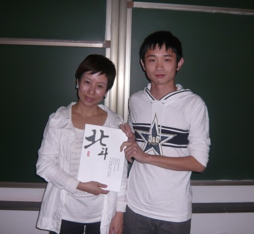
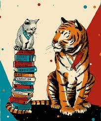

# ＜天璇＞刘瑜和微博

**当面对“细节决定成功”，“我的成功可以复制”“不考研就找不到好工作”这些流行观点时，你能去质疑，去找证据，而不是让它们占据你的思想，指导你的行为时，你已经用你的行动证明你可以得到“独立思考”这份沉甸甸的礼物。**  

# 刘瑜和微博

## 文/树獭（西安邮电学院）

 

我现在坐在图书馆里，正在阅读的是那本曾经被我认为装文艺的大神级作品《百年孤独》，这是两年前的我不可想象的。那时的我多么主流啊，书包里的永远是《高等数学》，《复变函数》，《大学英语》这些根正红苗。在教室里，第一排已经是我的固定席位了，在周围的兄弟姐妹们都相继倒下的情况下依然矢志不渝地坚挺着，鹤立鸡群。如果偶尔翻看杂志报刊，那么《青年文摘》，《环球时报》必定是我的首选。大学对我来说就是高中生活的延伸，如果没遇到某些人的话，你将看到的又是一个从二流大学战战兢兢，努力奋斗四年，最终考上重点大学研究生的励志故事。可是，我的故事不是这样。

给你看看我今天的怎么过的。上午终于结束了断断续续为期一个月的《公正》的阅读，对，你没看错，它是一本政治哲学的书，和我现在的专业搭不上边，中午顺便把这个星期的《南方周末》给买了，《环球时报》因为其它的狭隘已经被我束之高阁一年有余。下午发现了一本好书——日本作家司马辽太郎的《燃烧吧！剑》兴奋地读了两章。晚上重新捡起了前前后后被我放弃了n次的卡尔维诺卡大师的《看不见的城市》。

到底是谁将一个积极向上的美好青年塑造成现在这个整天不务正业逃课成习的边缘分子？下面请出促成这一改变的“罪魁祸首”——刘瑜女士以及新浪微博。

刘瑜对我的意义就像王小波对连岳和慕容雪村这类人意义一样，属于思想启蒙这一范畴。在她那本聚集了一个三十岁大妈各种吐糟和神经质的《送你一颗子弹》中，我觉着我找到了知音。她就像言情小说里我钟爱的剑走偏锋的江湖侠士，拉着我这个被各种规则绑架的闺阁女子完成了一场盛大的私奔。

比如说，我的各种长辈通常会语重心长的教育我：“年轻人，多听听我们的意见，我走过的路比你吃得盐还多。”我那个时候小，经常被这种家长式权威的建议给吓住。在我惶惶不安的青春中，我放任了他们对我的恋情，学业的各种干预，其结果就是，我总觉得我为别人活，我身不由己，这勾起了我浓浓的哀怨，而且久久不能散去。

但是刘瑜却不这样，她说：相信你自己，破除任何权威崇拜和偶像崇拜，无论是政府还是公知，运用你自己的头脑和理性证明你配得上自由。你们无法想象这句话给我带来的震撼，因为我所接受的教育中所宣扬的基本理念就是——向成功人士学习。比如高中时卖的很火的《等你在清华》，《等你在北大》；上大学之后，图书馆那一排排被翻得快烂的《成功人士的七个法则》，《这样做最高效》。在这种环境的浸淫下，我养成了依靠建议者身份来决定了他说话正确度这个“良好的习惯”。同样一句话“要好好吃饭”，如果发言者是李开复，我就会觉得“啊，真是一道闪电划过我灰暗的天空啊！”；但如果对象换成我家那个至今没有大出息的表哥，我就会觉得：“就你，一个没钱没地位的基层公务员，还好意思教育我。”我觉着，各种青年导师雨后春笋般的出现和我们这帮没有独立思考能力，极其不相信自己的21世纪大学生有着不可分割的联系。

因为刘瑜，我开始学着凭借自己的知识储备和生活感悟对身边的各种名人名言进行仔细的甄别，慎重的考量，不会在做出类似于“哇哦，是白岩松啊，央视新闻主播啊，我一定要把他说的话一字不漏地记录下来”这样的傻帽行为。

我的另一个老师——微博，则尽跟我唱反调，一点都不展示老师循循善诱，春风化雨的一面。比如，我坚定地觉着某国家领导人邓同志是一个大神级人物，他多么英明，多么睿智，多么有长远目光啊！可是微小博却不这样认为。他问我：“你知道85学潮么？你知道那个撰写‘实践是检验真理的唯一标准’的胡耀邦最后是怎么死的么？你知道还有一个被囚禁的叫做“赵紫阳”的人不？你看，你都不知道，那么多历史细节，你都不清楚，那么，你怎么可以凭借这些被篡改甚至隐去的历史就来评判甚至崇敬一个人呢？我这个从小沐浴在党的关怀下，未来世界接班人，看到这样一段话时，心中那个气啊！怎么有这么政治不正确的人？他从小的政治思想教育是怎么进行的？怎么可以向我敬爱的老爷爷身上泼脏水？即使我这么义愤填膺，这么炉火中烧，但是这些“大逆不道”的话，就像星星之火，经历十分钟的扩散后，最终成了燎原之势——我打开了百度，进行了自我历史教育。

这样一段不那么愉快的经历，却让我增添了一份人生智慧——对待某个历史伟人的评判，对待某个公共事件的看法，我一定要找出正反两方面的意见。承认人的不完美，承认事件有正反两反面的影响，是我迈出独立思考的第一步。

独立思考是我特别注重的特质，它超过了勤奋，善良这些从小到大被老师和家长青睐的品德。就说善良吧，经过王小波同志多年的“诲人不倦”后，我知道了一群善良却愚蠢的人很容易被别人操控，做出更邪恶的事。你看看“文革”中的老虎凳，辣椒水，各种丧尽天良的惩罚方式和封建社会有什么区别。这可是新中国，是经历了“五四”“新文化运动”的新中国。如果我们对“文革”的反思仅仅停留在强烈谴责“四人帮”，部分批评“毛泽东”，而不去探究当时那些参与者—那些情绪高昂的红卫兵，我觉得历史会重演，说不定下一个受害者或者害人者就是我们自己。

当面对“细节决定成功”，“我的成功可以复制”“不考研就找不到好工作”这些流行观点时，你能去质疑，去找证据，而不是让它们占据你的思想，指导你的行为时，你已经用你的行动证明你可以得到“独立思考”这份沉甸甸的礼物。

 

（采编自投稿邮箱；责编：麦静）

 
