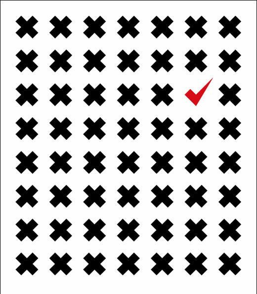

# ＜天璇＞别急，我们终会有一个按部就班的人生

**都说青春就应该与众不同，激情四射，可结果是猛然回头，却发现大多数人依然已经平庸无奇，人云亦云的态度，不敢冒险的精神，不去选择的生活，至少在我的周围人群的气场呈这样一种收敛的趋势。**  

# 别急，我们终会有一个按部就班的人生

## 文/ 祝心怿（重庆大学）

  周六的实验室总是这么冷清，虽然平时的这个时候大部分来了的也是打打酱油甚至打打cs，消磨消磨时光，撞撞运气看看老师来不来，貌似谁也没有想过快点把事情做完，因为老师已经安排了你哪一天做完。 毕业也一年了，和大学仅有的玩的好的几个工作的聊天，他们都在有自己的事情，有的满心希望的观看公租房摇号，摇完之后又发现没有自己，怨恨自己没有多吃几天素，没有多攒点人品，有的考虑买哪种无线鼠标，80的还是100的，买完之后依然吃着已经吃了一年的一碗面条加鸡蛋外加思考着今晚的欧冠哪个能赢。时光是块磨刀石，磨平了不知生活无知畏惧不怕选择的利刃，剩下的只有符合条件的那点形状，放在社会中占个位子，不可能光彩夺目，只是凑个数目。去年的时候，我们几个人还在满校园的发自己印的宣传单，两大塑料袋，那是我们睡觉前讨论出来的样式，网站的名字也是自己起的，有着自己的发展目标，意淫着宏伟前途，不是为了成功，仅仅是为了想象。我和老婆一起跑遍了所有的楼，她站在烈日下，我上上下下的跑遍了所有的宿舍楼，发传单的时候和所有的事情一样，有附和者支持者和不屑者，但是我们却只有两个感觉累和开心，发完的时候，大家却表达了同一个意思为自己折腾折腾真TM有激情。 

现在我还记得当时各种傻乎乎自大的宏图伟略，可是到了现在，我还是会思考这些想法，但是盟友却越来越少了，不是遗忘了当初的经历，而是太多人已经被习惯的安排的按部就班了，已经像一个瓶子，被生活的洪流推着前进，不能后退，不能停止，甚至不能跳出来。 不过，我们终究都会成为那个瓶子，但是我们有权利选择跳入那个海洋的时间。 

 昨天又一次在帮别人写了一个真的很垃圾的程序给别人当助教时忽悠下面的学生之后，被人问及了以后我想干什么，本来我想回答程序员的，但是我知道这个答案又要遭来各种质询，所以我换了种，一个轻松点的工作。当我说出这句话的时候，我却意识到这会遭来更大的质疑，他们唉的一声然后说，你这说的，谁不想找个轻松点工作，但是哪找的到。我又一次的默然了，我又一次知道这个问题的答案怎么回答都是错，因为大家祈求的答案无非到最终都离不开两个结果钱多的公司和有升职前途的地方。这本身并不错，但是什么时候答案却变得如此同一，按部就班的高等教育最终果然得出的是按部就班的结果。 都说青春就应该与众不同，激情四射，可结果是猛然回头，却发现大多数人依然已经平庸无奇，人云亦云的态度，不敢冒险的精神，不去选择的生活，至少在我的周围人群的气场呈这样一种收敛的趋势。 那天看到偶然看到凤凰台“倾倾百老汇”中的一句话，什么叫“殊途同归”，殊途指的是一群小孩子小的时候有人想当科学家，有人想当作家，有人想当掏粪的，同归的意思就是指长大了所有人都只有一个目标那就是房子。房子这个词已然成为了出现频率最高的词语之一了，不管什么事，只要和女的，钱，未来相关的都非要扯上房子，这里面是有真正的担心的，但是那些真正买不起房子并且非常着急大部分都在夜以继日的在自己的蜗居和工作地点上奔波，就算发个关于房子的心情，如此烦心的一件事，十有八九的会加上一个简短而有力的感叹词，而不是用哎这个语气词发着未来，房子的心情。别人是没办法已经踏上同归的路上了，要真想踏上也应该大大方方昂首挺胸的踏上，不能一边自愿的提前踏上了一边却抱怨这条路上的人真多，而且还都一点个性都没有，标新立异玩到好的那叫时尚，玩不好的至少也叫有个性，一拥而上并且偶尔装个深沉那只能淹没于慢慢的人性大海之中。 

 还记得小时候舆论铺天盖地的称我们这一代就知道追求个性，而且太追求个性，我这个小时候胆小没个性每每听到此总是有一种自卑感和羡慕感，可是长大了却发现，身边的好多人在追求个性的路上行走了80%之后毅然选择了折腾不转了和不想折腾了而投入了共性之中，在过了一段时间过后发现自己成为了历史剧本中的又一次轮回的演员，而且这种事都发生在本应疯狂敢想敢做的20岁，反正终要按部就班的生活几十年，何不仍然激情傻逼的多折腾几年呢？所以说，真别急。  

（采编：陈锴；责编：陈锴）

 
