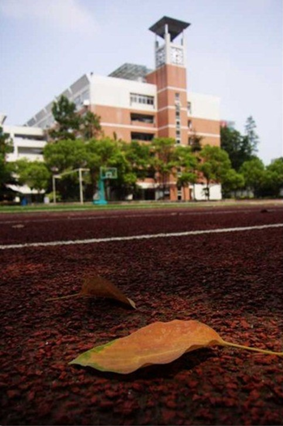
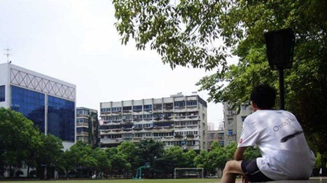
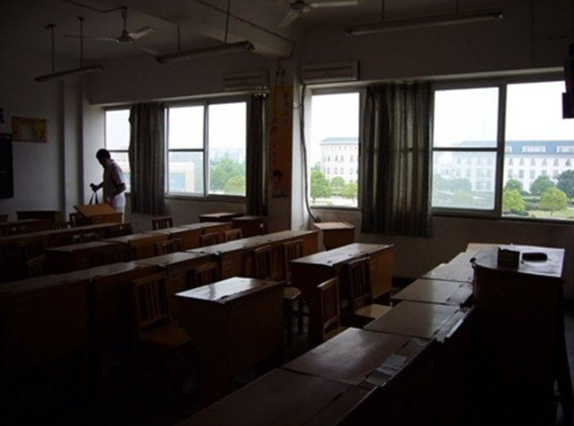
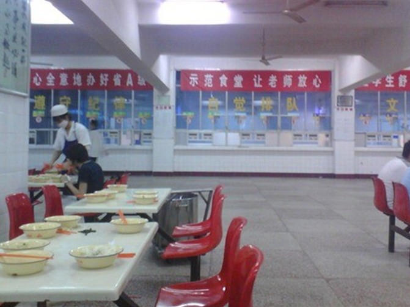
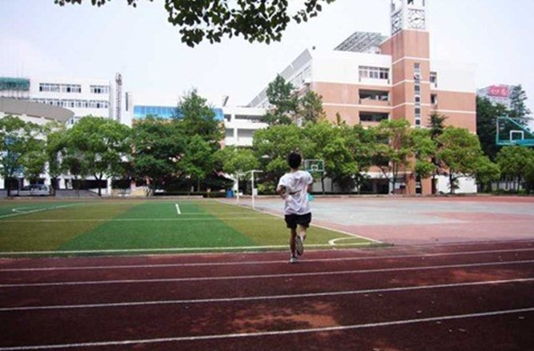

# ＜天璇＞十八岁开始苍老 Once There WFLS

**上了大学之后，我仿佛失去了几乎全部的棱角。虽然也闹过一些事情。但总之锋芒是已经消去了。一个不关心学生的学校，变着法的抹去了许多曾经自以为傲的东西。WFLS对学生的重视程度远非WHU能比的。至少，很幸运的我们遇见的绝大多数老师都是为学生好的。也许对一个中学来说，对学生好一点，重点率高一点是理所当然。那么WHU这种教授都留不住的学校，让人真的只能樱顶一望满目苍凉。在一个不尊重学生的学校里待着，实在不能说WHU的时光比WFLS更快乐。也许因为这样，所以老去了罢。**

# 十八岁开始苍老 Once There WFLS

## 文/ moonick（武汉大学）

我们都老了，于是变着法儿的想过儿童节。就像小时候变着法儿想当大人一样。 我今年心理年龄46，已经很老了。我想，我一定是在大学里老去的。在WFLS的6年里，那些灿烂的时光，大约就是我全部关于青春的定义了。 有那么一些日子，既不装嫩，也不太希望长大，我们甚至也没有觉得自己很年轻。不去幻想太多，也不回忆什么过往，只是单纯的每一个星期每一个星期的活着。在我看来，这段时光，叫做WFLS，我想我大部分的朋友也是一样。 这是我们梦开始的地方。还需要更多的什么理由吗？ 

这是很有意思的一所学校，会在六一儿童节给初一的学生发零食的学校。我似乎还记得初二没有发零食的时候的样子，想来却又很模糊了。 在这个园子里，以及园子周围，我们曾经如此快乐的活着，如是而已。 及至到了大学，才发现这多出来的许多事，并不带给我更多的快乐。到了大学毕业，回头看，原来一直只是在靠WFLS学到的东西在大学里混日子而已。 大学，至少我待过的武大并不是象牙塔。也许珞珈之山，东湖之水曾经是吧，在那久远的不属于我们的时光里。我更愿意相信我曾在一个小小的象牙塔里待过，那是我们的WFLS。 那时候看许多的书，讨论些不着边际的问题，男孩子每天还要运动。我记得初二万松园的新楼刚修好一半，我们跑上楼顶吹风聊天的时光。跟狒狒聊哲学跟肥罗聊历史，然后看着天空渐渐暗下去。我们在周记里辩论，或者写下自己稀奇古怪的想法。那位在夏天几个月穿衣服从来不重样的语文老师会读我们的周记，那是我上过最有意思的写作课了。 上了大学之后，我失去了这些所有关于少年的东西。没有卧谈的气氛，没什么人一起讨论学习上的东西，更别说奇思妙想，理科也没有什么有意思的教授。做实验也不再有人想些稀奇古怪的东西来试试。学得索然无味，自己有时想想何特死擂擂死的气魄，才在德国的实验室里好好的死扛着下来。 直到现在想起空集这个概念，我还是愿意跟别人讲徐航那个著名的例子：什么是空集？外校的飞机就是个空集。但是万一哪天燕老板买了1架飞机，那外校的飞机就不是空集了。 而武大，很抱歉，除了陆保生军事理论的语录，就很少让人印象深刻了。 脑袋不怎么动，身体也不怎么动。人就这么在大学的时光里老去了。 

就算考前突击，我也不再有那时一晚上做完一本生物练习册选择题的激情。也不再有全班一起1个小时做完理综全国卷三然后调侃的那种轻松的氛围。我失却了对学习更多的渴望。于是我在大学里老去了。 在大学里我读完的书居然不超过五本，即使在诗社里，我也不曾再读完过一本薄薄的诗集。我不是一个文艺青年，至少现在不是。如果我文艺过，那必然是在每一两个月读一本书的WFLS。那时候江筱站在报告厅里念她自己写的诗。那叫“梦开始的地方”。那时候班上排了全男生的课本剧，晓风同学女装更是拿下最佳女主角第二名。没有相机，没有PS，但是有一些纯粹的文艺的东西，很快乐的在那里。 

WFLS不大，似乎年级里每个人都多少认识。也有许多感情的故事。甚至有许多人有小本子写下来。每个人年轻时都有一个自己写就的小说。有的写下来，有的在心里。那些小小的心思我们都忘了，但是人物依旧活着，如此的生动。大学很大，有许多的爱情故事，分分合合的，我看着这许多的事情，然后，我老了。 有那么些时光，真的可以茶饭不思，听不进课，懒得做作业，但是不可以不去想一些事情，甚至考试的时候也一样。大学里我甚至付出了挂科的代价。可是有些事情，等明白了之后，已经不再是当时的自己了。无论怎样去念叨18岁来年春天的那次遇见。有些事，都已经不可避免的老去了。 

有一天我梦见和赖龙一起在食堂吃锅仔，然后又去小卖部买泡面。小卖部的货架似乎都还很清晰。我记得某次调考数学挂掉，很郁闷的跑去找肖老师，后来吃着饭，他还说到大学一定会长好的。我到现在，还没长胖，大约总是一个人吃饭的缘故吧。大一那年回沌口，一排人去老师那边的食堂混饭吃，每个人喊一句“一样的~”都还是那么有默契。 WFLS的条件不算很好，高三那年说是报告厅漏水不让我们开圣诞晚会。澡堂的挡板上长蘑菇之类，夏天宿舍连淋浴的喷头也没有。但是大家一起跟这环境斗争的各种奇思妙想也是很有趣的。那个频繁停电的夏天，孟爹给发了蜡烛。可是何特发下卷子之后就停电了，大家果断的集体翘了考试出去游荡。然后我和哈聪躺在球场的草地上看星星。高三那年不然参加运动会，侃侃带着大家跑去还拿了个奖状回来。后来何特还恶搞了一下，多么欢乐啊。 

上了大学之后，我仿佛失去了几乎全部的棱角。虽然也闹过一些事情。但总之锋芒是已经消去了。一个不关心学生的学校，变着法的抹去了许多曾经自以为傲的东西。WFLS对学生的重视程度远非WHU能比的。至少，很幸运的我们遇见的绝大多数老师都是为学生好的。也许对一个中学来说，对学生好一点，重点率高一点是理所当然。那么WHU这种教授都留不住的学校，让人真的只能樱顶一望满目苍凉。在一个不尊重学生的学校里待着，实在不能说WHU的时光比WFLS更快乐。也许因为这样，所以老去了罢。 德国的天气时常让我想起WFLS，雨后的万松园，阳光明媚或者下雪的太子湖。有一天我终于明白是什么让我如此印象深刻。答案就在那些下午下课后悠长清闲的时光里，踢球，或者在操场边听歌或者在教室里聊天看杂志。那样悠长而安定的时光里，不经意记住的天气和光影，是那样的美好。我时常觉得WFLS的校园很神奇，竟然很有些欧洲的意味。在那些悠长的时光里，没有手机电脑相机的纷纷扰扰。我们有才气和梦想，有校园里回荡的英文歌曲，有操场上奔跑的身影。这样的活着，要怎样才会老去呢？ 以前，每天八点多下第一节晚自习我总要和萧然出去看星星。如今他已经自称老辛了，大约也是过了个窝火的大学然后老了吧。 德国的夏天到九点还亮着，我已经好长时间没看星空了。远方的WFLSer， 大家都还好么：） 我不知道你们是否和我一样，离开WFLS之后就渐渐老去了。 但我可以肯定，在那样美好的时光里，在WFLS里，我们爱过。不是爱一个人，或者爱什么东西。而是对那段梦开始的时光的热爱。 

———————————————————— 看到这么个煽情的标题的时候，我似乎正好十八岁，或者也许更年轻一点。十八岁那年，我在我的MSN Space里敲了这个标题，存在草稿里，然后忘了去写完。今年，我23岁，MSN Space已经灰飞烟灭，有些事情，不仅老了，甚至已经作古了。 十八岁开始苍老，是的，18岁以前，在WFLS的时光里，我一定不曾远离青春。 流苏拂动，一时多少流年。 逝之如水。 **转载自**[流年的平面设计](http://moonick.net/) **本文链接地址****:** [十八岁开始苍老 Once There WFLS](http://moonick.net/2011/06/ages-after-18-once-there-wfls/)

（采编：陈锴；责编：陈锴）
