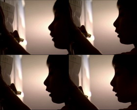
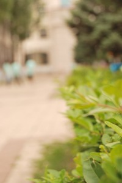

# ＜天璇＞十六岁的幻想

**再不荒唐就老了，年轻时候没有荒唐过，最糟糕的就是年纪大了用不合时宜的做作的轻狂和狷介哗众取宠——十六岁的你是不是一样？现在的你是不是还在做着十六岁那样的努力？做着那样的梦？你是陷入贪婪的求知中还是无尽的感叹和炫耀中？还是用非常的办法和手段为了成全十六岁的自己？**

### 

### 

# 十六岁的幻想

### 

## 文 / 朝夕（北斗撰稿人）

### 

### 

王勃十六岁的时候写了“冯唐易老，李广难封”，《滕王阁序》就是一个十六岁青年的满腹牢骚，作为文官制度的牺牲品，他没有机会看到后人对他的评价，世人也大概永远会原谅他的矫情和不识愁滋味。因为他最绚烂的瞬间就停留在十六岁。

我十六岁的时候幻想着我自己是个怀才不遇的人，是不能被世人欣赏的奇才，像每个异想天开的小孩一样，觉得自己鹤立鸡群，遗世独立。你别笑，有些事十六岁的时候不做，就晚了。就像十六岁的时候另外一群人相信可以开着跑车住着公寓，喝着星巴克，过着小资的生活。我最迷茫的时代里，往各种主流文学杂志投稿，曾经想要参加新概念，开了一个又一个博客，甚至学会写主页代码，我参加选秀，我参加歌手大赛，我在论坛和贴吧里纵横捭阖，一边吃着泡面一边和人称兄道弟。我望着博客里可怜的流量感到一片荒凉，那时候还不太知道什么僵尸粉，刷来访的事情。

世界上只有一个韩寒，只有一个郭敬明，而世界上的异数并不需要太多，只需要个把偶像。若干年后，偶像还是那个偶像，故事已经随风散逸，而匪我思存，南派三叔，当年明月这样的人早就走上了职业化的道路，他们不靠一夜成名，他们只是比较职业，我才知道，文学永远不是用来投机的筹码，而是靠笔耕。

我经常遗憾现在已经不再有那时的灵气和大开大合的笔调，但是没大关系，大学的时候一个教植物病理的老师说，你们不要死记硬背，二十二岁以后的人学习都是靠理解和联系，我们所失去的那些是注定要失去的，而属于我们的会纷至沓来，这就是时间给我们的，应当感谢。

往往我们从暴得大名的投机者的书中看到了世界，比方说政治，那年头还流行余杰和孔庆东的时候，我们对政治不过一个肤浅的认识，充满着新鲜和激愤。一个少年是陷入贪婪的求知中还是无尽的感叹和炫耀中——仅在一念之间。当我们知道了张朋园，杨奎松，金观涛，秦晖，我们知道了弗里德曼，凯恩斯，在一个聊起这些就能显得自己学识高尚的地方似乎太多人忘了自己本来追求的是什么。就像喜欢摇滚的女青年被乐手干了一样的感觉，忘了最初的来路——这一年我二十二岁。

你到现在都还是白衣一个呢！十六岁的我跟现在的我喊话。我说：安了，我很好。

我为了书中的一段推演击节赞叹，我听那些很被欣赏的音乐神魂颠倒，我为肥皂剧中的主角着急，我吃薯片看爆米花电影，我的博客仍然访客寥寥。朋友变多了，天冷了会叫你加衣服，这些年经常坐在空旷的街头看众生，和出租车司机、面馆老板谈笑风生，十六岁的我死了，但是我生气盎然——因为我学会了取悦自己。这世界上最该取悦的人就是自己。一个人的能力有大有小，品味有高有低，每个人都有自己的癖好，最了解的仍然是自己，我和男人若手里拿着对方看不懂的《巴尔干古代史》和《正义论》，是绝对舍不得交换的。

想到罗隐那首诗：我未成名君未嫁，可能俱是不如人。原诗里有种遗憾的意味，我倒觉得这样两个人凑一对，不是挺好的吗？有第二个人欣赏你已是人间幸事，欣赏你人品，人格，做派，品味的人，不是更难得？

再不荒唐就老了，年轻时候没有荒唐过，最糟糕的就是年纪大了用不合时宜的做作的轻狂和狷介哗众取宠——十六岁的你是不是一样？现在的你是不是还在做着十六岁那样的努力？做着那样的梦？你是陷入贪婪的求知中还是无尽的感叹和炫耀中？还是用非常的办法和手段为了成全十六岁的自己？九十年代的香港作品中经常描写追梦人们跌宕起伏、悲欢离合的被贪婪所左右的生活，大陆的影视作品里大家一上来就是小资，却没有告诉你用何种方法和代价能够得到它。

世上不如意事常八九，取悦自己最高。否则时光永远只是虚度，永远没有真正的存在感可言。

你十六岁的时候在幻想什么？

编者注：本文标题为编者所拟。原题为“王勃十六岁的时候写了‘冯唐易老，李广难封’，你十六岁的时候在幻想着什么？”。

### 

### 

（采编：黄理罡 责编：黄理罡）

### ** **

### ** **

