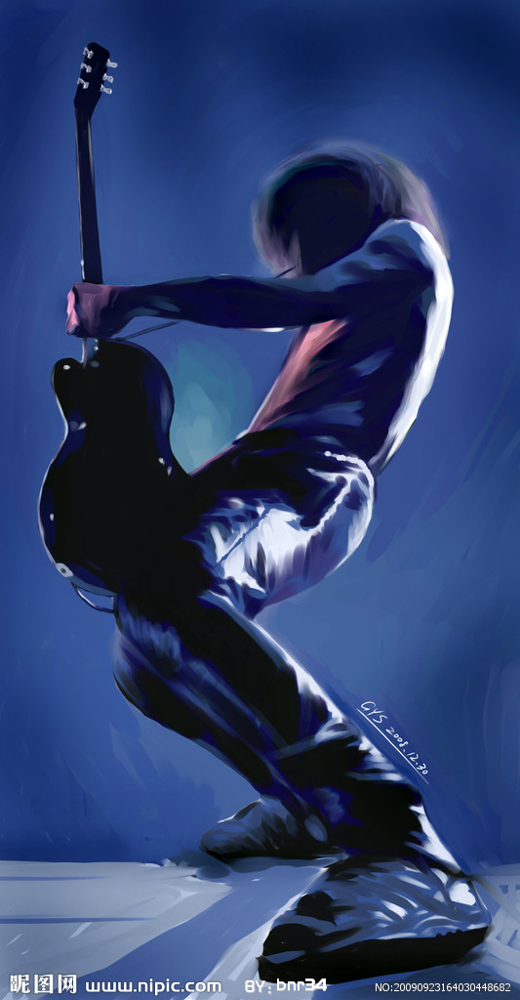

# ＜天璇＞原谅我这一生不羁放纵爱自由

**那么，关于执着和热爱着什么的心——在被工具理性和功利主义折磨了太多太深太久之后，我愿站出来坚定的说，不光是自己的，更是他人的，任何对梦想，对自由意志，对生命微光的追求，都值得仰望和尊重，值得为之消磨一生。已沦为工具的人，无所谓独立思想，更不必提自由精神；他们带着被社会所认可的成功，在自己的世界里苟延残喘，谈何抨击别人的梦想空切或卑微。**  

# 原谅我这一生不羁放纵爱自由

## 文/ 侯芳君（中国人民大学）

 

最近在看刘慈欣，就不由想到几年前，一位同学不顾一切的向我推荐《三体》时的样子：极力、执着，甚至执着的有些莫名其妙。那时候，大家似乎还都是热情澎湃的有志人士，今天有个想法，明天就会去行动——于是我办了电影社，每周五公放电影拉人气，他办了科幻社，开科幻小说和电影的讨论会，各种其它社团也层出不穷、风生水起。虽然大多数社团尚未小康，活动常常处于有上顿没下顿的境地，却也达到了聚众、闹事、犯文艺、谈理想的效果。

那时候我们都觉得，会毕生追逐自己的理想，就算拿爱好当饭吃，也能雄赳赳、气昂昂。那时候，我想当个fashion designer或者movie maker，至少会踏入传媒相关的行业，他的理想是当个数学家，就算总被说是geek或nerd也不怕。

后来，我没读艺术也没成为记者，而是学了金融，成为了精英教育中“优秀却平庸”的一份子。那位同学，倒是风生水起，虽然没学数学和物理，却直接休学去搞生物，还获得了华盛顿邮报“最年轻科学家”的称号。

几天前，表弟的大学有了着落，全家人聚在一起，庆祝又一位家庭成员脱离高考的苦海。“物理分数不够，估计分到计算机。”“后悔？”“没有，尽力了，而且倒是更喜欢计算机。”“要是我一直在高三从没来到大一，我不会明白学一门至少自己不讨厌的专业有多么重要。”“但在高三，能考680分就是得报物理，要是直接报计算机，谁不笑话你呢。”“计算机很累。”“听说过，不过喜欢它是不是会好很多？”

他说他喜欢，我就识趣的闭嘴了，毕竟我是个连新闻都没有填进志愿的怂包。混迹于私下里被戏谑为中共中央第二党校的牛逼闪闪的财政金融学院，这条路走得还算是一路凯歌，出人头地。这是家长最骄傲的，和社会最欣赏的，优秀年轻人的成长足迹。表弟说，你这条路好走，GPA，出国，读研，不费脑子，不用多想。是的，不费脑子，不用多想，相比于思考理想，前途反倒是简单的事；这条路是社会为你设计好的，一旦站在起点，就有别人、别的羡慕、别的声音，推着你走下去。太多的前辈一毕业就被大公司挖走，或者进入名字显赫的学校读研，或者在25岁拿下CPA、CFA……然而这没有外人想象的那么难，这不需要思考，只需要两点睡，七点起，坚持两年；别人能做到，我就能。

但是，25岁的，除了拥有能亮瞎别人的简历，你还想要，或者愿意去做些什么？

一个月前，一个朋友在微薄之盐开了她的专场，地方不大，没有烧钱的音响和灯光，然而可贵之处在于，她的声音透出难得一见的真诚。她说，从小就喜欢唱歌，如今能有这么个难得的机会，就当是给童年一个交代。她演出的第二天，是颜峻和廖伟棠的专场。这下我才知道，当年的摇滚圣地，无名高地，早在07年就停业了。

05年有一本很火的小说叫《地下室》，讲的是一群空有热血、生计无门的摇滚青年在现实和空想的烂泥滩里挣扎的故事。记得当时，疯狂爱音乐的我看一次哭一次，直到现在，想起那段为了挚爱掏心掏肺的日子，也不免偶尔黯然。“此一夜，铃儿响，坐拥红裘；彼一夜，棋子落无声。”我曾觉得，大多数人不可能一辈子搞纯艺术，为了一把琴节衣缩食、落魄流浪，并且冠以“为理想”的名分，这种偏执是边缘人在变相向生活的失败低头。但我错了——忠于理想不需要理由。步入中年，经历了太多次理想如空中楼阁和现实如惊涛拍岸，梦想家的眼神中减少了热血、冲动，也许多了一分世故，却决非麻木：他的心底的火种从未熄灭，仍等待一触即发。世俗者告诉你，当年是我的天真、幼稚、傻，在生活面前，爱好不值一提；但梦想家，最终，有人走向更大的舞台，迎接鲜花与掌声，迎接刺眼的聚光灯；也有人走向更加遥远的地域，继续带着一颗漂泊的心，流浪四方——总有些心灵不堪圭臬的束缚，他们的是非功过，并非他人所能评判。

当年为一台合成器跑遍大半个北京的我，最终没有把它抱回家，更没有让这挚爱生根发芽、茁壮生长。想起这无法弥补的遗憾，最好的方法也许是怀旧，就像我仍幻想在再一次坐在无名高地，再一次听到《不会说话的爱情》。

在以后的生命，如此遗憾，就不要让它再发生。

有时候静下来想，这是为什么，是什么让很多人丧失了童年时为了爱好天不怕地不怕的冲劲，包括我自己。很多次，我以为自己是被学习压力，被专业课，被未知的前途打击得越发退缩；然而真正的原因是，我害怕，一生都没有做自己喜欢的事。我似乎越来越不是个优秀的“名校脸”角色：我不太奋进，不会因为一场考试、一个证书而放弃所有欲望；我目标不明确，高三还摇摆本科是否要出国，现在还尚未计划是否读研；我不够抗压，我教育晚辈，去读一辈子都可能再也用不到的课外书，而这并非浪费时间——要不是成绩马马虎虎尚可接受，我大概要成为典型的loser了。

我的英文写作老师曾好奇的说，it seems that Chinese students care more about GPA than their learning process. 我一直觉得，精英教育的弊病之处在于，它培养了一批“未来政界、商界、科技界的人才，社会的中流砥柱”，而同时，也培养了一批趋利的、趋同的，为前途而不为理想的乌合之众。社会对于成功的标准越发量化，你的学历，你的工资、绩效、奖金状况，你所在的单位是否足够有分量，你开什么车、住什么房；重担之下，年轻的面孔呈现出外表的优秀，缺无法掩饰内心的平庸。“不了解的人看我，看到的多是我的学历和光鲜的生活；但了解我的人是不看这些的，因为那些有的是偶然，有的是机遇，有的是幸运，有的是努力。”一连串的数字和证书，不该是人生赢家的证明；教育，或者说生活，本应是教会人看待世界和自己的方式。所有年轻的梦都不是白做，生活为理想而不为前途，才不会在后半生因背弃自己而遗憾，不会因碌碌无为的内心而羞愧。“清华有一个哲匠之门，哲可以，但我不想做匠人。”自由的心灵，天生不会甘居芸芸众生的一分子，他们不会选择妥协，他们会莫名其妙般的，执着的走着自己的路。

那么，关于执着和热爱着什么的心——在被工具理性和功利主义折磨了太多太深太久之后，我愿站出来坚定的说，不光是自己的，更是他人的，任何对梦想，对自由意志，对生命微光的追求，都值得仰望和尊重，值得为之消磨一生。已沦为工具的人，无所谓独立思想，更不必提自由精神；他们带着被社会所认可的成功，在自己的世界里苟延残喘，谈何抨击别人的梦想空切或卑微。刘慈欣在《朝闻道》里描绘了一群偏执的科学家，为了获取人类千秋万代都不可能懂得的宇宙终极真理，向高等级的智能献祭，以生命换取了仅仅数分钟，却如饥似渴的满足。梦想家有时像极了偏执狂，但他们并非不懂万物永恒而生命一瞬，他们不在乎自己能达成多少，他们愿以飞蛾扑火、昙花一现的壮烈，去填补这种对理想的渴望。

很多人说，残酷的生存标准就摆在那里，不是你闭了眼，就能够视它们于不见。我不是不爱物质；我觉得我做了伟大的事情，那些东西都会随之而来。如果有一天，我也买了海景的房子，不是因为地价和声望，而是放眼望去，就是我梦中出现过的，相接的大海和天际线。

“但愿我们这群人，能有福活到白头，有福像《乐士浮生路》那些哈瓦那的老头老太太一样，唱到生命的终点，对着死亡开心地张开我们一望无牙的嘴。”周云蓬说。

于是，希望多年以后再看到这当年幼稚的文笔，我对自己说：

那一年我二十，我出发了，就没有再停下来。能走的时候我一往无前；不能走了，就停一停，等一等，再走。

 

（采编：陈锴；责编：陈锴）

 
