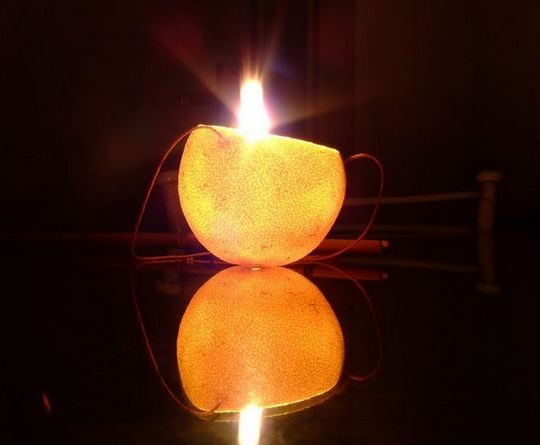
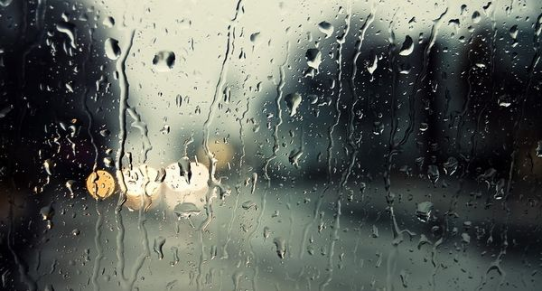

# ＜天璇＞只是当时已惘然

**我还把信写在五线谱上，就像王小波写给李银河的那样。苦于买不到五线谱的纸，我自己拿尺子比着画了一条又一条的横线自制五线谱。收到信之后他诧异的说道，“想不到有个姑娘居然为了我而画五线谱……”后来的好多事情他都没有想到。其实只要相爱了，浪漫是一件水到渠成的事。**  

# 只是当时已惘然

## 文/苏清扬（首都体育学院）

 

去年七月份，我收到了一封邮件。邮件中的他和我讨论罗素，他说因为我，他开始读罗素。熟络之后我问道，为什么我能影响你的阅读取向？他说，因为我对罗素的感情实在是太热烈了，导致他也发生了兴趣。确切的说，我们是因为罗素相识的，即使分手之后，罗素还是那个罗素，“我们”却再也不能放在一起，只能是，我，你。

相恋的那段时间，简直把浪漫演绎到极致。

下雨的时候打通他的电话，什么都不说，他听到只是淅沥沥的雨声。

我曾给他寄过一只自制小橘灯，对一个笨手笨脚的姑娘来说，把一个光鲜亮丽的橙子漂亮干净地掏空简直太难了，更何况一边掏着还得一边耐心的吃着果肉以免浪费。之所以送小橘灯是因为他曾说过，“你是我的微澜和星光。”顺势想起了冰心奶奶的那篇文章，当时觉得小橘灯再合适不过了。

当时每周都会给他写信，文字功底比不上他，字迹的优美也比不上他，但我还是会给他写信。最疯狂的是一口气给他寄出五封信，就为了让他宿舍楼下装信的小盒子全都塞满他的。信中会问他奇奇怪怪的问题，比如“橘子”和“桔子”的区别，“呼”和“呜”哪个更适合形容风声？他总会自动忽略。

我还把信写在五线谱上，就像王小波写给李银河的那样。苦于买不到五线谱的纸，我自己拿尺子比着画了一条又一条的横线自制五线谱。收到信之后他诧异的说道，“想不到有个姑娘居然为了我而画五线谱……”后来的好多事情他都没有想到。其实只要相爱了，浪漫是一件水到渠成的事。

有一次看加缪的《荒谬的自由》，没看几页就迫不及待地打电话给他，“喂喂，原来加缪和你的观点一样，他也觉得世界是荒谬的。”其实我们最经常讨论的人是郭沫若，我只能从郭的人品再论证回郭的人品，而他却能从他的戏剧，史学，书法各方面驳斥我。最后我实在不耐烦，就会甩出一句，“咱俩政治立场不同”而将话题终止。

室友经常诧异，你在和你男朋友打电话吗，听起来一点都不像啊。把这话说给他听，他答道，“咱俩什么都能聊嘛，不管是形而上还是形而下，其实咱俩是形而卡（“上”和“下”合起来）。”然后自己哈哈笑半天。

刚才翻到了一封他给我的情书。

“七月份的时候，我没有想过我会爱你，九月份，爱意已蔓延，满布在我的心里。我对你的言语，你的娇柔，我们的生活，是一座我们共同用爱意萌生的城，我们都在里面。我们在里面年华流转，在里面看城外无常的虚幻。城里有长久的所在，只要它的主人不曾离开。”

“此刻我用手机写一封情书给你，好像你正和我相对。我知道你正等我的信，但我还是不敢失之草率。教室没有日光直射进来，好像是窗外的绿荫的阴翳。此时的感觉非常的好，好像以后的岁月只剩下安惬，很想你就在我身边，看着我写这封信给你，看着我打给你的每一个字，每一个字我都灌注了我的生命，我的爱。你是我的生命，我爱你。”

从最开始相识我就知道他在考研。他是学财会的，想考北师大的文学系，跨学校跨专业的考研绝对是一场巨大的考验。

“你考上研究生之后，你会发现，原来生活这么精彩，原来可以接触到这么多有趣的人，原来你生活的圈子可以变得这么广阔，到时候，你还回想起来我吗？我总觉得，你只不过是出于考研的阶段，很需要一个人的陪伴而已，恰巧我出现了，就这么简单。曾听说一句话，‘爱是阳光，被爱是热，人们只有在寒冷的冬天才需要阳光。’现在的我对你来说，就像冬天里的阳光，你考研的日子就像没有光亮和温暖的冬天，希望我能陪伴你度过这一段，我尽量不那么那么的喜欢你，不那么那么的投入，不管你怎么劝我，怎么让我相信你，怎么言语动听地说服我，我都想给自己留一个出口，我就是这么胆小和自私，不是我固执，只不过我防范意识太强了，我才不要对任何非我的人莫名其妙的产生信任感，我害怕我就是害怕。即使你昨天说了那么多安抚我的话，即使我给你发了那样一条短信，我还是克服不了，或许这些都需要时间，或许吧。”

考研期间我们总争吵，我责怪他对我的关心不够。直到他疲倦地告诉我，爱情对他来说是种负担。他的确只有20%的精力照顾我，他说一个没有时间没有金钱的人拿什么谈恋爱；他说，他不是在和一个圣人恋爱；他说人性的弱点是没法较劲的；他说，世界是荒谬的。他说……我们还是做回朋友吧。果真被我言中，我成为了他考研路途中的一个过客。

我不太懂得经营一段感情，我还不想成为他的负担，同时我也想不通为什么我是个负担，我更没法做到耐心地陪他走过考研的这段时光。我们都太自私，这是我能想到的最好的解释。

如今他仍在他荒谬的世界中安之若素，我也在自己的矛盾体系中苟延残喘。他曾开玩笑道，他不是人。我惊诧地追问原因。他说，能做你这种奇葩女生的男朋友当然不是人喽。我听完笑了半天。看来我需要继续寻找下一个“不是人"的物种。

正好明天拉开考研的帷幕，就此想到了他。希望他明天顺利。希望所有考研的朋友顺利。

 

（采编：麦静；责编：麦静）

 
