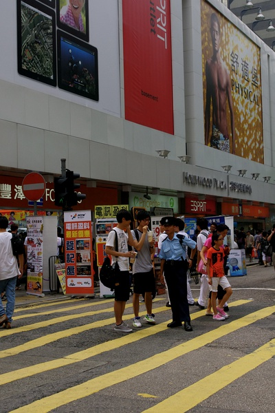
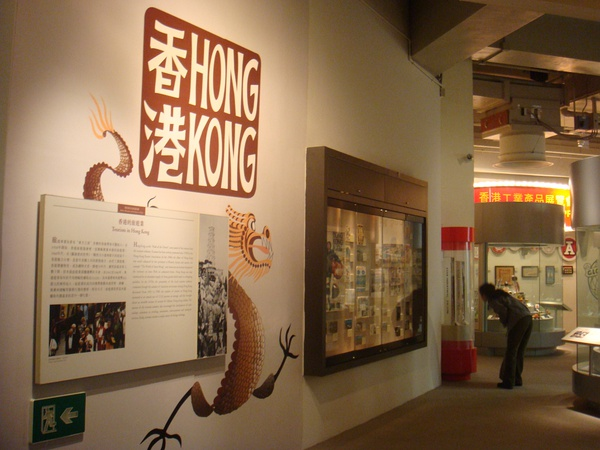
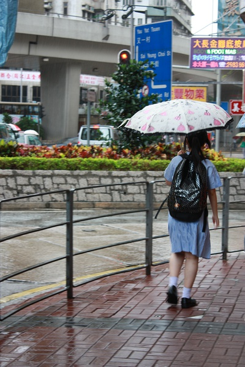

# ＜天璇＞可怜的香港年轻人

**香港年轻人们长在这样的环境里，一步步按部就班的成了一颗颗专业的让人感动的螺丝钉，推动者香港这个东方之珠日新月异。我在享受着香港的现代与便利的同时，也不免有了这丝自作多情，为他们在这样的大环境少了很多选择而惋惜，那个站在恒生银行里笑容可掬的招呼客人的女士，说不定本来想成为一个女学者呢。**** **

### 

# 

### 

# 可怜的香港年轻人

### 

## 文/刘项（香港城市大学）

### 

我坐在城市大学图书馆入口附近的沙发上打文章，面前一个个香港学生走来走去。虽然是人来人往，但是这些人看起来却都差不多。女生都像是从日本时尚杂志走出来的：她们头上顶着烫直的中分长发，或者是带着刘海的微卷发，若是有个扎着辫子的，或者短发的，那多半是内地生。现在的天气还是带着些许寒冷，女孩子们多半搭配了一双靴子，然后把牛仔裤的塞进靴子里。若是不怕冷的女生，那多半腿卷黑色丝袜，脚踩一双脚腕处V字开口的精致皮鞋。而男生呢，人人像方大同一样，他们多半顶着那所谓“飞轮海头”的发型，细细的鼻梁上必要架一幅黑框眼镜，时髦点的还要带一个黑色boston bag，挂在肩膀上夹在胳膊间，一边走一边走一边甩着另一条胳膊。 刚来香港的时候，我被香港这满大街的时髦男女所深深震撼，深感这里真是一个时尚之都，久而久之，却也感到，这里虽然时尚，但人人却大同小异。时尚这个词由“时”与“尚”两个字组成，时尚即是时之所尚，而不是人之所尚。这也是一把双刃剑，它让你获得了良好的自我感觉，获得了合群感，当然同时也失去了一部份自己的身份。我相信，香港一定也会有很多运动型的女生其实更喜欢整天穿着舒适宽大的运动服，而免受皮鞋蹩脚之苦，裙子走光之扰。香港一定也有很多高大健壮的男生，更喜欢穿一件简单的tshirt，展示些自己的阳刚风采，而不是把自己裹在修长的英伦风格大衣或是紧身细腿的牛仔里面，像大多数人一样营造一个斯文瘦高的印象。当然，衣着不一定能代表一个人的精神面貌，失去了个性打扮的机会，只是很小的一个方面。 我在大陆长大，听说了也经历了很多低效率，官僚化的待遇，所以来到香港，也为它无比专业高效的服务所震撼，不对，简直是感动。前几天我到旺角恒生银行去办业务，一进去还没来得及看指示找自己该去的柜台，笑容可掬的工作人员便热情的问我需要办什么服务，我本以为她会告诉去相应柜台办理业务，谁知她记下我的状况，直接就去里面的柜台处理，之后拿出来章表开始一阵填写，她一边填写着，还在招呼另一位来这里招人的客户。填完表，一边指示我要填的地方，一边帮那位找人的顾客打电话询问。我填完表，她也打完电话，请那位顾客稍等，同时礼貌的手下我填的表，和我礼貌的道别，然后她一边麻利的吧表格放入相应的活页夹一边招呼又一位新来的客户。我转头走了，心里却是十分为这位中年女士的热情专业感动，这样高效率的办完事，感觉只能用“爽”来形容。银行里人头攒动但是有条不紊，除了这位女士外，其他的年轻工作人员也是同样专业热情，一个个西装革履的男男女女或者在麻利的办事，或者双手握于身前，随时待命。在香港生活不免购物，不免办理各种服务，我在接受他们的恩惠的同时，也不免开始关注他们的状态。 

### 

### 

有时想想，香港这个拥挤无比的能这样高效有序的运行，并取得这么多成就，简直是一个奇迹，让香港这样有序运行下去，离不开每一个专业尽职的香港人。几十年前，乐于助人雷锋曾说自己甘愿做一颗国家这台大机器上的螺丝钉，这个螺丝钉精神也从此广为流传，现在看香港，组成他的每一个工作人员，不也是一个个称职无比的“螺丝钉”吗？ 香港年轻人办事专业，但也缺乏多样的发展机会，他们凭什么只能做香港这台大机器的一颗螺丝钉呢？虽然这也是一条路，但一个人的一生本应该有无数种选择。比如可以不好好读书当古惑仔，然后当上揸fit人，最后和警方合作，结束一片恶势力，上演一段真实的无间道史诗。或者去纳米比亚做志愿者，教当地孩子读书，天天和斑马长颈鹿为伍，娶个黑人老婆，几年后把自己经历写成一部惊世小说。虽然不一定要这么戏剧性，虽然上学，读商，进公司，升值，供楼，老死也是种活法，这是唯一的活法吗？ 

### 

### 

看看香港的各所大学，没有几间大学还有历史，哲学这些“没用”的专业了，其他的任何专业也都恨不得把“实用型”，“专业性”这样的词汇写入专业的名称把，把“受到雇主欢迎”，“毕业生薪水高”写入课程描述，把市场营销，商业交流这样的课挤进语气风马牛不相及的课程架构。那些一心想探求真理的香港学生，会不会因为家长的反对，朋友的笑话或是相关课程的稀缺，逼着自己选了商学院呢？教育配合世俗，世俗还侵蚀追求。香港物质丰富而诱人，精明的商人不断创造新的消费需求，不断地把现有的消费需求细化，等级化。原来只需要洗面霜，现在需要卸妆液，洗面奶，爽肤水，去眼袋霜，去鱼尾纹霜，补水面膜，日霜，晚霜，养肤食品。拥挤的香港到处都是商店，每天都在和不断更新中的物质有货亲密接触，赚钱消费的欲望是如此的强烈。一次和一位香港女生聊，聊到对未来的期待，她说“我要读好书啊，之后搵好工，之后要shopping啊.”再之后呢？没了，不知道揾钱shopping能不能成为支持人一生的追求。当花钱花的倾家荡产了，或者钱多的不计其数了，可怎么办？ 香港年轻人们长在这样的环境里，一步步按部就班的成了一颗颗专业的让人感动的螺丝钉，推动者香港这个东方之珠日新月异。我在享受着香港的现代与便利的同时，也不免有了这丝自作多情，为他们在这样的大环境少了很多选择而惋惜，那个站在恒生银行里笑容可掬的招呼客人的女士，说不定本来想成为一个女学者呢。 

### 

（采编：黄理罡 责编：陈锴）

### 

### 
