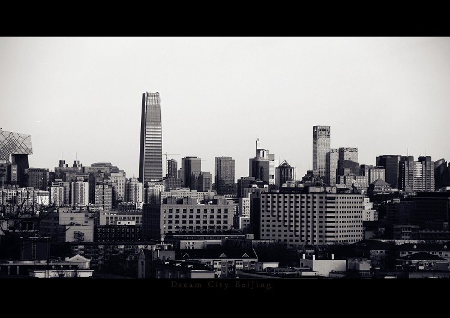
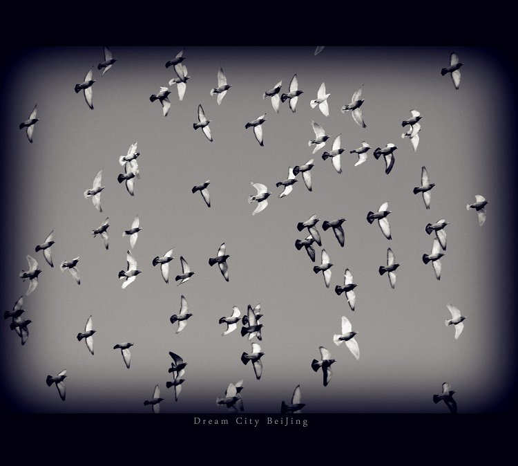

# ＜天璇＞哪怕有一天轰然坍塌

**我如今似乎隐约能理解，理想是分层次的，如一个蛋糕，上层的奶油是带给人新鲜，而下层的蛋糕是用以充饥，新鲜尝多了便是腻味，而所谓在内心沉淀多年的理想，没有它，至少在精神世界里你我将食不果腹。**

 

# 哪怕有一天轰然坍塌

## 文/ 孙习涵（北京体育大学）

  北京的夏天似乎有一种欲卷裹一切的习气，个中诸多风浪，平仄都很快被掩埋，人们依旧在众声喧哗中趋往各自的方向，如若在京城漂泊多年，许多人脸上便已读不出内心的姿态，这个城市充满困惑，不安，暗语重重，亦充满惊奇，冲动，亮丽光鲜，自踏上这块土地的第一天起，似乎回去的路就像老城拆迁一样在内心的版图里一 寸寸消失。 

无可否认，这依旧是我骂了上千次的地方，照余光中先生的比喻，北京应该算是我的情人，母亲不能骂，妻子骂了也是白骂，而我依然可以在她身上进退自如，纵使她 肌肤再是干燥，甚至有时能抚出沙子，我依然能在弹挥间寻到刺激。就如同在北风削面的冬日独自前寻红墙灰瓦中的老树寒鸦，这种情绪，如同拉拽一根牛筋，你总 在伸缩之间寻找自己的喘息之地，而这一切，并不能完全归于习惯。 每一年的高考季，当一群群当年的“我”挣脱教育体制的黑屋，奔向高校的应许之地，我总是有一种幻觉，对于这样一群热血荐轩辕的孩子，我无法对他们说，或许一切不是想象中的完美，或许有一天要向现 实赎回一切，因为我也不曾对自己说过。当然这只是对于那些知道自己要干什么的人而言，而大多数在试题煤窑里闷头作业了三年的毕业生，高考对于他们而言，只 是决定其未来四年在哪儿恋爱和DOTA。而更甚其者，在大环境的压力下，曾经有着更“崇高”理想的人，也只能先完成这两项“大学论文”的答辩环节，末了却忘记了自己人生的论文从何开题。 梦想这东西是无法解释的，倘若我们能解释为何有这样的梦想，我们自然能解释为何会最终丢失它，这就如人类哪一天忽然发现自己能直立行走了一般。我记得自己小 时候有一段想做个三轮车夫只是因为同伴骑着三轮车把我摔到了车底下，趴了一个下午才弄出来。梦想和恋爱一样，至少也得过个几日才腻味。高一时候，被尼采哲 学浸渍头脑的我告诉周围“我要拯救世界”，在当时假态繁荣的中国大陆上的一所普通高中里这话就和“我的梦想是当国家总理”一样，无法被理解本只是一个结果，但在中国这结果显然会导致你原本的地位也消失殆尽，因此我经历了整整一年黑暗的孤立岁月。一年之后我给当初的这一“妄想”赋予了实际的内容，我觉得自己要做新闻。 

未进入高校，你无法设想“信仰”到“姓怏”的 转变，或许在中国高校，多数新闻专业课除了让人知道什么不能说就没有比这个更有价值的了。尽管我们在网络这块无风险的阵地攻击权威和体制，为弱者叹息，而 首善之地的空气依旧充满了和平的味道，一如在老北京错综复杂的胡同里绕行了一圈接一圈，乃不知有汉。众瓮牖绳枢者在自家书房里起事成“意见领袖”的时候，我们这群原本是公民社会的推动者，未来改革的策动者，“手无寸铁兵百万，力举千钧纸一张”的传媒人却只能撅着腚儿跟随。当我们知道越多真相，却越感无力，我们站在“鸡蛋”这边，却无法以身试墙。我要做新闻，而三年之后，谁来告之于我，新闻是什么？托克维尔说“民主是把一个人永远抛回给自己，最终将自己完全禁锢在内心的孤独里”，那么，新闻是否也终归如此？然而，我明白，现在远未到怀疑一切的时候。 我从未评价过大学生通宵DOTA ，三国杀，因为多数人没有一个愉快的童年和自由的少年，也从未评价逃课，因为逃课往往比上课学到的更多，但把理想当石油一样消耗却不值这个价，80年代最牛的话是“我穷得只剩下理想了”。 但毋庸置疑，中国人是极为趋利避害的动物，红绿灯齐全的大街上人们依然在用最原始的躲避车辆的方式过马路，从另一个侧面说，人们无法静下来等候一个方向。 制度不是最好的东西，但事实上，许多时候正是对原则制度的轻佻，让人不知该往哪里走。而理想，作为内心深处最原始的制度，一次次面对这个制度被利用，被篡 改，被轻视的社会，仍然能坚持到最后的都可谓之为强者，而许多人最终输给了自己，就如我一个已毕业的朋友说他曾经的理想是做个记者，如今也算看透，以后并 不愿走这条路。他的理由是把爱好当工作是件痛苦的事。 我如今似乎隐约能理解，理想是分层次的，如一个蛋糕，上层的奶油是带给人新鲜，而下层的蛋糕是用以充饥，新鲜尝多了便是腻味，而所谓在内心沉淀多年的理想，没有它，至少在精神世界里你我将食不果腹。 

李海鹏在青涩的年纪怀着人道主义理想入主南周，有了资历如今亦跳出媒体圈子闲散过活，抛下一句“人们只会说这是个‘体制问题’。”说他疲惫也好，看破也好，他依然保留着对中国大陆守望的姿态, 哪 怕是站在自己的神坛上，而这样的距离或许恰恰适合于他。太多人沐浴过南周的洗礼，同样包括李海鹏自己。无论它是否朱颜已改，来日几何，这份我读了八年的报 纸依然会亮着孩子般天真的双眸，在特定的时间和地点发出澄澈而有力的声音。大陆并不缺怀着新闻专业主义理想的人们，缺的是给人以文化归属感的媒体，好像当 年名噪一时的中青报《冰点》栏目。理想主义的心总是漂泊的，而漂泊总归要寻一个依靠，试问如今大陆有几家媒体能如家一般“收容”一群漂泊的赤子？而我似乎 从未想过在房价飞涨，车如流水的现实城垣里，自己当初的那份源于漂泊的孤独会否走到一个结点，我亦不愿去设想。 梁文道说：“要做新闻就去大陆。”的确，这是一个关隘深坚的大陆，也是随处能嗅到改革硝烟的大陆；一个围观主义哲学盛行的大陆，也是一个心怀慈悲和激情的大陆，而现在我们站立在这块大陆的文化心脏，我们似乎早该放下抱怨。是的，也许哪一天一切轰然坍塌，我也绝对无悔于最初的抉择。  

（采编自投稿邮箱；责编：陈锴）
