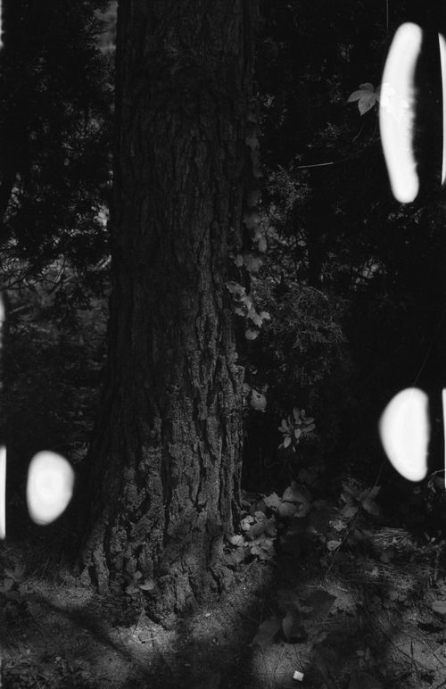
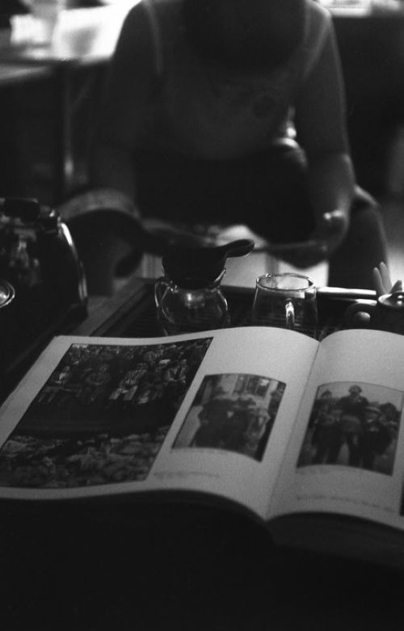
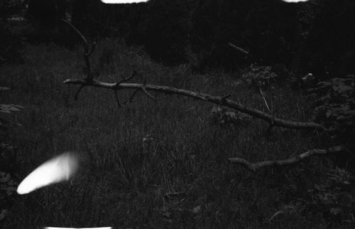
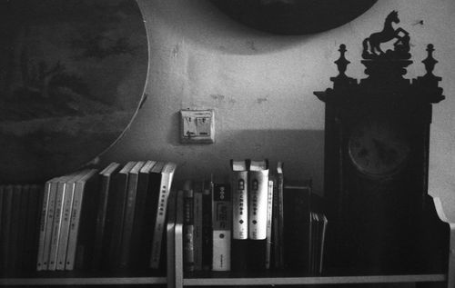

# ＜天璇＞四月随笔——得意之卮言

**我想一个人在经历了风雨获取家人与眷属，拥有豪宅后再去躺在那片粼粼的海滩上晒太阳的快感也许和之初一穷二白的懒汉相似，可是不会一致，世界本不会只有好与坏的二元对立，世界的谎言存在于这样的驳论里，意识到，别说穿，安身立命，自得其乐，独善其身，洁身自好，在这个颓废的情怀里光芒会炫如火焰煜耀，闪耀，心绪里的火焰不会被冷水浇灭的。**  

# 四月随笔——得意之卮言

## 文/郑皓中(中央美术学院）

 

### 3.31

欲望之源泉，生机勃勃，巧则通常有秩，愚淤至凝滞呆泄，最近几日迷上了摄影，出自罗兰巴特的引导，之初于巧合遇见古董旁轴相机，当即被其古拙典雅的外形倾倒，留下了深挚的念想，受罗兰巴特的摄影散文撺掇，还没有翻上几页，我的欲望，当然是芷凝的欲，如火山的喷薄之势，忽的，喷发。书就这样闲置了两日，惭愧会有的，可想到漫漫人生，束紧的焦虑好再松垮些，也罢，明日再来。

是的，在欲望面前我总会如赌徒般的痴迷，沉溺，世事抛在脑后，孤注一掷的悬住，一头撞在了墙头，眩晕的痛被麻痹的欲望替代了。

我遇见过声势皆浩大的人，我一度怀疑这样的人能否说悄悄话，他们的豪情无揽地绽放，我也会羡慕一瞬，转而暗自地骄傲，还是我这般的内敛些好吧。

一个赤裸裸的富人，幸福与满足完全的依赖于他人的见地，或者往日的恩人与仇人比其自身惨峻，其当即嘴角止不住的得意，左右轩辕，苦恼也会无遮的粘在脸上，偶尔又自得一会儿，原因出自他人的悲伤，被其痛苦，其又暗自地得意。真实的人没有的，可是真诚荡然无存后，无交流。人和人的遇见展示其的资本，愿受人羡，如此的赤裸裸二元法，好无知，好清澈，好不真诚。 不会自嘲的人离悲剧咫尺，不会保持自省的人喜剧也悄然的离之千里。

尼采，鲁迅，罗兰巴特，诸位先生，恕罪，今晚我因沉迷摄影，竟忘记，擅自不读您的著作，恕罪。恕我得罪。

 

### 4.1

愚人节，可以借此机会开个玩笑，善意欺骗的节日。

苦的感受是纠结的，印在心结里，卡在缝罅，憋着，惴惴不安的禁锢。

心慌能写出什么样的文字，文字怎样从心里淤积的细缝中挤出，我来尝试一下吧。

 

### 4.2

酬酢 酩酊 酲酲混喜

 

### 4.3

翻看4月1号学的文字，看得出心里淤积的时节，文字淌不出来的，“我来尝试一下吧”，下文便没有了，下文只剩下了纠结，悬在一处，懊恼，恓惶，废然忧戚，文字看来是需要快感支持的，快感来自于一种游戏或自娱的基调，白话“自我满足”，这也许是一切艺术的源动力，源动力的重要即是真诚在艺术里的重要一般。

其实颓丧是带有贵族气的，颓废是在物质的满足后（欲望满足后）的一种消沉，有那么一点自得其乐，虚荣的失意感，微微自得继而自忧的喜悦，我们无法想象一个整天连吃喝都成问题的乞丐怎样的颓废呢。

前几日我每日的时间极端的用在读书与记生字，到深夜，眼睛红肿着，精神因为高度地集中，急躁过后锁定禁锢自己的生理，持续在吞噬有知的快感里，挚友在玩着游戏，蓦地喜纳，游戏通关，幸福的样子，烁烁发光的眼睛投向我赤肿的眼泡儿，我戏谑的说：“无聊”，友快答:"我觉得你也很无聊”。一只冷箭射过来，将我的虚荣坠下马来，是的，我对知识的攫取，源自快感与友正在通关中的游戏的快感如出一辙，或许她的快感更悠长更猛烈，那么无聊也是同等的了，而且我们都是建立在自得其乐的基础，兴许我的虚荣更大些吧？这一句犹如醍醐灌顶的无聊，让我凝住在自我的臆想中，思索着无聊其实就是无意义的意义在哪里？难道只是快感吗？除了快感我们这样的形式有什么样的区别呢？

我想类似这样的诡辩还是有一些的，比如当你欣欣然精心的做出一道美食，重金买下古董，真诚饱满的倾注心血画完一幅画，经历波折换来一首诗等等，都可以被无聊，“我觉得都一样”，“不就是个破罐子吗，就值那么多钱”，“看不懂”，“没有意思，不如儿童画”，当这个时候这些拥有者的自得被击得粉碎，皆是下来的无意义是否使人绝望，纠结。

看来我们在快感的层面都是一样的，同等的，原始的触觉不会因外在物质属性的差异而形成同一标准的高低，一个积攒多年的经验学识与金钱的古董收藏者买得一件古玩的快感，和一个骑着电动车泡在网吧投入金钱充值杀怪升级获得装备的人差异不会有固定的悬殊。

这个驳论还扩展到另一个关于幸福值的小故事——

在地中海的某个沙滩上躺着一个赤足的单身汉，和暖的阳光晒在他古铜色的脸上，眯起眼睛，睡意淳淳，一个商人经过此地，看到他这样的懒惰，用脚将他踹醒，问：“你怎么还在这里睡觉，别人都已经出海打鱼了”。

“然后打上很多鱼就可以卖钱”。

“然后呢？”

“然后就可以再买一些船组成一列船队捕更多的鱼。”

“然后呢？”

“然后卖完钱可以购买一座庄园娶妻生子养狗打猎。”

“然后呢？”

“然后你就可以在你别墅的海滩上晒太阳。”

“可是你现在就打扰到我晒太阳了。”

这样残酷的无意义驳论让我体会到一丝颓废的意思。

在这样的驳论面前，首先要承认在基础的源动力和实现后的持续快感上是一致的，前面已经说过古董藏家与网络游戏参与者的快感，而且都会在快感满足后一起失落，旋即挑战新的目标，可是也许我们忽视了另外的一层意义，便是我们的无聊是建立在自得其乐上的快感满足，比如玩游戏，比如购物等等，都是自得其乐的宣泄，这个至关重要的前提之后会有那么一个长长的线牵动另一方的眷属，眷属就是理想的部分，理想不是一个自我满足的概念里，理想是带有集体性的，或者需要给众带去自己醍醐的一个明志。

我想一个人在经历了风雨获取家人与眷属，拥有豪宅后再去躺在那片粼粼的海滩上晒太阳的快感也许和之初一穷二白的懒汉相似，可是不会一致，世界本不会只有好与坏的二元对立，世界的谎言存在于这样的驳论里，意识到，别说穿，安身立命，自得其乐，独善其身，洁身自好，在这个颓废的情怀里光芒会炫如火焰煜耀，闪耀，心绪里的火焰不会被冷水浇灭的。

 

### 4.4

清明节无记录，混混沌沌听着阿城的讲座录音睡着了。（4月5日后记）

 

### 4.5

交谈中互相梳理思路，汇集之处，碰撞，有了些许快感。

不高不矮的个头，肩膀是宽薄的，纤细的腰部也可称之为“倒三角”，肤色黄中带黑，略显颓意，有些零散的暗红色粉刺散落在额头与侧腮，青春的样子，深陷的眼窝陪着两笔敷贴的疏朗的黑眉，眼睛如孩童般清澈，消瘦的脸，平庸的唇与鼻子，都因为这深邃的眼窝下的俊瞳有了样子。

男女之间的心智有了差异，沟通会出现障碍，一方的情感经历颇多与另一方对待爱情的方式截然不同了，往往第一次会显得幼稚，取而代之的纯真和宝贵，难免强词夺理，第一次的无知遇到多次的淡然，第一次的紧张遇到多次的释怀，第一次的紧缩腼腆遇到了多次的施然然，这是生活里的许多吧。

行走在阳光里，无风，空气里没有味儿，宽阔的马路，间或驶过几辆车，好像也是宁静的，柏树枝在阳光下有些发黄，黄与绿掺和着，有着生命沉淀后绽放第二次美丽的姿色，摄影会改变人看待周围的方式，平时无视的场景，有视了，文艺腔是说“重新张开了发现美的眼睛”。

实话实说是难得，礼仪，礼貌，五常，五伦，都是让人不要直接的表达心里和生理的愿望，故事也是婉转的表达理念，面对丰臀肥乳，收敛色心，有礼仪驾驭，藏着吧，性征起着作用，还有眼神可以听大脑缓缓神儿。

紧张的时候是因为害怕，害怕失去，害怕痛，攻击随在紧张后面，腼腆是紧张的面纱，下次看到腼腆的姑娘，原来后面藏着攻击。

 

### 4.7

吃饭是件顶重要的要事，填饱肚子，果腹，充饥，满足基础的饥饿。后续的花样，美味，无穷尽的翻新与传承，食材的归纳，火候，花色，味道，香气，甚至掺杂人的意识形态，所以吃可以说是人的过，美丽的过。

我喜爱吃，不喜欢吃的人是极冷漠的，了无生机，无情趣，少时我喜爱味周遭的香气，午后放学的路上，要经过一条小吃街，一路的菜香。哗！含水气的菜倾入油中，悦耳之极。又听到咕咕的油炸声，噼噼啪啪，铿锵琤琮。眼前头顶悬着，飘着丝丝烟气，油气，我喜爱这样的世俗生活，双脚踏实的临近大地，周围的人近的声致远消失，远的声音缓缓转到耳边，欢笑的，孩子的尖锐哭闹，一派沸腾的人间阆苑。

家中有电视，我爱锁定美食频道，跟着厨子的刀法，烹法，饪法，接连叙叹叫好，眼福总是算饱了。

看汪曾祺先生的书，畅聊饮食，娓娓道来的见识，真是开阔却不玄乎，令人心服口服饱腹饱心。

人对于攻击是有克制的，极力想克制。克制的总想再跃跃欲试，再挑事端，攻击是天性。天生动物性，克制才能见人性，那还是做个人兽好些，纯粹的人，纯粹的兽，都蛮可怕的。

 

### 4.8

因观看《勿忘在莒》步行至家已近十点，此因至昨日笔记未成，好勉强，多半是因为懒惰吧，看戏至十点这样的借口也算说得过去，这些字是在为昨日的过失背过。

古典戏剧我几乎同等于白痴，少时与奶奶共处一室之时，间或听过咿呀之音，我进入不了那样的情景里，因为现在的戏剧，电影，总是把人的想象填满，人也懒得参入古典戏剧的大片空白了，想象变成一件难事，奢侈之事，大型新编吕剧《勿忘在莒》这出剧里的立意分明，世俗之际，类似韩剧，看开头，皆为就差不多知晓，可是这样的世俗局的大悲大喜，是惹人喜爱的，新编的吕剧，为了顾及现代人的感知能力，多少采用了灯光变幻之法，和所谓的音效，无非是声大点，立体声用在丰富想象力来入境的戏曲中，难免是多余的，唯一的功能，即是在大的礼堂中好让人听的更清楚些，此次体验，我多少奢侈了一会儿，参与到情景里，善用了想象力，果然效果卓越，入戏后，被催眠，有些痴醉，传统与现代的断裂，不是一时用声效灯光便能接的上的，体会者（如我）也只好走马观花的看看吧，只能看看。

 

### 4.10

焦虑时常伴随我，烦恼应运而生，运，焦虑的运，惶惶忽忽废然恓恓然，身子却清了，轻了些许，头脑空空如也，暂时不再强迫记起那些烦恼，或者烦恼来临，也冷眼旁观，懒得理会。

爱好，潜入世俗，投入的去沉湎，其实是在试图忘却烦恼，忘却忧虑，忧虑什么，其实就是在忧虑些黏糊糊的情愫。

不服气，不顺心，总是是气不会畅通，心不顺达，凝固的，围困住自己，逃遁的方式不是简单地直线，曲曲弯弯的另辟蹊径，选择爱好，忘掉忧愁。

我近些日耽搁掉读书，绘画，沉湎在琐碎的爱好里，盆景，苔藓草盆景，想起来，一股拙气，执拗的，投入的，如一根筋的孩童，拿起凶器（螺丝刀），去挖掘潮湿的角落罅隙中的苔藓，毫不留情，一次次挖掘，在拼贴，拼贴再喷淋，期待，草盆中植物的生长，期待未知，定知，忘记已知，未知。

 

### 4.11

一个人于斗室存在，逍遥且多情，两个人安于斗室，无情的束缚，缠绕着，推搡扭捏，造作似熟昵，心早就飘得老远，老远，远到一颗也望不到，走开吧，让我扎在这里，杵在这里，凝固在这里，把这个订做的劣质沙发，坐的塌下来，坐穿。

风吹煞草木，哪是徐徐，分明呼啸着左右摇摆，颤抖，如卮无定理，风向哪吹，草木倒向哪边，反作用踅回，酲酲然的醉态，草木真是些无情，茁壮的呆子。

金鱼缸里有绿水，有金鱼，水面斜跨过一只管道，连接着胶皮管，也是黑色，水流从一个胶管中吸纳，在经过水泵组成的过滤器，回流至另一端的胶皮管，塑料管，滴滴答答灌入鱼缸，去其糟粕，存醍醐，鱼的醍醐，曰：“硝化菌”。太阳晒过，风吹过，氧气鼎力相助，硝化菌滋生蔓延，绿色的水铺铺陈陈，一缸翡翠，红鱼满贯，影影绰绰，暧昧的样子。比起通体通明的热带鱼缸，性感的很，有趣得很，修养，教养，学养，在于养，静静的独自沉默，独自疯狂，独自暧昧，一览无余的热带鱼缸，傻得很，一赤发白净丰满狰狞女子赤裸立于街边，疯了吧？何止性感？很傻。

这万恶的过滤器，比喻说法，如万恶的帝国主义。吱吱呀呀，因为氧气堵塞，说明书引导“可将插头反复插拔三到四次，轻轻摇晃机身，使其空气逸处。”我的气量小，集权制于斗室时常发生，当我恶贯满盈之时便是我的狂躁，我的执拗，我的一意孤行。徐先生的座右铭一意孤行，我受不了这叽叽喳喳的声音，摇晃，用力摇晃，自上而下的猛抖，砰地一声，摔倒墙上，插头拔过十余次，放下，人民的声音照样叽叽喳喳，叫个不停，集权在斗室不奏效，摔掉，心疼，斩首，坐牢，死一个，做一个，还有千千万嘛。帮帮忙，过滤器先生，您只管叫吧，我选择听水声，抽空我在慢慢修整您的问题。

过滤器惨遭我的倔强，我愿称做真诚，有动物性吗？有。谁没有？选择流水之音，琤琮之音便是我的文化，我的礼仪。

生意人，画商？画家，艺术家？画画的人，画者？教师，店主。多重身份，我选哪个，选哪个应对来者，我时常选错。昨日，与楼下衔烟斗读书，翘起腿自得读着，好安静，阳光也安逸，心里默读，千万别来人，默读完毕，人来了，哪位？五十八岁上下，退休，兴许之前在机关政府部门上班，小城市，父辈外省？无知的骄傲，自称朋友遍天下，门市间隔我处两所，是画廊，买些山水画，水墨画，差极了，像他身上的运动衣，运动衣无罪，身着这样的一副脸上，罪便来了。那种写在脸上的骄傲，一张嘴的无知，我通常笑笑，只应一个字，“是”。“唉”。他说话时，爱重复，反复阐释自己的无意义动作与行为：“这不是刚去了一趟深圳，送朋友张画，哎，反正得送，去了趟深圳啊，买的你的画筒直接扔在那边了，还能把画筒带回来吗？扔给他中了，就当扔给他，把纸卷起来连画筒一起扔给他了，反正也不贵，那画筒，你说是不是，你忘了？画筒在你这里买的，哎，这不，就这个画筒。”我该如何定自己的位置？昨天我显然定错位了，看了一眼，应了两声吧，他说：“你喝酒了”，笑：“没有”。“我在你这里买的画筒”“我知道”墙上挂着我的画，他抬头找话茬“这是你画的”我低下头继续看书：“我在看书”。自讨没趣的先生，假装镇定，反将门推错，推了几下，恍然拉开，快步逃逸。

我是得意的。

将军与反将军，攻击和反攻击。我与她说：“他真有度量，若是我，不会让你去东跑西窜。”她说“你是应该像他学学。”

开车，广播放着初中时听到的歌，穿越到彼时，气味，感受，一股脑的涌上来，初中时的游魂上了身，焦虑也有的，原来焦虑一直都有，一直都强烈，那些说成长伴随焦虑越多的朋友，你们说的言过其实了。

压力，压着我，钱吗，谈钱在文章里不脏，在为自己开脱，我要着重谈谈书，一本本书嚷着：“快来看我。”此起彼伏，另有些嚷道：“你还有一半，还有一点，还有一些，没读完呢。”诸位别急，我很着急，慢慢来好吗？说给自己听的吧。画框，画都在喊：“还不画，这张还没有调整玩呢，你只知道看书，逃避吗，你不画画了啊，你会痛苦的。”是的您说的没错，我的确痛苦了，纠结了，忧悒且忧虑了。书与画的声音盖过了钱的声，钱嗫喏的说：“别-忘-了......我。”有时，现实来了，猛的朝我踹一脚，我想起了钱先生，沮丧吗？我不，得意吗？有点。

 

（采编：何凌昊；责编：何凌昊）

