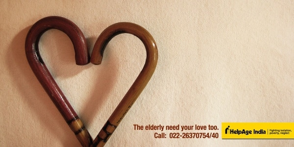

# ＜天璇＞因为怀念

**因为年轻如是，我总觉得不管是亲情，友情，爱情这一切可以在原来的位置上等我：等我读完了书，找到了好工作，挣了钱再去孝敬父母；等我忙完了专业课，考完了托福，奋战了GRE就去见初中同桌小学邻座；等我的皮肤变好了，生活稳定了，对自己有信心了就去跟我爱的人结婚。我好像从来没有想过，即使我们还是年轻的模样，可是这些人怎么不会有沧桑。即使经历了很多终于等到了，可是这些人怎么还会在原地没有远航。 **

### 

### 

# 因为怀念

### 

## 文/ 高琦琛（武汉大学）

### 

### 

在书柜里突然看到一本挺久之前买的书，叫做《一个人住第五年》。如果离开家就算是一个人，那么我一个人住多久了呢，在我写下这篇文章的时候，是我在外面上学的第六个冬天。然后我明天又要离开家了，不知道下一次回来是什么时候。其实世事无常，谁知道有没有那么多下一次。 昨天我妈妈坐在一边看着我上网，突然对我说，我跟你这么大或者比你还小的时候，你姥姥来北京看胃病，回老家的时候给我们每个人都带了礼物，然后很快就去世了。然后我妈妈说，有空多回家。再然后我就怔住了。当我在外面和同学压马路望天儿的时候，学校里为了准备各种考试的时候，斗志昂扬地走在路上的时候，为了实现自己的梦想牺牲回家时间的时候，好像从来没有想过，所谓的“下一次我就回家”还可以下一次多少次。  

 不知道你们听到背景音乐里的那句“因为爱情怎么会有沧桑，所以我们还是年轻的模样”了么，今天我在告别了一个老朋友独自坐地铁回家的时候，听到mp3里缓缓地流出这一句时怎么也止不住眼泪掉下来。因为年轻如是，我总觉得不管是亲情，友情，爱情这一切可以在原来的位置上等我：等我读完了书，找到了好工作，挣了钱再去孝敬父母；等我忙完了专业课，考完了托福，奋战了GRE就去见初中同桌小学邻座；等我的皮肤变好了，生活稳定了，对自己有信心了就去跟我爱的人结婚。我好像从来没有想过，即使我们还是年轻的模样，可是这些人怎么不会有沧桑。即使经历了很多终于等到了，可是这些人怎么还会在原地没有远航。 好像是一夜之间，我们就生活在了一个拼命工作都买不起大城市的房子的时代，一个各个阶层的第二代矛盾到不可调和的时代，一个看了纯爱的电影可以激动到哭的时代。要不然怎么走在路上看到楼盘的时候总去情不自禁地猜每平米多少钱，要不然我的高中同学撞了人怎么会被全中国人民不分青红皂白地唾骂他爸，要不然怎么大家看了山楂树出来都红着一双烂桃眼。 陈奕迅在《因为爱情》里唱，“给你一张过去的cd，听听那时我们的爱情，有时会突然忘了我还在爱著你。”嗯，给我一台过去的放映机，看看那时我们的生活，有时会突然忘了我还爱着你们。我看到夏天我妈喊我回家洗澡时在阳台里探出的面庞，那时的她特别年轻，一根白头发都没有；我看到同桌易丹上语文课的时候跟我比大腿的粗细之后懊恼的表情，那时的她特别可爱，一点忧愁都没有；我看到我和某个曾经共度过快乐时光现在不再联系的人坐在他们班前面的长椅上，那时的月亮特别圆，他的眼睛特别亮。“因为爱情不会轻易悲伤，所以一切都是幸福的模样”，其实岂止是爱情，其实何止是幸福。 

 要是怀念，就赶紧去抓住吧，别等这些人都找不到的时候再后悔，就算我们还年轻，又有多少时间可以用来等待，还有那些已经老了的人，他们还要花多久才能等到我们有时间去张看。要是没时间回家，也可以打个电话给家里说这边不冷，学习挺顺利，身体也好；要是有时间，就发个短信问问久不联系的同学过得怎么样，谁也没规定GRE不上1450就不能去见见他们；要是还有时间，就抽空在人人上问一下暗恋的人到底喜欢上了自己没有，发邮件也行；或者QQ上问一下另一半愿不愿意一起出国，没房你还爱我么；要是时间还没用完，就来写日志回忆生活中值得怀念的过往，要不，看别人回忆也好。 

### 

### 

（采编：陈锴 责编：陈锴）

### 

### 
