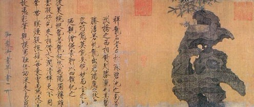
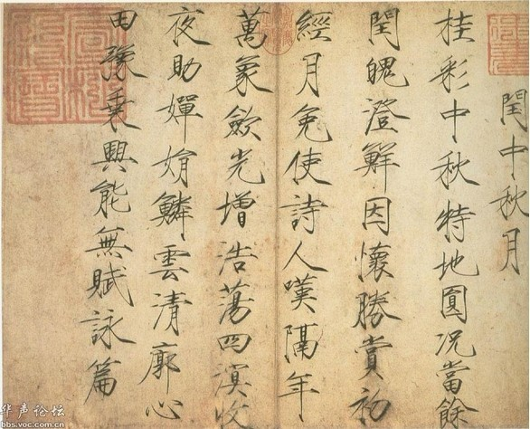
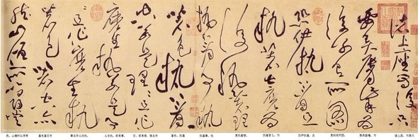
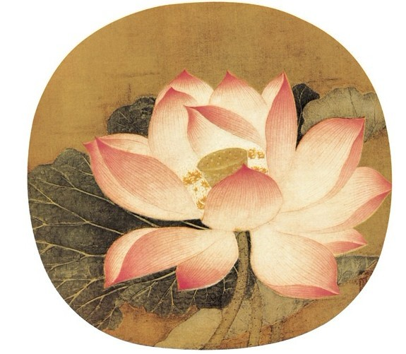
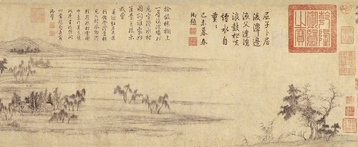
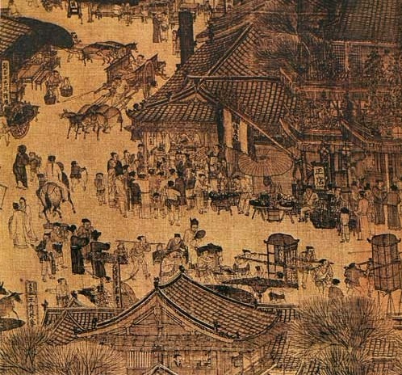
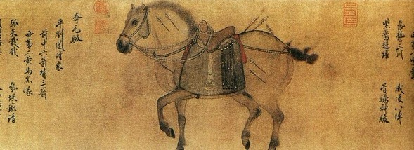
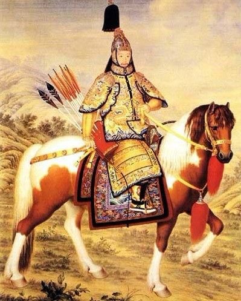

# ＜天璇＞在东京邂逅《清明上河图》

**这一个大房间，展厅确实只有一件，就是传说中的《清明上河图》。当我真的看到一个玻璃后面有一掌宽，数米长的棕色长卷搁在那里，仿佛血都热腾了。 这不是在做梦，真不敢奢望，如果我今天没有血来心潮要来上野的话，想不到我这辈子还能看到这一国宝。于是，我就被人夹着，像流水线上的皮带一样，开始贴着玻璃看清明上河图，为了不让哈气把玻璃弄模糊，只好把宣传页挡在口鼻前，然后把整个脸贴在了玻璃上。 绢本的原因，仔细看有很多地方细看是破碎了，但是总体看保存的非常好。你甚至可以看到算命先生布贴上的字和卖大饼商贩大饼上的芝麻。这幅画，真是像台历史的时空机器，当真的贴在眼前看的时候，仿佛就回到了当年那个城市一样，画的信息量如此之大，它记录了一个一个的“事件”，将空间用”事件“这个表达方式还原了出来，而且惟妙惟肖，简直是活灵活现到仿佛我的耳边就可以听到驼队穿过城门摇曳那簌簌的铜铃声。**  

# 在东京邂逅《清明上河图》

## 文/唐杰（日本千叶大学）

 

今天天气极差，阴霾，下着小雪，如果不是要去参观日本最大的建设公司之一的日本清水建设株式会社(shimizu)的研究中心，肯定不出门了。 既然必须出门，昨天就在家盘算，搂草打兔子，顺便上午拐一下，去趟上野公园逛逛，去看下柯布西耶的西洋美术馆，前川国男的东京文化馆和谷口吉生的法隆寺宝物馆。

其实冬天的上野公园特别没有逛头，但是我9点钟到了上野公园，就发现有种很奇怪的气氛，很多人成群结队往一个方向走 。跟在后面走了几步，就看到了路边一个大大的招贴：北京故宫博物院200选。

起初我心里还在打小鼓，以前也去过几次故宫，没看到什么像样的宝贝，所以对故宫印象并不太好，唯恐这次又是什么挂羊头卖狗肉的展览，所以还在犹豫是不是要继续原定计划去看建筑。但是转念一想， 我天朝上国一贯的习惯是，拿到国外给国际友人举办的展览一向是出血本的，绝对跟国内不是一个级别的，说不定有我在国内罕能看到的老祖宗的好宝贝。就靠着这点政治觉悟，我又折返回来了。 一看展览日期到2月19号，就再也不犹豫了，心想别说柯布西耶的房子了，就是柯布西耶本人今天在那里借尸还魂了，我都不去了！

随即顺着人流奔向展览地点：东京国立博物馆。 展览9点半开始，还有一刻钟，门口就已经排了长长的队伍等着开始售票，基本上都是老年人，看看我这个年纪的基本没有。 等了会，买票，进入平成馆。 拿到了一张展览作品的列表， 由于展厅内光线不好，而且密密麻麻的列表我也没心思看， 就撇了一眼。 只注意到列表上密密麻麻的作品名称前的五角星（国家一级文物的意思），心里盘算着：算是来对了。

第一个展厅主要是书画，也是日本人热情最高的地方。 我也不知道哪里来这么多日本人，挤的跟东京上下班高峰时的地铁一样。 全部贴在玻璃前，害得博物馆刊管理人员一个劲的在催：前面更精彩哟！ 我就夹在其中开始往里面走，一个一个看过来。 看到第三个，是宋徽宗赵佶的《祥龙石图卷》，接着也是赵佶的《中秋月诗帖》。 我当时一下感觉触电了一样。 莫非这是传说中的三希堂三宝之一的《中秋帖》？ 同级别的贵为三宝之一的王羲之的《快雪时晴贴》是台北故宫的镇馆之宝，这我记得很清楚。 所以当时看到那个《中秋月诗帖》，不免呆了。 当然，事后回到家查了一下，我发现当时是我记忆错误了，此《中秋帖》非彼《中秋帖》也。 三希堂的《中秋帖》是王献之的作品。 不过，因为这个小错误，从那一刻起，我的全部的肾上腺激素都被调动起来了，恨不得把玻璃拆了，拿个放大镜贴在那里看。

（《祥龙石图卷》）

（就是把这个误当做《中秋帖》了，字很神啊，瘦金体名不虚传。）

书画厅名家的精品很多，比如宋四家“苏黄米蔡”除了苏轼，别的都有，而且仅仅蔡襄的就有《 入春帖》、《孟惠帖》、《山堂帖》、《 肩从帖》四幅。 还有我非常喜欢的黄山谷的《诸上座帖》，后来买的明信片想要收藏的就是这个《诸上座帖》。

（黄山谷的字，宋四家里我最喜欢。看那两个执着，那种“气”。） 

（天然去雕饰，《出水芙蓉》。） 

第二个高潮很快不期而至，我看到了赵孟頫的《水村图卷》，在中国山水画史上这也算是代表作之一了。赵孟頫和 倪瓒的画我都极喜欢，计白当黑，空灵和出世的美 。 后来果然也看到了倪瓒的画，可惜不是山水，却也是著名的《杨竹西人像》。

（赵孟頫的《水村图卷》）

（《杨竹西人像》） 

看完赵孟頫的《水村图卷》，我承认当时能想到的最好的期望，是能看到范宽的《溪山行旅图》，但是这个想法落空了。后来回家以后搜了才知道，原来《溪山行旅图》北京拿不出来的，因为不在北京故宫，而在台北故宫。不过，谁知道更大的惊喜即将到来。

第一个展厅行将结束的时候，有一个特殊的房间，一面墙上有四五个大屏幕，并没有展品。 定睛一看，竟然是在放《清明上河图》的各个部分的放大解释。我当时一惊，真没想到，莫非可以在此时此地看到《清明上河图》？这算是北京故宫的镇宫之宝了吧。 这也给搬到东京来了？ 北京故宫还真给力啊！

（《清明上河图》局部）

这一个大房间，展厅确实只有一件，就是传说中的《清明上河图》。当我真的看到一个玻璃后面有一掌宽，数米长的棕色长卷搁在那里，仿佛血都热腾了。 这不是在做梦，真不敢奢望，如果我今天没有血来心潮要来上野的话，想不到我这辈子还能看到这一国宝。于是，我就被人夹着，像流水线上的皮带一样，开始贴着玻璃看清明上河图，为了不让哈气把玻璃弄模糊，只好把宣传页挡在口鼻前，然后把整个脸贴在了玻璃上。 绢本的原因，仔细看有很多地方细看是破碎了，但是总体看保存的非常好。你甚至可以看到算命先生布贴上的字和卖大饼商贩大饼上的芝麻。这幅画，真是像台历史的时空机器，当真的贴在眼前看的时候，仿佛就回到了当年那个城市一样，画的信息量如此之大，它记录了一个一个的“事件”，将空间用”事件“这个表达方式还原了出来，而且惟妙惟肖，简直是活灵活现到仿佛我的耳边就可以听到驼队穿过城门摇曳那簌簌的铜铃声。

后来我在第二个展厅看到了也是国宝的《康熙帝南巡图卷》，都是国宝，但是你看完《清明上河图》，再看《南巡图》， 高下立判。 虽然《康熙帝南巡图》是工笔设色，颜色艳丽 ，但是整个画片跟《清明上河图》比，画工略显粗糙，而且过于呆板拘泥，死气一团，味同嚼蜡。 不由感叹，中国书画辉煌的年代已经过去了，神作不再。于是第二个展厅看完以后，我又跑回第一个展厅，排队，又”擦玻璃“似地欣赏了《清明上河图》两次。

第二个展厅多以器具为主，书画很少，不过竟然看到了《昭陵六骏图》。还有不少年代久远的青铜器和玉器，还有大量的清代宫廷的器物，包括龙袍若干，乾隆的盔甲，还有那副著名的郎世宁的《乾隆帝大阅像轴》，不过奇怪的是，无论是列表还是当时的展览展板都没有注明是郎世宁的作品，不知道什么原因。

（超神气的马，《昭陵六骏》！）

（这张原画超大的，贼眉鼠眼的乾隆一览无余。再看这马，跟昭陵六骏比，死马一匹！）

由于第一个展厅书画我看了太长的时间，所以第二个展厅就没有挨个细看，器物我也不太懂，加上下午还有任务不能迟到，所以只能依依不舍离去。 离去的时候门口的排队更长了，还有人不断源源而来。在队伍的末尾，有一个工作人员举着牌子，上面写着：进入展厅在这里还需要等40分钟。日本人的热情是很高的，尤其是对书画方面。 我看到不少日本人一边看名家书法，一边以手代笔，不停操写。 当时看的时候我就觉得，其实日本人还是有相当的”中华“情结在的。一衣带水，确实不虚。

最后，我不得不感叹，这么多"国宝"漂洋过海来到日本，让外国人开了眼界，别人又能承你多少的情呢。可是，很多国人我们自己却一辈子没有机会一睹真容。 藏着掖着捂着，就是不让看。 何必呢？ 尤其当我看的那些书画时，我就不免难受，我外公生前就很爱书画，早年也有几个书画界的好友。我爸亦然是算个书法爱好者。 如果我的外公和我爸能看到这些东西，肯定甚是欢喜，定能说出更多的门道。 我小时候贪玩，书法练字如坐针毡，三天打鱼。结果如今只能写得一笔狗爬字。 现在长大了，愧对祖宗啊，却悔之晚矣。

 

（采编：周冰 责编：麦静）

 
