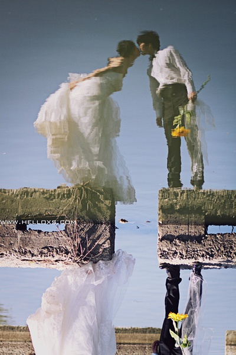

# ＜天璇＞在旧时光里拈花微笑

**人生从不会像前列腺的痉挛来得痛快和舒畅，颠簸与流离我们都在路上。而那些我们深爱热爱的过往，大都淹没在年轮扬起的灰尘里，你若想追去，也只能灰头土脸地回来。**  ** **

# 在旧时光里拈花微笑

# 

## 文/ 杭鹏程（燕山大学）

作家刘原在他的离职感言《八月，一场马不停蹄的别离》里，陈述了他平凡一生中，所有8月历经的浩劫，离乡去职，好友辞世。而我的八月，也大多忙着离别，四年前的八月，我在无锡城糜烂的雨里艳遇了一场，便匆匆离去；去年的八月，我同学四年的好友笑天，在东海里永生，我未能见他最后一面，而八月的最末，我却拖着沉重的行李，背离家乡，坐上1342次的老黄牛，来到这个徒有名字光鲜的城市。 人生从不会像前列腺的痉挛来得痛快和舒畅，颠簸与流离我们都在路上。而那些我们深爱热爱的过往，大都淹没在年轮扬起的灰尘里，你若想追去，也只能灰头土脸地回来。 我与表哥讨论这个标题，表哥沉思许久，抬头说道：“不如在旧时光里拈花惹草来得淫荡”，我始终不像表哥那样潇洒，离开故土，还生长得这般滋润，最近忙于和鼓起的肚腩抗战。于是在这个黄莺乱叫的初春，在这个叫春的清晨，我俯身掬一泓肾上腺的潮水，与表哥，一同缅怀他故去的处男岁月，那些在他被岁月搞大了肚子后，再也寻不回的美好时光。在这个很少人能在故乡生存的世道，你和我放逐在远方，也只有那湾记忆的浅海，才是不变的可怀旧的精神故地。我知我是不会在秦皇岛生存的，因为生了乡愁的人生不了根，当然除非你搞大了本地女人的肚子。于是我们常常在小说里看到这样的桥段，在某个月色苍茫的夜里，男主角越墙而逃，口念初恋情人的名字一路狂奔，却在村口的歪脖树下，遭遇了坚硬的鞋拔子。婚姻的惨淡，莫大于此，我倒是希望表哥在遭遇了若干女人之后能抽足而出，不要坠入婚姻的窑井。 

 12岁那年，我曾在外滩边上独自行走，当时所见的夜上海，各色华灯的光耀，东方明珠旖旎的光芒，我曾惊叹过的繁华，如今都已忘得干净了。那次上海之行的记忆，只停留在一些小地方，记得的只是一些工地旁免费的色情电影，发廊门口小板凳上妖冶的妓女，撩起的裙子，露出的底裤和雪白的大腿，以及酒店旁小树林里激战正酣的皮肉生意。如今想来，当时的我就已经看到了浮华背后农工生活和卖肉生意的惨淡，原来我从来都不曾看惯繁华，对于繁华我从基因里看不惯。而现在我的于世的愤恨，大概就是从这里来。当时空无比犀利地将命运切换到20岁的盛年，当我置身繁华，总有莫名的想吐的冲动。 很小的时候把邻居家的房门钥匙藏起来，害得邻居找了一天不能行房；初中的时候，没有写作业，被班主任撵回家，还好没有进行投票表决，不然我会像雷梦佳一样死掉，我要谢谢独裁的班主任，谢谢国家谢谢党；而高中时候打架打牌打台球，上网洗澡抽香烟，成了必修课，而我成了办公室的常住民，我沾染了所有能沾上的恶疾，但没有失却生命最本真的肆意和自由。我的20岁，在我学会了憋尿很多年之后，终于学会了憋话，我给自己的成人礼是再憋一憋，于是我成了中华鳖精。前些日子回顾了《冰封王座十大经典战役》里Moon的神迹，有些怀念高中的时光，偏执和激情，就是我们的青春，那是生命最好的时光，如果，时光还是时光。 作家林白说，不要忽视过去的文字，不要试图切割过去的自己。是啊，记忆不是阑尾，不是盲肠，是活生生的，带有血肉的。而拈花微笑是个多么轻逸的姿态，轻逸得像株昙花，只在无人时开放。 

（采编自投稿邮箱 责编：陈锴）
