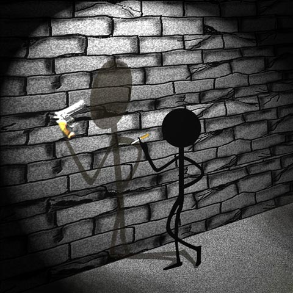
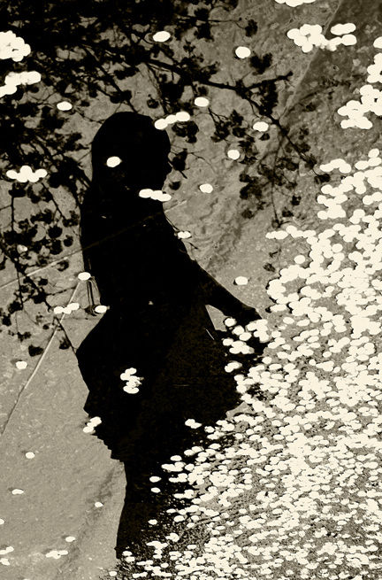

# ＜天璇＞在水一方，生活在他处

**生活或者精神，都会被不经意分为两个部分，一部分是我们对美的追求，对自我的不断探索，它幻化做那些模糊的文字，或者是一些只有自己才能读得懂的照片；另一部分，我们必须有我们生活化的一面，洗漱，吃饭，劳动，工作，休息，做饭，吃饭，玩乐，性交，排泄，睡觉。**

# **在水一方，生活在他处**

## 文/安芯(暨南大学)

“扑通”，水花四溅，我纵身一跃，扎进了游泳池中，幽暗的灯光在头顶晃耀。

此时已是晚上九点，我半个身子漂浮在水里，半个脑袋随之也淹没在水里，仅露出嘴巴和鼻子呼气。我闭上眼睛，毫无戒备全身放松地浮在水面上，感觉自己飘到了很远的地方，睁开眼看时，还是原来的位置，未曾变换。

我好傻。双耳浸泡在里面听不见外面的声音，双眼紧闭看不见上方的景色，意识飘散分不清前后的方向，就以为自己到了远方，其实我还停留在原地。

1.

水，我出生的城市没有海，也很少见到成片成片的湖，有的，只是一座座挺拔陡峭的高山，和一条大江横亘在两岸。夜里，一条索道，上下江城，火树银花。如今，索道被拆了，黄果树没了，为了市容市貌。

唯记得有次8岁，我躺在在家里的浴缸里泡澡，足足和水玩了两个小时。我把玩具大炮坦克小人泡在水里，分成两队，坦克在水里碾压着小人，说不出有多么的欢乐。可大人们说那会着凉的，喝我出来，自那以后，我便知道在冷水里呆久了，对身体不好，会感冒会发烧会咳嗽。

后来我去到珠海，第一次看到了大海，于我而言，毫无惊喜。我总是告诉自己，与其闻着臭臭的海风，不如呆在教室多做几道金融数学的题，早点把精算师的资格证拿下，才是当务之急。

后来我两次去到深圳的海滩，一次是家人和一个开着两辆宝马车的律师朋友去的，一次是和朋友们去的。头一次的律师朋友事业有成，理应香车宝马在周末度假，后一次正值青春年少，绽放生命毫无疑问。可无论哪一次，我都感到无处安放自己。放在前一次总觉得这些不应与大自然相映衬，摆在后一次又觉欠缺很多。到底是什么，那时候我自己也不清楚。

再后来我在加州的数个海滩边和华人或者老外烧烤，聊天，晒太阳，嬉戏。一切看似很和谐很美好，但在内心深处我明白自己根本没有融入进去。我抵触起来，不安，躁动，质疑，反思，困惑。种种感情叠加，我想，是时候去寻找一个答案了。可是如何找，却茫然无绪。

某日，闺蜜邀我到南丫岛的海滩走走，一口应下。船停靠岸后，走了许久，方才坐下。他掏出两块毛巾，扑在细沙上，自己倒头便睡去。

“你在干嘛？！”

“睡觉啊，这么好的太阳，睡一会才舒服呢。”

“啊。”我将信将疑地摘下帽子，躺了下去。

慢慢地我的手指碰触到了细沙，我本能地抚摸起它们来。一粒一粒的沙粒瞬间有了生命，我说的是，一粒一粒的，而非整体。我看到他们的时候，他们是成片的沙，但我真正碰触到他们的时候，他们分散成了个体，鲜活有力的独立个体。

我渐渐地闭上了双眼，用耳朵去感受旁人的碎语，以及海水冲刷上岸的声音。瞬间，我兀自地与这个世界隔离开来，作为个体伫立在这个海滩上，尽管我是躺着的。我听到了过往从未听到过的声音，它好像来自于外面的世界，但又清楚地来源我自己。我自己，多么熟悉而又陌生的三个字。

想到“我自己”这三个字时，心里不禁微颤。我睁开双眼，在游泳池里。

不知为何，些许有些难过起来。我不由得大吸一口气，动了动身体，骤失平衡，如流沙沉没般。恍然间再次双眼，透过游泳镜，我看到一滴滴的水花摇晃着上升，至水面，最后涸没为一体。而我自己每往下沉一点，便感到仿佛离那个最真实的我自己更近了一步。

这是回归母体的感觉。活在这个世上，无非是明白一些道理，遇到一些有趣的事情，从哪里来，再回到哪里去。

我不断地下沉，便感到水在不断地亲吻着我。

2.

恍惚间，我想到了一个朋友和我在泰国的学生们。

我的那个朋友，她从来都是以小鸡啄米的速度看书，绝不会以马踏飞燕的速度遗忘，于是她幸运地达到了“给我一个话题，我就能挥洒出一篇论文”的境界。她拒绝波德莱尔的那句接“痛恨成为有用的人”，抵制废物一般的人生，远离达达一类的艺术，于是鲜花，掌声，赞誉以1:1:1的比例向她涌来。她是如此的幸运。

她发现世界不过就是一场此消彼长的零和游戏，当她一步步成长的同时，社会逐渐弯下了腰，从北极熊变成了树袋熊。只要她不惧怕现实主义恐怖片，屏蔽福柯尼采鲍曼斯科特的纪录片，于是该来的都以10米每秒的速度向她狂奔着。她真是如此的幸运。

无论web1.0，web2.0，还是web3.0，时代翻来覆去，从平面到立体，再到多维，都绝不会有任何鸭梨向她扔来。

买彩票幸运地中了5块钱，于是她花了500块请客吃饭。

我不知道后来那位幸运的朋友成了什么样子，再或是有没有成为她自己。这一切我都不会知道了，因为我已经彻底和她失去了联系。

这就好比每个人的心底都住着两个小人，不断斗争，一个打败另一个后，扬长而去。

在泰国，每天都会帮助有身体障碍的学生复健。其中游泳课上的一个学生，他只有一只手，初见时我稍显诧异，一只手怎么可以游泳，这显然不符合常识。就好比万事万物都应该遵循常识，但常识也在不断地被人修订，或者伪饰。因为这个世界上原本就有好的，以及坏的。

他用仅有的一只手扶着栏杆，一步一步走下游泳池里。我在后默默地看着，甚至不忍心去打扰他。

他逐渐向前倾，最后将身体完全没入了水中，双腿向后使劲猛蹬，仅有的一只手用力向前划着，毫无疑问，这样的动作比普通人更为吃力。

但他确也开始在游泳池里自由自在地舞蹈起来。

他就这样轻松地颠覆了我脑海里原有的常识。水亦有这样的常识，比如西湖水干，江潮不起，雷峰塔倒，白蛇复出。可我们都知道西湖的水是永远都不会干涸的，于是蜷缩在最底层的白蛇如同沉睡在我内心深处的欲望是永远都走不出去。

我忍不住开始去想，我是不是错了，常识是不是错了，我为什么会有这样的常识，是谁告诉我这些的，他们又为什么会有这样的常识？

我在日照中心亦有一群五六岁的学生，每次我教他们英语书写，他们总会情不自禁地从右写到左，从下写到上。我自以为很耐心地告诉他们，这样子不对，应该从左到右，从上到下书写，甚至担心焦虑他们不识何谓左何谓右。忽然之间，我恍然大悟，顿感自己的残忍。这就是社会化的开端，或者说是常识传递的过程。我们都不希望别人告诉我们生活应该是怎样，却将既定的规则教给了他们。虽然我暗指的这两种规则毫不相同，但却相通。

于是我想了在国内的班上，恐怕顶多也就只能找出一个人是左撇子，而在国外的班上，左撇子成堆。因为常识告诉我们，写字应该用右手。没必要去思考原本的我到底是左撇子还是右撇子，忽略掉它吧，顺从常识。

还有次我和他们一起给动物填色。一个孩子将猴子涂成绿色，一个孩子却把人的脸涂成红色，另一个小孩甚至将大象涂成了黄色。我们都知道，猴子是棕色的，人的脸也是肉色的，大象是灰色而绝不可能是黄色，如果我们双目完好。

于是越发到了后面，我们便有了主流性的思维定势。仿佛在一个系统里，由特定的内循环不断回流，回流，再回流。至于外面的循环方式，是不能够为人所知为人所运转的。许是因为系统的内循环一旦被干扰，整个封闭式的系统便会逐日坍塌。

我们都忘记了去思考为什么外面的循环会是那样。因为我不可以去这样思考，它违背既有的常识。

系统，打破这个系统，定是要走出去。很多东西，如果你不亲眼去看看，你就不会有真正的了解。很多事情，如果你没有尝试就放弃，你永远也不知道自己能否真正做到。

我浮出水面，奋力地挥手向前划着，双腿向后蹬着，将自己裹在水里，向着前方游着，以自己最大的速度。那种感觉就好似将自己的脚趾、膝盖、双腿、双臂、头颅以及身体统统地交到了水里。也仿佛是这里的美国老太太每日教我们练太极，我第一次用双手去触碰自己的能量，去掐捏，抚摸自己各部分的关节。

我四肢健全，我有口有耳有鼻，我可看可闻可触，还有什么比这些更重要的。我就是我，还有什么比守住自己更重要的。无论走到哪里，住在哪个国家，只要我还是我，我就还会去想那些问题。

3.

一路上我确有不少朋友，但大部分毕竟都是点头之交，寒暄几日，便又各自踏上各自的旅途。真正能够成为一辈子的挚友，也多不过二三。而挚友的感觉，就是无论走到哪里，你都会偶尔情不自禁好奇在它身上发生着什么事情，然后一通电话，一封邮件，几句留言。频率虽不及恋人，但也是字短情长。大多时候，它未必就是对你影响极其深远的人。

但反过来，那些点头之交与我的交谈，往往会碰触到在游泳池底挣扎的我。

索菲亚，30岁刚好。初遇她时，是在印度飞往泰国的航班上，她在我旁座看书，架着一副金丝框的眼镜，发丝不经意垂在耳际。

我们自然而然地交谈起来。她说这是她因为工作的原因，第十次离开印度了，现在总算暂停手里的工作，花两年时间周游那些她想要去的国家，而这次去泰国，仅仅只是在曼谷会朋友三天，就会离开去柬埔寨。

于是我暗想，她是做国际贸易发家的么。

后来越聊越多，才发现，她是牛津大学人权研究专业博士毕业，在联合国的难民署工作了好些年。苏丹一年，中国新疆一年，印度往返十次，纽约是工作主要地方所在。

过安检时，她特地站在一旁等我，然后塞给了我她的邮箱地址，“何时何地，想起我时，给我发邮件，告诉我你正在做什么，以及将要做什么。”

亚历山大，是我在曼谷的一位瑞典朋友。他生长在瑞典很小的一个镇上，按照他自己的话来说，大学毕业前连瑞典都没出过。毕业后，作为英语为非母语的人，他考了TEFL，背着包以沙发客的方式去亚洲国家教英语，生活一段时间，再离开去别的国家。

生活在他处，拿着一份尚能温饱或者充裕的工资，租房，交水电费，偶尔去超市提一袋生活用品回来，认识新的朋友，走时搞一个离别派对，再通过社区网络保持着或多或少的联系。

第一次认识亚历山大的时候，他对我说，“如果一个人不愿意承认自己，那么他必定是不快乐的。

亚历山大离开泰国时，我们一群朋友聚在一块烧烤。他趁机把我推下游泳池，大声叫吼着：“下到水里去看看自己吧！”

看清自己，在水一方，然后转身离开，去应该去的或者适合自己的地方，生活在他处。

迈克和劳拉，约莫50岁出头，是我在基金会最聊得来的朋友之一。偶尔走在路上，总会看到他们成双成影地散步。他们是居住在美国中部的普通人，小学和中学的教师，一双儿女差不多也快大学毕业了。

一次吃饭时，和迈克大叔聊天，他坦然地说道，“我在你这个年龄的时候，连美国中部都没出过，结婚后也是第七年有了些积蓄，去伦敦旅游了趟。后来四十岁时，他们通过teach overseas这个组织，先去科威特带薪教了四年的英语，再去南非教了两年。然后是曼谷一年。”

“阴差阳错地来了基金会做半年义工，不过我们也得考虑接下来的安排了，毕竟做义工对我们来说没有收入，财务上还有些紧张。”

其实每一个人的内心深处都有一个小人，孤独地存在着。在我们的一生中，遇到爱，遇到性，都不稀罕，稀罕的是遇到了解，以及彼此了解以后共同生活。

当然，这种了解在我眼里，不是伯牙子期那种强烈的精神共鸣。因为我们的生活或者精神，都会被不经意分为两个部分，一部分是我们对美的追求，对自我的不断探索，它幻化做那些模糊的文字，或者是一些只有自己才能读得懂的照片；另一部分，我们必须有我们生活化的一面，洗漱，吃饭，劳动，工作，休息，做饭，吃饭，玩乐，性交，排泄，睡觉。

我，我在游泳池里往返游了三个来回，最后终于和我自己停靠在边上，摘下游泳镜，大口大口地喘气。

我，自己，真的是在锱铢必较么？尽管今天的锱铢必较，最后不过也就成了一片滔滔逝水。

上方星稀的灯光映照在水面，弯弯曲曲地随着水波晕散开来，伸向远处。我湿漉漉地从水里爬了出来，瞥了眼的另一方，光着脚丫走向自己的房间。

留下的，除了被寒黄的灯光拉长的背影，还有一串串一上一下的脚印。

那是我的脚印，一路走来的印记。它已经刻在地上，为我画押。

（采编：应鹏华；责编：麦静）

 
