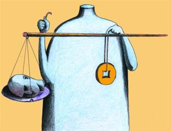
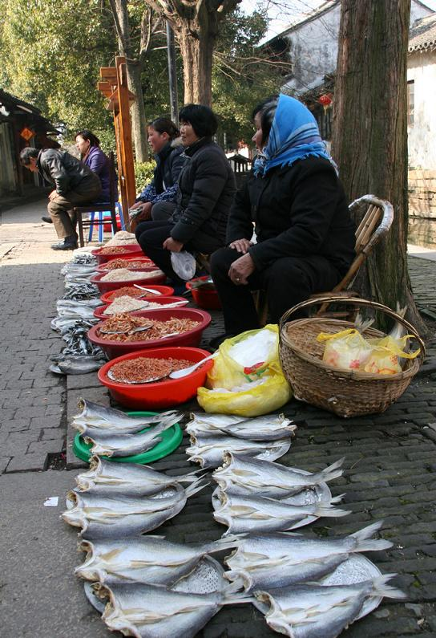
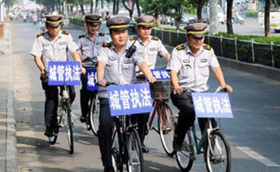

# ＜天璇＞地摊女的故事

**地摊确实是蝇头微利，卖不出氛围，卖不出情调，卖得就是实实在在东西。几毛钱几块钱。就像那些卖针线口子指甲剪和穿针环的老太太永远无法理解为什么商城顶层的旋转餐厅吃顿饭要几千块一样。我们要的是实实在在的生存需求，而不是那种出于虚荣心或高品质的需求。**  

# 地摊女的故事

## 文/ 宋桃子（华中科技大学）

 

很长一段时间我对对书本着迷，对知识分子描绘的理想世界充满了探索欲望，对思想家的思想与思维有着强烈执着的爱好，我在仿佛不属于这个世界的另一个时间和空间尺度都很大的天地里寻寻觅觅，享受着仰望天上星星的乐趣。

有一天我开始喜欢购物，开始迷恋商品，开始频繁地贯穿于商业街需找安慰，并且开始相信物质能抚慰精神的伤痛，有一天我发现像我这样想的人这样做的人并不是少数，于是我理解一种叫做“购物狂”人，有一种叫做“血拼”的快感。

不得不否认我们生活在一个商业社会，商业行为就发生在每天每个人的身边。当古镇开发成一个个旅游景点，其实我们早就该意识到古老的农耕文明已经远去，这只不过又是另一种形式的商业行为。

当商业如此繁盛，物质能带给我们极大的享受，极大的慰藉，我们对于其他东西的渴望就退化，感知也消退，那些古典课堂讲述的东西越来越难以体会，我们人类从来没有像今天一样如此深入地介入商业，我看到的是一种疯狂的滋生，像打了激素的水藻一样，狂热地蔓延，如果说古代的社会是重农抑商到毛泽东时代的完全取消商业活动，那么如今的社会的天平已经完全倾向了商业。

我开始有点点体会“资本主义”和“社会主主义”，虽然曾经一度厌恶这两个词，那是在毛邓三的课堂上，在没有社会活动经历的时候，在拥挤的课堂上听白痴一样空洞的理论。现在渐渐能理会两者的区别了，开始理解共产主义者的所要到达的理想王国，那里一定没有过分的商业活动，没有被过分商业异化的人，没有平穷和富有，大家可以各取所需，工作是为了完成自我。

我终于有些明白为什么一些西方人会喜欢大公社时期的中国，喜欢一穷二白吃大锅饭的中国，为什么有西方人来到中国或者走向世界各地，埃及或南美，或许他们是对西方成熟商业社会的叛逃吧，反叛商业社会的价值观，追求另一种精神价值。发展中的中国喜欢用商业社会的眼观来衡量所有人，所以不能理解卢安克为什么到中国的山村当教师，不明白那个李开复的优秀的大学室友为什么跑到巴西画廊去工作，当然李开复是成功的，而且是符合我们这个社会眼观审美的成功。

这一切是摆地摊的时候想到的，因为我像这个时代所有人一样对商品着了迷，对商业活动着了迷，我渴望充分的参与与理解，我从中获得乐趣，思考和沉重。

地摊女是我也是她，是许许多多摆地摊的同盟们，是刚走的大婶也是才来的小姑娘。我们窜行在光谷、鲁磨路附近。我们相互告知城管的行踪，互相祝福对方今天多卖几件。摆地摊的有像我一样还没有毕业的学生，也有刚毕业还未找到工作的大学生，有上班一族，有在家闲得无聊的老太太，还有专门以摆地摊为生的女人。我与前面几种类型的人交谈甚多，一起卖东西一起聊天，对于以摆地摊为生的女人，她们往往是神情麻木的，有与着年龄不相称的衰老，衣着朴实老旧，不太与人交往。

地摊女A看起来与我年龄相仿，但是没有年轻姑娘活泼朝气和青春鲜亮，有些老气灰尘的的感觉。她说她没有工作，白天在家玩，晚上出来摆地摊，我说这能养活自己么。她说她结婚了，所以有老公可以靠，要不然早就没饭吃了。她说有一天收了一张假钱，还好没给老公看见，不然会挨骂。可见吃人家的饭也不是那么好吃的。

地摊女B是上班一族，摆摊纯属娱乐，她不太会拿货，东西拿货价都太高了，所以一件东西七块钱拿货卖十块钱，还有人跟她还价，弄得好不郁闷。

地摊确实是蝇头微利，卖不出氛围，卖不出情调，卖得就是实实在在东西。几毛钱几块钱。就像那些卖针线口子指甲剪和穿针环的老太太永远无法理解为什么商城顶层的旋转餐厅吃顿饭要几千块一样。我们要的是实实在在的生存需求，而不是那种出于虚荣心或高品质的需求。

摆地摊最刺激最惊心动魄的就是躲城管了，我们要和城管躲猫猫。今天出师不利，连遇城管两次，生意搅黄了一次。第一次城管车来的时候我收的快，摊开的垫布一卷起来往行李箱里一塞就拖到旁边去了，地摊女C的卖的是袜子，摆的的架子太多，来不及收，被城管推到在地，袜子撒了一地。可以看出来是个她是一个以摆摊为生的“惯犯”，因为她对城管的行为已经习以为常了，嘴里还油油的说着“再不摆了再不摆了”，但我相信她一定会马上就摆出来的。我帮她捡起地上散落的袜子，白花花的袜子沾了不少灰，希望下次可以卖出去。

我挪了一个地方把摊摆到了另一个买衣服的女孩子旁边，刚刚摆好，有两个妇人过来买，我们正在讨价还价，由于太专注了，三四个城管跳到我面前说下次再摆就没收，估计看我是个新手就放了。我真是受惊吓了，原来城管真的如猛虎。

我拉着箱子默默回来了，路上心情很沉重，我想我们的生活为什么会这样沉重。如果我不是大学生，我就是我这个自由的个体，我希望用我健全的四肢勤劳热情的品质去换取生活的话，可能永无翻身之日。我还是我，但是贴上了这个文凭就像打上了优质猪肉的印记一样，我可以卖个更好的价钱了，事实上猪还是那头猪，对，还是猪，还是一头即将被企业压榨的猪。

我在想那个问题，是什么让我们的生存变得这样难。也许到商业社会成熟的那一天，人们可以各取所需，钱没了实实在在的意义，只是代表商品的符号，那么地摊就会消失，地摊女也就成为了一个传说。

 

（采编自投稿邮箱；责编：陈锴）

 
