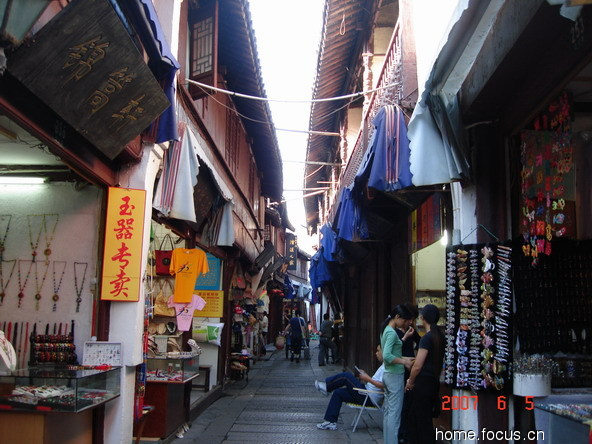
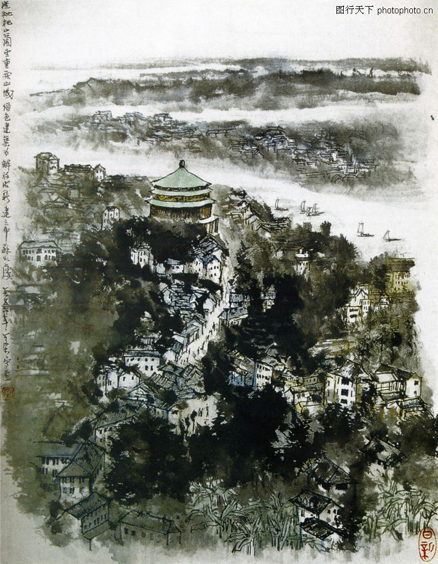

# ＜天璇＞城市，城市

**我希望，有天有个姑娘能陪着我，去吃我曾经吃撑了连路都走不动的烤肉，去吃我魂牵梦绕的肠旺面，去初中后街那个我抽第一支烟的地方，去，去到我城市。在我的城市里，向说着她的城市，说着她的城市里让她无法割舍的那一切，对我来说无法想象且说实话也没多大吸引力的东西。** **这，就像......对，就像是对唱两首接不上调的小曲，曲调不同，词却是一样的。**  

# 城市，城市

## 文/陈澜鑫（中南财经政法大学）

  **一**

人总是爱谈论城市的，在不知道该说些什么的时候，问一声你从哪里来”，话匣便从此处开了条缝。

在谈论城市的时候，说话人总是自顾自的，带着一丝骄傲的神情难以抑制地滔滔不绝。听者往往插不上话，时间久了稍觉烦闷，清清嗓子，“嗯嗯，我们那......”于是顷刻间、三两句，便能逆转了形势，继而眼神发亮、眉飞色舞，而对方此时就只能略显尴尬地不断打着哈哈、点点头。仿佛对唱两首接不上调的小曲，你一段、我一段，我绝不突兀地打断你，但觊觎着话题间的隙缝，稍不注意便全军突进，然两人都作着宋襄公，自觉地守着“仁义”，绝不赶尽杀绝。终究各布其阵、各得其乐。

在谷歌卫星地图上，拉到一定距离，能看到在江河湖泊、连绵山脉之间有些落了漆的斑驳，再拉近些，像是大地上滋生的霉菌，不太起眼也不太好看，这些便是城市了。大一点的无非是发育得成熟些的霉菌罢，四处伸着灰白的触角，在极小的范围里张牙舞爪；小一些的则默默团身，如被小孩剥去了乳胶漆，墙上露出的一个圆圆的石灰点。在这个程度的视野中，城市定然是无聊的慌，所幸人毕竟是心眼都极小的生物，他们总是急促地把地图拉到最大，看儿时出生的医院、看幼儿园、小学、初中、高中，看逃课去的黑网吧，看初吻的转角地......一栋栋楼、一条条街，吃过的、玩过的、走过的地方，走马灯放过，就是一个人的城市记忆。

城市记忆毕竟是属于个人的，同一个城市里的人能有着决然不同的城市记忆，只有把那些太个人、太独特的经历抛开，试着凝聚、归纳些共通，才能大致看出一座城市的意趣。城市的意趣是什么，其实说不上来，与其费尽口舌说着家乡的风物，不如轻轻舞舞手，“这样、那样、就是这样。”“不，这个不对，差了点，嗯，就是差了点什么。”回想下，这么一个说不明道不白的东西要感知、获取着实不易，交换则更是奢望，要是一心去寻求怕是也有诸多困难。

这其一，一个人若非在当地人中间热闹地折腾上一年半载，那么这城市虽扎实地踩在脚下，但那往来人群中无言面孔的背后，他必然参不透的。他不会知道这些形色匆忙的人将要奔向的是菜市场、酒吧还是办公楼。一座城市之所以有意趣，不单单在乎个人，但终究是在乎于人的。然人生之有限早就候在这条捕获城市意趣的道路上，一长条凳放在当中，寿终，止步！终归发觉自己所能真正了解的城市、了解的不同城市的城市人实在少得可怜。按照科学研究的标准，在这一领域，资料的缺失几乎是难以弥补的。

人呢，的确是可以旅行无数的城市，可以在城市的标志性建筑前交叉着腿摆出V字，去吃几家知名的小吃店，逛过几条有名有姓的街道，甚至有闲之士在这里停留个一周两周，把当地方言也听个耳熟。可惜当人在计划之中，在列车表的追逐下，要么就是大脑动的过多，沉浸在这城市过去的沉浮往事中，嘴里含着临时服下的情怀药片，给自己造了一座“看不见的城市”；要么就是眼睛看得太多，看公交看大厦看车看桥看地铁，终究把城市看成为一座运载人的大机械，因为擦肩而过的无数人群之不可见而只留下一系列单薄的高像素相片。

对于我来说：北京，我的外公外婆在我三岁的时候背着我上北京，颐和园的游船遇到了不开船的大风天，他们则遇上了无赖泼皮的我放声大哭；青岛，九岁的我和妈妈一起在那时还很干净的沙滩上玩了足足一下午沙，回到宾馆细细洗去脚趾间的沙粒；广州，我在那里停留过一天，我记得那里的辣椒酱尝上去有点像微微沾点辣椒的番茄酱，自然是嗤之以鼻、不屑一顾；成都，我宾馆出门右转的那条街上，一个院子里立一块牌子，写“非本院人员不得入内”，里面传来哗啦啦的麻将声……这些，只是还能够留存一些残片的影像罢了，比起当初我的停留尚且算是烧完的灰烬，要从中看出些意趣来，实在异想天开。

问：一个城市里住上个三两年，一辈子下来中国大中城市也能转个大概了吧？

答：不然。这其二：城市的鉴赏不比赏一幅画、一支曲，它有着一个更大的命门，就是永远摆脱不开故乡的羁绊。科学研究者即使在意识层面上做不到客观，但只要方法客观就能得出科学的结论。而美的鉴赏却是意识上从来甩不掉主观性，也不打算甩掉的。到了城市这里，则更加不堪，不但意识层面不可能客观，连方式都必然是主观的。不然又有什么别的可能吗？你从羊水之中瞬间被推到的，便是故乡这么一座活生生、闹腾腾的城市，护士操着当地口音配合着剪掉脐带，门外的爷爷奶奶外公外婆也同样操着家乡话询问着“是男是女”。你终于成长起来，终于独自离开家门，可是，一个人在同一环境中待得太久，到了另外一个环境中，但凡所见不同，第一步往往不是比较好与坏，而是被巨大的惊异感所淹没。正如此刻的我躺在床上，只知抱怨：唉呀，怎么这么热，这么热？天底下竟有这样热的地方！想起我那故乡凉凉的清风，又会有怎样的心情来体会这座城市的细微呢？

 **二**

故乡，故乡对于一个人的城市鉴赏力是个恶毒的诅咒，拜我的家乡贵阳所赐，对于城市我就有一种受虐的恶癖。

在我小时候，贵阳大街上总是有那么多捧着碗大口吃米粉的中学生，有那么多手拿一塑料袋糯米饭边走边狼吞虎咽的小学生，还有在街边吃完半碗肠旺面后端起剩下半碗面抬屁股走人的上班族。在路上吃东西对我来说稀松平常，而在多年之后，终于有人告诉我：不要在路上吃东西，对肠胃不好。

天总是阴的，妈妈牵着年幼的我在林荫道上的公交车站转车，急匆匆地买一瓶酸奶，三两口解决完毕，远处的中巴车癫狂地呼啸而来，“哐——”，门猛然一开，一个中年妇女歪在一边永远在喊“有位子，有位子！”无论车上占了多少人，永远都是有位子的。

阴凉的风夹杂着鼎沸的人声，吹在脖子上化着凉凉的湿气，时常让人有些烦躁，但就在这躁动之中，总有夸张的笑声、粗鄙的笑骂伴着中巴车里那永远轰隆隆的引擎声，来给人予一种略带诙谐的昂扬感。随着这发了疯的中巴车在爬坡、下坡里，在车内时不时传来的“前面有下”和“有位子”里，这座先天自闭的城市又开始躲在山坳中悄悄开始他独自笑骂的一天。

问个路，用不着东西南北，往上往下就已足够。

吃完饭楼下散个步，往下走，踩在破碎翘起的人行道上，稍不注意——“啪喇”，砖块下的污水就贱了一裤脚。

卖小吃的夜摊在鼎盛时期延绵了这城市数十条街道，卖便宜货甚至“生活片”的夜市也曾傲然地盘踞在高档商场门口，狭窄的人行道里人们拨开彼此，东瞅西望，转个弯再去吃点烤肉或是来一碗砂锅粉，拍拍肚子、牵着娇妻及拉着拖鞋回家。不管买没买“生活片”，活得倒确实很“生活片”。

从前，我从未感受到什么“地沟油”的威胁，出来之后在外面吃东西却总是处处担忧。想念起家乡那些看上去是那么油污，吃起来自己却更为放心的小吃摊。可是有人告诉我：“并不是贵阳没有地沟油，而是那里的老板也不在乎什么地沟油，他整天吃的就是自己卖的东西。你看着他吃、你也吃，你以为没什么，其实大家都在地沟里呢！”他真的不在乎吗，在乎不在乎，他都不正眼看着你对你说声“你好”什么的，进来便坐下，有啥吃啥，就是有什么怨言看那慵懒的老板坐在那一副无精打采的样子，反倒不好说些什么了。

熟人不相骂，骂得不狠就觉得不是哥们一样，这又是这城市里颇为病态的一点。从一个“日”字开始，便有无数变化，腔调若干。在别的城市里，通常只听过“日”字头后面带女性亲属的，而在贵阳，“哥”竟然也是那行为对象之一，真是敢爱敢恨、绝不挑食。到了武汉，听到那声名在外的“汉骂”，只能暗自摇摇头，心想：真是有些单调乏味。

嘈杂、自得、笑骂，在各式各样的辣椒里，浸成一种独有的滋味。它绝不是那种现代、文明、秩序的地方，它带点狂野、狡黠，它带着笑意看着你而眼神却颇有几分狠劲，你难以猜到它下一秒是会是要放肆大笑还是暴怒地从裤兜里抽出点什么。这样的城市里，父辈们喝完酒打完麻将，完了再面带笑意地回到家中，他坐下来，清清嗓子，告诉你：这城市很乱啊，晚上不要出去喔。

这就是我的城市给我带来的深刻烙印，城市，一个坏孩子，一个小疯子。

而在上海这样的城市里，有的街道两旁甚至难见小商铺，难见那种卖着不知哪弄来的女装的小门面，路面是那样的平整，没有藏着污水的“砸眼石”，路人少有抬着碗面在街上走的，车辆行驶得很平稳，里面吹着凉爽的空调，就是穿着睡衣在路上散步的人也看起来很温柔很松弛的样子。我暗自叹息，这样就好像缺了点什么啊，是不？

不过我在一本书里读到，张爱玲好像也说过，她爱上海，因为那是个她可以随意吐痰的地方。毕竟是转述，不知是否真确，要是真的，怕是她的心里头对上海也有一种越不堪越美、文明中有点小狂野才显得优雅的意趣。在那太太的客厅里、在留声机放着爵士乐的地方，不羁总是能够廉价地买到一口痰，也许就够了。

不喜欢整洁、平坦、雅致，却偏要那掺了毒的烟尘，我就这样最终惹了天怒。可叹，那老天爷居然大手一挥，把我赶到那大武汉城，憋着坏笑，说：个婊子养的，老子满足你！

 **三**

武汉太大，大，大，大，过江地铁尚未通车，只能乘公车或是双腿去丈量这大，于是大就更大。武汉太热，热，热，热，孤身一人在这异乡，寝室里一声音比风大的多的摇脑风扇折腾个不停，于是热只更热。

西部开发、中部崛起，我从那开发之地来，到这崛起之地去。比照“复兴东北老工业基地”透出来的那股衰落的意味，那“开发”暗含着荒凉和贫瘠，而这“崛起”有的是几分怒其不争的意味。在这么大的城市里，湖泊遍布，龟蛇二山，夹江而守，好一座有山有水的城市，可惜这水质却极差、水域也在湖景房的蚕食中不断缩减，真是让人觉得可惜。武昌鱼声名在外，而到了武汉，我却不敢吃鱼了。五月南湖翻塘，万斤死鱼蒸在那烈日之下，能从南湖大桥上步行而过的，我先给您跪一个。

其实我很喜欢毛泽东的那首《菩萨蛮.黄鹤楼》：“茫茫九派流中国，沉沉一线穿南北。烟雨莽苍苍，龟蛇锁大江。”两句词，把武汉的恢弘、壮大体现得淋漓尽致，武汉定是那种要在大视野下才能感知其美的城市。长江之龙在这里跃然一折，在这九省通衢的龙腰上留下三镇：四大名镇之一的大商埠汉口，中国近现代工业的源头之一汉阳以及在秋老虎天里实在憋不住枪声的首义武昌，由长江、汉江两江隔开，自这岸看那岸，那岸又回看，高楼高塔、黄鹤晴川，实在有种雄壮之美！

然而崛起的城市定然要有些个崛起的景象，于是乎我所看到的武汉出现了一派“千百工地齐开工，江南江北尽烟尘”的奇景。而那笑骂、嘈杂更是在这武汉城里更是烧得浓浓烈烈，武汉人池莉的小说里亲生的姐妹间互道“个婊子养的”，大街上时常看见扯皮、撞猴子，大老爷们光膀子，中年妇女也爱烫个狮子头，满城一副剽悍匪气。见过一张老照片，往长江大桥去的那条大街上，夏日炎炎，两旁顺道里全是铺着凉席的床。据说八十年代前，武汉人夜里爱睡在街上，拿着凉水往身上泼，这也难怪，武汉的夏天不但白日里烈日舕舕，就是到了夜里那满城的水汽罩着依然找不到一丝阴凉。

大热、大寒、大江、大城。这么一个“大地方”，却是最好的生养小市民之地。小市民绝不是贬义，一大早就吃完如此重口的热干面，坐着粗暴狂野的大巴从桥上摇曳而过，哐——当——哐！便轻而易举过了那横亘千年的扬子江。人皆是来来去去，狗苟蝇营，而放到这样一个“大地方”，人的“小”更显得明显而有趣起来。嘈杂、自得、笑骂，我家乡的坏脾气到了这里无不变本加厉，只可惜少了那令我魂牵梦绕的徐徐凉风，还委屈当央视直播员为着到底是贵州省还是贵州市而困惑的时候，武汉却能够以几声笑骂搏得那传至江南塞北的“恶”名。

火车站边的出租车司机终于拼满了三个傻学生，一人四十，跑一趟赚的盆满钵满，被司机狠狠坑了一把的我无奈坐在他身旁一言不发，他却忽然递给我一支二十块的黄鹤楼软蓝，气头瞬消，实在让人哑然失笑。好一个大武汉，好一个生活场。

10年的夏天，我高考那年，分数不高不低去不了北京好学校，抱定独自在外读书的念头早早放弃了上海，而一分之差又去不了南京，就是这样老天爷把我赶到了这里，带着好久都散不透的失意。北京，明成祖迁都，在这历史洪流中傲然端坐了六百年；南京，六朝胜地，虎踞龙盘，处处是轻轻忧叹的挽歌；武汉，三镇一体称之为“武汉”至今将将才八十余年，在极冷极热的暴虐气候里终不甘寂寞地响起那破空的一枪，北伐战争中民国政府又迁都武汉成一时之革命中心，也不忘那抗日战中里“保卫大武汉”的血战滔天，九八洪水......激荡的、起伏的、猛地咋起嗓子怒吼又瞬间嘶哑掉的，我就来到的这样一座城市，和武昌太多太多的大学生一起，才终守得一点安慰。想起此时在南京上学的那个多么多么漂亮的成都姑娘，渐不至哀声空叹。

 **四**

说到底，武汉至少是我自个儿填在志愿表上的地方，也算是我选择来到了这里。然而有的人在颠簸的命运中，却被自己的城市所流放。

五月一个周日，百无聊赖，我自己到电影院里去看电影《我11》。进去，只有一对情侣坐在前面。快要开始的时候，一个六十多岁的大妈也走进来，提着一篮子菜，门口服务员告诉她没什么人，“随便坐”。

“怎么能随便坐呢？这票上有座位的。”携菜而行，正好坐在我的后面。

这部电影讲的还是类似《青红》的故事，又是上海三线建设支援到贵州的背景，只是这次主角换成了几个孩子。一样有想回上海而不得的知识分子，一样有被夺去贞洁的姑娘。姑娘的哥哥杀死了强奸姑娘的干部，最后又是被判了死刑，一个镜头里，老父亲和姑娘一道呆呆直直地立在公安局外那荒草间生的石板阶梯上。

“真是惨啊！在这大山里，回不去家啊。诶，你说是不是？”大妈头靠在椅靠上，正凑着我耳边。

我尴尬地点点头。

“唉哟，你看这个地方，贵州山区啊，到处都是山。”

“嗯嗯......”

“在这大山里，上海也回不去，人也成了这个样子......你看着贵州的大山哟，天啊！”

“呵呵，我.......就是贵州的。”

“哦哦......你就是贵州的啊......那........你们那，是这样的吧，都是山！”

“是是。”

“我告诉你啊，那个时候好多人啊，都去支援三线建设去了，跑到山里头，大学学的东西一点没用。大学白念了！在里面啊回又回不去，想想真是惨。”

“啊，我外公他们，也是三线建设来贵州的。”

“喔？是吗？他们从哪里来的？”

“也是从上海。”

“啊，这样。唉，我自己也是啊，从武汉被赶到榆林去了，干了那么久，到这会才能回来。”

电影放至最后，大妈还说：“还是你们现在好，你看，你们想去哪去哪，时代不一样了！”

时代不一样了？时代不一样了。

我的母亲初三才来到贵阳，花费两周时间就听懂了这山城里阴郁的方言，像是破解了一串命运的暗码，从此在这里扎下根。我的舅舅，小学毕业因为户口随着外公一起来了这里，在上海上不了中学，也到了贵阳。

每当我的母亲说到高考她被补录到她的大学的时候，总是笑着说学校招生的那个老师满足于自己终于招到了一个女生，还是漂亮的“上海姑娘”。外婆虽然是山东人，可总是习惯在家里说上海话，有时也和我说，我就拿贵阳话答着腔。舅舅也还能说一口蹩脚地上海话，我都能听出来很蹩脚的那种，那边亲戚打电话来，他拿起听筒显得有些烦躁，勉勉强强地用他的蹩脚上海话匆忙招架着。

但更为有趣的是，他们有时会用上海话说“他们上海人嘛，就是这样子”，嘴角却露出一点点鄙夷一点点讥诮。我的舅舅吃烧烤喝啤酒，对着从上海来贵阳玩的表哥说“我现在不是上海人，上海不要我了，我早就是贵阳人了”，又说起父亲第一次到上海去在公车上被人说“外地人”，舅舅站起来操着普通话说“你嘴巴放干净点”，别人问他哪里人，他骄傲地说：“贵阳的，怎么了？”

贵阳的，怎么了？我不确定那个听者是否真的知道这么一个地方。我的舅舅又一大口啤酒下肚，开始说起贵阳城里的杀人抢劫，说夜市里酒吧外被人捅刀子，说地方来的不要命的疯子，说得把表哥和我都吓到了，而他，却沉浸在这邪恶的魅歌里，越说越上瘾，越说越着迷。之后的那几天，我们总是不得不想起那些残暴的杀人故事。最后我的母亲对表哥说：“别听你舅舅瞎说，哪有这么可怕！”

外公外婆在贵阳买了墓地，会一直留在这里。而母亲每次去上海，总是不停地和贵阳的朋友打着电话，盘算着回去的日子。我在上海姨妈家里，上海奶奶(外公的姐姐），一直给我夹着菜，慈祥地问着我“这个，你们那有吗？”或是“这个，你吃过吗？”

有的有的，吃过吃过。

想起《我11》里那呆立着的身影，想起我舅舅喝着啤酒说着贵阳话的样子，两幅极端差异的情景，也许，对于有的人来说，两座城的故事并非总是那么糟糕。

 **五**

城市好吗？往坏了说，就是所谓的“石粪森林”罢了。况且，在连锁餐饮、连锁商城、网店银行的攻势之下，所谓的城市“同质化”越来越明显，也许以后每座城市的差别会越来越小了。银行、商场、医院，车辆把人载来载去，在这之中来回流转着，城市能说得上好吗？

坏吗？再坏，又如何割舍儿时吃的路边摊、割舍小学门口的小卖部，割舍去过的黑网吧，割舍你在城市里交下的那些个朋友？

有的城市对于人来说，和过往连接在一起，它永远是原生的那种闲适、天真生活的符号；而有的城市，则作为未来的灯塔，给你一个充满可能性的未来想象。而这一切，只在人心里，城市永远还是那个城市。

我希望，有天有个姑娘能陪着我，去吃我曾经吃撑了连路都走不动的烤肉，去吃我魂牵梦绕的肠旺面，去初中后街那个我抽第一支烟的地方，去，去到我城市。在我的城市里，向说着她的城市，说着她的城市里让她无法割舍的那一切，对我来说无法想象且说实话也没多大吸引力的东西。

这，就像......对，就像是对唱两首接不上调的小曲，曲调不同，词却是一样的。

城市，城市。

 

（来自投稿邮箱；责编：佛冉）

